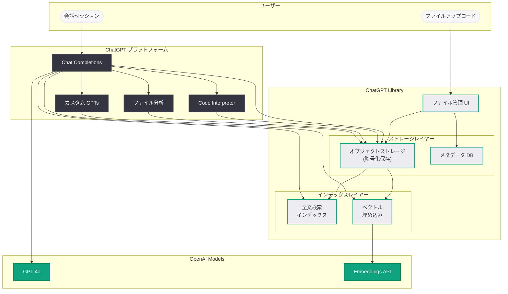

# OpenAI、ChatGPT Library を展開 -- 個人ファイルの保存・管理が可能に

## メタデータ

| 項目 | 内容 |
|------|------|
| 発表日 | 2026-03-23 |
| ソース | BleepingComputer、MSN |
| カテゴリ | Product |
| 公式リンク | [openai.com](https://openai.com/news) |

## 概要

OpenAI は、ChatGPT に「Library」と呼ばれる新機能を展開した。この機能により、ユーザーは個人ファイルを ChatGPT 内に直接保存・管理できるようになる。BleepingComputer と MSN が報じたこの機能は、ChatGPT を単なる対話型 AI から、永続的なファイルストレージを備えた包括的な生産性プラットフォームへと進化させるものである。

ChatGPT Library の導入は、2026 年 3 月 20 日に報じられたデスクトップ「スーパーアプリ」構想の一環として位置づけられる。会話をまたいでファイルが永続化することにより、ユーザーはプロジェクト単位でのドキュメント管理やリサーチ資料の蓄積が可能となり、ChatGPT のワークフローにおける連続性が大幅に向上する。

## 主な内容

### ChatGPT Library の概要と仕組み

ChatGPT Library は、ユーザーが個人ファイルを ChatGPT のプラットフォーム上にアップロードし、会話セッションをまたいで永続的に保存・管理できる機能である。

従来の ChatGPT では、ファイルのアップロードは個別の会話セッションに紐づいており、セッションが終了するとファイルへの参照が失われるという制約があった。Library はこの制約を解消し、以下の機能を提供する。

- **永続的なファイルストレージ:** アップロードしたファイルが会話セッション終了後も保持され、いつでもアクセス可能
- **ファイル管理インターフェース:** ファイルの一覧表示、検索、整理のための専用 UI を提供
- **会話間でのファイル参照:** 複数の会話セッションから同一ファイルを参照・分析できる
- **既存機能との統合:** Code Interpreter やファイル分析機能とシームレスに連携

### 対応ファイル形式と保存容量

ChatGPT Library で対応が想定されるファイル形式は以下の通りである。

**ドキュメント系:**
- PDF、Word (.docx)、テキスト (.txt)、Markdown (.md)
- PowerPoint (.pptx)、Excel (.xlsx)、CSV

**コード系:**
- Python (.py)、JavaScript (.js)、TypeScript (.ts) 等の主要プログラミング言語ファイル
- JSON、YAML、XML 等の構造化データファイル

**画像系:**
- PNG、JPEG、GIF、WebP 等の一般的な画像形式

保存容量の上限については、ティアごとに異なる制限が設定される可能性が高い。有料プラン (Plus、Pro) ではより大容量のストレージが提供され、Enterprise や Team プランではチーム共有のファイルスペースも含まれると推測される。

> **注:** 具体的なファイル形式の完全なリストおよびストレージ容量の上限は、OpenAI の公式ドキュメントを参照されたい。

### 既存機能との統合

ChatGPT Library は、ChatGPT の既存機能と深く統合されることで、その価値を最大化する。

1. **Code Interpreter との連携:** Library に保存したデータファイル (CSV、Excel 等) を Code Interpreter で直接読み込み、データ分析やグラフ作成を実行できる。セッションごとにファイルを再アップロードする手間が不要になる
2. **ファイル分析機能との連携:** PDF やドキュメントを Library に保存しておくことで、複数の会話セッションにわたって同一ドキュメントの分析を継続できる
3. **GPTs (カスタム GPT) との連携:** カスタム GPT が Library 内のファイルを参照できるようになれば、ナレッジベースとしての活用が可能になる
4. **検索・要約機能:** Library 内のファイルを横断的に検索し、AI による要約や関連情報の抽出が可能になる

### 提供ティアと可用性

ChatGPT Library の提供範囲について、以下の展開が想定される。

| ティア | Library の利用 | 想定されるストレージ | 備考 |
|--------|---------------|---------------------|------|
| Free | 制限付き | 小容量 | 基本的なファイル保存のみ |
| Plus | 利用可能 | 中容量 | フル機能 |
| Pro | 利用可能 | 大容量 | 優先的な機能アクセス |
| Team | 利用可能 | 大容量 + 共有 | チーム共有機能付き |
| Enterprise | 利用可能 | カスタム | 管理者制御、コンプライアンス対応 |

> **注:** 上記は報道内容に基づく推定であり、実際の提供内容は OpenAI の公式発表を参照されたい。

### プライバシーとセキュリティ

個人ファイルの保存機能において、プライバシーとセキュリティは最重要の考慮事項である。

**データ保護の観点:**

- **暗号化:** アップロードされたファイルは保存時 (at-rest) および転送時 (in-transit) に暗号化されることが期待される
- **アクセス制御:** ファイルはアップロードしたユーザーのみがアクセス可能であり、他のユーザーからは参照できない
- **データ保持ポリシー:** ファイルの保持期間、削除ポリシー、データの所在地 (リージョン) に関する透明性が求められる
- **AI トレーニングへの利用:** アップロードされたファイルが AI モデルのトレーニングに使用されるかどうかの明確なオプトアウト設定が必要である

**Enterprise 向けの要件:**

- **SSO・SCIM 連携:** 企業の ID 管理システムとの統合によるアクセス制御
- **監査ログ:** ファイルのアップロード、アクセス、削除の履歴を記録する監査機能
- **データ損失防止 (DLP):** 機密情報を含むファイルのアップロードを防止するポリシーの設定
- **コンプライアンス:** GDPR、HIPAA 等の規制要件への適合

### 競合分析: Google Drive + Gemini、OneDrive + Copilot

ChatGPT Library の登場により、OpenAI は Google と Microsoft が既に展開するファイルストレージと AI の統合領域に参入することになる。

| 項目 | ChatGPT Library | Google Drive + Gemini | OneDrive + Copilot |
|------|----------------|----------------------|-------------------|
| ストレージ基盤 | ChatGPT 内蔵 | Google Drive (15 GB 無料) | OneDrive (5 GB 無料) |
| AI 統合 | ネイティブ (ChatGPT) | Gemini による分析・要約 | Copilot による分析・要約 |
| エコシステム | ChatGPT 中心 | Google Workspace 全体 | Microsoft 365 全体 |
| 強み | 対話型 AI との深い統合 | 大規模ストレージ、共同編集 | Office アプリとの統合 |
| 弱み | ストレージ規模は限定的 | AI 統合は後付け | AI 統合は後付け |
| 対象ユーザー | AI ヘビーユーザー | Google エコシステムユーザー | 企業ユーザー |

OpenAI の差別化ポイントは、AI との対話を中心としたファイル管理体験にある。Google Drive や OneDrive は汎用的なファイルストレージとして膨大な容量と共同編集機能を提供するが、ChatGPT Library は AI によるファイルの理解・分析・活用を第一に設計されている点で根本的に異なるアプローチを取る。

### ユースケース

ChatGPT Library の主要なユースケースは以下の通りである。

- **ドキュメント管理:** 契約書、レポート、仕様書等のドキュメントを Library に保存し、必要に応じて AI に分析・要約を依頼する
- **リサーチ:** 論文、記事、データセットを蓄積し、複数の会話セッションにわたって継続的なリサーチを実施する
- **プロジェクト管理:** プロジェクト関連ファイルを一元管理し、AI をプロジェクトアシスタントとして活用する
- **学習・教育:** 教材や参考資料を Library に保存し、AI を個人チューターとして活用する
- **コード開発:** コードベースやドキュメントを保存し、Code Interpreter と連携した分析・デバッグを実行する

## 技術的な詳細

### ファイルストレージアーキテクチャ

ChatGPT Library のバックエンドは、以下の技術要素で構成されると推測される。

- **オブジェクトストレージ:** ファイルの永続的な保存にはクラウドベースのオブジェクトストレージ (Azure Blob Storage 等) が使用される可能性が高い
- **メタデータ管理:** ファイル名、サイズ、アップロード日時、ファイル形式等のメタデータを管理するデータベース
- **インデックス作成:** ファイル内容の検索を可能にするための全文検索インデックス
- **ベクトル埋め込み:** ファイル内容をベクトル化し、セマンティック検索や関連ファイルの推薦に活用

### API の可能性

ChatGPT Library が API として公開される場合、開発者はプログラマティックにファイルの管理が可能になる。

```python
from openai import OpenAI

client = OpenAI()

# ファイルのアップロード (想定される API)
file = client.files.create(
    file=open("research_paper.pdf", "rb"),
    purpose="library"
)

# Library 内のファイルを参照した会話
response = client.chat.completions.create(
    model="gpt-4o",
    messages=[
        {
            "role": "user",
            "content": "Library に保存した research_paper.pdf の要約を作成してください"
        }
    ],
    file_ids=[file.id]
)
print(response.choices[0].message.content)
```

> **注:** 上記のコードサンプルは想定される API の例示であり、実際の API 仕様は OpenAI の公式ドキュメントを参照されたい。既存の Files API (`client.files.create`) は Assistants API や Fine-tuning 向けに提供されており、Library 向けの API はこれを拡張する形で実装される可能性がある。

## アーキテクチャ



## 開発者への影響

### Files API の拡張可能性

- **Library 対応の Files API:** 既存の Files API が Library 機能に対応することで、開発者はアプリケーションからユーザーの Library にファイルを保存・取得する機能を構築できるようになる可能性がある
- **Assistants API との連携強化:** Assistants API が Library 内のファイルを直接参照できるようになれば、よりパーソナライズされたアシスタントの構築が可能になる
- **ベクトルストアとの統合:** Library に保存されたファイルが自動的にベクトルストアに登録されることで、RAG (Retrieval-Augmented Generation) ベースのアプリケーション開発が簡素化される

### プラットフォーム戦略への影響

- **エコシステムのロックイン強化:** ユーザーが ChatGPT Library にファイルを蓄積するほど、プラットフォームへの依存度が高まる。開発者はデータポータビリティを考慮した設計が求められる
- **競合プラットフォームとの差別化:** Google の Gemini や Anthropic の Claude がファイル管理機能を提供する中、OpenAI は Library により永続的なファイルストレージの分野で差別化を図る
- **スーパーアプリ構想との連携:** 2026 年 3 月 20 日に報じられたデスクトップスーパーアプリに Library が統合されることで、ローカルファイルとクラウドファイルのシームレスな管理が実現する可能性がある

### 留意すべき課題

- **データガバナンス:** Enterprise 環境では、Library に保存されるファイルのガバナンスポリシーの設定が重要になる
- **コスト構造:** ストレージ容量に応じた追加課金が発生する場合、アプリケーションの設計においてコスト管理を考慮する必要がある
- **レート制限:** ファイルのアップロード・ダウンロードに対するレート制限の設定と、アプリケーション側での適切なハンドリングが必要になる

## 関連リンク

- [BleepingComputer 報道](https://www.bleepingcomputer.com/)
- [MSN 報道](https://www.msn.com/)
- [OpenAI Files API ドキュメント](https://platform.openai.com/docs/api-reference/files)
- [OpenAI Assistants API ドキュメント](https://platform.openai.com/docs/assistants)
- [関連レポート: OpenAI がデスクトップ「スーパーアプリ」を発表 (2026-03-20)](./2026-03-20-openai-desktop-superapp.md)

## まとめ

ChatGPT Library は、ChatGPT を対話型 AI から永続的なファイルストレージを備えた生産性プラットフォームへと進化させる重要な機能追加である。会話セッションをまたいだファイルの永続化により、ドキュメント管理、継続的なリサーチ、プロジェクトファイルの一元管理といったユースケースが実現する。Code Interpreter やファイル分析機能との統合により、保存したファイルを AI が直接活用できる点が、Google Drive + Gemini や OneDrive + Copilot との差別化要因となる。一方で、プライバシー保護、データガバナンス、AI トレーニングへのデータ利用に関する透明性の確保は、ユーザーの信頼を維持する上で不可欠である。2026 年 3 月 20 日に報じられたデスクトップスーパーアプリ構想と合わせて、OpenAI が ChatGPT を包括的な AI ワークスペースとして発展させる戦略が着実に進行していることを示す動きである。
