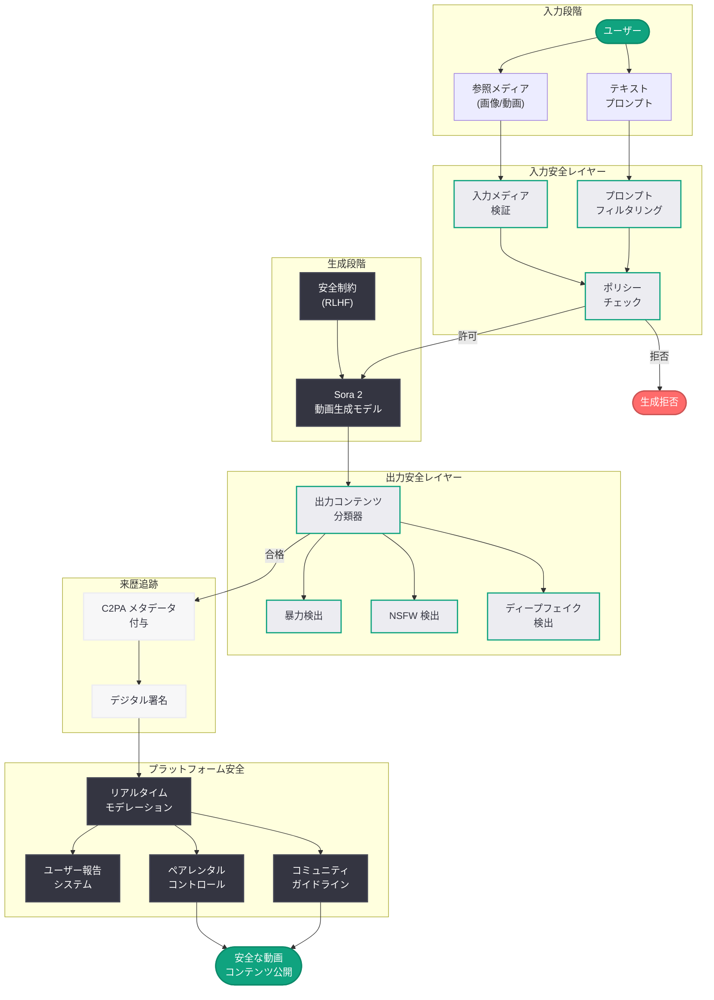

# Sora 2 の安全な創作環境: ソーシャル動画生成プラットフォームにおける安全設計

## メタデータ

| 項目 | 内容 |
|------|------|
| 発表日 | 2026-03-23 |
| ソース | OpenAI Blog (公式) |
| カテゴリ | Safety |
| 公式リンク | [Creating with Sora Safely](https://openai.com/index/creating-with-sora-safely) |

## 概要

OpenAI は、最先端の動画生成モデル Sora 2 およびソーシャル創作プラットフォームとしての Sora アプリにおける安全対策の全体像を公開した。従来の画像生成モデルとは異なり、動画生成モデルには新たな安全上の課題が存在するため、OpenAI はモデルの基盤レベルから安全性を組み込むアプローチを採用している。

Sora 2 の安全アーキテクチャは、入力段階でのプロンプトフィルタリング、生成段階でのコンテンツモデレーション、出力段階での C2PA メタデータ付与という多層防御を基本としている。さらに、ソーシャルプラットフォームとしての Sora アプリには、ユーザー間のインタラクションに対する安全機能や保護者向けのペアレンタルコントロールが実装されており、安全性と創造性の両立を目指した包括的な取り組みとなっている。

## 主な内容

### Sora 2 の安全アーキテクチャ

Sora 2 は、モデルの設計段階から安全性を考慮した「Safety by Design」の原則に基づいて構築されている。具体的な保護策は以下の通りである。

- **入力フィルタリング:** ユーザーのプロンプトを解析し、暴力的、性的、またはポリシーに違反するコンテンツの生成要求を検出してブロックする。テキストプロンプトだけでなく、画像や動画の参照入力に対してもフィルタリングが適用される
- **モデルレベルの制約:** トレーニングデータのキュレーションと RLHF (人間のフィードバックによる強化学習) を通じて、モデル自体が有害なコンテンツを生成しにくいよう調整されている
- **出力スクリーニング:** 生成された動画に対して複数の分類器が適用され、ポリシー違反のコンテンツを検出・除去する

### コンテンツモデレーションシステム

Sora アプリがソーシャル創作プラットフォームとして機能するためには、AI 生成コンテンツの品質管理だけでなく、ユーザー投稿コンテンツ全体のモデレーションが不可欠である。

- **自動モデレーション:** AI を活用した自動検出システムにより、ポリシーに違反する動画コンテンツをリアルタイムで検出する
- **人間によるレビュー:** 自動検出では判断が困難なケースに対して、専門のモデレーションチームが人手によるレビューを実施する
- **報告メカニズム:** ユーザーが不適切なコンテンツを報告できる仕組みが整備されており、コミュニティ全体での安全性維持を支援する
- **段階的な制裁:** 軽微な違反に対する警告から、重大な違反に対するアカウント停止まで、段階的な制裁システムが運用されている

### C2PA メタデータと来歴追跡

OpenAI は、AI 生成コンテンツの透明性を確保するために、C2PA (Coalition for Content Provenance and Authenticity) 標準に基づくメタデータの付与を実施している。

- **デジタル署名:** Sora 2 で生成されたすべての動画に、OpenAI の暗号署名を含む C2PA メタデータが埋め込まれる
- **来歴情報:** 動画が AI によって生成されたことを示す情報が、ファイルのメタデータに記録される。これにより、コンテンツの出所と生成方法を確認できる
- **改ざん検出:** C2PA メタデータにより、生成後にコンテンツが改ざんされた場合に検出が可能となる
- **エコシステムとの連携:** C2PA 標準は Microsoft、Adobe、Google など主要テクノロジー企業が参加する業界標準であり、プラットフォーム間でのコンテンツ来歴の一貫した追跡を実現する

### ユーザー安全機能とペアレンタルコントロール

Sora アプリはソーシャルプラットフォームとしての性質を持つため、特に未成年ユーザーの保護に重点を置いた安全機能が実装されている。

- **年齢確認:** ユーザー登録時の年齢確認プロセスにより、年齢に応じた適切なコンテンツ制限を適用する
- **ペアレンタルコントロール:** 保護者が子どものアカウントに対して、コンテンツの閲覧制限、使用時間の管理、ソーシャル機能の制限などを設定できる
- **プライバシー設定:** 未成年ユーザーのアカウントはデフォルトで非公開に設定され、コンテンツの公開範囲を限定する
- **DM 制限:** 未成年ユーザーに対するダイレクトメッセージ機能の制限により、不適切な接触を防止する

### レッドチーミングと敵対的テスト

OpenAI は Sora 2 のリリースに先立ち、広範なレッドチーミングと敵対的テストを実施している。

- **内部レッドチーム:** OpenAI の安全チームが、モデルの脆弱性を体系的に探索し、回避手法への耐性を検証した
- **外部レッドチーム:** セキュリティ研究者、コンテンツ安全の専門家、人権団体など外部のステークホルダーを招いた評価を実施した
- **敵対的プロンプトテスト:** プロンプトインジェクションやジェイルブレイクなど、安全フィルターの回避を試みる攻撃に対する耐性を検証した
- **マルチモーダル攻撃:** テキストプロンプトだけでなく、画像や動画入力を通じた安全フィルターの回避に対するテストも実施された

### 初代 Sora との安全対策の比較

Sora 2 は初代 Sora の安全対策を大幅に拡張している。

- **対象範囲の拡大:** 初代 Sora はプロフェッショナル向けの限定的なツールであったのに対し、Sora 2 はソーシャルプラットフォームとしての公開を前提としており、より広範な安全対策が必要となった
- **リアルタイムモデレーション:** ソーシャル機能の追加に伴い、生成時の安全チェックに加えて、投稿後のリアルタイムモデレーションが追加された
- **コミュニティガイドライン:** ユーザー間のインタラクションを規律するコミュニティガイドラインが新たに策定された
- **透明性の向上:** C2PA メタデータの標準的な付与により、AI 生成コンテンツの識別がより容易になった

## 技術的な詳細

### 多層安全パイプライン

Sora 2 の安全パイプラインは、以下の複数のレイヤーで構成されている。

1. **プロンプト分析レイヤー:** 自然言語処理によりプロンプトの意図を分析し、ポリシー違反の意図を検出する
2. **入力検証レイヤー:** 参照画像や動画がポリシーに適合しているかを検証する
3. **生成制御レイヤー:** モデルの生成プロセスにおいて、安全制約を適用する
4. **出力分類レイヤー:** 生成された動画に対して、暴力、性的コンテンツ、有害表現などの多カテゴリ分類を実行する
5. **メタデータ付与レイヤー:** C2PA 準拠のメタデータを動画ファイルに埋め込む
6. **プラットフォームモデレーションレイヤー:** ソーシャルプラットフォーム上でのコンテンツ監視と管理を実行する

### Sora API への影響

Sora API を利用する開発者は、以下の安全機能の影響を受ける。

- **コンテンツポリシーの遵守:** API リクエストに対しても同等の安全フィルタリングが適用される
- **C2PA メタデータ:** API 経由で生成された動画にも C2PA メタデータが付与される
- **レート制限:** 安全上の理由により、疑わしいパターンのリクエストに対してレート制限が強化される場合がある

## アーキテクチャ

## 開発者への影響

### Sora API 利用者への影響

Sora 2 の安全アーキテクチャの強化は、API を利用する開発者にも直接的な影響を与える。

- **フィルタリングの強化:** 安全フィルターの精度向上により、誤検出 (false positive) が減少する一方、より厳格なコンテンツポリシーが適用される可能性がある
- **C2PA 必須化:** API 経由で生成されたすべての動画に C2PA メタデータが自動付与されるため、開発者のアプリケーションにおいてもコンテンツの来歴が追跡可能となる
- **利用規約の更新:** ソーシャルプラットフォーム機能の追加に伴い、API 利用規約が更新される可能性がある

### アプリケーション開発者への示唆

- **コンテンツモデレーション設計の参考:** OpenAI の多層安全パイプラインは、AI 生成コンテンツを扱うアプリケーションにおけるモデレーション設計の参考となる
- **C2PA 対応の準備:** AI 生成コンテンツに C2PA メタデータを付与する流れは業界全体に広がっており、開発者はコンテンツ来歴の検証機能の実装を検討すべきである
- **未成年保護の重要性:** ソーシャル機能を持つ AI アプリケーションでは、ペアレンタルコントロールや年齢確認の実装が標準的な要件となりつつある

## 関連リンク

- [Creating with Sora Safely - OpenAI Blog](https://openai.com/index/creating-with-sora-safely)
- [OpenAI Safety](https://openai.com/safety)
- [C2PA (Coalition for Content Provenance and Authenticity)](https://c2pa.org/)
- [OpenAI 公式ドキュメント](https://platform.openai.com/docs)
- [Sora API リファレンス](https://platform.openai.com/docs/api-reference)

## まとめ

OpenAI は Sora 2 およびソーシャル創作プラットフォームとしての Sora アプリにおいて、安全性を基盤から組み込んだ包括的なアプローチを採用している。プロンプトフィルタリング、モデルレベルの制約 (RLHF)、出力分類、C2PA メタデータ付与、プラットフォームモデレーションという多層防御の安全パイプラインにより、動画生成 AI 特有のリスクに対処している。特に、ソーシャルプラットフォームとしての側面では、ペアレンタルコントロール、年齢確認、DM 制限といったユーザー保護機能が実装され、未成年ユーザーの安全確保に重点が置かれている。レッドチーミングと敵対的テストを通じた継続的な脆弱性の発見と対策の強化、C2PA 標準への準拠によるコンテンツ来歴の透明性確保は、AI 生成動画の信頼性を高める上で重要な取り組みであり、AI 動画生成プラットフォームにおける安全設計のベンチマークとなるものである。
