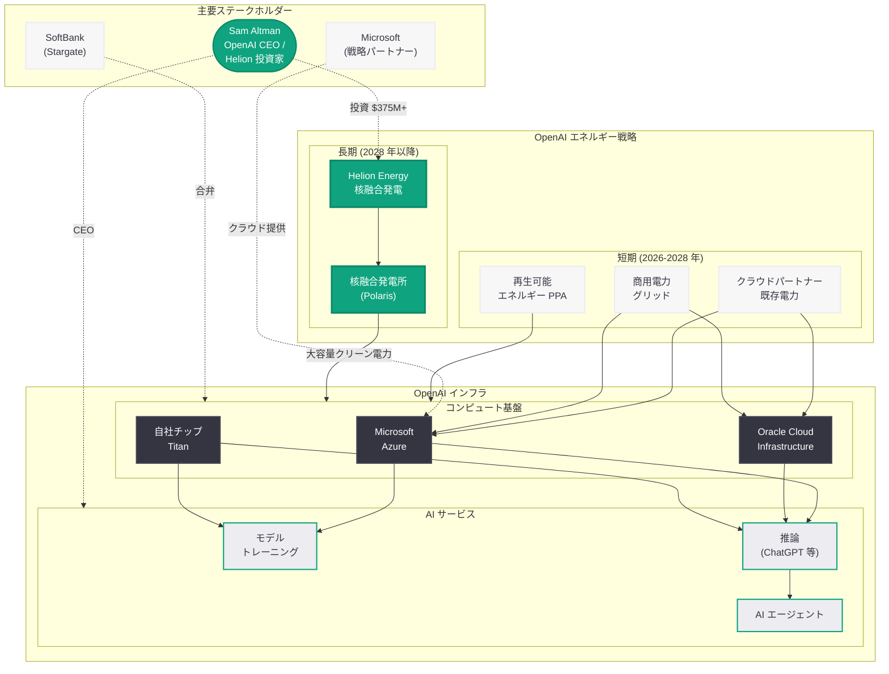

# OpenAI、Altman 支援の核融合スタートアップ Helion Energy との大型エネルギー提携を推進

## メタデータ

| 項目 | 内容 |
|------|------|
| 発表日 | 2026-03-23 |
| ソース | Axios (scoop)、Reuters、POWER Magazine、GeekWire |
| カテゴリ | インフラ / エネルギー |
| 公式リンク | [Axios](https://www.axios.com/)、[Reuters](https://www.reuters.com/)、[POWER Magazine](https://www.powermag.com/)、[GeekWire](https://www.geekwire.com/) |

## 概要

OpenAI が、Sam Altman が個人的に 3 億 7,500 万ドル以上を投資する核融合スタートアップ Helion Energy との大型エネルギー提携に向けた協議を進めていることが、Axios のスクープで明らかになった。Altman は利益相反を管理するため、Helion の取締役を退任している。

この提携は、AI トレーニングと推論に必要な膨大な電力を持続可能な形で確保するための OpenAI の長期エネルギー戦略の一環である。データセンターの電力需要が急増する中、核融合エネルギーは従来の電力源に比べて圧倒的にクリーンかつ大容量の電力供給を実現する可能性を秘めており、AI 産業全体にとって画期的なエネルギーソリューションとなり得る。

## 主な内容

### Helion Energy の核融合技術

Helion Energy は、ワシントン州エバレットに拠点を置く核融合スタートアップであり、磁場反転配位 (FRC: Field-Reversed Configuration) と呼ばれる独自のプラズマ加速技術を開発している。

- **技術的アプローチ:** Helion の核融合炉「Polaris」は、重水素とヘリウム 3 (D-He3) を燃料として使用し、プラズマを高速で衝突させることで核融合反応を引き起こす
- **直接電力変換:** 従来の核融合炉が蒸気タービンを介して発電するのに対し、Helion は核融合反応から直接電力を回収するアプローチを採用しており、効率面で大きな利点がある
- **コンパクト設計:** Helion の核融合炉は、ITER などの大型トカマク炉に比べて遥かにコンパクトであり、データセンター近隣への設置が現実的である
- **タイムライン:** Helion は 2028 年までに商用核融合発電を開始する目標を掲げており、既に Microsoft との電力購入契約 (PPA) を 2024 年に締結している

### Sam Altman の投資と利益相反管理

Sam Altman は Helion Energy の最大の個人投資家であり、その投資額は 3 億 7,500 万ドルを超える。

- **投資の背景:** Altman は AI の発展に伴う膨大なエネルギー需要を早くから認識し、核融合エネルギーに大きな可能性を見出してきた
- **取締役退任:** OpenAI と Helion の正式な提携協議が進む中、Altman は利益相反を回避するため Helion の取締役を退任した
- **ガバナンスの透明性:** この退任は、OpenAI が IPO を控える中でコーポレートガバナンスの透明性を確保する重要な措置として評価されている
- **影響力の継続:** 取締役退任後も、Altman は主要株主として Helion に対する影響力を維持するとみられる

### AI オペレーションに必要なエネルギー規模

OpenAI の AI トレーニングと推論に必要な電力は、急速に拡大している。

- **現在の電力消費:** 大規模 AI モデルのトレーニングには数十メガワット規模の電力が必要とされ、GPT-5 クラスのモデルでは更に増大している
- **推論コストの増大:** ChatGPT をはじめとするサービスの利用者拡大により、推論に必要な電力消費も急増している
- **将来の需要予測:** AI エージェントや自律型システムの普及に伴い、データセンターの電力需要は 2030 年までに現在の数倍に達する可能性がある
- **Stargate プロジェクト:** SoftBank との合弁プロジェクト Stargate は、最大数ギガワット規模の電力を必要とする構想であった

### OpenAI のデータセンター戦略における核融合の位置づけ

核融合エネルギーの確保は、OpenAI のインフラ戦略全体の中で長期的な電力基盤として位置づけられている。

- **クラウドパートナー依存への転換:** 2026 年 3 月 22 日の報道の通り、OpenAI は自社データセンター建設を縮小しクラウドパートナーへの依存を高めているが、エネルギー調達は独自に確保する戦略を並行して進めている
- **Titan チップとの相乗効果:** 自社開発の AI チップ「Titan」は電力効率の向上を目指しているが、絶対的な電力消費量は増加傾向にあり、大容量電力源の確保は不可欠である
- **短期 vs 長期:** 短期的にはクラウドパートナーの既存電力インフラを活用しつつ、長期的には Helion の核融合発電による自立的な電力供給を目指す二段構えの戦略である

### 他社の AI エネルギー戦略との比較

AI 大手各社は、データセンターの電力需要に対応するため、それぞれ独自のエネルギー戦略を展開している。

- **Microsoft (原子力):** Microsoft は Three Mile Island 原子力発電所の再稼働に関する契約を Constellation Energy と締結し、既存の原子力技術を活用する戦略を採用している。また、Helion Energy とも独自の電力購入契約を締結済みである
- **Google (地熱):** Google は Fervo Energy との提携により、次世代地熱発電 (EGS: Enhanced Geothermal Systems) をデータセンターの電力源として活用する計画を推進している
- **Amazon (原子力 + 再生可能エネルギー):** Amazon は小型モジュール炉 (SMR) への投資と大規模な再生可能エネルギー調達を組み合わせた戦略を展開している

| 企業 | エネルギー戦略 | 技術 | 商用化時期 |
|------|--------------|------|-----------|
| OpenAI | 核融合 | Helion FRC | 2028 年目標 |
| Microsoft | 原子力 + 核融合 | 既存原発再稼働 + Helion | 稼働中 + 2028 年 |
| Google | 地熱 | Fervo EGS | 2026-2027 年 |
| Amazon | 原子力 + 再エネ | SMR + 太陽光 / 風力 | 2030 年代 |

## 技術的な詳細

### 核融合発電の技術概要

Helion Energy の核融合アプローチは、従来のトカマク型とは根本的に異なる。

1. **燃料サイクル:** 重水素 - ヘリウム 3 (D-He3) 反応を採用しており、中性子放出が少なく放射性廃棄物が大幅に低減される
2. **プラズマ加速:** 磁場反転配位 (FRC) プラズマを両端から加速し、中央で衝突させることで核融合温度 (1 億度以上) に到達させる
3. **直接エネルギー回収:** 核融合反応で生じた荷電粒子のエネルギーを、電磁誘導により直接電力に変換する
4. **パルス方式:** 連続運転ではなくパルス方式で核融合反応を繰り返すことで、装置の小型化と制御性の向上を実現する

### データセンター電力供給モデル

核融合発電所とデータセンターの統合には、以下の技術的課題がある。

- **安定供給:** パルス方式の核融合炉から安定した電力を供給するためのエネルギー貯蔵システムの統合
- **送電:** データセンター近隣に核融合発電所を設置することで送電ロスを最小化
- **冗長性:** 核融合発電所のメンテナンス期間中のバックアップ電源の確保
- **スケーラビリティ:** 需要増加に応じた核融合炉のモジュール追加による段階的な電力増強

## アーキテクチャ

## 環境・持続可能性への影響

### 核融合エネルギーの環境メリット

核融合発電は、AI 産業の環境負荷を大幅に軽減する可能性を持つ。

- **ゼロカーボン:** 核融合反応は二酸化炭素を排出しないため、データセンターの脱炭素化に直接貢献する
- **放射性廃棄物の低減:** Helion の D-He3 反応は従来の核分裂や D-T 核融合に比べて中性子放出が少なく、長寿命放射性廃棄物がほぼ発生しない
- **燃料の豊富さ:** 重水素は海水から、ヘリウム 3 は核融合反応自体の副産物として生成可能であり、燃料枯渇のリスクが極めて低い
- **土地利用効率:** コンパクトな核融合炉は、同等出力の太陽光発電や風力発電に比べて遥かに少ない土地面積で済む

### AI 産業全体への波及効果

OpenAI が核融合エネルギーの商用化を推進することは、AI 産業全体の持続可能性に関する議論に大きな影響を与える。

- **業界標準の形成:** OpenAI のような影響力のある企業が核融合に注力することで、他の AI 企業も持続可能なエネルギー源の確保に積極的になる可能性がある
- **投資の加速:** AI 企業からの需要が核融合技術への投資を加速させ、商用化のタイムラインを前倒しする効果が期待される
- **ESG 評価:** IPO を控える OpenAI にとって、クリーンエネルギーへの取り組みは ESG (環境・社会・ガバナンス) 評価の向上に直結する

## 開発者への影響

### 長期的なインフラ安定性

核融合エネルギーの確保は、長期的に OpenAI の API インフラの安定性向上に寄与する可能性がある。

- **電力制約の緩和:** 大容量の安定電力供給により、データセンターの電力制約に起因するサービス制限が軽減される可能性がある
- **コスト構造の変化:** 核融合発電の限界費用は極めて低いため、長期的には API 利用料金の安定化や引き下げに貢献する可能性がある
- **地理的展開:** コンパクトな核融合炉は様々な地域に設置可能であり、グローバルなサービス展開の選択肢が広がる

### 注意点

- **実用化までの不確実性:** 核融合の商用化は技術的に極めて困難であり、Helion の 2028 年目標が達成されるかは不確実である
- **短期的な影響は限定的:** 核融合発電の恩恵が開発者に届くまでには数年を要するため、短期的な API サービスへの直接的な影響はない
- **クラウドパートナー経由の電力:** OpenAI がクラウドパートナー依存を強めている現状では、核融合発電の電力がどのような形で API インフラに供給されるかは未定である

## 関連リンク

- [Axios](https://www.axios.com/) - OpenAI - Helion Energy 提携に関するスクープ
- [Reuters](https://www.reuters.com/) - 核融合エネルギーと AI 産業に関する報道
- [POWER Magazine](https://www.powermag.com/) - エネルギー業界の分析
- [GeekWire](https://www.geekwire.com/) - Helion Energy の技術動向
- [Helion Energy](https://www.helionenergy.com/) - 公式サイト
- [OpenAI のデータセンター戦略転換 (2026-03-22)](./2026-03-22-openai-datacenter-pivot-nvidia-ipo.md) - 関連レポート
- [Samsung HBM4 と OpenAI Titan チップ (2026-03-21)](./2026-03-21-samsung-hbm4-openai-titan-chip.md) - 関連レポート
- [OpenAI News](https://openai.com/news)

## まとめ

OpenAI が Helion Energy との核融合エネルギー提携を推進する動きは、AI 産業のエネルギー戦略における重要な転換点を示している。Sam Altman が 3 億 7,500 万ドル以上を個人投資し、利益相反管理のために取締役を退任するという対応は、この提携の規模と重要性を物語っている。AI モデルの大規模化とサービス利用者の急増により、データセンターの電力需要は今後も加速度的に拡大する見通しであり、核融合はこの課題に対する根本的なソリューションとなり得る。短期的にはクラウドパートナーの既存電力インフラに依存しつつ、長期的には Helion の核融合発電により自立的かつ持続可能な電力基盤を構築するという二段構えの戦略は、OpenAI の IPO に向けた ESG ストーリーとしても強力である。ただし、核融合の商用化には依然として技術的な不確実性が残っており、Helion の 2028 年商用化目標が計画通りに達成されるかが、この戦略の成否を左右する最大の鍵となる。
