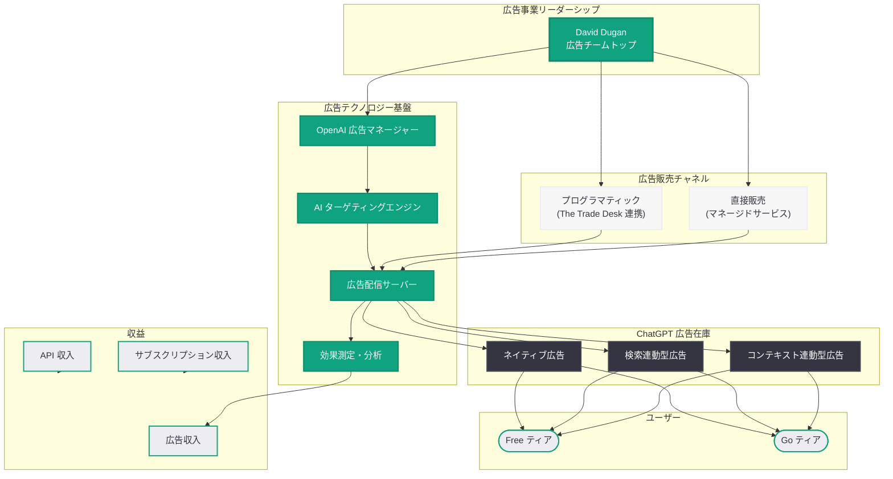

# OpenAI、元 Meta 広告幹部 David Dugan を ChatGPT 広告チームのトップに起用

## メタデータ

| 項目 | 内容 |
|------|------|
| 発表日 | 2026-03-23 |
| ソース | WSJ (独占報道)、ADWEEK、Skift、PYMNTS、MediaPost |
| カテゴリ | ビジネス / 広告 |
| 公式リンク | [WSJ 報道](https://www.wsj.com/) |

## 概要

OpenAI は、Meta (旧 Facebook) の広告部門で幹部を務めた David Dugan を ChatGPT 広告事業のトップとして採用した。Wall Street Journal が独占報道し、ADWEEK、Skift、PYMNTS、MediaPost 等の複数メディアが確認した。この人事は、OpenAI が広告収入を本格的な収益の柱として構築する意志を明確に示すものである。

この採用は、2026 年 3 月 21 日に発表された ChatGPT 無料・低価格ユーザー向け米国広告展開の拡大、および 3 月 22 日に報じられた The Trade Desk との広告販売提携検討と合わせて、OpenAI の広告戦略が急速に具体化していることを示している。Meta の広告プラットフォームは年間約 1,600 億ドルの広告売上を誇る世界最大級の広告事業であり、その中核を担った人材の起用は、OpenAI が Google や Meta と直接競合する広告市場への本格参入を加速させることを意味する。

## 主な内容

### David Dugan の経歴と採用の意義

David Dugan は、Meta において広告事業の中核的な役割を担った実績を持つ人物である。

- **Meta での実績:** Meta の広告プラットフォームは、Facebook、Instagram、WhatsApp、Messenger を横断する広告ネットワークを構築し、年間約 1,600 億ドルの広告売上を達成している。Dugan はこの広告エコシステムの運営と成長に貢献した
- **広告業界における専門性:** 大規模なプログラマティック広告の運用、広告主リレーション、広告フォーマットの開発、ターゲティング技術の最適化など、広告事業の包括的な知見を有する
- **ChatGPT 広告チームのリーダーシップ:** OpenAI における役割は、ChatGPT の広告事業全体を統括し、広告収入の最大化と広告エコシステムの構築を主導することである

この採用が持つ戦略的意義は以下の通りである。

1. **実行力の確保:** 広告戦略の構想段階から実行段階への移行に際し、大規模広告事業の運用実績を持つリーダーが不可欠である
2. **広告主との信頼構築:** Meta の広告主ネットワークとの関係性は、OpenAI の広告在庫に広告主を誘致する上で大きな資産となる
3. **組織構築の加速:** 広告チームのスケーリングに際し、Meta の広告部門で培った組織運営のノウハウが活用される

### OpenAI の広告戦略の全体像

直近 1 週間で OpenAI の広告戦略に関する動きが連続して報じられており、全体像が明確になりつつある。

| 日付 | 動き | 意義 |
|------|------|------|
| 2026-03-21 | ChatGPT 無料・Go ティアの米国全ユーザーへ広告展開拡大 | 広告在庫の確保 |
| 2026-03-22 | The Trade Desk との広告販売提携検討 | プログラマティック広告基盤の構築 |
| 2026-03-23 | David Dugan を広告チームトップに採用 | 広告事業の実行体制の確立 |

この一連の動きは、広告在庫 (供給)、広告配信基盤 (インフラ)、事業リーダーシップ (人材) という広告事業の三要素が同時に整備されていることを示しており、OpenAI が広告事業を単なる実験ではなく、収益の中核として位置づけていることが読み取れる。

### ChatGPT 広告のフォーマットと配信方法

ChatGPT における広告は、従来の Web 広告やソーシャルメディア広告とは根本的に異なるフォーマットが求められる。

**想定される広告フォーマット:**

- **コンテキスト連動型広告:** ユーザーの質問内容に関連する広告を会話フロー内に自然に表示する。例えば、旅行に関する質問に対して航空券やホテルのスポンサードコンテンツを提示する
- **検索連動型広告:** ChatGPT の Web 検索機能と連動し、検索結果内にスポンサードリンクを表示する
- **レコメンデーション広告:** 製品やサービスの推薦を求める会話において、スポンサードされた選択肢を含める
- **ネイティブ広告:** 会話の自然な流れを阻害しない形式で、広告コンテンツを対話に統合する

**ターゲティング手法:**

- **コンテキストターゲティング:** 会話の内容やトピックに基づいた広告配信
- **インテントベースターゲティング:** ユーザーの意図 (購買、調査、比較検討等) を推測した配信
- **デモグラフィックターゲティング:** ユーザーの基本属性に基づいた配信

### Google 広告事業との競合分析

David Dugan の採用は、OpenAI が Google の広告事業に対して本格的に挑戦する意志を示すものでもある。

| 項目 | Google | Meta | OpenAI (構築中) |
|------|--------|------|----------------|
| 年間広告売上 | 約 3,000 億ドル | 約 1,600 億ドル | 未公開 |
| 広告インフラ歴 | 20 年以上 | 15 年以上 | 初期段階 |
| 主な広告面 | 検索、YouTube、ディスプレイ | Facebook、Instagram、WhatsApp | ChatGPT 対話型 UI |
| 広告主数 | 数百万社 | 数百万社 | 構築中 |
| ターゲティングの強み | 検索意図、閲覧履歴 | ソーシャルグラフ、行動データ | 対話コンテキスト、意図推測 |
| DSP 連携 | 自社 DV360 | 自社 Audience Network | The Trade Desk (検討中) |

OpenAI の差別化ポイントは、対話型 AI という新しい広告メディアにある。ユーザーが自然言語で意図を明確に表現する ChatGPT の環境では、従来の検索キーワードやソーシャルメディアの行動データよりも精度の高い意図把握が可能となる。Meta の広告事業を熟知する Dugan のリーダーシップのもと、この優位性を最大限に活用した広告プロダクトの開発が期待される。

### IPO に向けた収益多角化

OpenAI が広告事業を急速に立ち上げる背景には、IPO (新規株式公開) に向けた収益基盤の強化がある。

- **現在の収益構造:** 年間売上高ランレート 250 億ドル (2026 年 3 月時点) の大部分はサブスクリプション収入と API 利用料で構成されている
- **広告収入の必要性:** AI モデルのトレーニングおよび推論コストは依然として莫大であり、広告収入による収益多角化は、投資家に対して持続可能なビジネスモデルを提示するために不可欠である
- **評価額への影響:** 複数の収益源を持つ企業は、単一の収益源に依存する企業よりも高い評価を受ける傾向がある。広告事業の確立は、IPO 時の企業価値最大化に直結する

### プライバシーとユーザー体験の課題

広告事業の拡大に伴い、OpenAI は以下の課題に直面する。

- **会話データの取り扱い:** ChatGPT の会話内容を広告ターゲティングにどの程度活用するかは、プライバシーの観点から慎重な判断が求められる。Meta が過去に直面したプライバシー問題の教訓を、Dugan が OpenAI に持ち込むことが期待される
- **ユーザー体験の維持:** 広告表示がユーザー体験を著しく損なう場合、有料ティアへのアップグレード動機にはなり得るが、同時にユーザー離脱のリスクも生じる
- **規制対応:** 米国の CCPA、EU の GDPR 等のプライバシー規制への準拠が必要であり、AI が生成する応答内の広告という新しい形態に対する規制の動向も注視が求められる
- **広告の透明性:** ユーザーが広告コンテンツとオーガニックな回答を明確に区別できる仕組みの設計が不可欠である

## 技術的な詳細

### 広告エコシステムの構築要素

David Dugan のリーダーシップのもとで構築が進む広告エコシステムは、以下の技術要素で構成されると推測される。

**広告配信インフラ:**

- リアルタイムビディング (RTB) 対応の広告サーバー
- The Trade Desk との API 連携によるプログラマティック広告配信
- 広告在庫管理システム (SSP: サプライサイドプラットフォーム)

**広告マネージャー:**

- 広告キャンペーンの作成・管理インターフェース
- ターゲティング設定 (コンテキスト、デモグラフィック、インテント)
- 予算管理・入札戦略の最適化エンジン
- パフォーマンスレポーティング・効果測定ダッシュボード

**AI 活用型広告最適化:**

- 大規模言語モデルを活用した広告コンテンツの最適化
- 会話コンテキストの理解に基づくリアルタイムターゲティング
- 広告クリエイティブの自動生成・最適化

### 直接販売とプログラマティックの融合

OpenAI の広告事業は、二つの販売チャネルの融合を目指している。

- **直接販売 (マネージドサービス):** 大規模ブランド広告主に対するプレミアム広告枠の直接販売。高度なカスタマイズとブランドセーフティを提供
- **プログラマティック (The Trade Desk 経由):** 中小企業を含む幅広い広告主が自動化された入札を通じて広告在庫にアクセス。スケーラビリティとアクセシビリティを重視

## アーキテクチャ

## 開発者への影響

### 広告テクノロジー開発者への影響

- **新たな広告プラットフォームの登場:** ChatGPT 広告エコシステムの構築に伴い、広告テクノロジー企業にとって新たなインテグレーション機会が生まれる
- **対話型広告フォーマットの開発:** 従来のバナー広告やテキスト広告とは異なる、対話型 AI に最適化された広告クリエイティブの開発ニーズが拡大する
- **The Trade Desk エコシステムの拡張:** The Trade Desk の DSP を利用する広告テック企業は、ChatGPT の広告在庫を新たな配信先として活用できるようになる

### OpenAI API 利用者への間接的影響

- **API 利用への直接的影響はなし:** 現時点では、OpenAI API を利用する開発者のサービスに広告が挿入される計画は報じられていない
- **API 価格の安定化:** 広告収入の増加による財務基盤の強化は、API 価格の安定化や将来的な値下げに寄与する可能性がある
- **将来的な広告 API の可能性:** 広告事業の成熟に伴い、開発者が自社アプリケーション内で OpenAI の広告ネットワークを活用できる API が提供される可能性がある

### 広告業界全体への影響

- **AI ネイティブ広告市場の創出:** 対話型 AI における広告は、既存のデジタル広告とは異なる新しいカテゴリーを形成する可能性がある
- **人材市場への波及:** Meta、Google 等の広告プラットフォームから OpenAI への人材流動が加速する可能性がある
- **競合他社の対応:** Google、Meta、Amazon 等の広告プラットフォームも、自社の AI プロダクトにおける広告モデルの強化を進めることが予想される

## 関連リンク

- [WSJ 報道 (独占)](https://www.wsj.com/)
- [ADWEEK 報道](https://www.adweek.com/)
- [Skift 報道](https://skift.com/)
- [PYMNTS 報道](https://www.pymnts.com/)
- [MediaPost 報道](https://www.mediapost.com/)
- [関連レポート: ChatGPT 無料・低価格ユーザー向け米国広告展開拡大 (2026-03-21)](./2026-03-21-chatgpt-ads-expansion-us.md)
- [関連レポート: OpenAI、The Trade Desk との広告販売提携を検討 (2026-03-22)](./2026-03-22-openai-trade-desk-ad-partnership.md)

## まとめ

OpenAI が元 Meta 広告幹部の David Dugan を ChatGPT 広告事業のトップに迎えたことは、同社の広告戦略が構想段階から本格的な実行段階へと移行したことを明確に示している。2026 年 3 月 21 日の米国全ユーザー向け広告展開拡大、3 月 22 日の The Trade Desk との提携検討、そして今回の Dugan の採用という一連の動きは、広告在庫の確保、配信基盤の構築、事業リーダーシップの確立という三要素が同時に進行していることを物語っている。Meta で年間約 1,600 億ドル規模の広告事業を経験した Dugan のリーダーシップのもと、ChatGPT の対話型インターフェースを活用した独自の広告エコシステムの構築が加速することが予想される。年間売上高ランレート 250 億ドルに達した OpenAI にとって、IPO を控えた収益多角化は喫緊の課題であり、広告収入はサブスクリプションと API 利用料に次ぐ第三の収益の柱となる可能性がある。一方で、ユーザーの会話データの取り扱い、プライバシー保護、広告の透明性、ユーザー体験の維持といった課題への対応が、広告事業の成否を左右する重要な要素となる。
