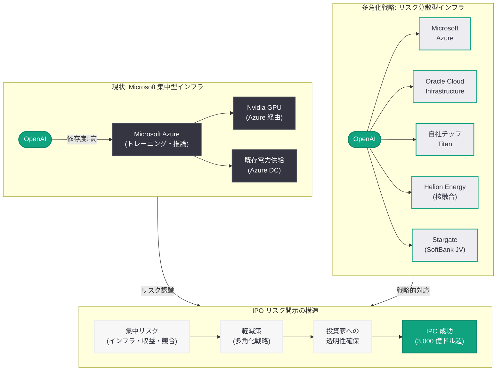

# OpenAI、IPO 投資家向け文書で Microsoft 依存リスクを明記: インフラ集中リスクと多角化戦略の全容

## メタデータ

| 項目 | 内容 |
|------|------|
| 発表日 | 2026-03-23 |
| ソース | CNBC、Reuters、Forbes |
| カテゴリ | ビジネス / IPO |
| 公式リンク | [CNBC](https://www.cnbc.com/2026/03/23/openai-ipo-microsoft-risk-disclosure.html)、[Reuters](https://www.reuters.com/technology/openai-ipo-microsoft-dependence-risk-2026-03-23/)、[Forbes](https://www.forbes.com/sites/technology/2026/03/23/openai-ipo-microsoft-risk/) |

## 概要

OpenAI が IPO に先立ち投資家向けに提出した文書において、Microsoft への依存を主要なリスク要因として明記したことが 2026 年 3 月 23 日に明らかになった。この開示は、OpenAI がインフラストラクチャにおける集中リスクを公式に認識し、投資家に対して透明性を確保する意図を示すものである。

評価額 3,000 億ドル超が見込まれる OpenAI の IPO において、Microsoft 依存リスクの明記は極めて重要な意味を持つ。OpenAI の収益基盤であるクラウドインフラ、計算資源、そしてビジネス関係の大部分が Microsoft に集中している現状は、投資家にとって無視できないリスクファクターである。同時に、OpenAI は独自チップ「Titan」の開発、Helion Energy との提携によるエネルギー調達の多角化、マルチクラウド戦略の推進など、依存度を低減するための具体的な取り組みを進めている。

## 主な内容

### Microsoft 依存リスクの具体的な開示内容

OpenAI が投資家向け文書で明記した Microsoft 依存リスクには、以下の主要な領域が含まれる。

- **クラウドインフラの集中:** OpenAI のモデルトレーニングおよび推論ワークロードの大部分が Microsoft Azure 上で稼働しており、Azure の障害やサービス変更が OpenAI の事業継続性に直接影響する
- **計算資源の調達依存:** GPU クラスタを含む大規模計算資源の確保において、Microsoft との契約に大きく依存しており、供給制約や価格交渉力の面でリスクがある
- **収益分配構造:** Microsoft との既存の契約には収益分配条項が含まれており、OpenAI の利益率に構造的な影響を与えている
- **競合関係の潜在リスク:** Microsoft は独自の AI モデル開発 (Copilot 等) も推進しており、パートナーであると同時に潜在的な競合でもあるという複雑な関係性が存在する

### IPO のタイムラインと評価額

OpenAI の IPO に関する主要な情報は以下の通りである。

- **評価額:** 直近の資金調達ラウンドで 3,000 億ドル超の評価を受けており、IPO 時にはさらなる上昇が見込まれる
- **営利法人への転換:** OpenAI は非営利組織から営利法人への転換プロセスを進めており、IPO はその完了後に実施される見通しである
- **収益規模:** 年間収益は急成長を続けており、ChatGPT の有料会員数の増加と API 利用量の拡大が収益基盤を支えている
- **黒字化の見通し:** 巨額のインフラ投資が継続する中、黒字化のタイムラインは投資家にとって最大の関心事の一つである

### Microsoft 依存を低減する多角化戦略

OpenAI は Microsoft への依存度を戦略的に低減するため、複数の取り組みを並行して推進している。

- **独自チップ「Titan」の開発:** Samsung 製 HBM4 メモリを採用した独自 AI チップにより、GPU 調達における Nvidia および Microsoft への依存を軽減する狙いがある
- **Helion Energy との提携:** 核融合エネルギー企業 Helion との提携により、データセンターのエネルギー供給を多角化し、電力コストの安定化を図る
- **マルチクラウド戦略:** Oracle Cloud Infrastructure (OCI) を含む複数のクラウドプロバイダーとの関係を構築し、Azure 一極集中からの脱却を目指す
- **自社データセンター構想:** SoftBank との Stargate プロジェクトを含む自社インフラの構築も選択肢として残しつつ、コスト効率とのバランスを検討している

### Microsoft-OpenAI パートナーシップへの影響

リスク開示が両社のパートナーシップに与える影響は多面的である。

- **契約関係の再定義:** OpenAI の多角化戦略は、Microsoft との排他的なインフラ契約の見直しにつながる可能性がある
- **Microsoft の対応:** Microsoft にとって OpenAI は Azure の最大級の顧客であり、関係維持のために契約条件の柔軟化を提示する可能性がある
- **投資家への影響:** Microsoft は OpenAI の大株主でもあり、IPO による投資リターンと顧客としての収益の両面で利害が絡む
- **長期的な共存:** 両社の関係は競合と協調が入り混じる「コーペティション」の構造へと移行しつつある

## 技術的な詳細

### インフラ依存の構造分析

OpenAI の Microsoft 依存は、以下の技術的レイヤーにわたっている。

1. **トレーニングインフラ:** 大規模言語モデルのトレーニングには数万台規模の GPU クラスタが必要であり、これらの大部分が Azure 上で構成されている
2. **推論インフラ:** ChatGPT および API サービスの推論ワークロードも Azure 上で稼働しており、日々の API リクエスト処理に不可欠である
3. **ネットワークインフラ:** グローバルなサービス提供に必要な CDN やロードバランシングも Azure のネットワーク基盤に依存している
4. **セキュリティとコンプライアンス:** データ保護やコンプライアンス対応においても Azure のセキュリティ機能を活用している

### 多角化の技術的課題

Microsoft 依存からの脱却には、以下の技術的課題が存在する。

- **モデル移植性:** Azure に最適化されたトレーニングパイプラインを他のクラウドプロバイダーに移植するには、相当な工数が必要である
- **データ転送コスト:** マルチクラウド構成では、クラウド間のデータ転送 (egress) コストが増大する
- **運用の複雑化:** 複数のクラウドプロバイダーを管理する運用負荷は、単一プロバイダー利用時と比較して大幅に増加する

## アーキテクチャ

## 投資家および業界への影響

### 投資家にとっての意味

OpenAI が Microsoft 依存リスクを明記したことは、投資家にとって以下の意味を持つ。

- **透明性の評価:** リスク要因の率直な開示は、企業ガバナンスの成熟度を示すものとして投資家からポジティブに評価される可能性がある
- **評価額への影響:** 集中リスクの存在は評価額にディスカウント要因として作用する一方、多角化戦略の具体性が相殺要因となる
- **デューデリジェンスの焦点:** 投資家は Microsoft との契約条件、収益分配比率、解約条項などを精査する必要がある
- **比較対象:** Anthropic (Amazon/AWS 依存) や Google DeepMind (Google Cloud 依存) との比較において、リスクの相対的な大きさが評価される

### AI 業界への波及効果

- **業界標準の形成:** OpenAI のリスク開示が先例となり、他の AI 企業も同様のインフラ集中リスクの開示を求められる可能性がある
- **クラウドプロバイダーの競争:** AI 企業のマルチクラウド志向が強まることで、AWS、Azure、GCP、OCI 間の競争が激化する
- **垂直統合の再評価:** 自社チップや自社エネルギーなど、AI 企業による垂直統合戦略の重要性が再認識される

## 関連リンク

- [CNBC: OpenAI flags Microsoft dependence as risk factor in IPO investor document](https://www.cnbc.com/2026/03/23/openai-ipo-microsoft-risk-disclosure.html)
- [Reuters: OpenAI IPO filing highlights Microsoft reliance risk](https://www.reuters.com/technology/openai-ipo-microsoft-dependence-risk-2026-03-23/)
- [Forbes: OpenAI's IPO documents reveal Microsoft concentration risk](https://www.forbes.com/sites/technology/2026/03/23/openai-ipo-microsoft-risk/)
- [OpenAI News](https://openai.com/news)
- [OpenAI 公式ドキュメント](https://platform.openai.com/docs)

## まとめ

OpenAI が IPO 投資家向け文書で Microsoft 依存を主要リスク要因として明記したことは、AI 産業における企業ガバナンスと透明性の新たな基準を示すものである。クラウドインフラ、計算資源、収益構造の大部分を単一パートナーに依存する現状は、評価額 3,000 億ドル超の企業にとって無視できない構造的リスクであり、OpenAI はこれを正面から認めた形となる。同時に、独自チップ「Titan」の開発、Helion Energy との核融合エネルギー提携、Oracle Cloud を含むマルチクラウド戦略など、依存度低減に向けた具体的な多角化施策を投資家に提示している。この開示は、Microsoft との関係を維持しつつも「コーペティション」構造への移行を明確にするものであり、IPO 成功に向けた戦略的コミュニケーションとして評価できる。AI 企業のインフラ集中リスクという業界共通の課題に対して、OpenAI が先駆的にリスク開示を行ったことで、Anthropic や他の AI スタートアップにも同様の透明性が求められる流れが加速するだろう。
