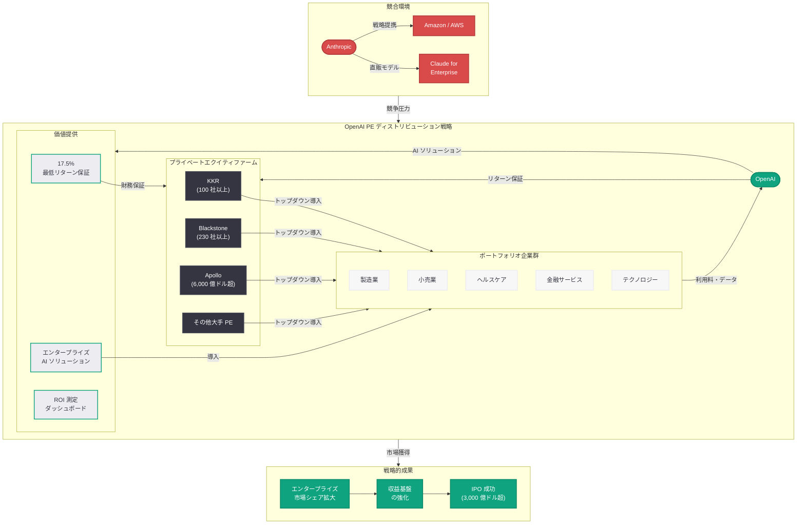

# OpenAI、プライベートエクイティ向けに 17.5% 最低リターン保証を提示: Anthropic との企業 AI 覇権争いが激化

## メタデータ

| 項目 | 内容 |
|------|------|
| 発表日 | 2026-03-23 |
| ソース | Reuters (独占報道)、Forbes、Yahoo Finance |
| カテゴリ | ビジネス / 投資 |
| 公式リンク | [Reuters](https://www.reuters.com/technology/openai-private-equity-guaranteed-return-2026-03-23/)、[Forbes](https://www.forbes.com/sites/technology/2026/03/23/openai-pe-guaranteed-return/)、[Yahoo Finance](https://finance.yahoo.com/news/openai-private-equity-175-return-2026-03-23/) |

## 概要

OpenAI がプライベートエクイティ (PE) ファームに対し、投資に対する 17.5% の最低リターン保証を提示していることが 2026 年 3 月 23 日に Reuters の独占報道で明らかになった。この異例の財務インセンティブは、PE ファームが保有するポートフォリオ企業群にエンタープライズ AI を導入させることで、Anthropic との企業向け AI 市場における競争で優位に立つことを狙った戦略である。

評価額 3,000 億ドル超、IPO 準備を進める OpenAI にとって、PE ファームのネットワークを通じた大規模なエンタープライズ流通チャネルの確保は、従来の直販型営業モデルとは根本的に異なるアプローチである。KKR、Blackstone、Apollo 等の大手 PE ファームが保有する数千社規模のポートフォリオ企業に対して一括で AI 導入を推進できる可能性は、OpenAI のエンタープライズ収益を飛躍的に成長させるポテンシャルを持つ。一方で、最低リターン保証という財務的コミットメントは、OpenAI 自身にとっても重大なリスクを伴う。

## 主な内容

### 17.5% 最低リターン保証の構造と条件

OpenAI が PE ファームに提示している 17.5% 最低リターン保証は、従来のエンタープライズ AI 販売モデルとは一線を画す革新的なスキームである。

- **保証の仕組み:** PE ファームが OpenAI のエンタープライズ AI ソリューションをポートフォリオ企業に導入した場合、その投資に対して年率 17.5% 以上のリターンを保証する
- **リターンの算出基準:** AI 導入によるコスト削減、生産性向上、収益増加等の定量的な効果を基準にリターンを算出し、未達の場合は OpenAI が差額を補填する構造と見られる
- **契約期間:** 複数年にわたるコミットメントが前提であり、PE ファーム側も一定規模以上のポートフォリオ企業への導入を約束する相互拘束型の契約となっている
- **スケールメリット:** 導入企業数が増えるほど OpenAI 側の単位コストが低下するため、大規模導入を前提とした価格設定が可能となる

### PE ファームのポートフォリオ企業を通じたエンタープライズ AI 導入戦略

OpenAI が PE ファームをターゲットとする戦略的合理性は、PE ファームが持つ独特のガバナンス構造にある。

- **トップダウン導入の効率性:** PE ファームはポートフォリオ企業に対して強力な経営介入権を持ち、AI 導入のような全社的な施策を迅速にトップダウンで推進できる
- **ターゲット PE ファーム:** KKR (ポートフォリオ企業 100 社以上)、Blackstone (230 社以上)、Apollo Global Management (ポートフォリオ総資産 6,000 億ドル超) 等の大手 PE ファームが対象とされる
- **導入規模の試算:** 主要 PE ファーム 10 社のポートフォリオ企業を合算すると数千社規模となり、従来の直販営業では数年を要する導入規模を短期間で実現できる可能性がある
- **業種の多様性:** PE ファームのポートフォリオは製造、小売、ヘルスケア、金融サービス等の多岐にわたり、OpenAI のエンタープライズ AI ソリューションの汎用性を証明する場ともなる

### OpenAI vs Anthropic: エンタープライズ AI 競争の構図

エンタープライズ AI 市場における OpenAI と Anthropic の競争は、2026 年に入り一段と激化している。

- **OpenAI のエンタープライズ収益:** 年間経常収益 (ARR) は急成長を続けており、ChatGPT Enterprise と API の法人利用が収益の柱となっている
- **Anthropic の攻勢:** Anthropic は Amazon/AWS との戦略的提携を軸に、Claude for Enterprise の展開を加速させており、金融、医療、法務等の規制産業でシェアを拡大している
- **差別化ポイント:** OpenAI は GPT-4o を中心とした幅広いモデルラインナップと ChatGPT のブランド力を武器とし、Anthropic は安全性と信頼性を前面に打ち出している
- **PE チャネルの重要性:** 従来の SaaS 型直販では 1 社ずつの獲得となるが、PE ファーム経由では一括で数十~数百社への導入が可能となり、市場シェア獲得のスピードが劇的に変わる

### OpenAI のエンタープライズ戦略と IPO への布石

17.5% リターン保証は、OpenAI の IPO 準備と密接に関連している。

- **収益基盤の拡大:** PE ファーム経由の大規模エンタープライズ契約は、IPO 投資家に対して安定的な収益成長ストーリーを提示する材料となる
- **評価額の正当化:** 3,000 億ドル超の評価額を正当化するためには、消費者向け ChatGPT に加えてエンタープライズ収益の急成長が不可欠である
- **ロックイン効果:** PE ファームとの複数年契約により、長期的な収益の予測可能性が向上し、投資家にとっての魅力が増す
- **競合排除:** Anthropic が同様の PE チャネル戦略を展開する前に先行者利益を確保する狙いがある

## 技術的な詳細

### エンタープライズ AI 導入における技術的側面

PE ファームのポートフォリオ企業への AI 導入では、以下の技術的要素が重要となる。

1. **標準化された導入フレームワーク:** 多数の企業に短期間で導入するため、業種別のテンプレート化されたソリューションパッケージが必要となる
2. **API インテグレーション:** OpenAI の API をポートフォリオ企業の既存システム (ERP、CRM、HR 等) に統合するための標準的なインテグレーションレイヤーの提供
3. **データセキュリティとコンプライアンス:** PE ファームのポートフォリオ企業は多様な業種にまたがるため、HIPAA、SOC 2、GDPR 等の各種コンプライアンス要件への対応が求められる
4. **ROI 測定基盤:** 17.5% リターン保証の根拠となる効果測定のために、AI 導入による生産性向上やコスト削減を定量的に計測するダッシュボードや分析基盤の提供が必要となる

### リターン保証のリスク分析

OpenAI にとっての財務リスクは以下の通りである。

- **保証コストの見積り:** ポートフォリオ企業の AI 導入効果が 17.5% に満たない場合、OpenAI が差額を負担する必要があり、大規模な導入では数億ドル規模のコミットメントとなる可能性がある
- **効果測定の不確実性:** AI 導入の ROI は業種、導入範囲、組織の成熟度によって大きく異なり、一律 17.5% の保証は一部の企業で未達となるリスクがある
- **持続可能性:** 短期的な市場シェア獲得には有効だが、保証コストの累積が長期的な収益性を圧迫する可能性がある
- **IPO への影響:** リターン保証が偶発債務として財務諸表に計上される場合、IPO 時の投資家評価に影響を与える可能性がある

## アーキテクチャ

## 投資家および業界への影響

### PE ファームにとっての意味

OpenAI の 17.5% リターン保証は、PE ファームにとって以下の観点で検討に値する。

- **リスク軽減:** AI 導入のリターンが保証されることで、PE ファームはポートフォリオ企業への AI 投資に伴うダウンサイドリスクを大幅に低減できる
- **バリューアップの手段:** AI 導入によるオペレーショナルエクセレンスの向上は、PE ファームが追求するポートフォリオ企業のバリューアップに直結する
- **差別化要因:** LP (リミテッドパートナー) への運用報告において、AI 活用による付加価値創出は有力なアピールポイントとなる
- **カウンターパーティリスク:** 一方で、OpenAI の保証能力に対する信用リスク評価が必要であり、OpenAI の財務健全性が判断材料となる

### エンタープライズ AI 市場への波及効果

- **販売モデルの変革:** 従来の SaaS 型直販から、金融的インセンティブを組み合わせた間接販売モデルへの転換が業界全体で広がる可能性がある
- **Anthropic の対応:** Anthropic は Amazon/AWS のエコシステムを活用した対抗策を講じる必要に迫られる
- **価格競争の激化:** リターン保証という実質的な値引きが、エンタープライズ AI 市場全体の価格水準に下方圧力を与える可能性がある
- **PE 業界と AI 業界の融合:** テクノロジー企業と金融機関の新たな協業モデルとして、業界横断的な注目を集めている

### 従来のエンタープライズ営業との相違点

| 観点 | 従来の直販モデル | PE ディストリビューション戦略 |
|------|-----------------|---------------------------|
| 営業対象 | 個別企業の CIO/CTO | PE ファームのマネージングパートナー |
| 導入意思決定 | ボトムアップ (数か月~1 年) | トップダウン (数週間~数か月) |
| 1 契約あたり導入企業数 | 1 社 | 数十~数百社 |
| リスク分担 | 顧客が全リスクを負担 | OpenAI がリターンを保証 |
| 契約期間 | 年次更新が一般的 | 複数年コミットメント |
| 競合排除効果 | 低い | 高い (排他的契約の可能性) |

## 関連リンク

- [Reuters: OpenAI offers PE firms guaranteed 17.5% return in enterprise AI push](https://www.reuters.com/technology/openai-private-equity-guaranteed-return-2026-03-23/)
- [Forbes: OpenAI sweetens deal for private equity firms](https://www.forbes.com/sites/technology/2026/03/23/openai-pe-guaranteed-return/)
- [Yahoo Finance: OpenAI's aggressive PE strategy amid Anthropic rivalry](https://finance.yahoo.com/news/openai-private-equity-175-return-2026-03-23/)
- [OpenAI News](https://openai.com/news)
- [OpenAI 公式ドキュメント](https://platform.openai.com/docs)

## まとめ

OpenAI がプライベートエクイティファームに対して 17.5% の最低リターン保証を提示したことは、エンタープライズ AI 市場における競争戦略の新たなフェーズを示すものである。KKR、Blackstone、Apollo 等の大手 PE ファームが保有する数千社規模のポートフォリオ企業群に対して、トップダウンでの AI 導入を一括推進するこの戦略は、従来の SaaS 型直販モデルとは根本的に異なるアプローチであり、Anthropic との企業 AI 覇権争いにおいて決定的な流通優位性を確保する狙いがある。一方で、17.5% のリターン保証は OpenAI にとって重大な財務的コミットメントであり、AI 導入効果が想定を下回った場合の補填コスト、偶発債務としての IPO への影響、そして保証スキームの長期的な持続可能性といったリスクが存在する。評価額 3,000 億ドル超を見据えた IPO 準備が進む中、このアグレッシブな戦略がエンタープライズ収益の急成長を実現し IPO 成功の礎となるか、それとも過大な財務リスクとなるかは、今後の AI 導入効果の実績と PE ファーム側の反応に大きく依存するだろう。
