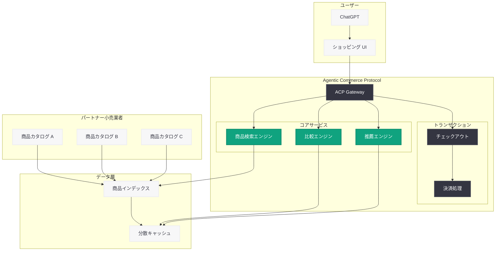

# ChatGPT における商品発見機能の強化 -- Agentic Commerce Protocol の導入

## メタデータ

| 項目 | 内容 |
|------|------|
| 発表日 | 2026-03-24 |
| ソース | OpenAI News |
| カテゴリ | Product |
| 公式リンク | [openai.com](https://openai.com/index/powering-product-discovery-in-chatgpt) |

## 概要

OpenAI は 2026 年 3 月 24 日、ChatGPT にリッチでビジュアルに没入感のあるショッピング体験を導入することを発表した。本機能は新たに開発された Agentic Commerce Protocol (ACP) を基盤としており、ユーザーが ChatGPT 内で商品の発見、比較、そしてシームレスなチェックアウトまでを一貫して行えるようにするものである。

この発表は、AI アシスタントが単なる情報提供ツールから、実際の購買行動を支援するエージェントへと進化する重要な転換点を示している。従来の検索エンジンベースのショッピング体験とは異なり、対話型 AI が購買意思決定の全プロセスをサポートする新しいコマース体験が実現される。

## 主な内容

### Agentic Commerce Protocol (ACP) の概要

Agentic Commerce Protocol は、AI エージェントがコマースエコシステムと安全かつ効率的に連携するための標準化されたプロトコルである。このプロトコルにより、ChatGPT は小売業者のカタログデータ、在庫情報、価格情報にリアルタイムでアクセスし、ユーザーに最適な商品を提案できるようになる。

- **標準化された商品データ交換:** 小売業者が統一的なフォーマットで商品情報を提供できる仕組み
- **リアルタイム在庫・価格同期:** 常に最新の在庫状況と価格をユーザーに反映
- **安全なトランザクション処理:** エンドツーエンドで暗号化された決済フロー
- **プライバシー保護:** ユーザーの購買データを適切に管理し、不要なデータ共有を防止

### ビジュアルリッチな商品発見体験

ChatGPT のショッピング体験は、テキストベースの応答を超えた視覚的に豊かなインターフェースを提供する。

- **商品カード表示:** 高品質な商品画像、価格、評価、レビュー概要を含むリッチカードで商品を表示
- **サイドバイサイド比較:** 複数の商品を並べて仕様、価格、レビューを直感的に比較可能
- **パーソナライズされた推薦:** ユーザーの好みや予算に基づいた AI 駆動の商品推薦
- **カテゴリ横断検索:** 複数のカテゴリや小売業者にまたがる統合的な商品検索

### シームレスなチェックアウト

商品選択からチェックアウトまでのプロセスが ChatGPT 内で完結する。

- **ワンクリックチェックアウト:** ChatGPT 内から直接小売業者のチェックアウトフローに遷移
- **配送オプションの比較:** 複数の配送方法と到着予定日を一覧で表示
- **価格アラート:** 関心のある商品の価格変動を通知する機能
- **購入履歴の活用:** 過去の購入パターンに基づく再購入提案やサイズ推薦

### パートナー小売業者との連携

Agentic Commerce Protocol は、主要な小売業者やブランドとのパートナーシップを通じて展開される。小売業者は ACP に準拠したデータフィードを提供することで、ChatGPT のショッピングエコシステムに参加できる。これにより、幅広いジャンルの商品がカバーされ、ユーザーは多様な選択肢の中から最適な商品を見つけることが可能になる。

## 技術的な詳細

### Agentic Commerce Protocol の技術アーキテクチャ

ACP は RESTful API と WebSocket を組み合わせたハイブリッドアーキテクチャを採用しており、商品カタログの検索にはバッチ処理型の REST API を、在庫や価格のリアルタイム更新には WebSocket ベースのストリーミングを使用する。

- **商品データスキーマ:** JSON-LD ベースの構造化データで商品情報を記述
- **認証・認可:** OAuth 2.0 ベースの小売業者認証と、ユーザー同意ベースのアクセス制御
- **レート制限:** 小売業者ごとのリクエストレート管理によるシステム安定性の確保
- **キャッシュ戦略:** CDN と分散キャッシュを活用した高速な商品情報配信

### API を活用した統合例

開発者は OpenAI API の拡張機能を通じて、ACP を活用したカスタムコマース体験を構築できる。

```python
from openai import OpenAI

client = OpenAI()

# 商品発見を含む会話の例
response = client.chat.completions.create(
    model="gpt-4o",
    messages=[
        {
            "role": "system",
            "content": "You are a shopping assistant with access to product catalogs via the Agentic Commerce Protocol."
        },
        {
            "role": "user",
            "content": "I'm looking for wireless noise-cancelling headphones under $300 with good battery life."
        }
    ],
    tools=[
        {
            "type": "function",
            "function": {
                "name": "search_products",
                "description": "Search for products using the Agentic Commerce Protocol",
                "parameters": {
                    "type": "object",
                    "properties": {
                        "query": {"type": "string"},
                        "category": {"type": "string"},
                        "price_max": {"type": "number"},
                        "sort_by": {"type": "string"}
                    },
                    "required": ["query"]
                }
            }
        }
    ]
)

print(response.choices[0].message.content)
```

> **注:** 上記のコード例は ACP を活用した商品検索の一般的なパターンの想定であり、実際の API 仕様とは異なる場合がある。詳細は公式ドキュメントを参照してください。

## アーキテクチャ



## 開発者への影響

### コマースアプリケーション開発の新たな機会

Agentic Commerce Protocol の導入により、開発者にとって以下のような新たな機会と影響が生まれる。

- **ACP 統合の実装:** 小売業者向けに ACP 準拠のデータフィードやカタログ連携の構築が求められる
- **プラグインエコシステムの拡大:** ChatGPT のコマース機能を拡張するプラグインやツールの開発機会が増加
- **ユーザー体験の差別化:** AI 駆動のパーソナライズされたショッピング体験が標準となり、従来の EC サイトとの差別化が必要に

### EC プラットフォームへの影響

- 既存の EC プラットフォームは ACP への対応を検討する必要がある
- 商品データの構造化と標準化がこれまで以上に重要になる
- AI エージェントを介した新しい顧客獲得チャネルとしての活用が可能に

### 導入時の考慮事項

- ACP 準拠の商品フィード仕様への対応と既存データの変換コスト
- 決済フローにおけるセキュリティ要件とコンプライアンス対応
- AI を介した購買における返品・クレームポリシーの再設計
- 商品レコメンデーションの公平性とバイアスへの配慮

## 関連リンク

- [Powering product discovery in ChatGPT (公式発表)](https://openai.com/index/powering-product-discovery-in-chatgpt)
- [OpenAI 公式ドキュメント](https://platform.openai.com/docs)
- [OpenAI API リファレンス](https://platform.openai.com/docs/api-reference)
- [OpenAI News](https://openai.com/news)

## まとめ

ChatGPT におけるショッピング機能の強化と Agentic Commerce Protocol の導入は、AI アシスタントが情報提供の枠を超え、商取引を直接支援するエージェントとして機能する新時代の到来を示している。ビジュアルリッチな商品カード、サイドバイサイド比較、シームレスなチェックアウトという一連の機能は、従来のオンラインショッピング体験を根本から変革する可能性を持つ。ACP による標準化されたプロトコルは、小売業者が AI コマースエコシステムに参入するための統一的な基盤を提供し、開発者にとっても新たなビジネス機会を創出する。今後、AI エージェントを介したコマースが EC の主流チャネルの一つとなることが予想され、早期の対応が競争優位性につながるだろう。
