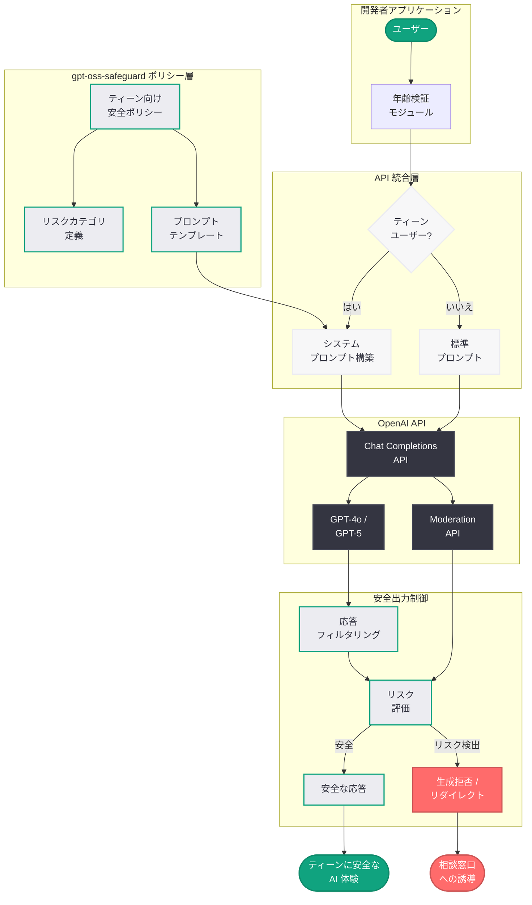

# 開発者がティーン向けのより安全な AI 体験を構築するための支援: gpt-oss-safeguard によるティーン安全ポリシーの公開

## メタデータ

| 項目 | 内容 |
|------|------|
| 発表日 | 2026-03-24 |
| ソース | OpenAI News |
| カテゴリ | Safety |
| 公式リンク | [openai.com](https://openai.com/index/teen-safety-policies-gpt-oss-safeguard) |

> **注記:** 本レポートは記事タイトル、概要、および OpenAI の既存のティーン安全施策に関する公開情報をもとに作成されている。記事全文へのアクセスが制限されていたため、公開されている情報と関連する技術的背景に基づいて内容を構成している。

## 概要

OpenAI は 2026 年 3 月 24 日、開発者がティーン (10 代) ユーザー向けにより安全な AI 体験を構築できるよう、プロンプトベースのティーン安全ポリシーを公開した。本ポリシーは `gpt-oss-safeguard` という名称で提供され、開発者が AI システムにおける年齢固有のリスクをモデレーションするための具体的な指針とツールを含んでいる。

この取り組みは、OpenAI が 2026 年 3 月 17 日に発表した「Japan Teen Safety Blueprint」をはじめとするグローバルなティーン安全施策の技術的な実装支援として位置づけられる。開発者が OpenAI の API を利用してアプリケーションを構築する際に、ティーンユーザーに対する安全性を組み込みやすくすることを目的としている。

## 主な内容

### gpt-oss-safeguard の概要

`gpt-oss-safeguard` は、OpenAI が開発者向けに提供するプロンプトベースのティーン安全ポリシーセットである。このツールは、開発者が自身のアプリケーションにおいてティーンユーザー向けの年齢固有のリスクをモデレーションするために活用できる。

- **プロンプトベースのアプローチ:** システムプロンプトに組み込む形式で提供されるため、開発者は既存のアプリケーションアーキテクチャを大幅に変更することなく、ティーン向けの安全対策を導入できる
- **年齢固有のリスクモデレーション:** ティーンユーザーに特有のリスク (不適切なコンテンツへの露出、自傷行為に関する情報、過度な個人情報の共有等) に対応したポリシーが定義されている
- **オープンソースでの提供:** "oss" (Open Source Software) の名称が示す通り、本ポリシーはオープンソースとして公開されており、開発者コミュニティが自由に利用・改善できる形式で提供されている

### プロンプトベースの安全ポリシーの仕組み

gpt-oss-safeguard のプロンプトベースアプローチは、以下のような仕組みで動作すると考えられる。

- **システムプロンプトへの統合:** 開発者は、gpt-oss-safeguard が提供するポリシーテンプレートを自身のアプリケーションのシステムプロンプトに組み込む
- **年齢に応じた応答制御:** ティーンユーザーと判定されたセッションでは、安全ポリシーに基づいてモデルの応答が年齢に適した内容に調整される
- **リスクカテゴリの定義:** 暴力、性的コンテンツ、薬物、自傷行為、個人情報漏洩など、ティーンに対して特にリスクの高いカテゴリが明確に定義されている
- **段階的な制限:** リスクレベルに応じて、警告の表示、応答の修正、生成の拒否といった段階的な対応が実装される

### 開発者向けガイダンス

OpenAI は、gpt-oss-safeguard の導入にあたり、開発者に対して以下のようなガイダンスを提供していると考えられる。

- **実装ガイド:** ポリシーの組み込み方法、カスタマイズの手順、テスト方法を含む包括的なドキュメント
- **ベストプラクティス:** ティーンユーザーを対象としたアプリケーション構築における安全設計のベストプラクティス
- **評価ツール:** ポリシーの有効性を検証するためのテストケースと評価フレームワーク

## 技術的な詳細

### gpt-oss-safeguard の統合方法

gpt-oss-safeguard は、OpenAI の Chat Completions API や Responses API と連携して動作する。開発者はシステムプロンプトにポリシーを組み込むことで、ティーン向けの安全対策を実装できる。

### コードサンプル

```python
from openai import OpenAI

client = OpenAI()

# gpt-oss-safeguard のティーン安全ポリシーをシステムプロンプトに組み込む例
teen_safety_policy = """
You are an AI assistant serving a teen user (age 13-17).
Follow the gpt-oss-safeguard teen safety policies:
- Do not generate content that is sexually explicit or gratuitously violent
- Do not provide instructions for self-harm or dangerous activities
- Redirect conversations about mental health crises to appropriate helplines
- Do not encourage sharing of personal identifying information
- Maintain age-appropriate language and topics
- If uncertain about content appropriateness, err on the side of caution
"""

response = client.chat.completions.create(
    model="gpt-4o",
    messages=[
        {"role": "system", "content": teen_safety_policy},
        {"role": "user", "content": "Hello! Can you help me with my homework?"}
    ]
)
print(response.choices[0].message.content)
```

### 年齢検証との連携

gpt-oss-safeguard は、開発者のアプリケーション側で実装される年齢検証メカニズムと連携することが前提となっている。ユーザーがティーンであると判定された場合に、安全ポリシーが適用されるシステムプロンプトに切り替える設計が推奨される。

```python
def get_system_prompt(user_age: int) -> str:
    """ユーザーの年齢に応じて適切なシステムプロンプトを返す"""
    if 13 <= user_age <= 17:
        # gpt-oss-safeguard のティーン向けポリシーを適用
        return load_teen_safety_policy()
    elif user_age >= 18:
        return load_standard_policy()
    else:
        # 13 歳未満のユーザーにはサービスを提供しない
        raise ValueError("User must be at least 13 years old")
```

## アーキテクチャ



## 開発者への影響

gpt-oss-safeguard の公開は、OpenAI API を利用する開発者に対して以下のような影響を与える。

- **ティーン向け安全対策の標準化:** プロンプトベースの安全ポリシーが公式に提供されることで、開発者は独自に安全対策を設計する負担が軽減され、業界として統一的なアプローチが促進される
- **コンプライアンス対応の容易化:** 各国の未成年者保護に関する法規制 (米国の COPPA、EU の GDPR、日本の青少年インターネット環境整備法等) への対応において、gpt-oss-safeguard を基盤として活用することで、コンプライアンス対応が容易になる
- **オープンソースによるコミュニティ主導の改善:** ポリシーがオープンソースで公開されることにより、開発者コミュニティからのフィードバックや改善提案を通じて、ポリシーの品質が継続的に向上することが期待される
- **アプリケーション審査への影響:** OpenAI の API 利用規約において、ティーン向けアプリケーションに対して gpt-oss-safeguard の導入が推奨または要件化される可能性がある
- **多言語対応の必要性:** グローバルに展開されるアプリケーションでは、各言語・文化圏に適合したポリシーのカスタマイズが求められる

## 関連リンク

- [Helping developers build safer AI experiences for teens](https://openai.com/index/teen-safety-policies-gpt-oss-safeguard)
- [Japan Teen Safety Blueprint](https://openai.com/index/japan-teen-safety-blueprint/)
- [Introducing the Teen Safety Blueprint](https://openai.com/index/introducing-the-teen-safety-blueprint/)
- [Teen Safety, Freedom, and Privacy](https://openai.com/index/teen-safety-freedom-and-privacy/)
- [OpenAI 公式ドキュメント](https://platform.openai.com/docs)
- [OpenAI API リファレンス](https://platform.openai.com/docs/api-reference)
- [OpenAI News](https://openai.com/news)

## まとめ

OpenAI が公開した gpt-oss-safeguard は、開発者がティーンユーザー向けのより安全な AI 体験を構築するためのプロンプトベースの安全ポリシーセットである。年齢固有のリスクモデレーションを実現するための具体的なポリシーテンプレートとガイダンスが提供されており、開発者はシステムプロンプトへの統合という比較的容易な方法で安全対策を導入できる。オープンソースとして公開されているため、開発者コミュニティによる改善と拡張が期待される。本施策は、OpenAI の Teen Safety Blueprint や Japan Teen Safety Blueprint といったグローバルなティーン安全イニシアティブの技術的な実装基盤として、AI エコシステム全体における未成年者保護の水準向上に貢献するものである。
