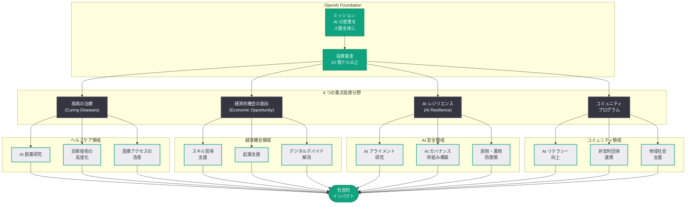

# OpenAI Foundation の最新情報: 10 億ドル以上の社会投資計画を発表

## メタデータ

| 項目 | 内容 |
|------|------|
| 発表日 | 2026-03-24 |
| ソース | OpenAI News (公式) |
| カテゴリ | Company |
| 公式リンク | [Update on the OpenAI Foundation](https://openai.com/index/update-on-the-openai-foundation) |

## 概要

OpenAI Foundation は、少なくとも 10 億ドル (約 1,500 億円規模) を社会的課題の解決に投資する計画を発表した。投資対象は、疾病の治療、経済的機会の創出、AI レジリエンス、およびコミュニティプログラムの 4 つの重点分野に分かれており、AI 技術の恩恵を広く社会に還元することを目指している。

この発表は、OpenAI が営利企業としての成長を加速させる一方で、非営利的な社会貢献活動にも大規模な資金を投じる姿勢を明確にしたものである。OpenAI Foundation は、AI が人類全体に利益をもたらすという OpenAI の創設理念を具体的な行動に移すための重要な組織として位置づけられている。

## 主な内容

### 投資規模と財源

OpenAI Foundation は、少なくとも 10 億ドルの投資を行うことを表明した。この資金は、OpenAI の事業収益および関連する資金調達から拠出されるものと見られる。AI 産業が急速に拡大する中で、その利益を社会に還元するための具体的なコミットメントとして、業界内でも注目すべき規模の投資額である。

### 疾病の治療 (Curing Diseases)

OpenAI Foundation の重点投資分野の 1 つ目は、疾病の治療である。AI 技術を活用した創薬研究、診断技術の高度化、医療アクセスの改善など、ヘルスケア領域における革新的なプロジェクトへの支援が想定される。AI モデルによるタンパク質構造解析や薬物相互作用の予測は、従来の研究手法を大幅に加速させる可能性を持っており、この分野への投資は具体的な成果が期待できる領域である。

### 経済的機会の創出 (Economic Opportunity)

2 つ目の重点分野は、経済的機会の創出である。AI の発展により労働市場が変化する中で、新たなスキル習得の支援、起業支援、デジタルデバイドの解消など、AI 時代における経済的格差の縮小を目指す取り組みが含まれる。特に、AI 技術へのアクセスが限られる地域やコミュニティに対する支援は、AI の恩恵を公平に分配する上で重要な施策となる。

### AI レジリエンス (AI Resilience)

3 つ目の重点分野は、AI レジリエンスである。AI システムの安全性、信頼性、およびロバスト性の向上に関する研究や、AI リスクへの社会的な備えを強化するプロジェクトへの投資が想定される。AI アライメント研究、AI ガバナンスの枠組み構築、および AI の誤用・悪用に対する防御策の開発など、AI の安全な発展を支えるインフラストラクチャへの投資が含まれると考えられる。

### コミュニティプログラム (Community Programs)

4 つ目の重点分野は、コミュニティプログラムである。教育機関、非営利団体、地域コミュニティとの連携を通じて、AI リテラシーの向上や AI を活用した社会課題解決の支援を行う。草の根レベルでの AI 活用を促進し、AI 技術が社会の隅々にまで恩恵をもたらすことを目指す取り組みである。

## 技術的な詳細

### OpenAI Foundation の位置づけ

OpenAI Foundation は、OpenAI の企業構造における非営利部門として機能し、商業活動とは独立した社会貢献活動を推進する役割を担う。OpenAI が営利法人 (for-profit entity) への移行を進める中で、非営利的な使命を継続的に果たすための組織的な仕組みとして重要な意味を持つ。

### 投資の実行体制

10 億ドル規模の投資を効果的に実行するためには、以下のような体制が必要となる。

- **助成プログラム:** 研究機関や非営利団体への助成金の提供
- **パートナーシップ:** 医療機関、教育機関、政府機関との戦略的パートナーシップの構築
- **直接投資:** 社会的インパクトの高いプロジェクトへの直接的な資金投入
- **技術支援:** AI 技術やコンピューティングリソースの無償または低コストでの提供

## アーキテクチャ

## 開発者への影響

OpenAI Foundation の社会投資計画は、直接的な API の変更ではないが、AI エコシステム全体に以下のような影響を与える可能性がある。

- **ヘルスケア AI の加速:** 疾病治療分野への投資により、医療 AI 関連の API やモデルの開発が促進される可能性がある。開発者にとっては、医療分野における AI アプリケーションの構築機会が拡大する
- **AI アクセスの民主化:** 経済的機会の創出やコミュニティプログラムを通じて、AI 技術へのアクセスが拡大することで、新興市場や発展途上地域からの開発者参入が増加する可能性がある
- **AI 安全基準の向上:** AI レジリエンス分野への投資は、AI 安全性に関する業界標準の策定を加速させ、開発者が遵守すべきセキュリティ要件やガバナンス要件が強化される可能性がある
- **非営利・社会貢献プロジェクトへの支援拡大:** OpenAI Foundation の助成プログラムを通じて、社会的課題の解決を目指すオープンソースプロジェクトや非営利プロジェクトへの技術・資金支援が期待できる
- **企業の CSR 戦略への示唆:** AI 企業が大規模な社会投資を行う前例として、他の AI 企業にも同様の取り組みを促す可能性があり、AI 産業全体の社会的責任に対する意識が高まることが期待される

## 関連リンク

- [Update on the OpenAI Foundation - OpenAI](https://openai.com/index/update-on-the-openai-foundation)
- [OpenAI Foundation](https://openai.com/foundation)
- [OpenAI About](https://openai.com/about)
- [OpenAI News](https://openai.com/news)

## まとめ

OpenAI Foundation は、少なくとも 10 億ドルを疾病の治療、経済的機会の創出、AI レジリエンス、コミュニティプログラムの 4 つの重点分野に投資する計画を発表した。この取り組みは、OpenAI が営利企業としての成長と非営利的な社会貢献を両立させる姿勢を明確にしたものであり、AI 技術の恩恵を人類全体に還元するという創設理念の具体的な実行である。10 億ドル規模の社会投資は AI 産業において前例のない規模であり、ヘルスケア AI の加速、AI アクセスの民主化、AI 安全基準の向上、コミュニティレベルでの AI 活用促進など、広範な社会的インパクトが期待される。OpenAI Foundation の今後の具体的なプログラム内容や助成先の選定基準に注目が集まる。
