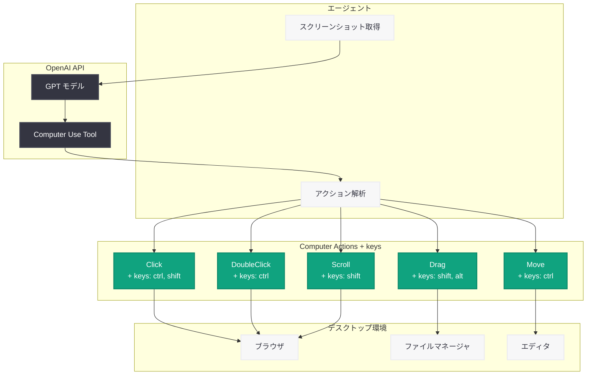

# OpenAI SDK アップデート: Computer Action に keys フィールド追加 (Python v2.30.0 / Node v6.33.0)

## メタデータ

| 項目 | 内容 |
|------|------|
| 発表日 | 2026-03-25 |
| ソース | OpenAI API Changelog (GitHub Releases) |
| カテゴリ | API 更新 |
| 公式リンク | [Python SDK v2.30.0](https://github.com/openai/openai-python/releases/tag/v2.30.0) / [Node SDK v6.33.0](https://github.com/openai/openai-node/releases/tag/v6.33.0) |

## 概要

OpenAI は 2026 年 3 月 25 日、Python SDK v2.30.0 および Node SDK v6.33.0 を同時リリースした。今回の最大の新機能は、Computer Use における Click / DoubleClick / Drag / Move / Scroll の各アクションに `keys` フィールドが追加されたことである。これにより、Ctrl+Click や Shift+Drag などの修飾キーとマウス操作の組み合わせが可能になり、Computer Use エージェントの操作精度と表現力が大幅に向上する。

さらに、Node SDK では WebSocket クラスに非同期イテレータと `stream()` メソッドが追加され、リアルタイムストリーミング処理の開発体験が改善された。両 SDK 共通で、レスポンス型の修正や `ResponseInputMessageItem` の型定義強化なども含まれている。

## 主な内容

### Computer Action への keys フィールド追加

Computer Use API の各アクション型 (Click、DoubleClick、Drag、Move、Scroll) に新しい `keys` フィールドが追加された。このフィールドは修飾キー (Ctrl、Shift、Alt、Meta など) の配列を受け取り、マウス操作と同時に押下するキーを指定できる。

従来の Computer Use では、マウス操作とキーボード操作は個別のアクションとして実行する必要があった。しかし、実際のデスクトップ操作では Ctrl+Click による複数選択、Shift+Click による範囲選択、Alt+Drag によるオブジェクトの複製など、修飾キーとマウス操作の同時使用が頻繁に発生する。`keys` フィールドの導入により、これらの操作を単一のアクションとして自然に記述できるようになった。

### WebSocket クラスの非同期イテレータとストリーム対応 (Node SDK)

Node SDK v6.33.0 では、WebSocket クラスに非同期イテレータ (`async iterator`) と `stream()` メソッドが追加された。これにより、Realtime API やストリーミング応答の処理において、`for await...of` 構文を使用した直感的なイベント処理が可能になる。

従来はコールバックベースでイベントを処理する必要があったが、非同期イテレータの導入により、ストリーミングデータのフロー制御やエラーハンドリングがよりシンプルに記述できる。

### SDK レスポンス型の修正

両 SDK で、レスポンス型が拡張されたアイテムスキーマに合わせて修正された。これは API 側のスキーマ拡張に SDK の型定義を追従させるもので、TypeScript や型チェッカーを使用する開発者にとって、より正確な型補完とコンパイル時の安全性が提供される。

また、`ResponseInputMessageItem` において `type` フィールドが必須に変更された。これにより、型の曖昧さが解消され、入力メッセージの構築時に明示的な型指定が求められるようになった。

## 技術的な詳細

### コードサンプル

#### Computer Use で修飾キーを使用する (Python)

```python
from openai import OpenAI

client = OpenAI()

# Computer Use with modifier keys (new keys field)
response = client.responses.create(
    model="computer-use-sonnet",
    tools=[{
        "type": "computer_use_preview",
        "display_width": 1920,
        "display_height": 1080,
        "environment": "browser"
    }],
    input=[{
        "type": "computer_call_output",
        "call_id": "call_abc123",
        "output": {
            "type": "computer_screenshot",
            "image_url": "data:image/png;base64,..."
        }
    }]
)

# The model may now return actions with keys field:
# {
#     "type": "click",
#     "x": 500,
#     "y": 300,
#     "keys": ["ctrl"]       # Ctrl+Click for multi-select
# }
#
# {
#     "type": "drag",
#     "start_x": 100, "start_y": 200,
#     "end_x": 400, "end_y": 500,
#     "keys": ["shift"]      # Shift+Drag for range selection
# }
```

#### WebSocket の非同期イテレータ (Node)

```typescript
import OpenAI from "openai";

const client = new OpenAI();

// Using async iterator with WebSocket (new in v6.33.0)
const ws = await client.realtime.connect({ model: "gpt-5.4-realtime" });

// Stream events using for-await-of syntax
for await (const event of ws.stream()) {
    if (event.type === "response.audio.delta") {
        // Process audio chunks
        processAudio(event.delta);
    } else if (event.type === "response.text.delta") {
        // Process text chunks
        process.stdout.write(event.delta);
    }
}
```

### 変更一覧

#### Python SDK v2.30.0

| 種別 | 変更内容 |
|------|---------|
| 機能追加 | Click / DoubleClick / Drag / Move / Scroll に `keys` フィールド追加 |
| バグ修正 | SDK レスポンス型を拡張アイテムスキーマに合わせて修正 |
| バグ修正 | エンドポイントのパスパラメータのサニタイズ処理を修正 |
| バグ修正 | `ResponseInputMessageItem` の `type` フィールドを必須に変更 |
| リファクタ | テストフレームワークを Prism から Steady に移行 |

#### Node SDK v6.33.0

| 種別 | 変更内容 |
|------|---------|
| 機能追加 | Computer Action 型に `keys` フィールド追加 |
| 機能追加 | WebSocket クラスに非同期イテレータと `stream()` メソッド追加 |
| バグ修正 | SDK レスポンス型を拡張アイテムスキーマに合わせて修正 |
| バグ修正 | `ResponseInputMessageItem` の `type` フィールドを必須に変更 |
| リファクタ | テストフレームワークを Prism から Steady に移行 |

## アーキテクチャ

以下の図は、Computer Use API における `keys` フィールドの役割を示している。エージェントがモデルからアクションを受け取り、修飾キー付きのマウス操作としてデスクトップ環境に送信する流れを表している。



## 開発者への影響

### Computer Use エージェントの高度化

- **操作の正確性向上:** 修飾キー付きのマウス操作が単一アクションで実行可能になり、操作ステップ数が削減される
- **複雑な操作への対応:** Ctrl+Click による複数選択、Shift+Drag による範囲選択、Alt+Drag によるコピーなど、日常的なデスクトップ操作がネイティブにサポートされる
- **エラー率の低減:** 修飾キーの押下とマウス操作を個別に実行する際のタイミングのずれが解消される

### リアルタイム通信の改善 (Node SDK)

- **開発体験の向上:** `for await...of` 構文によるストリーミング処理が可能になり、コールバック地獄を回避できる
- **フロー制御:** 非同期イテレータによりバックプレッシャー制御が容易になる
- **コードの可読性:** ストリーミングイベントの処理ロジックが直線的に記述でき、保守性が向上する

### SDK アップグレード時の注意点

- `ResponseInputMessageItem` の `type` フィールドが必須になったため、既存コードで `type` を省略している場合は修正が必要
- テストフレームワークが Prism から Steady に移行されたが、SDK 利用者への直接的な影響はない
- Python SDK ではエンドポイントパスパラメータのサニタイズ処理が修正されており、特殊文字を含むパラメータの挙動が改善される

## 関連リンク

- [Python SDK v2.30.0 リリースノート](https://github.com/openai/openai-python/releases/tag/v2.30.0)
- [Node SDK v6.33.0 リリースノート](https://github.com/openai/openai-node/releases/tag/v6.33.0)
- [OpenAI API Changelog](https://platform.openai.com/docs/changelog)
- [Computer Use ガイド](https://platform.openai.com/docs/guides/computer-use)
- [Responses API リファレンス](https://platform.openai.com/docs/api-reference/responses)

## まとめ

2026 年 3 月 25 日の Python SDK v2.30.0 および Node SDK v6.33.0 の同時リリースにより、Computer Use API の操作性が大幅に強化された。最も注目すべき変更は、Click / DoubleClick / Drag / Move / Scroll の各アクションに `keys` フィールドが追加されたことで、修飾キーとマウス操作の組み合わせが単一アクションとして実行可能になった。これにより、Computer Use エージェントはより人間に近い自然なデスクトップ操作を実現できる。また、Node SDK では WebSocket クラスの非同期イテレータ対応によりリアルタイムストリーミングの開発体験が改善された。両 SDK 共通のレスポンス型修正や型定義の厳格化も、堅牢なアプリケーション開発を支援する重要な改善である。
