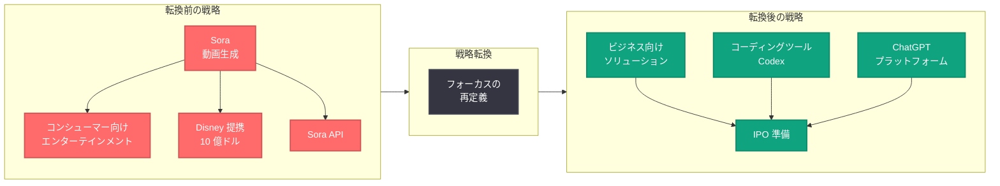

# OpenAI が Sora を終了、Disney との 10 億ドル提携も解消

## メタデータ

| 項目 | 内容 |
|------|------|
| 発表日 | 2026-03-25 |
| ソース | Multiple Sources (WIRED, Mashable, NYT, Ars Technica etc.) |
| カテゴリ | 戦略転換 / サービス終了 |
| 公式リンク | [OpenAI Sora 2](https://openai.com/index/sora-2)、[Creating with Sora Safely](https://openai.com/index/creating-with-sora-safely) |

> **注記:** 本レポートは複数のニュースソースに基づく報道内容をまとめたものであり、OpenAI の公式ブログ記事に基づくものではない。確認済みの事実と報道ベースの情報を区別して記載する。

## 概要

2026 年 3 月 25 日、複数の主要メディアが OpenAI の動画生成ツール Sora の終了を一斉に報じた。WIRED は「OpenAI Enters Its Focus Era by Killing Sora」と題し、OpenAI がコンシューマー向けエンターテインメントから撤退し、ビジネス、コーディングツール、そして IPO 準備に注力する戦略転換を進めていると報道している。

この決定に伴い、Disney が OpenAI と締結していた 10 億ドル規模のパートナーシップも解消されたことが Mashable、Ars Technica、Variety など複数のメディアによって報じられている。Variety は「OpenAI Just Spiked Bob Iger's Final Big Strategic Deal」と報じ、Disney CEO の Bob Iger にとって最後の大型戦略的提携が白紙になったとしている。Newsweek によれば、ディープフェイク問題も Sora 終了の一因となったと報道されている。

## 主な内容

### Sora 終了の背景と報道内容

複数のメディア報道を総合すると、OpenAI は動画生成プラットフォーム Sora を終了する決定を下した。Sora は 2024 年の初公開以来、AI による動画生成の可能性を示す先駆的なプロジェクトとして注目を集めてきたが、ローンチからわずか数か月での終了となる。

WIRED は OpenAI が「フォーカスの時代」に入ったと表現し、コンシューマー向けの派手なプロダクトから、より収益性の高いビジネス分野へのピボットを指摘している。Axios も「OpenAI pivots from consumer hype to business reality」と報じ、同様の見解を示している。

**報道されている終了の主な理由:**

- **戦略的フォーカスの変更:** ビジネス向けツール、コーディング支援、IPO 準備への集中
- **ディープフェイク問題:** Newsweek によれば、ローンチ後にディープフェイク関連の論争が発生していた
- **収益性の課題:** コンシューマー向けエンターテインメント事業の収益化の困難さ (報道ベース)

### Disney との 10 億ドルパートナーシップの解消

Ars Technica は「Disney cancels $1 billion OpenAI partnership amid Sora shutdown plans」と報じ、OpenAI の Sora 終了計画を受けて Disney が 10 億ドル規模のパートナーシップを解消したと伝えている。

Mashable の報道では、Disney 側が OpenAI との提携から撤退する形で取引が解消されたとされている。Variety は、この提携が Disney CEO Bob Iger の最後の大型戦略的取引であったと位置づけており、エンターテインメント業界における AI 活用の方向性にも影響を与える可能性がある。

**この提携解消の意味するもの (報道ベース):**

- エンターテインメント業界における AI 動画生成の商業化への疑問
- Disney のコンテンツ制作戦略における AI パートナーシップの再検討
- OpenAI のコンシューマー向け事業からの撤退を裏付ける動き

### 戦略転換: ビジネス・コーディング・IPO への集中

NYT は「What Sora's End Says About OpenAI's Strategy」と題した分析記事で、今回の決定が OpenAI の戦略における大きな転換点であると報じている。The Hill や Axios の報道も含め、OpenAI の今後の方向性として以下が指摘されている。

**報道されている OpenAI の新たな注力分野:**

- **ビジネス向けソリューション:** エンタープライズ顧客向けの AI ツールとサービス
- **コーディングツール:** Codex を中心とした開発者向けツールの強化
- **IPO 準備:** 上場に向けた事業ポートフォリオの整理と収益基盤の強化

### ディープフェイク問題の影響

Newsweek は「OpenAI Scraps Sora Video App Months After Launch and Deepfake Controversies」と報じ、Sora ローンチ後に発生したディープフェイク関連の論争が終了の一因となったことを示唆している。

わずか 2 日前の 2026 年 3 月 23 日には、OpenAI が Sora 2 の安全対策に関する詳細な記事 「Creating with Sora Safely」を公開しており、C2PA メタデータの付与やディープフェイク検出機能など、安全性への取り組みを強調していた。この時点での安全対策の公表と Sora 終了の報道が時期的に近接していることは注目に値する。

## 技術的な詳細

### Sora API への影響

2026 年 3 月 13 日のレポートで報告した通り、OpenAI は直近で Sora API の大幅な改善 (Character API の統合、動画拡張・編集機能の強化、高解像度エクスポートのサポート) をリリースしたばかりであった。Sora 終了の報道が事実であれば、これらの API 機能は短期間で提供終了となる可能性がある。

**Sora API を利用する開発者が検討すべき事項:**

- Sora API に依存するアプリケーションの代替手段の検討
- 生成済みコンテンツのバックアップと保存
- API 終了のタイムラインに関する OpenAI からの公式発表の確認
- 代替の動画生成サービス (Runway、Pika、Stability AI 等) への移行計画

### 終了タイムラインに関する情報

本レポート執筆時点 (2026 年 3 月 25 日) において、OpenAI から Sora の具体的な終了タイムラインに関する公式発表は確認されていない。開発者および利用者は、OpenAI の公式チャネルからの続報を注視する必要がある。

## アーキテクチャ

### OpenAI の戦略転換 (報道ベース)

## 開発者への影響

### Sora API 利用者への直接的影響

Sora の終了が確定した場合、API を利用する開発者には以下の影響が想定される。

- **API の提供終了:** Sora API を利用したアプリケーションが動作しなくなる可能性がある。具体的な廃止スケジュールは OpenAI からの公式発表を待つ必要がある
- **移行の必要性:** 動画生成機能を継続するには、Runway ML、Pika Labs、Stability AI などの代替サービスへの移行が必要となる
- **投資の回収:** 直近の API 改善 (Character API、高解像度エクスポート等) に基づいて開発を進めていた場合、その投資が無駄になるリスクがある

### コンテンツクリエイターへの影響

- **制作ワークフローの中断:** Sora をコンテンツ制作に活用していたクリエイターは、代替ツールへの移行を迫られる
- **Sora アプリのソーシャル機能:** ソーシャル創作プラットフォームとしての Sora アプリに投稿されたコンテンツの取り扱いについて、公式な案内が必要となる
- **エンターテインメント業界への示唆:** Disney との提携解消は、AI 動画生成ツールの商業利用に対するエンターテインメント業界の慎重な姿勢を示す可能性がある

### OpenAI プラットフォーム全体への示唆

- **ビジネス向けシフト:** 今後の OpenAI はエンタープライズ向けのソリューションとコーディングツールに注力する方向性が強まると予想される
- **API の安定性への懸念:** 短期間でのサービス終了は、OpenAI の他の API サービスの継続性に対する懸念を引き起こす可能性がある
- **IPO への影響:** 事業ポートフォリオの整理は、IPO に向けた収益構造の明確化を意図している可能性がある

## 関連リンク

- [OpenAI Sora 2](https://openai.com/index/sora-2)
- [Creating with Sora Safely - OpenAI Blog](https://openai.com/index/creating-with-sora-safely)
- [Sora API の改善 (2026-03-13 レポート)](./2026-03-13-sora-api-improvements.md)
- [Sora 2 の安全な創作環境 (2026-03-23 レポート)](./2026-03-23-creating-with-sora-safely.md)
- [OpenAI 公式ドキュメント](https://platform.openai.com/docs)
- [OpenAI News](https://openai.com/news)

## まとめ

2026 年 3 月 25 日、複数の主要メディアが OpenAI の動画生成ツール Sora の終了と、Disney との 10 億ドル規模のパートナーシップ解消を報じた。報道によれば、OpenAI はコンシューマー向けエンターテインメントからビジネス向けソリューション、コーディングツール (Codex)、IPO 準備への戦略転換を進めており、Sora の終了はこの方針の一環とされている。ディープフェイク問題も終了の一因として報じられている。わずか 12 日前に Sora API の大幅改善がリリースされ、2 日前には安全対策の詳細が公表されたばかりでの終了報道は、この決定の急速さを物語っている。Sora API を利用する開発者やコンテンツクリエイターは、代替手段の検討を開始しつつ、OpenAI からの公式発表を注視する必要がある。
