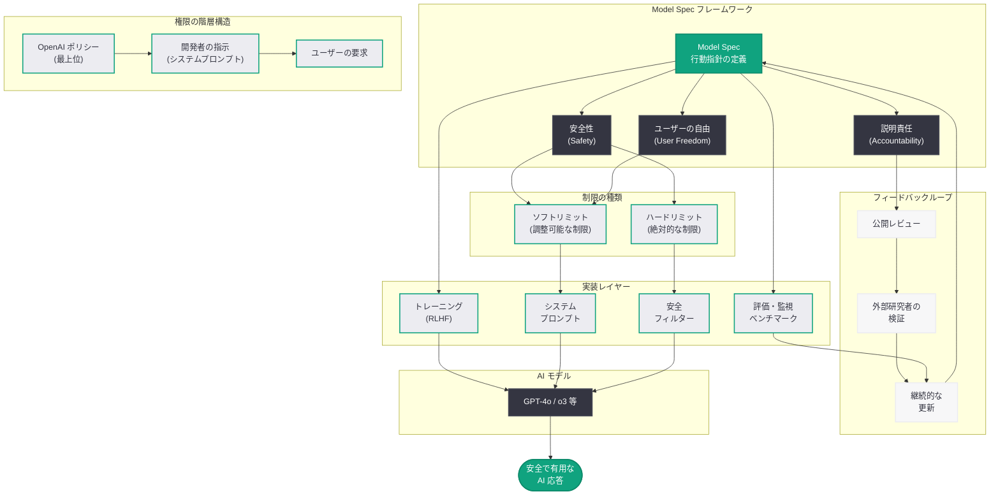

# Model Spec へのアプローチ: AI モデルの行動指針を定める公開フレームワーク

## メタデータ

| 項目 | 内容 |
|------|------|
| 発表日 | 2026-03-25 |
| ソース | OpenAI Blog (公式) |
| カテゴリ | Research |
| 公式リンク | [Inside our approach to the Model Spec](https://openai.com/index/our-approach-to-the-model-spec) |

## 概要

OpenAI は、AI モデルがどのように振る舞うべきかを定義する公開フレームワーク「Model Spec」に関する詳細なアプローチを発表した。Model Spec は、安全性 (Safety)、ユーザーの自由 (User Freedom)、説明責任 (Accountability) の 3 つの要素をバランスよく両立させることを目指しており、AI システムがより高度化する中で、モデルの行動規範を明文化し透明性を確保するための重要な取り組みである。

Model Spec は、OpenAI の AI モデルが従うべき行動原則を体系的にまとめた公開文書であり、開発者、ユーザー、そして社会全体に対して、AI モデルの意思決定プロセスと行動基準を明確に示すものである。AI 技術が急速に進歩する現在、モデルの行動指針を公開し外部からの検証を可能にすることは、AI の信頼性を高める上で極めて重要な取り組みといえる。

## 主な内容

### Model Spec とは何か

Model Spec は、OpenAI が開発する AI モデルの行動指針を定めた公開フレームワークである。このフレームワークは、AI モデルがユーザーとのインタラクションにおいてどのように応答すべきか、どのような要求を拒否すべきか、そしてどのような場合に注意を促すべきかを体系的に規定している。

Model Spec の中核となる設計思想は、以下の 3 つの原則のバランスにある。

- **安全性 (Safety):** AI モデルが有害なコンテンツの生成を防止し、悪用を抑制し、社会的に責任ある振る舞いを行うこと
- **ユーザーの自由 (User Freedom):** ユーザーが AI を自身の目的のために幅広く活用できること。過度な制限を避け、ユーザーの自律性を尊重すること
- **説明責任 (Accountability):** AI モデルの行動が透明で説明可能であり、問題が生じた場合に原因を特定し是正できること

### 権限の階層構造

Model Spec は、AI モデルに対する指示の優先順位を明確に定義する階層構造を採用している。

1. **OpenAI のポリシー (最上位):** OpenAI が定めるグローバルな安全ポリシーと行動規範。すべてのモデルの振る舞いの基盤となる
2. **開発者の指示:** API を通じてモデルを利用する開発者が設定するシステムプロンプトやカスタム指示。OpenAI のポリシーの範囲内で有効
3. **ユーザーの要求:** エンドユーザーからの個別の要求。開発者の指示と OpenAI のポリシーの両方の範囲内で処理される

この階層構造により、安全性を最優先としながらも、開発者とユーザーのそれぞれの裁量を適切に確保するバランスが実現されている。

### 安全性とユーザーの自由のバランス

Model Spec における最も重要な設計上の課題は、安全性とユーザーの自由のバランスである。過度に制限的なモデルは有用性を損ない、逆に制限が緩すぎるモデルは安全上のリスクを生む。

OpenAI は以下のアプローチでこのバランスを実現している。

- **デフォルトの行動基準:** モデルは安全で有用な応答をデフォルトとして設計されている
- **コンテキストに応じた判断:** 同じ質問でも、教育目的、研究目的、創作目的など、コンテキストに応じて適切な応答が異なることを認識し、柔軟に対応する
- **ハードリミットとソフトリミット:** 絶対に超えてはならないハードリミット (例: 児童搾取コンテンツの生成禁止) と、状況に応じて調整可能なソフトリミットを区別する
- **透明性の確保:** モデルが要求を拒否する場合、その理由を可能な限り説明する

### 説明責任の仕組み

Model Spec は、AI モデルの行動に対する説明責任を確保するために、以下の仕組みを組み込んでいる。

- **公開性:** Model Spec 自体を公開文書として公開し、外部の研究者、開発者、一般ユーザーからのフィードバックを受け付ける
- **反復的な改善:** AI 技術の進歩や社会的な要請の変化に応じて、Model Spec を継続的に更新する
- **監査可能性:** モデルの行動が Model Spec に準拠しているかを検証可能な仕組みを構築する
- **ステークホルダーの参加:** AI の行動規範の策定プロセスに、多様なステークホルダーの意見を反映する

## 技術的な詳細

### Model Spec のモデルへの適用

Model Spec は、AI モデルのトレーニングとデプロイメントの両方の段階で適用される。

- **トレーニング段階:** RLHF (人間のフィードバックによる強化学習) や Constitutional AI の手法を用いて、Model Spec に定められた行動原則をモデルに学習させる
- **システムプロンプト:** Model Spec の原則は、モデルのシステムプロンプトにも反映され、推論時の行動を制御する
- **安全フィルター:** Model Spec のハードリミットに対応する安全フィルターが、入力および出力の両方に適用される
- **評価と監視:** Model Spec への準拠度を測定するための評価ベンチマークが構築され、継続的な監視が行われる

### 開発者向けのカスタマイズ

API を利用する開発者は、Model Spec の範囲内でモデルの行動をカスタマイズできる。

- **システムプロンプトによる指示:** 開発者はシステムプロンプトを通じて、モデルのトーン、応答スタイル、対応範囲を調整できる
- **コンテンツフィルターの設定:** 一部のコンテンツカテゴリについて、開発者がフィルターの厳格さを調整できる
- **ユースケースに応じた設定:** 医療、法律、教育など、特定のユースケースに応じた行動パターンを設定できる

## アーキテクチャ

## 開発者への影響

Model Spec の公開は、OpenAI の API を利用する開発者に以下のような影響を与える。

- **行動基準の明確化:** モデルがどのような原則に基づいて応答を生成するかが明文化されたことで、開発者はアプリケーション設計時にモデルの振る舞いをより正確に予測できるようになる
- **カスタマイズの指針:** システムプロンプトや API パラメータを通じたモデルの行動カスタマイズについて、許容範囲と制限事項が明確になり、開発者がより効果的にモデルを活用できる
- **コンプライアンス対応:** 規制当局や顧客に対して、利用している AI モデルの行動基準を Model Spec を参照して説明できるようになり、コンプライアンス対応が容易になる
- **フィードバック参加:** Model Spec の改善プロセスに開発者が参加できるため、実際のユースケースに基づいた行動基準の改善に貢献できる
- **安全設計の参考:** Model Spec のアプローチは、開発者が自身のアプリケーションにおける安全設計を検討する際の参考フレームワークとなる

## 関連リンク

- [Inside our approach to the Model Spec - OpenAI](https://openai.com/index/our-approach-to-the-model-spec)
- [OpenAI Model Spec](https://model-spec.openai.com/)
- [OpenAI Safety](https://openai.com/safety)
- [OpenAI 公式ドキュメント](https://platform.openai.com/docs)
- [OpenAI News](https://openai.com/news)

## まとめ

OpenAI は、AI モデルの行動指針を体系的に定義する公開フレームワーク「Model Spec」に関する詳細なアプローチを発表した。Model Spec は、安全性、ユーザーの自由、説明責任の 3 つの原則をバランスよく両立させることを目指しており、OpenAI ポリシー、開発者の指示、ユーザーの要求という権限の階層構造を通じて、安全性を最優先としながらもユーザーの自律性を尊重する設計となっている。ハードリミットとソフトリミットの区別、コンテキストに応じた柔軟な判断、そして公開文書としての透明性確保と反復的な改善プロセスにより、AI システムの高度化に対応した行動規範の策定が進められている。Model Spec の公開は、開発者にとってモデルの行動予測の精度向上、カスタマイズの指針明確化、コンプライアンス対応の容易化といった実践的なメリットをもたらすものであり、AI 業界全体における行動規範の標準化に向けた重要な一歩である。
