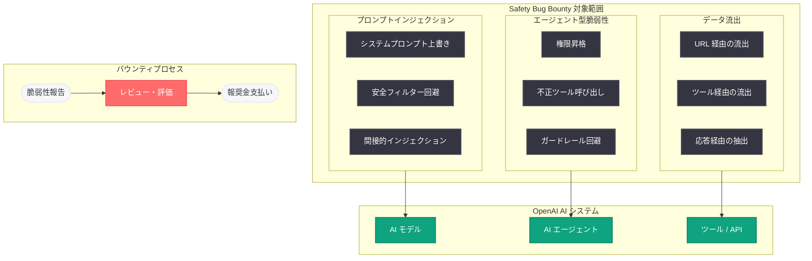

# OpenAI Safety Bug Bounty プログラムの導入

## メタデータ

| 項目 | 内容 |
|------|------|
| 発表日 | 2026-03-25 |
| ソース | OpenAI Blog |
| カテゴリ | Safety |
| 公式リンク | [openai.com](https://openai.com/index/safety-bug-bounty) |

> **注記:** 本レポートは RSS フィード情報および関連する公開情報に基づいて作成されている。レポート生成時点では記事の全文コンテンツにアクセスできなかったため、RSS の説明文、カテゴリ情報、および関連する公開情報をもとに内容を構成している。

## 概要

OpenAI は 2026 年 3 月 25 日、AI の安全性に特化した新しいバグバウンティプログラム「Safety Bug Bounty」を発表した。本プログラムは、AI の悪用やセキュリティリスクを特定することを目的としており、エージェント型脆弱性、プロンプトインジェクション、データ流出といった AI 固有の安全性リスクをカバーしている。

OpenAI は従来からソフトウェアの脆弱性を対象とした一般的なバグバウンティプログラムを運用していたが、今回の Safety Bug Bounty は AI モデルやエージェントシステムに特有の安全性リスクに焦点を当てた新たな取り組みである。AI エージェントの普及に伴い、従来のソフトウェアセキュリティの枠組みでは捕捉しきれない新種の脅威への対応が急務となっている。

## 主な内容

### Safety Bug Bounty プログラムの概要

Safety Bug Bounty プログラムは、OpenAI の AI システムにおける安全性リスクを外部のセキュリティ研究者やコミュニティの協力を得て特定・報告するための仕組みである。従来の一般的なバグバウンティプログラムがソフトウェアの技術的な脆弱性 (認証バイパス、XSS、SSRF など) を対象としていたのに対し、本プログラムは AI モデルの動作に起因する安全性リスクに特化している。

### 対象となる安全性リスク

本プログラムがカバーする主要な AI 安全性リスクは以下の 3 カテゴリである。

- **エージェント型脆弱性 (Agentic Vulnerabilities):** AI エージェントが自律的にタスクを実行する際に発生する脆弱性。エージェントが意図しないアクションを実行したり、権限を超えた操作を行ったりするリスクが含まれる。Responses API、Computer Use、ツール呼び出しなどのエージェント機能における安全性の欠陥が対象となる
- **プロンプトインジェクション (Prompt Injection):** 悪意のある指示を入力に埋め込むことで、AI モデルの動作を意図しない方向に誘導する攻撃手法。システムプロンプトの上書き、権限の昇格、安全フィルターの回避などが含まれる
- **データ流出 (Data Exfiltration):** AI モデルやエージェントが保持する機密情報を外部に漏洩させる攻撃手法。URL パラメータへの機密データの埋め込み、ツール呼び出しを介したデータの外部送信、モデルの応答を通じた情報の抽出などが対象となる

### 既存バグバウンティプログラムとの違い

OpenAI の既存のバグバウンティプログラムと Safety Bug Bounty プログラムの主な違いは以下の通りである。

| 観点 | 既存バグバウンティ | Safety Bug Bounty |
|------|-------------------|-------------------|
| 対象 | ソフトウェアの技術的脆弱性 | AI 安全性リスク |
| 範囲 | API、Web アプリ、インフラ | AI モデル、エージェント |
| 脆弱性の種類 | XSS、SSRF、認証バイパスなど | プロンプトインジェクション、データ流出など |
| 評価基準 | CVSS スコアなどの標準指標 | AI 安全性に特化した評価基準 |
| 目的 | ソフトウェアの堅牢性向上 | AI の安全な動作の保証 |

### AI 安全性エコシステムへの影響

本プログラムの導入は、AI 安全性の分野において以下のような影響をもたらすと考えられる。

- **セキュリティ研究の活性化:** AI 安全性に特化した報奨金制度により、研究者コミュニティにおける AI セキュリティ研究への取り組みが加速する
- **脆弱性発見の体系化:** エージェント型脆弱性やプロンプトインジェクションといった新しい脅威カテゴリに対する体系的な発見・報告のフレームワークが確立される
- **業界標準の形成:** OpenAI による AI 安全性バグバウンティの導入が、他の AI 企業にも同様のプログラム導入を促し、業界全体の安全性向上に寄与する

## 技術的な詳細

### 安全性リスクの評価フレームワーク

AI 安全性リスクの評価には、従来のソフトウェア脆弱性とは異なるアプローチが必要となる。以下の評価軸が想定される。

1. **影響範囲:** 脆弱性が影響するユーザー数やデータの範囲
2. **再現性:** 脆弱性の再現が容易であるかどうか
3. **悪用可能性:** 攻撃者が実際に脆弱性を悪用できる可能性
4. **対策の難易度:** 脆弱性に対する修正や緩和策の実装難易度

### エージェント型脆弱性の分類

AI エージェントに特有の脆弱性は、以下のように分類される。

- **権限昇格:** エージェントが設計上の権限範囲を超えたアクションを実行するケース
- **意図しないツール呼び出し:** 悪意のある入力によりエージェントが不正なツール操作を行うケース
- **安全ガードレールの回避:** エージェントの安全制約を迂回して危険な操作を実行させるケース
- **チェーン攻撃:** 複数の軽微な脆弱性を組み合わせて重大なセキュリティ侵害を引き起こすケース

## アーキテクチャ

## 開発者への影響

### セキュリティ意識の強化

Safety Bug Bounty プログラムの導入により、OpenAI の AI システムを利用する開発者にとって以下の影響が見込まれる。

- **エージェント開発の安全設計:** 外部研究者によって発見されるエージェント型脆弱性の知見を活用し、より堅牢なエージェントシステムの設計が可能になる
- **プロンプトインジェクション対策の進化:** 新たに報告されるプロンプトインジェクションの手法を踏まえ、防御策の継続的な改善が期待される
- **データ保護の強化:** データ流出に関する脆弱性報告を通じて、機密データの取り扱いに関するベストプラクティスが更新される

### API 利用者への推奨事項

- Responses API を使用したエージェント開発においては、Safety Bug Bounty で報告された脆弱性の情報を定期的に確認し、防御策に反映する
- エージェントが外部データを処理する際は、プロンプトインジェクションとデータ流出の両面から安全性を検証する
- ツール呼び出しの権限設計を最小権限の原則に基づいて行い、エージェントの動作範囲を必要最小限に制限する

## 関連リンク

- [Introducing the OpenAI Safety Bug Bounty program (原文)](https://openai.com/index/safety-bug-bounty)
- [Designing AI agents to resist prompt injection](https://openai.com/index/designing-agents-to-resist-prompt-injection)
- [AI Agent Link Safety](https://openai.com/index/ai-agent-link-safety/)
- [OpenAI Bug Bounty Program (Bugcrowd)](https://bugcrowd.com/openai)
- [OpenAI セキュリティガイド](https://platform.openai.com/docs/guides/safety-best-practices)

## まとめ

OpenAI が発表した Safety Bug Bounty プログラムは、AI の安全性に特化した新しいバグバウンティの取り組みであり、エージェント型脆弱性、プロンプトインジェクション、データ流出という 3 つの主要な AI 安全性リスクを対象としている。従来のソフトウェアバグバウンティとは異なり、AI モデルやエージェントシステムに固有の脅威に焦点を当てている点が特徴である。2026 年 3 月に相次いで公開されたプロンプトインジェクション対策やリンク安全性に関する記事と合わせて、OpenAI の AI 安全性への包括的な取り組みの一環として位置づけられる。AI エージェントの普及が加速する中、外部のセキュリティ研究者コミュニティとの協力を通じた安全性の向上は、AI エコシステム全体の信頼性確保に不可欠な施策である。

> **免責事項:** 本レポートは RSS フィード情報および関連する公開情報に基づいて構成されたものであり、記事の全文を確認した上での分析ではない。記事の実際の内容とは異なる可能性がある点にご留意いただきたい。
