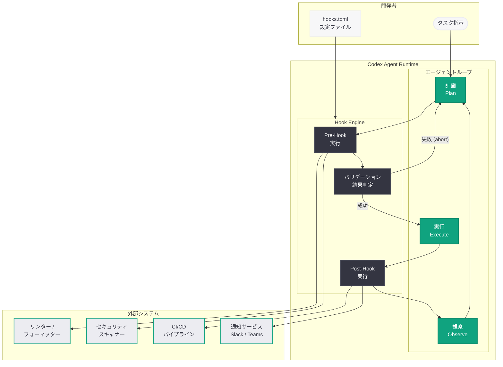

# Codex Hooks: クラウドコーディングエージェントにライフサイクルフックを導入

## メタデータ

| 項目 | 内容 |
|------|------|
| 発表日 | 2026-03-31 |
| ソース | OpenAI Developers |
| カテゴリ | API 更新 |
| 公式リンク | [platform.openai.com/docs/codex/hooks](https://platform.openai.com/docs/codex/hooks) |

> **注記:** 本レポートは OpenAI Developers のドキュメントページとして公開が確認された情報に基づいて作成されている。元ページの全文は Cloudflare の保護により取得できなかったため、公開されている URL 情報、Codex の既存ドキュメント、および関連する公開情報に基づく内容となっている。正確な詳細については公式ドキュメントを参照されたい。

## 概要

OpenAI は Codex のドキュメントに新たな「Hooks」ページを公開し、クラウドベースのコーディングエージェント Codex にライフサイクルフック機能を導入した。Hooks は、Codex がコードの生成、テストの実行、プルリクエストの作成といった一連のオペレーションを実行する際に、開発者がカスタムコールバックを挿入できる仕組みである。これにより、事前検証、事後処理、セキュリティチェック、CI/CD パイプラインとの統合など、Codex のワークフローを柔軟にカスタマイズできるようになる。

Codex は 2026 年に入ってからサブエージェント GA、カスタムエージェント定義、Smart Approvals など多数の機能強化を重ねてきた。Hooks の導入は、エンタープライズ環境での Codex 採用を加速させる重要な機能拡張であり、開発者が Codex の動作を自社の開発プロセスやコンプライアンス要件に合わせて制御できるようにするものである。

## 主な内容

### Codex とは

Codex は OpenAI が提供するクラウドベースのソフトウェアエンジニアリングエージェントである。Responses API と Shell ツールを基盤とし、ホステッドコンテナ上で動作する。主要な機能は以下の通りである。

- **コード生成と編集:** 自然言語の指示からコードを生成し、既存コードの修正を実行
- **テスト実行:** 自動テストの作成と実行により、変更の品質を検証
- **プルリクエスト作成:** Git リポジトリへの変更をプルリクエストとして提出
- **サブエージェント連携:** explorer、worker、default の 3 種類のサブエージェントを活用した並列タスク処理
- **エージェントループ:** 計画、実行、観察、評価、修正のサイクルを反復してタスクを完遂

### Hooks の概念

Hooks は、Codex のオペレーションライフサイクルにおける特定のポイントで実行されるカスタムコールバック関数である。Git Hooks や CI/CD パイプラインのフックと同様の概念であり、Codex がアクションを実行する前後に開発者独自のロジックを挿入できる。

Hooks の基本的な動作モデルは以下の通りである。

1. **トリガー:** Codex が特定のオペレーション (コミット、テスト実行、ファイル変更など) を開始
2. **Pre-Hook 実行:** オペレーション実行前にカスタムスクリプトやバリデーションが実行される
3. **オペレーション実行:** Pre-Hook が成功した場合、Codex が本来のオペレーションを実行
4. **Post-Hook 実行:** オペレーション完了後にカスタムスクリプトや通知処理が実行される
5. **結果の統合:** Hook の実行結果がエージェントループのコンテキストにフィードバックされる

### 想定される Hook の種類

Codex のオペレーションライフサイクルに基づき、以下の種類の Hook が提供されると想定される。

- **pre-commit:** コードのコミット前に実行されるフック。リンター、フォーマッター、静的解析ツールの実行に使用
- **post-commit:** コミット完了後に実行されるフック。通知送信やログ記録に使用
- **pre-test:** テスト実行前に実行されるフック。テスト環境のセットアップやデータ準備に使用
- **post-test:** テスト完了後に実行されるフック。テスト結果の解析やレポート生成に使用
- **pre-push:** プルリクエスト作成前に実行されるフック。コードレビューチェックやセキュリティスキャンに使用
- **post-push:** プルリクエスト作成後に実行されるフック。外部システムへの通知や追跡チケットの更新に使用
- **on-error:** エラー発生時に実行されるフック。エラー通知やフォールバック処理に使用
- **on-approval:** 承認フロー完了時に実行されるフック。Smart Approvals との連携に使用

### 開発ワークフローとの統合

Hooks は既存の開発ワークフローとシームレスに統合できるよう設計されていると考えられる。主な統合パターンは以下の通りである。

- **CI/CD パイプライン連携:** Codex の出力を Jenkins、GitHub Actions、GitLab CI などの CI/CD パイプラインに接続し、自動デプロイフローを構築
- **セキュリティスキャン:** SAST (静的アプリケーションセキュリティテスト) や DAST (動的アプリケーションセキュリティテスト) ツールをフックとして組み込み、セキュリティ検証を自動化
- **コンプライアンスチェック:** ライセンス検証、コーディング規約の遵守確認、データ保護ポリシーの適合検査を自動化
- **通知と監査:** Slack、Teams、メールなどへの通知送信や、監査ログの記録を自動化

## 技術的な詳細

### コードサンプル

以下は、Hooks の設定と使用方法の想定されるコードサンプルである。

**TOML による Hook 定義 (`~/.codex/hooks.toml`):**

```toml
# Codex Hooks 設定ファイル

[hooks.pre-commit]
description = "コミット前のコード品質チェック"
command = "python /scripts/lint_check.py"
timeout = 30  # 秒
on_failure = "abort"  # abort | warn | ignore

[hooks.post-test]
description = "テスト結果の Slack 通知"
command = "python /scripts/notify_slack.py"
timeout = 10
on_failure = "warn"

[hooks.pre-push]
description = "セキュリティスキャンの実行"
command = "python /scripts/security_scan.py"
timeout = 120
on_failure = "abort"
```

**Python による Hook スクリプトの例 (`/scripts/lint_check.py`):**

```python
#!/usr/bin/env python3
"""Codex pre-commit hook: コード品質チェック"""

import subprocess
import sys
import json


def run_linter(changed_files: list[str]) -> dict:
    """変更されたファイルに対してリンターを実行"""
    results = {"passed": True, "issues": []}

    for file_path in changed_files:
        if file_path.endswith(".py"):
            result = subprocess.run(
                ["ruff", "check", file_path],
                capture_output=True,
                text=True,
            )
            if result.returncode != 0:
                results["passed"] = False
                results["issues"].append({
                    "file": file_path,
                    "output": result.stdout,
                })

    return results


def main():
    # Codex が環境変数で変更ファイルリストを渡す想定
    import os
    changed_files_json = os.environ.get("CODEX_CHANGED_FILES", "[]")
    changed_files = json.loads(changed_files_json)

    results = run_linter(changed_files)

    if not results["passed"]:
        print("Lint check failed:")
        for issue in results["issues"]:
            print(f"  {issue['file']}: {issue['output']}")
        sys.exit(1)

    print("All lint checks passed.")
    sys.exit(0)


if __name__ == "__main__":
    main()
```

**Python SDK からの Hook 設定の例:**

```python
from openai import OpenAI

client = OpenAI()

# Codex タスクに Hook を設定して実行
response = client.codex.tasks.create(
    repository="https://github.com/example/my-project",
    prompt="認証モジュールにレート制限機能を追加してください",
    hooks={
        "pre_commit": {
            "command": "python /scripts/lint_check.py",
            "timeout": 30,
            "on_failure": "abort",
        },
        "post_test": {
            "command": "python /scripts/notify_slack.py",
            "timeout": 10,
            "on_failure": "warn",
        },
        "pre_push": {
            "command": "python /scripts/security_scan.py",
            "timeout": 120,
            "on_failure": "abort",
        },
    },
)

print(f"Task ID: {response.id}")
print(f"Status: {response.status}")
```

### 環境変数による Hook コンテキスト

Codex は Hook スクリプトに対して、以下のような環境変数を通じてコンテキスト情報を提供すると想定される。

| 環境変数 | 説明 |
|----------|------|
| `CODEX_TASK_ID` | 実行中のタスク ID |
| `CODEX_HOOK_TYPE` | フックの種類 (pre-commit、post-test など) |
| `CODEX_CHANGED_FILES` | 変更されたファイルの JSON リスト |
| `CODEX_REPOSITORY` | 対象リポジトリの URL |
| `CODEX_BRANCH` | 作業ブランチ名 |
| `CODEX_COMMIT_MESSAGE` | コミットメッセージ (コミット関連フックの場合) |
| `CODEX_TEST_RESULTS` | テスト結果の JSON (テスト関連フックの場合) |

## アーキテクチャ

以下は、Codex Hooks の実行フローを示すアーキテクチャ図である。



## 開発者への影響

Codex Hooks の導入は、開発者とエンタープライズの双方に以下の影響を与える。

- **ワークフローのカスタマイズ:** Codex のデフォルト動作を変更することなく、組織固有の要件 (コーディング規約、セキュリティポリシーなど) をフックとして追加できる。これにより、Codex を既存の開発プロセスに自然に組み込める
- **セキュリティの強化:** pre-commit や pre-push フックにセキュリティスキャンを組み込むことで、Codex が生成したコードに対する自動セキュリティ検証が可能になる。2026 年 3 月 6 日に公開された Codex Security Research Preview の知見を実際のワークフローに適用できる
- **エンタープライズ導入の加速:** コンプライアンスチェック、監査ログ、承認フローをフックとして実装することで、規制の厳しい業界 (金融、医療、政府機関など) での Codex 導入障壁が低下する
- **CI/CD 統合の簡素化:** post-test や post-push フックを通じて、Codex の出力を既存の CI/CD パイプラインに直接接続できる。GitHub Actions、GitLab CI、Jenkins などとの連携が容易になる
- **既存の Hook 概念との親和性:** Git Hooks や CI/CD フックに慣れた開発者にとって、Codex Hooks は馴染みのある概念であり、学習コストが低い
- **Smart Approvals との連携:** 2026 年 3 月 16 日にリリースされた Smart Approvals 機能と組み合わせることで、承認フローの中にカスタムバリデーションを組み込む高度なワークフローが構築できる

### 類似概念との比較

| 概念 | 対象 | トリガー | 実行環境 |
|------|------|----------|----------|
| Git Hooks | Git リポジトリ操作 | commit、push など | ローカル / サーバー |
| CI/CD Hooks | ビルド / デプロイパイプライン | ビルドステージの前後 | CI/CD ランナー |
| Webhooks | Web サービス間の通知 | HTTP イベント | 受信側サーバー |
| Codex Hooks | Codex エージェント操作 | エージェントアクションの前後 | Codex コンテナ |

## 関連リンク

- [Codex Hooks Documentation](https://platform.openai.com/docs/codex/hooks)
- [Codex Overview - OpenAI Platform](https://platform.openai.com/docs/codex)
- [Codex v0.115.0: サブエージェントとカスタムエージェント](https://openai.com/index/subagents)
- [Unrolling the Codex Agent Loop](https://openai.com/index/unrolling-the-codex-agent-loop/)
- [Codex Security Research Preview](https://openai.com/index/codex-security-research-preview/)
- [Responses API Documentation](https://platform.openai.com/docs/api-reference/responses)

## まとめ

Codex Hooks は、OpenAI のクラウドベースコーディングエージェント Codex にライフサイクルフック機能を追加する新機能である。開発者は pre-commit、post-test、pre-push などのフックポイントにカスタムスクリプトを登録することで、コード品質チェック、セキュリティスキャン、CI/CD 連携、通知処理などを Codex のワークフローに組み込める。Git Hooks や CI/CD フックと同様の親しみやすい概念を採用しており、既存の開発プロセスとの統合が容易である。サブエージェント GA、Smart Approvals に続く本機能の追加は、エンタープライズ環境での Codex 採用をさらに加速させるものであり、組織固有のセキュリティ要件やコンプライアンス要件を満たしながら AI コーディングエージェントを活用するための重要な基盤となる。
