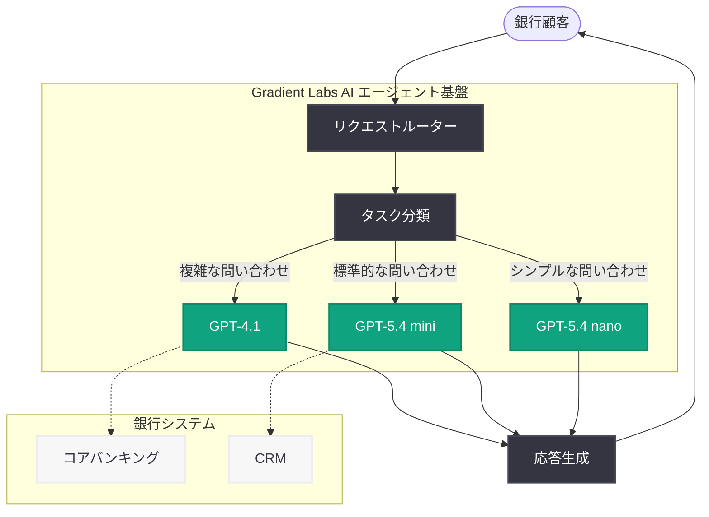

# Gradient Labs: すべての銀行顧客に AI アカウントマネージャーを提供

## メタデータ

| 項目 | 内容 |
|------|------|
| 発表日 | 2026-04-01 |
| ソース | OpenAI Blog |
| カテゴリ | B2B Story |
| 公式リンク | [openai.com/index/gradient-labs](https://openai.com/index/gradient-labs) |

> **注記:** 本レポートは RSS フィード情報および関連する公開情報に基づいて作成されている。元記事の全文は Cloudflare の保護により取得できなかったため、公開されている概要情報に基づく内容となっている。

## 概要

Gradient Labs が OpenAI の GPT-4.1 および GPT-5.4 mini / nano を活用し、銀行の顧客サポートワークフローを自動化する AI エージェントを構築した事例が OpenAI Blog で紹介された。すべての銀行顧客に AI アカウントマネージャーを提供するというビジョンのもと、低レイテンシかつ高信頼性の AI エージェントを実現しており、金融サービス業界におけるエンタープライズ AI 導入の先進事例として注目される。

銀行業界では、顧客サポートの品質向上とコスト削減の両立が長年の課題であった。Gradient Labs は複数の OpenAI モデルを組み合わせることで、従来は人手に依存していた銀行サポート業務を AI エージェントで自動化し、顧客一人ひとりに専属の AI アカウントマネージャーを提供するソリューションを実現している。

## 主な内容

### Gradient Labs について

Gradient Labs は、銀行業界向けの AI エージェントソリューションを提供するテクノロジー企業である。同社は OpenAI のモデルを基盤として、金融機関の顧客サポートワークフローを自動化する AI エージェントプラットフォームを開発している。「すべての銀行顧客に AI アカウントマネージャーを」というコンセプトのもと、従来は一部の富裕層顧客にのみ提供されていた専属アカウントマネージャーのような体験を、AI を通じてすべての顧客に拡大することを目指している。

### GPT-4.1 と GPT-5.4 mini / nano の活用

Gradient Labs のソリューションは、OpenAI の複数モデルを目的に応じて使い分ける設計を採用している。

- **GPT-4.1:** 複雑な問い合わせの処理や高度な判断を要するタスクに使用。顧客の状況を深く理解し、適切な対応を生成する際に活用される
- **GPT-5.4 mini:** 中程度の複雑さを持つサポートタスクに対応。コストとパフォーマンスのバランスを最適化し、幅広い問い合わせを効率的に処理
- **GPT-5.4 nano:** 低レイテンシが求められるリアルタイム処理やシンプルなタスクに特化。応答速度を最優先とする場面で活用され、顧客体験の即時性を確保

この複数モデルの使い分けにより、タスクの複雑さに応じた最適なコスト・パフォーマンス比を実現している。

### 銀行サポートワークフローの自動化

Gradient Labs の AI エージェントが自動化する銀行サポートワークフローには、以下のような領域が含まれると考えられる。

- **口座照会と残高確認:** 顧客からの基本的な口座情報に関する問い合わせへの即時応答
- **取引履歴の確認と説明:** 過去の取引に関する質問や不明な取引の説明
- **サービス手続きの案内:** カードの再発行、住所変更、各種申請手続きのガイダンス
- **金融商品の提案:** 顧客の状況に基づいたパーソナライズされた金融商品の推奨
- **問題解決のエスカレーション:** AI エージェントでは対応できない複雑な問題を適切な人間のスタッフに引き継ぐ仕組み

## 技術的な詳細

### AI エージェントアーキテクチャ

Gradient Labs の AI エージェントは、低レイテンシと高信頼性を両立するために、複数のモデルを階層的に活用するアーキテクチャを採用していると推測される。

### 使用モデルの特徴

| モデル | 用途 | 特徴 |
|--------|------|------|
| GPT-4.1 | 複雑なタスク | 高精度な推論、複雑な判断への対応 |
| GPT-5.4 mini | 標準タスク | コストとパフォーマンスのバランス |
| GPT-5.4 nano | リアルタイム処理 | 超低レイテンシ、高スループット |

### 低レイテンシと高信頼性の実現

銀行業界の AI エージェントでは、以下の要件が特に重要となる。

- **低レイテンシ:** 顧客がリアルタイムで対話する場面では、応答の遅延が顧客体験を大きく損なう。GPT-5.4 nano の活用により、ミリ秒単位での高速応答を実現
- **高信頼性:** 金融情報の正確性は不可欠であり、誤った情報の提供は重大な問題となる。モデルの出力に対する検証レイヤーやガードレールの実装が想定される
- **スケーラビリティ:** 銀行の顧客数は大規模であり、同時に多数のリクエストを処理する能力が求められる。軽量モデル (nano) の活用により、コスト効率の高いスケーリングを実現

## 開発者への影響

Gradient Labs の事例は、AI エージェント開発および金融業界での AI 活用に関して、以下の重要な示唆を提供する。

- **複数モデルの戦略的活用:** GPT-4.1 と GPT-5.4 mini / nano を組み合わせるアプローチは、コスト最適化とパフォーマンス最大化を両立する設計パターンとして参考になる。タスクの複雑さに応じてモデルを使い分けることで、全体的なコストを抑えながら高品質なサービスを提供できる
- **金融業界での AI エージェント設計:** 銀行業界特有の規制要件 (KYC、AML、データプライバシーなど) に対応した AI エージェントの設計は、他の規制産業での AI 導入にも応用可能である
- **低レイテンシ AI エージェントの構築:** GPT-5.4 nano のような軽量モデルを活用した低レイテンシ設計は、リアルタイム性が求められるあらゆるユースケースに適用できるアーキテクチャパターンである
- **エンタープライズ AI の実用化:** 概念実証 (PoC) ではなく、実際の銀行顧客に対してサービスを提供している点は、AI エージェントが本番環境で信頼性を持って運用できることを実証している
- **API ベースの統合:** OpenAI API を活用した既存の銀行システムとの統合は、金融機関のレガシーシステムと AI を連携させるモデルケースとなる

## 関連リンク

- [Gradient Labs - OpenAI Blog](https://openai.com/index/gradient-labs)
- [GPT-4.1 モデル情報](https://platform.openai.com/docs/models)
- [OpenAI for Business](https://openai.com/business)
- [OpenAI API リファレンス](https://platform.openai.com/docs/api-reference)
- [OpenAI News](https://openai.com/news)

## まとめ

Gradient Labs は、OpenAI の GPT-4.1 および GPT-5.4 mini / nano を活用し、すべての銀行顧客に AI アカウントマネージャーを提供するソリューションを実現した。複数モデルの戦略的な使い分けにより、低レイテンシと高信頼性を両立し、銀行のサポートワークフローを効率的に自動化している。本事例は、金融サービス業界における AI エージェント導入の先進モデルとして重要であり、タスクの複雑さに応じたモデル選択という設計パターンは、他の業界や開発者にとっても実践的な参考事例となる。特に GPT-5.4 nano を活用した超低レイテンシの応答処理は、リアルタイム性が求められるエンタープライズ AI アプリケーションの設計において、重要な技術的指針を提供するものである。
