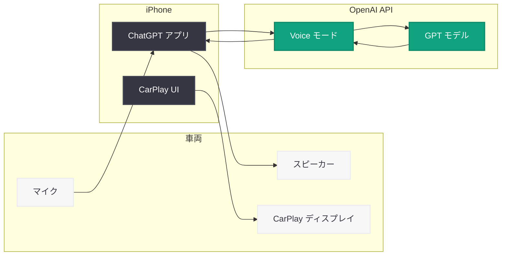

# ChatGPT Voice モードが Apple CarPlay に対応

> **注記:** 本レポートは、OpenAI 公式ページ (openai.com) が Cloudflare 保護により直接アクセスできなかったため、Engadget、Mashable、AOL、News.az、The Bridge Chronicle など複数のニュースソースの報道に基づいて作成されている。

## メタデータ

| 項目 | 内容 |
|------|------|
| 発表日 | 2026-04-02 |
| ソース | OpenAI News |
| カテゴリ | 製品 / ChatGPT |
| 公式リンク | [openai.com/index/chatgpt-voice-carplay](https://openai.com/index/chatgpt-voice-carplay) |

## 概要

OpenAI は ChatGPT の Voice モードを Apple CarPlay に統合し、ドライバーがハンズフリーで ChatGPT と音声会話できる機能を正式にリリースした。これにより、運転中にハンドルから手を離すことなく、ChatGPT の高度な会話型 AI を利用できるようになる。

今回の CarPlay 対応は、ChatGPT の利用可能な場面を自動車領域に大きく拡大する戦略的な一歩である。複数のメディア (Engadget、Mashable、AOL、News.az、The Bridge Chronicle) が 2026 年 4 月 2 日から 3 日にかけてこの発表を報じており、自動車における AI アシスタントの新たな選択肢として注目を集めている。

## 主な内容

### CarPlay 統合の概要

ChatGPT Voice モードの CarPlay 対応により、以下の機能が利用可能となる。

- **ハンズフリー音声会話:** 運転中にハンドルから手を離さず、ChatGPT と自然な会話が可能
- **CarPlay インターフェース統合:** Apple CarPlay の画面上で ChatGPT アプリが動作し、車載ディスプレイから直接アクセスできる
- **高度な会話型 AI:** 単純な音声コマンドにとどまらず、ChatGPT の持つ文脈理解力や推論能力を活用した深い対話が可能

### 主要な特徴

ChatGPT の CarPlay 統合は、従来の車載音声アシスタントと比較して以下の点で差別化される。

- **自然言語での対話:** 定型的なコマンドではなく、日常会話のような自然な言い回しでの指示が可能
- **マルチターン会話:** 前後の文脈を維持した複数回のやり取りに対応
- **幅広い知識ベース:** 一般的な質問、ブレインストーミング、情報要約など多様なタスクに対応

### 制約事項

AOL の報道によると、今回のリリースには「重要な機能が 1 つ欠けている」と指摘されている。これは Siri レベルの深いシステム統合や常時起動 (Always-on) のアクティベーション機能が欠如している可能性を示唆している。具体的には以下の制約が考えられる。

- **常時リスニング非対応:** "Hey Siri" のようなウェイクワードによる常時起動には対応していない可能性がある
- **システムレベルの統合の制限:** Apple のネイティブサービスと比較して、車両機能 (ナビゲーション、電話、メッセージなど) との深い連携が制限される可能性がある
- **Siri との併用:** CarPlay 上では Siri が依然としてプライマリの音声アシスタントとして機能し、ChatGPT は補完的な位置づけとなる

## 技術的な詳細

### CarPlay 統合の仕組み

Apple CarPlay は iPhone のアプリを車載ディスプレイに投影する仕組みであり、ChatGPT の CarPlay 対応は以下の技術的な構成に基づくと考えられる。

- **iPhone アプリベース:** ChatGPT iOS アプリが CarPlay 対応インターフェースを提供し、車載ディスプレイに最適化された UI を表示
- **Voice モード活用:** ChatGPT の既存の Voice モード技術 (音声認識、自然言語処理、音声合成) を CarPlay 環境で動作させる
- **車載オーディオ統合:** 車両のマイクとスピーカーを通じて音声入出力を処理

### Voice モードの機能

ChatGPT の Voice モードは以下の技術要素で構成される。

- **リアルタイム音声認識:** ドライバーの発話をリアルタイムでテキストに変換
- **GPT モデルによる応答生成:** 変換されたテキストを GPT モデルが処理し、適切な応答を生成
- **自然な音声合成:** 生成された応答を自然な音声で読み上げ

## 開発者への影響

今回の CarPlay 統合は、自動車における AI アプリケーションのエコシステムに以下の影響を与える。

- **自動車向け AI アプリの可能性拡大:** ChatGPT の CarPlay 対応は、サードパーティ開発者にとって自動車向け AI インターフェースの設計に関する参考事例となる。車載環境に最適化された音声 UI のベストプラクティスが確立されていく可能性がある
- **Voice モード API の活用促進:** OpenAI の Realtime API や Audio API を活用した自動車向けアプリケーションの開発が促進される可能性がある。ハンズフリー操作が求められる場面での AI 活用ニーズの高まりが期待される
- **CarPlay エコシステムの競争激化:** ChatGPT の参入により、CarPlay 上の AI アシスタント市場が活性化し、Google、Amazon などの競合他社も同様の統合を加速させる可能性がある
- **自動車メーカーとの連携機会:** OpenAI API を活用した車載 AI ソリューションの需要が高まり、自動車メーカーやティア 1 サプライヤーとの連携プロジェクトが増加する可能性がある

## 関連リンク

- [ChatGPT Voice on CarPlay - OpenAI](https://openai.com/index/chatgpt-voice-carplay)
- [ChatGPT iOS アプリ - App Store](https://apps.apple.com/app/chatgpt/id6448311069)
- [OpenAI News](https://openai.com/news)
- [Apple CarPlay - Apple](https://www.apple.com/carplay/)
- [OpenAI Realtime API ドキュメント](https://platform.openai.com/docs/guides/realtime)

## まとめ

OpenAI は ChatGPT Voice モードの Apple CarPlay 対応を発表し、自動車領域における AI アシスタントの利用可能性を大幅に拡大した。ドライバーはハンズフリーで ChatGPT の高度な会話機能を利用できるようになり、従来の車載音声アシスタントを超える自然な対話体験が提供される。一方で、Siri レベルのシステム統合や常時起動機能の欠如が制約として指摘されており、Apple のネイティブエコシステムとの統合深度には改善の余地がある。今回のリリースは、ChatGPT がスマートフォンやデスクトップを超えて、日常生活のあらゆる場面に浸透していく動きの一環として位置づけられる。
