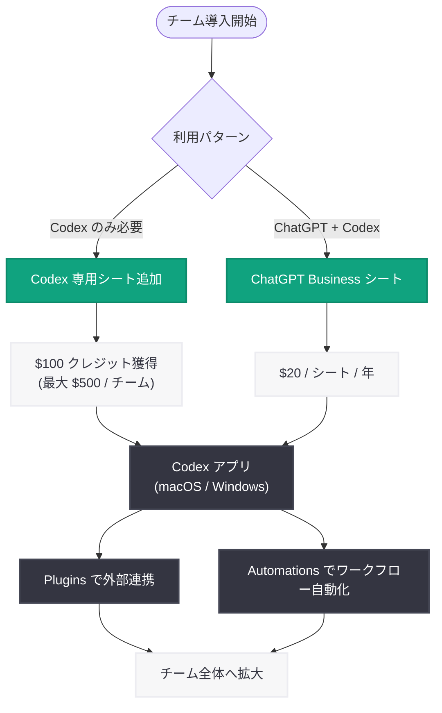

# Codex がチーム向けに柔軟な従量課金制を導入

## メタデータ

| 項目 | 内容 |
|------|------|
| 発表日 | 2026-04-02 |
| ソース | OpenAI Blog |
| カテゴリ | Product |
| 公式リンク | [openai.com/index/codex-flexible-pricing-for-teams](https://openai.com/index/codex-flexible-pricing-for-teams) |

## 概要

OpenAI は、ChatGPT Business および Enterprise のチーム向けに、Codex 専用シートの従量課金制 (pay-as-you-go) を導入した。これにより、固定のシート料金なしで Codex のフル機能にアクセスできるようになり、小規模チームでもパイロット導入を開始しやすくなる。併せて、ChatGPT Business の年間価格がシートあたり $25 から $20 に引き下げられ、新規 Codex ユーザー向けのクレジットプログラムも提供される。Codex の利用は急速に拡大しており、2026 年 1 月以降、Business および Enterprise における Codex ユーザー数は 6 倍に成長している。

## 主な内容

### 従量課金制の Codex 専用シート

ChatGPT Business および Enterprise のワークスペースに、従量課金制の Codex 専用シートを追加できるようになった。主な特徴は以下の通りである。

- **固定シート料金なし:** Codex 専用シートには固定のシート料金が不要で、トークン消費量に基づく課金となる
- **レート制限なし:** Codex 専用シートにはレート制限が設けられておらず、必要に応じて自由に利用できる
- **透明なコスト管理:** トークン消費量ベースの課金により、予算、ワークフロー、チームごとのコスト追跡が容易になる

この仕組みにより、チームは小規模なパイロットから導入を開始し、重要なワークフローで価値を実証した後、段階的に利用を拡大することが可能となる。

### ChatGPT Business の価格引き下げ

幅広い ChatGPT アクセスを必要とするチーム向けに、標準の ChatGPT Business シート (Codex の利用制限付き) も引き続き提供される。ChatGPT Business の年間価格はシートあたり $25 から $20 に引き下げられ、より手頃な価格でのアクセスが可能となった。

### 新規ユーザー向けクレジットプログラム

導入を促進するため、対象となる ChatGPT Business ワークスペースには、新規 Codex 専用チームメンバーごとに $100 のクレジットが提供される (チームあたり最大 $500、期間限定)。クレジットを有効化するには、ワークスペースに Codex 専用シートを追加するか、新しい ChatGPT Business ワークスペースを作成する必要がある。

### Codex アプリと新機能

Codex を使い始める最良の方法として、macOS および Windows 向けの Codex アプリが提供されている。さらに、以下の新機能により、チームが既に使用しているシステムとの連携が強化された。

- **Plugins:** Codex を外部ツールやサービスと接続する拡張機能 ([developers.openai.com/codex/plugins](https://developers.openai.com/codex/plugins))
- **Automations:** ワークフローの自動化を実現する機能 ([developers.openai.com/codex/app/automations](https://developers.openai.com/codex/app/automations))

### Codex の急速な普及

Codex の利用はチーム全体で急速に拡大しており、以下の数字がその成長を裏付けている。

| 指標 | 数値 |
|------|------|
| ChatGPT の有料ビジネスユーザー | 900 万人以上 |
| 毎週 Codex を利用するビルダー | 200 万人以上 |
| Business / Enterprise での Codex ユーザー成長率 (2026 年 1 月以降) | 6 倍 |

Notion、Ramp、Braintrust、Wasmer などの企業が既に Codex を活用してエンジニアリングワークフローを加速させている。これらのチームでは、より迅速な実行、再現性の高いワークフロー、個人の AI 実験から組織全体への展開への明確なパスが実現されている。

## 技術的な詳細

### 料金体系の比較

| プラン | シート料金 | Codex アクセス | レート制限 | 課金方式 |
|--------|-----------|---------------|-----------|---------|
| ChatGPT Business (標準シート) | $20 / シート / 年 | 利用制限付き | あり | 固定料金 |
| Codex 専用シート | なし | フルアクセス | なし | トークン消費量ベース |

### 導入フロー

## 開発者への影響

今回の価格改定と新機能の導入は、開発者やエンジニアリングチームに対して以下の重要な影響をもたらす。

- **導入障壁の低下:** 固定シート料金なしの従量課金制により、小規模チームやスタートアップでも Codex の本格導入を開始しやすくなった。パイロットプロジェクトでの価値検証から、段階的に利用を拡大する導入パスが明確化された
- **コスト予測の改善:** トークン消費量ベースの課金により、ワークフローごとのコストを正確に把握・管理できるようになった。これにより、チームやプロジェクト単位での予算配分が容易になる
- **外部システムとの統合:** Plugins と Automations の提供により、Codex を既存の開発ツールチェーンやワークフローに組み込むことが可能となった。CI/CD パイプラインやプロジェクト管理ツールとの連携が期待される
- **エンタープライズ展開の加速:** Notion や Ramp などの先行事例が示すように、Codex は個人の生産性向上ツールからチーム全体のエンジニアリングワークフロー基盤へと進化している。レート制限なしの Codex 専用シートにより、大規模チームでの利用も円滑に行える
- **ChatGPT Business の価格優位性:** 年間シート価格が $20 に引き下げられたことで、ChatGPT と Codex の両方を必要とするチームにとってもコスト面での魅力が向上した

## 関連リンク

- [Codex Flexible Pricing for Teams - OpenAI Blog](https://openai.com/index/codex-flexible-pricing-for-teams)
- [Codex Plugins](https://developers.openai.com/codex/plugins)
- [Codex Automations](https://developers.openai.com/codex/app/automations)
- [ChatGPT for Business](https://openai.com/business)
- [OpenAI News](https://openai.com/news)

## まとめ

OpenAI は Codex のチーム向け価格体系を大幅に刷新し、従量課金制の Codex 専用シートを導入した。固定シート料金とレート制限を撤廃し、トークン消費量に基づく透明な課金モデルを提供することで、チームの規模やフェーズに応じた柔軟な導入が可能となった。ChatGPT Business の年間価格も $25 から $20 に引き下げられ、新規ユーザー向けの最大 $500 のクレジットプログラムも用意されている。Plugins と Automations の新機能により、Codex と既存システムの統合も強化された。2026 年 1 月以降、Business および Enterprise での Codex ユーザー数が 6 倍に成長するなど、チームでの Codex 導入は急速に加速しており、今回の価格改定はその流れをさらに後押しするものである。
