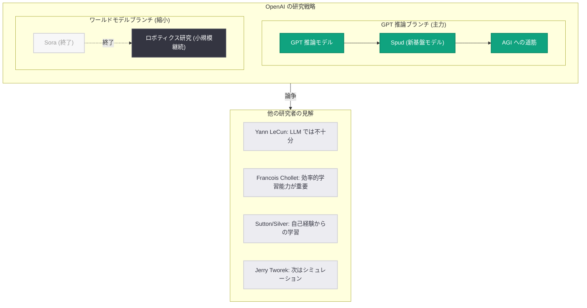

# OpenAI が新基盤モデル「Spud」を予告、Greg Brockman が AGI 到達への確信を表明

> **注記:** 本レポートは Big Technology Podcast でのインタビューおよび THE DECODER、Mint、NDTV、Firstpost 等の複数のニュースソースに基づいて作成されている。

## メタデータ

| 項目 | 内容 |
|------|------|
| 発表日 | 2026-04-02 |
| ソース | OpenAI News / Big Technology Podcast |
| カテゴリ | 研究 / モデル |
| 公式リンク | [openai.com/index/spud](https://openai.com/index/spud) |

## 概要

OpenAI 共同創業者の Greg Brockman が Big Technology Podcast に出演し、GPT 推論モデルが AGI (汎用人工知能) への「見通し (line of sight)」を持っていると宣言した。Brockman は「その問いには決定的に答えが出たと思う。AGI に到達する。見通しが立っている」と明言し、テキストベースのモデルが真の理解を獲得できるかという AI 研究の中心的な問いに対して強い確信を示した。

さらに Brockman は、ChatGPT の新しい基盤モデル「Spud」の存在を予告した。Spud は数年にわたる研究の成果に基づく新たなファウンデーションモデルのアプローチであり、AGI に向けた重要なステップとなる可能性がある。一方で、Sora アプリの終了や業界内の異なる見解など、OpenAI の戦略的選択に関する議論も活発化している。

## 主な内容

### Brockman の AGI 到達宣言

Greg Brockman は Big Technology Podcast において、GPT 推論モデルの進化が AGI への明確な道筋を示していると述べた。彼の正確な発言は以下の通りである。

> "I think that we have definitively answered that question -- it is going to go to AGI. Like we see line of sight."

この発言は、AI 研究における最も重要な未解決問題の一つ、すなわち「主にテキストで訓練されたモデルが真の理解を発展させることができるか」という問いに対する大胆な回答である。Brockman はこの問いが既に解決済みであると主張している。

### 新基盤モデル「Spud」の予告

Brockman は ChatGPT の新しい基盤モデルとして「Spud」の名称を明らかにした。複数のソースによると、Spud は以下の特徴を持つ。

- **数年間の研究成果:** 長期にわたる研究開発の集大成として位置づけられている
- **新たなファウンデーションモデルアプローチ:** 従来の GPT シリーズとは異なるアプローチの可能性が示唆されている
- **AGI への足がかり:** AGI 実現に向けた重要なマイルストーンとなることが期待されている

ただし、Spud の具体的なアーキテクチャや技術仕様については現時点で詳細が公開されていない。

### 業界からの反応と異論

Brockman の AGI 到達宣言に対しては、AI 研究コミュニティから多様な見解が示されている。

- **Yann LeCun (Meta):** LLM が人間のような知性に到達することはないと主張し、Brockman の見解に異を唱えている
- **Francois Chollet:** 知能を「新しいスキルを効率的に学習する能力」と定義し、現在の LLM をその基準で非常に低く評価している
- **Richard Sutton / David Silver (DeepMind):** パラダイムシフトの必要性を訴え、システムは自らの経験から学ぶべきだと主張している
- **Jerry Tworek (元 OpenAI):** 深層学習は「完了した」段階にあり、次のステップはシミュレーションであると述べている
- **Demis Hassabis (DeepMind):** 画像モデル「Nano Banana」が AGI に近いと感じたと発言し、世界モデルの重要性を示唆している

## 技術的な詳細

### GPT 推論アプローチ vs ワールドモデル

OpenAI の戦略的選択として、GPT 推論モデルへの集中投資とワールドモデル (Sora) の縮小が明確になった。Brockman は限られた計算資源の中で、両方のアプローチを同時に追求することは現実的ではないと説明している。

Brockman は Sora を「素晴らしいモデル」と評しつつも、GPT 推論とは「技術ツリーの異なるブランチ」にあると位置づけた。OpenAI は最近 Sora アプリとモデルを終了したが、ロボティクス向けのワールドモデル研究は小規模に継続している。

DeepMind の Hassabis が Sora スタイルのワールドモデルが AGI に近いと示唆したことに対し、Brockman はワールドモデルをスキップすることで重要な知見を見逃すリスクがあることを認めている。

### アーキテクチャの分岐

## 開発者への影響

- **新モデルへの準備:** Spud が正式にリリースされた場合、新しい API エンドポイントやモデル名への対応が必要になる可能性がある。開発者は OpenAI の公式アナウンスを注視すべきである
- **Sora 依存の見直し:** Sora アプリの終了に伴い、Sora API を利用していた開発者は代替手段の検討が必要である。ロボティクス向けのワールドモデル研究は継続されるが、消費者向けサービスとしての提供は不透明である
- **推論モデルの進化:** GPT 推論モデルへの集中投資により、推論能力の大幅な向上が期待される。複雑な問題解決や多段階推論を必要とするアプリケーションの開発者にとっては好材料となる
- **AGI 議論の実務的影響:** AGI への「見通し」が立っているという主張が現実化した場合、AI アプリケーションの設計思想そのものに根本的な変革が求められる可能性がある

## 関連リンク

- [OpenAI Spud (公式ページ)](https://openai.com/index/spud)
- [Big Technology Podcast](https://www.bigtechnology.com/)
- [THE DECODER - Brockman AGI claims 記事](https://the-decoder.com/)
- [OpenAI News](https://openai.com/news)
- [OpenAI Research](https://openai.com/research)

## まとめ

Greg Brockman は Big Technology Podcast にて、GPT 推論モデルが AGI への明確な道筋を持つと宣言し、新基盤モデル「Spud」の存在を予告した。OpenAI は限られた計算資源を GPT 推論モデルに集中投資する戦略を明確にし、Sora アプリを終了した。一方で、Yann LeCun や Francois Chollet をはじめとする著名な AI 研究者からは LLM ベースのアプローチだけでは AGI に到達できないとする反論が提起されている。Brockman 自身もワールドモデルをスキップするリスクを認めており、AGI への最適な道筋については業界全体で活発な議論が続いている。Spud モデルの詳細が今後明らかになることで、この議論はさらに加速することが予想される。
