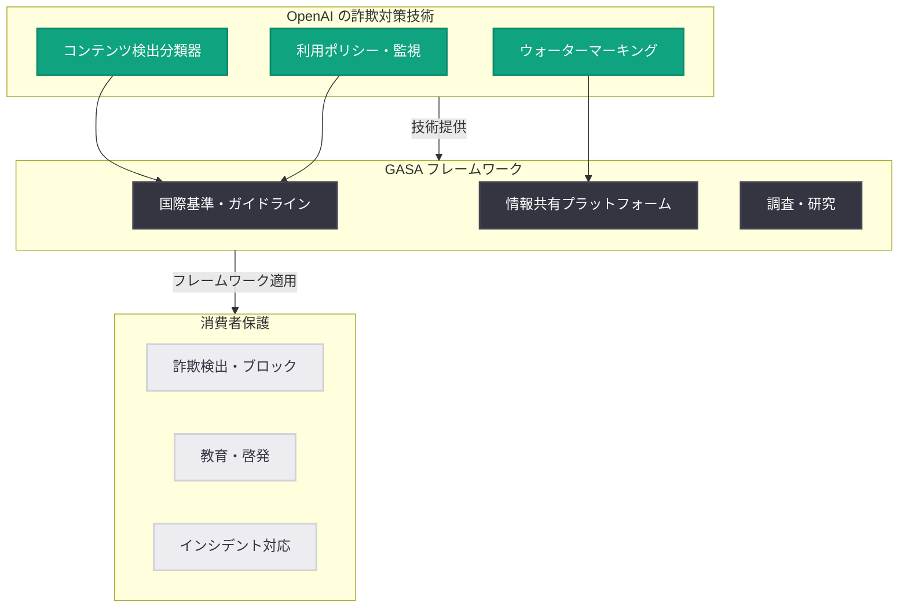

# OpenAI が Global Anti-Scam Alliance (GASA) に基盤メンバーとして加盟

## メタデータ

| 項目 | 内容 |
|------|------|
| 発表日 | 2026-04-03 |
| ソース | OpenAI News |
| カテゴリ | 安全性 / パートナーシップ |
| 公式リンク | [openai.com/index/global-anti-scam-alliance](https://openai.com/index/global-anti-scam-alliance) |

> **注記:** 本レポートは Burlington Free Press 等のニュースソースの報道に基づいて作成されています。公式ページの内容を直接確認できなかったため、報道内容に基づく情報となります。

## 概要

OpenAI が、オンライン詐欺やフラウド対策に取り組む国際的な組織である Global Anti-Scam Alliance (GASA) に Foundation Member (基盤メンバー) として加盟したことが発表された。AI を悪用した詐欺行為がグローバルに増加する中、OpenAI がその対策に積極的に関与する姿勢を明確に示す動きである。

近年、AI 技術の進歩に伴い、ディープフェイク、音声クローニング詐欺、ソーシャルエンジニアリング攻撃が急増している。OpenAI の GASA 加盟は、AI 技術の開発企業として、自社技術の悪用防止に責任を持つという姿勢の表れであり、安全性に関する同社の広範なミッションと一貫した戦略的な取り組みである。

## 主な内容

### GASA の概要と役割

Global Anti-Scam Alliance (GASA) は、オンライン詐欺やサイバー犯罪の撲滅を目的として設立された国際的な組織である。政府機関、テクノロジー企業、金融機関、消費者保護団体など、多様なステークホルダーが参加し、詐欺対策のフレームワーク構築やベストプラクティスの共有を推進している。

GASA の主な活動領域は以下のとおりである。

- **国際的な連携体制の構築:** 各国の規制当局や企業間での詐欺情報の共有と協力体制の強化
- **詐欺対策ツールの開発支援:** 技術的なソリューションやフレームワークの開発促進
- **消費者教育と啓発:** オンライン詐欺に関する認知向上と被害防止のための教育活動
- **調査・研究:** 詐欺の手法やトレンドに関する調査レポートの発行

### OpenAI の役割と貢献

Foundation Member として加盟した OpenAI は、以下の分野で貢献することが期待される。

- **技術的専門知識の提供:** AI 技術に関する深い知見を活かし、詐欺検出ツールや対策フレームワークの開発を支援する
- **リソースの投入:** 詐欺対策に必要な技術基盤やリソースを GASA コミュニティに提供する
- **コンテンツ検出技術の共有:** AI 生成コンテンツの検出・識別に関する技術やツールを共有する
- **ポリシー策定への参画:** AI を悪用した詐欺に対する国際的なガイドラインやポリシーの策定に貢献する

### AI を悪用した詐欺の現状

AI 技術の急速な進歩により、詐欺の手法も高度化・多様化している。現在特に懸念されている AI 悪用詐欺の類型は以下のとおりである。

- **ディープフェイク詐欺:** AI で生成された偽の動画や画像を使用し、本人になりすまして金銭を詐取する手法
- **音声クローニング詐欺:** AI による音声合成技術を悪用し、家族や知人の声を模倣して緊急の送金を求める手法
- **ソーシャルエンジニアリング攻撃:** AI を活用して個人情報を分析し、高度にパーソナライズされたフィッシングメッセージを生成する手法
- **AI チャットボット詐欺:** AI チャットボットを利用して被害者と長期的な関係を構築し、投資詐欺やロマンス詐欺に誘導する手法

## 技術的な詳細

### AI 詐欺検出ツール

OpenAI は、AI 生成コンテンツの検出と識別に関する複数の技術を開発・提供している。

- **コンテンツ検出分類器:** テキストが AI によって生成されたものかどうかを判定する分類器。詐欺メッセージの自動検出に活用可能
- **画像認証メタデータ:** AI で生成された画像に C2PA メタデータを付与し、コンテンツの出所を追跡可能にする技術
- **音声認証システム:** AI 生成音声の識別を支援する技術的フレームワーク

### AI 生成コンテンツのウォーターマーキング

OpenAI は AI 生成コンテンツに対するウォーターマーキング技術の開発を進めており、以下の特徴を持つ。

- **不可視ウォーターマーク:** コンテンツの品質に影響を与えずに埋め込まれる識別情報
- **改ざん耐性:** 編集や変換を経ても検出可能な堅牢性を備える
- **標準化対応:** C2PA 等の業界標準規格に準拠したメタデータの付与

### 利用ポリシーによる不正利用の防止

OpenAI の利用規約では、以下の行為が明確に禁止されている。

- 詐欺目的での AI モデルの使用
- 他者になりすますためのコンテンツ生成
- 金融詐欺やフィッシング攻撃のための AI 活用
- 誤情報や偽情報の生成・拡散

## アーキテクチャ

## 開発者への影響

今回の GASA 加盟は、OpenAI のプラットフォームを利用する開発者にとって以下の影響が考えられる。

- **利用ポリシーの強化:** 詐欺対策への取り組み強化に伴い、API の利用ポリシーやモデレーションがより厳格になる可能性がある。開発者は自社アプリケーションにおける不正利用防止策の見直しが求められる
- **コンテンツ検出ツールの拡充:** AI 生成コンテンツの検出 API やツールが今後さらに充実することが期待される。開発者はこれらのツールを自社プロダクトに統合し、詐欺防止機能を強化できる
- **ウォーターマーキング API の進化:** AI 生成コンテンツへのウォーターマーク埋め込みや検出機能が、API として提供される可能性がある
- **業界標準への準拠:** GASA を通じて策定される国際的なガイドラインが、API の設計やコンテンツポリシーに反映されることで、開発者が準拠すべき基準が明確になる
- **セーフティベストプラクティスの共有:** 詐欺対策に関するベストプラクティスやガイドラインが開発者コミュニティに共有され、より安全なアプリケーション開発が促進される

## 関連リンク

- [Global Anti-Scam Alliance (GASA) 加盟発表 (推定)](https://openai.com/index/global-anti-scam-alliance)
- [An update on disrupting deceptive uses of AI - OpenAI](https://openai.com/global-affairs/an-update-on-disrupting-deceptive-uses-of-ai)
- [Creating with Sora safely - OpenAI](https://openai.com/index/creating-with-sora-safely)
- [OpenAI Usage Policies](https://openai.com/policies/usage-policies)
- [OpenAI Safety](https://openai.com/safety)
- [OpenAI News](https://openai.com/news)

## まとめ

OpenAI が Global Anti-Scam Alliance (GASA) に Foundation Member として加盟したことは、AI 技術の悪用防止に対する同社の明確なコミットメントを示すものである。ディープフェイクや音声クローニング詐欺が増加する中、AI 開発企業として技術的専門知識とリソースを提供し、国際的な詐欺対策フレームワークの構築に貢献する姿勢は、業界全体の信頼性向上にとって重要な一歩である。OpenAI はコンテンツ検出分類器、ウォーターマーキング技術、利用ポリシーの厳格な運用など、多層的なアプローチで詐欺対策に取り組んでおり、GASA との連携によりこれらの取り組みがさらに加速することが期待される。
