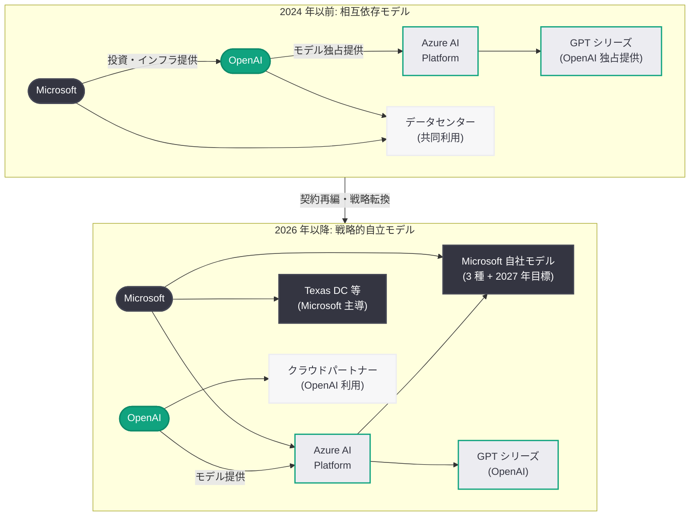

# Microsoft、自社 AI モデル 3 種を発表し Texas データセンターを引き継ぎ: OpenAI パートナーシップの構造的転換が加速

## メタデータ

| 項目 | 内容 |
|------|------|
| 発表日 | 2026-04-04 |
| ソース | Barron's / Bloomberg / Business Insider / The North State Journal / WinBuzzer / Digital Trends |
| カテゴリ | ビジネス / パートナーシップ / インフラ |
| 公式リンク | [Barron's](https://www.barrons.com/articles/microsoft-openai-deal-ai-journey-stock-price)、[Bloomberg](https://www.bloomberg.com/news/articles/2026-04-02/microsoft-aims-to-create-large-cutting-edge-ai-models-by-2027)、[Business Insider](https://www.businessinsider.com/microsoft-new-ai-models-competition-openai-2026-4)、[The North State Journal](https://www.northstatejournal.com/microsoft-takes-over-texas-ai-data-center-expansion-as-openai-backs-away) |

## 概要

Microsoft が 2026 年 4 月初旬に自社開発の AI モデル 3 種を発表し、同時に OpenAI が撤退した Texas データセンター拡張計画を引き継ぐことが明らかになった。これらの動きは、Microsoft が OpenAI への依存を戦略的に低減し、AI 分野における自社の技術的自立性を強化する方向へ大きく舵を切ったことを示している。

Barron's は 4 月 4 日に「Microsoft Is on a New AI Journey After Reworked OpenAI Deal」と題した記事で、OpenAI との契約再編後の Microsoft の新たな AI 戦略を詳報した。Bloomberg の報道によれば、Microsoft の AI 責任者は 2027 年までに最先端の大規模 AI モデルを自社で構築する目標を掲げている。この一連の動きは、[3 月 22 日に報じられた OpenAI のデータセンター投資縮小と Nvidia 契約見直し](2026-03-22-openai-datacenter-pivot-nvidia-ipo.md)の直接的な後続展開であり、両社のパートナーシップが「相互依存」から「戦略的競争と協調の共存」へと移行しつつあることを明確に示している。

## 主な内容

### Microsoft の自社 AI モデル開発

Microsoft は 4 月 2 日から 3 日にかけて、自社開発の AI モデル 3 種を発表した。Business Insider、WinBuzzer、Digital Trends など複数のメディアが一斉に報じたこの発表は、Microsoft が OpenAI のモデルに依存する立場から脱却し、独自の AI モデル開発能力を確立する意思を明確にしたものである。

- **3 種の自社モデル発表:** Microsoft は OpenAI の GPT シリーズに対抗する形で 3 つの新しい AI モデルを市場に投入した。これらのモデルは Azure AI プラットフォームを通じて提供される
- **2027 年目標:** Bloomberg の報道によれば、Microsoft の AI 責任者は 2027 年までに「state-of-the-art」(最先端) レベルの大規模 AI モデルを自社で構築することを目指している
- **競争と協調の両立:** Digital Trends が指摘する通り、Microsoft は Google と OpenAI の双方に対抗する独自のポジションを構築しつつある。OpenAI とのパートナーシップを維持しながらも、自社モデルによる代替手段を確保する「デュアルトラック戦略」を推進している

### Texas データセンター移管

The North State Journal は 4 月 4 日、Microsoft が OpenAI の撤退した Texas データセンター拡張計画を引き継ぐことを報じた。これは 3 月 22 日に CNBC が報じた OpenAI のデータセンター投資縮小の具体的な帰結である。

- **OpenAI の撤退:** OpenAI は IPO 準備の一環として capex (設備投資) を大幅に縮小し、Texas データセンター拡張計画から撤退した。3 月 31 日には 1,220 億ドルの資金調達を完了し、評価額は 8,520 億ドルに達している
- **Microsoft による引き継ぎ:** OpenAI が手を引いたデータセンター拡張を Microsoft が引き継ぐことで、Microsoft は AI インフラにおける支配的な地位をさらに強化する
- **インフラの主導権:** この移管により、AI ワークロードを処理する物理的なインフラの所有と運営において、Microsoft が OpenAI に対してさらに優位な立場を確保することになる

### OpenAI パートナーシップへの影響

Barron's が詳報した通り、Microsoft と OpenAI の関係性は契約再編を経て新たなフェーズに入っている。

- **契約再編の背景:** Microsoft は OpenAI との独占的パートナーシップ契約を再交渉し、より柔軟な枠組みへと移行した。これにより、Microsoft は自社モデル開発を並行して推進する自由度を獲得した
- **相互依存から戦略的自立へ:** Microsoft は OpenAI のモデルを引き続き Azure 上で提供しつつも、自社モデルによる代替オプションを顧客に提供することで、特定のパートナーへの過度な依存リスクを軽減する
- **OpenAI への影響:** OpenAI にとって、最大の投資者であり技術パートナーである Microsoft が競合モデルを開発する状況は、長期的なビジネスモデルに影響を与える可能性がある。ただし、OpenAI は 1,220 億ドルの資金調達に成功しており、Microsoft 以外のパートナーとの関係構築も進めている

## 技術的な詳細

### パートナーシップ構造の変遷

Microsoft と OpenAI の関係性は、以下の 3 つのフェーズを経て変化してきた。

1. **投資・依存期 (2019-2024 年):** Microsoft が OpenAI に数十億ドルを投資し、Azure を通じて OpenAI モデルを独占的に提供
2. **転換期 (2025 年):** OpenAI の企業構造変更 (非営利から営利への転換) に伴い、Microsoft は持分比率や契約条件を再交渉
3. **自立期 (2026 年-):** Microsoft が自社 AI モデルを本格展開し、OpenAI モデルとの並行提供体制を構築

### Microsoft の AI モデル戦略

Microsoft の自社モデル開発は、既存の Phi シリーズ (小規模モデル) の成功を基盤としている。今回の 3 モデル発表は、小規模モデルから大規模モデルへと開発範囲を拡大する戦略的な一歩であり、2027 年の「最先端モデル」実現に向けたロードマップの第一段階と位置づけられる。

## 開発者への影響

### Azure AI プラットフォームの選択肢拡大

Microsoft が自社モデルを Azure 上で提供することにより、開発者は OpenAI モデルと Microsoft モデルの双方から用途に応じて選択できるようになる。

- **マルチモデル戦略:** 特定のモデルプロバイダーにロックインされるリスクが軽減され、タスクに最適なモデルを柔軟に選択可能になる
- **API 互換性:** Azure AI プラットフォームを通じて統一的な API で複数のモデルにアクセスできる環境が整備される見込みである
- **コスト競争:** Microsoft 自社モデルと OpenAI モデルの競争により、API 利用料金の引き下げ圧力が生まれる可能性がある

### インフラの信頼性

Microsoft が Texas データセンターを含む AI インフラへの投資を拡大することは、Azure 上で AI ワークロードを実行する開発者にとって、コンピューティングリソースの安定供給という観点でポジティブな要因となる。

### 注意すべき点

- **モデル互換性:** Microsoft 自社モデルと OpenAI モデルの間で API の互換性や出力特性に差異がある可能性があり、アプリケーション設計においてモデル切り替えの容易さを考慮することが重要である
- **長期的なパートナーシップリスク:** Microsoft と OpenAI の関係性が競争的に変化する場合、Azure 上での OpenAI モデルの提供条件やサポート体制に影響が生じる可能性がある
- **移行計画:** 現在 OpenAI API を直接利用している開発者は、Azure AI 経由でのアクセスも検討し、プロバイダー分散による可用性向上を図ることが推奨される

## 関連リンク

- [Barron's: Microsoft Is on a New AI Journey After Reworked OpenAI Deal](https://www.barrons.com/articles/microsoft-openai-deal-ai-journey-stock-price)
- [Bloomberg: Microsoft Aims to Create Large Cutting-Edge AI Models By 2027](https://www.bloomberg.com/news/articles/2026-04-02/microsoft-aims-to-create-large-cutting-edge-ai-models-by-2027)
- [Business Insider: Microsoft released 3 new AI models](https://www.businessinsider.com/microsoft-new-ai-models-competition-openai-2026-4)
- [The North State Journal: Microsoft takes over Texas AI data center expansion](https://www.northstatejournal.com/microsoft-takes-over-texas-ai-data-center-expansion-as-openai-backs-away)
- [WinBuzzer: Microsoft Ships 3 In-House AI Models to Rival OpenAI](https://winbuzzer.com/2026/04/03/microsoft-ships-3-in-house-ai-models-to-rival-openai-xcxwbn/)
- [Digital Trends: Microsoft takes on Google and OpenAI with its own AI models](https://www.digitaltrends.com/computing/microsoft-takes-on-google-openai-own-ai-models/)
- [MLQ.ai: Microsoft Launches In-House AI Models to Reduce Reliance on OpenAI](https://mlq.ai/microsoft-launches-in-house-ai-models/)
- [関連レポート: OpenAI、IPO を前にデータセンター投資を縮小し Nvidia 契約を見直し](2026-03-22-openai-datacenter-pivot-nvidia-ipo.md)

## まとめ

Microsoft が自社 AI モデル 3 種を発表し、2027 年までに最先端モデルの構築を目指す方針を明確にしたこと、そして OpenAI が撤退した Texas データセンター拡張計画を引き継いだことは、Microsoft-OpenAI パートナーシップの構造的な転換を象徴する出来事である。3 月 22 日に報じられた OpenAI のデータセンター投資縮小と Nvidia 契約見直しが「OpenAI 側の変化」であったのに対し、今回の動きは「Microsoft 側の対応と自立化」という対をなす展開である。Microsoft は OpenAI との協力関係を維持しつつも、自社モデルの開発と AI インフラの直接的な所有を通じて、AI 分野における戦略的自律性を確保する方向に明確に舵を切った。OpenAI が 1,220 億ドルの資金調達を経て評価額 8,520 億ドルに達し IPO に向けた準備を加速する一方、Microsoft は AI の「モデル層」と「インフラ層」の双方で主導権を握る布石を着実に打っている。この両社の戦略的分化は、AI 産業全体の競争構図と、開発者がモデルやインフラを選択する際の判断基準に大きな影響を与えるものである。
