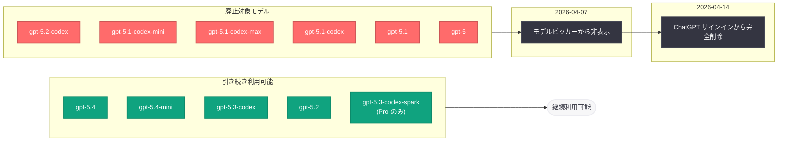

# Codex のモデル選択肢を更新 -- 旧モデルを段階的に廃止

## メタデータ

| 項目 | 内容 |
|------|------|
| 発表日 | 2026-04-07 |
| ソース | Codex Changelog |
| カテゴリ | API 更新 |
| 公式リンク | [developers.openai.com/codex/changelog](https://developers.openai.com/codex/changelog/) |

## 概要

OpenAI は 2026 年 4 月 7 日、ChatGPT サインインで Codex を利用するユーザー向けに、モデル選択肢の更新を実施した。旧世代の GPT-5.1 系および GPT-5.2 系 Codex モデルがモデルピッカーから非表示となり、2026 年 4 月 14 日には完全に削除される。これは GPT-5.4 ファミリーへの統合を進める OpenAI のモデル廃止サイクルの一環であり、開発者は利用中のモデルの移行計画を早急に策定する必要がある。

## 主な内容

### モデルピッカーからの非表示化

2026 年 4 月 7 日より、ChatGPT サインインで Codex を利用する場合、以下のモデルがモデルピッカーに表示されなくなった。

| 非表示となったモデル | 系列 |
|---------------------|------|
| gpt-5.2-codex | GPT-5.2 系 |
| gpt-5.1-codex-mini | GPT-5.1 系 |
| gpt-5.1-codex-max | GPT-5.1 系 |
| gpt-5.1-codex | GPT-5.1 系 |
| gpt-5.1 | GPT-5.1 系 |
| gpt-5 | GPT-5 系 |

### 完全削除のスケジュール

2026 年 4 月 14 日に、上記のモデルは ChatGPT サインインでの Codex から完全に削除される。この日以降、これらのモデルを ChatGPT サインイン経由で利用することはできなくなる。

### 引き続き利用可能なモデル

ChatGPT サインインのユーザーは、以下のモデルを引き続き選択できる。

| モデル | 対象ユーザー |
|--------|-------------|
| gpt-5.4 | 全ユーザー |
| gpt-5.4-mini | 全ユーザー |
| gpt-5.3-codex | 全ユーザー |
| gpt-5.2 | 全ユーザー |
| gpt-5.3-codex-spark | ChatGPT Pro ユーザーのみ |

### API キーによるアクセス

上記以外の API サポート対象モデルを利用したい場合は、API キーでサインインするか、モデルプロバイダーを設定することで引き続きアクセスが可能である。

## 技術的な詳細

### モデル移行タイムライン

### アクセス方法の比較

| サインイン方法 | 利用可能なモデル | 制限 |
|---------------|-----------------|------|
| ChatGPT サインイン | gpt-5.4, gpt-5.4-mini, gpt-5.3-codex, gpt-5.2 | 旧モデルは 4 月 14 日に完全削除 |
| ChatGPT Pro サインイン | 上記 + gpt-5.3-codex-spark | 旧モデルは 4 月 14 日に完全削除 |
| API キーサインイン | API サポート対象の全モデル | API の利用制限に準拠 |

## 開発者への影響

今回のモデル選択肢の更新は、Codex を利用する開発者に対して以下の影響をもたらす。

- **旧モデルからの移行が必須:** gpt-5.1 系および gpt-5.2-codex を利用しているユーザーは、2026 年 4 月 14 日までに gpt-5.4 系または gpt-5.3-codex への移行を完了する必要がある。移行が間に合わない場合、ワークフローが中断する可能性がある
- **GPT-5.4 ファミリーへの統合:** OpenAI は GPT-5.4 系を主力モデルとして位置づけており、今後の機能改善やパフォーマンス最適化もこの系列に集中することが予想される。早期の移行により、最新の改善を享受できる
- **API キー利用の検討:** ChatGPT サインインでは利用可能なモデルが限定されるため、幅広いモデル選択が必要な場合は API キーでのサインインへの切り替えを検討すべきである
- **ChatGPT Pro の付加価値:** gpt-5.3-codex-spark は ChatGPT Pro ユーザー限定のモデルであり、Pro プランの価値が相対的に向上している
- **ワークフローの検証:** 旧モデルに依存するプロンプトやワークフローが存在する場合、新モデルでの動作検証を早急に行う必要がある

## 関連リンク

- [Codex Changelog](https://developers.openai.com/codex/changelog/)
- [OpenAI API リファレンス](https://platform.openai.com/docs/api-reference)
- [OpenAI Models](https://platform.openai.com/docs/models)
- [OpenAI News](https://openai.com/news)

## まとめ

OpenAI は Codex のモデル選択肢を整理し、ChatGPT サインインユーザー向けに旧世代モデルの段階的廃止を開始した。2026 年 4 月 7 日にモデルピッカーから非表示となった gpt-5.2-codex、gpt-5.1 系、gpt-5 の各モデルは、4 月 14 日に完全に削除される。引き続き利用可能なモデルは gpt-5.4、gpt-5.4-mini、gpt-5.3-codex、gpt-5.2 であり、ChatGPT Pro ユーザーは gpt-5.3-codex-spark も選択できる。これは GPT-5.4 ファミリーへの統合を進めるモデル廃止サイクルの一環であり、開発者は 4 月 14 日の完全削除までにワークフローの移行と検証を完了することが推奨される。API サポート対象の他のモデルを利用したい場合は、API キーでのサインインまたはモデルプロバイダーの設定が必要である。
