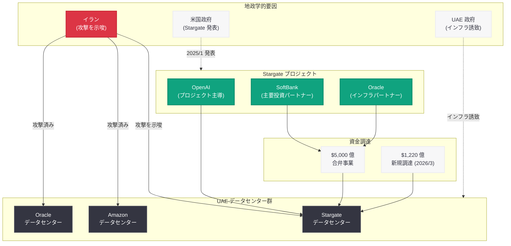

# イランが UAE の OpenAI Stargate データセンターへの攻撃を示唆

## メタデータ

| 項目 | 内容 |
|------|------|
| 発表日 | 2026-04-07 |
| ソース | Data Center Dynamics |
| カテゴリ | Infrastructure / Geopolitical |
| 公式リンク | [Data Center Dynamics](https://www.datacenterdynamics.com/en/news/iran-threatens-to-attack-openais-stargate-data-center-in-uae-war/) |

## 概要

2026 年 4 月 7 日、Data Center Dynamics の報道によると、イランが UAE (アラブ首長国連邦) に所在する OpenAI の Stargate データセンターへの攻撃を示唆した。この脅威は、イランが既に Amazon および Oracle のデータセンターを攻撃した後に発せられたものであり、中東地域における AI インフラの物理的安全保障に対する深刻な懸念を提起している。Stargate プロジェクトは OpenAI、SoftBank、Oracle らによる 5,000 億ドル規模の合弁事業であり、今回の地政学的リスクの顕在化は、グローバルな AI インフラ戦略に重大な影響を及ぼす可能性がある。

## 主な内容

### イランによる攻撃の示唆

イランは UAE に建設された OpenAI の Stargate データセンターを攻撃対象とする意向を示した。この脅威は、同地域にある Amazon および Oracle のデータセンターが既に攻撃を受けた後に発せられたものであり、AI インフラが地政学的紛争の標的となる新たな段階に入ったことを示している。

中東地域では、クラウドインフラやデータセンターが戦略的資産として認識されつつあり、従来の軍事・エネルギー施設に加えて、テクノロジーインフラが紛争における攻撃対象となるリスクが現実のものとなった。

### Stargate プロジェクトの概要

Stargate プロジェクトは、2025 年 1 月にトランプ大統領によって発表された米国発の大規模 AI インフラ構想である。OpenAI、SoftBank、Oracle をはじめとする主要パートナーによる 5,000 億ドル規模の合弁事業として計画され、AI の計算基盤を大幅に拡充することを目的としている。

OpenAI はこのプロジェクトを米国内にとどまらずグローバルに展開しており、UAE を含む複数の地域にデータセンターを建設してきた。2026 年 3 月 31 日には 1,220 億ドルの新規資金調達を発表しており、その資金の一部はインフラ拡張に充てられる計画であった。

### 先行する Amazon・Oracle データセンターへの攻撃

イランによる Stargate への脅威に先立ち、同地域にある Amazon および Oracle のデータセンターが既に攻撃を受けている。これらの攻撃は、中東における大規模テクノロジーインフラが地政学的リスクにさらされていることを明確に示す先例となった。

## 地政学的背景と影響

### 中東における AI インフラの戦略的位置づけ

UAE は近年、AI およびクラウドコンピューティングのハブとしての地位を確立するため、積極的な投資と誘致を行ってきた。OpenAI をはじめとする主要テクノロジー企業が UAE にインフラを展開してきた背景には、以下の要因がある。

- **地理的優位性:** アジア、ヨーロッパ、アフリカを結ぶ中間地点としての位置
- **エネルギー供給:** データセンター運営に必要な豊富なエネルギー資源
- **投資環境:** テクノロジー企業に対する優遇政策と資金支援
- **成長市場:** 中東・北アフリカ地域の急速なデジタル化需要

### AI インフラへの地政学的リスク

今回の事態は、AI インフラが国家間紛争の新たな標的となり得ることを示している。従来、データセンターの安全保障は主にサイバーセキュリティの観点から議論されてきたが、物理的な軍事攻撃のリスクが現実化したことで、AI インフラの立地戦略そのものの見直しが求められる。

## ステークホルダー構造

## 業界への影響

今回のイランによる Stargate データセンターへの攻撃示唆は、AI 業界全体に対して以下の重要な影響をもたらす。

- **AI インフラの立地戦略の再考:** 中東地域への大規模データセンター投資に対するリスク評価が根本的に見直される可能性がある。地政学的安定性がデータセンター立地の最優先要件として再認識されることになる
- **物理的セキュリティの強化:** データセンターのセキュリティが、サイバー防御だけでなく物理的な軍事攻撃への耐性を含む総合的な観点から再設計される必要性が高まった
- **インフラの地理的分散:** 単一地域への過度な集中を避け、複数の地政学的に安定した地域へのインフラ分散が加速する可能性がある
- **保険・リスク管理への影響:** データセンターの戦争リスク保険や、地政学的リスクを織り込んだ事業継続計画 (BCP) の重要性が増大する
- **国際的な規範形成:** テクノロジーインフラを紛争における正当な攻撃対象とすべきかについて、国際法や外交の場での議論が活発化する可能性がある

## 関連リンク

- [Iran threatens to attack OpenAI's Stargate data center in UAE - Data Center Dynamics](https://www.datacenterdynamics.com/en/news/iran-threatens-to-attack-openais-stargate-data-center-in-uae-war/)
- [OpenAI $122B 資金調達発表 (2026/3/31)](https://openai.com/index/accelerating-the-next-phase-of-ai/)
- [OpenAI News](https://openai.com/news)

## まとめ

イランが UAE に所在する OpenAI の Stargate データセンターへの攻撃を示唆したことは、AI インフラが地政学的紛争の新たな標的となる時代の到来を象徴する出来事である。Amazon および Oracle のデータセンターが既に攻撃を受けた後の脅威であり、中東地域における大規模テクノロジーインフラの脆弱性が改めて浮き彫りとなった。5,000 億ドル規模の Stargate プロジェクトは、AI の計算能力を飛躍的に拡大するための戦略的投資であるが、その物理的安全性の確保が重大な課題として認識されることとなった。AI 業界全体として、インフラの地理的分散、物理的セキュリティの強化、地政学的リスクを織り込んだ立地戦略の再構築が急務となっている。
