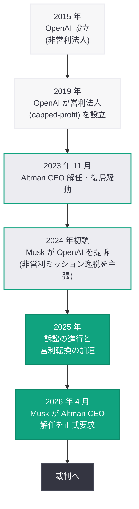
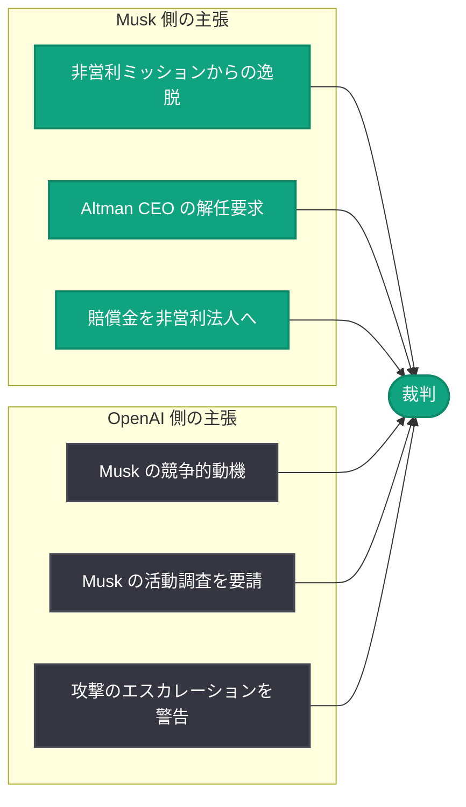

# Musk が OpenAI 訴訟で Altman CEO 解任を要求

## メタデータ

| 項目 | 内容 |
|------|------|
| 発表日 | 2026-04-07 |
| ソース | Google News (CNBC, Bloomberg, The Hill, Fast Company, Gizmodo) |
| カテゴリ | Company / Legal |
| 公式リンク | [CNBC](https://www.cnbc.com/2026/04/07/elon-musk-openai-altman-ouster.html), [Google News](https://news.google.com/search?q=OpenAI+Musk) |

## 概要

Elon Musk は OpenAI に対する訴訟を大幅にエスカレートさせ、Sam Altman の CEO 解任を裁判所に求めた。Musk は、OpenAI が当初の非営利ミッションから逸脱し営利企業へ転換したことが契約違反であると主張しており、裁判で勝訴した場合の賠償金を OpenAI の非営利法人に帰属させるよう要求している。一方、OpenAI 側は裁判を前に Musk の活動に対する調査を裁判所に求めるなど、双方の対立は激化の一途をたどっている。OpenAI が IPO を準備している時期と重なることから、この訴訟の行方は同社のコーポレートガバナンスと将来の方向性に重大な影響を及ぼす可能性がある。

## 主な内容

### Musk が Altman CEO の解任を要求

CNBC の報道によると、Musk は進行中の訴訟の一環として、Sam Altman を OpenAI の CEO から解任するよう裁判所に正式に求めた。これは、Musk がこれまでの金銭的請求に加え、OpenAI の経営陣の刷新を直接要求する形へと訴訟戦略を転換したことを意味する。Musk の主張は、Altman のリーダーシップの下で OpenAI が営利追求に傾倒し、設立時の非営利ミッションである「人類全体の利益のための AI 開発」から逸脱したというものである。

### 賠償金の非営利法人への帰属要求

Bloomberg および Gizmodo の報道によれば、Musk は裁判で勝訴した場合の賠償金を OpenAI の非営利法人に帰属させるよう裁判所に求めている。この戦略は、Musk が個人的な利益ではなく OpenAI の設立理念の保護を目的としていることを強調するものであり、訴訟を「非営利ミッションの防衛」というフレームワークで位置づけようとする意図が明確である。

### OpenAI 側の対抗措置

The Hill および Fast Company の報道によると、OpenAI も黙って防御に徹しているわけではない。OpenAI は裁判を前に Musk の活動に対する調査を裁判所に要請しており、Musk が裁判が近づくにつれ攻撃をエスカレートさせていると警告している。OpenAI 側は、Musk の訴訟が競争的な動機に基づくものであり、純粋な非営利ミッションの保護を目的としたものではないと主張していると見られる。

### IPO への影響と企業統治の課題

OpenAI は現在 IPO の準備を進めており、この法的紛争のタイミングは極めて重要である。CEO 解任を求める訴訟は、投資家の信頼や企業価値評価に直接影響を与える可能性がある。また、OpenAI の非営利法人と営利法人の関係というガバナンス構造そのものが争点となっており、判決の内容次第では AI 業界全体の組織構造に先例を示すことになる。

## 訴訟の経緯

### タイムライン

### 双方の主張の構図

## 業界への影響

今回の訴訟のエスカレーションは、OpenAI のみならず AI 業界全体に対して以下の重要な影響をもたらす可能性がある。

- **OpenAI の IPO プロセスへの影響:** CEO 解任を求める訴訟は、投資家の不確実性を高め、IPO のタイミングや企業価値評価に直接的な影響を及ぼす可能性がある。OpenAI は IPO に向けてガバナンス構造の安定性を示す必要があるが、本訴訟はその妨げとなりうる
- **AI 企業のガバナンスモデルへの先例:** 非営利法人から営利法人への転換の合法性が争われることで、他の AI 企業やテクノロジー企業のガバナンスモデルにも波及効果が生じる可能性がある
- **AI の公益性に関する議論:** Musk が訴訟を「非営利ミッションの防衛」として位置づけていることで、AI 開発が公益のために行われるべきかという根本的な議論が再燃する可能性がある
- **OpenAI の経営陣への影響:** 仮に裁判所が Altman の解任を命じた場合、OpenAI の経営体制は大きく変動し、同社の戦略的方向性にも重大な変更が生じることになる
- **競合他社への波及:** xAI を率いる Musk が OpenAI の経営に介入しようとすることで、AI 業界の競争構造そのものが変化する可能性がある

## 関連リンク

- [CNBC - Elon Musk seeks ouster of OpenAI CEO Sam Altman](https://www.cnbc.com/2026/04/07/elon-musk-openai-altman-ouster.html)
- [Google News - OpenAI Musk](https://news.google.com/search?q=OpenAI+Musk)
- [OpenAI News](https://openai.com/news)

## まとめ

Elon Musk は OpenAI に対する訴訟を新たな段階へと進め、Sam Altman の CEO 解任および裁判の賠償金を OpenAI の非営利法人に帰属させることを裁判所に正式に求めた。Musk は OpenAI が設立時の非営利ミッションから逸脱したと主張し、組織の原点回帰を訴えている。一方、OpenAI は Musk の活動に対する調査を裁判所に要請し、Musk の攻撃がエスカレートしていると警告するなど、全面的に対抗する姿勢を示している。OpenAI が IPO を準備する中でのこの法的紛争は、同社のコーポレートガバナンス、企業価値、そして AI 業界全体の組織構造に対して広範な影響を与える可能性があり、今後の裁判の行方が注目される。
