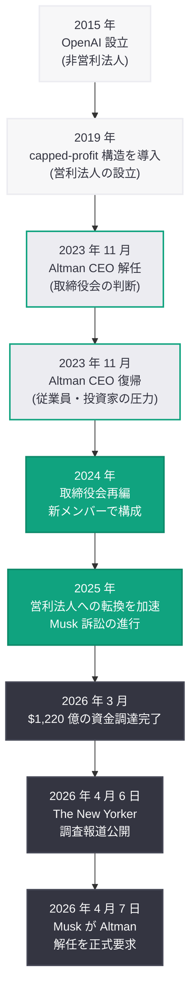
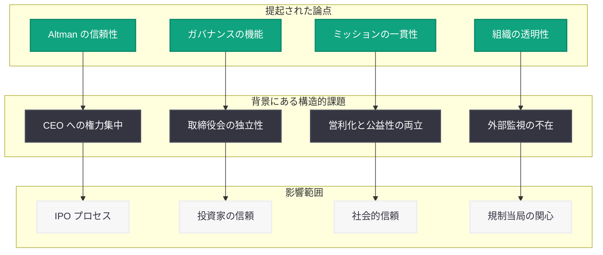

# The New Yorker が Sam Altman の経営手法を徹底検証

## メタデータ

| 項目 | 内容 |
|------|------|
| 発表日 | 2026-04-07 |
| ソース | Google News (The New Yorker, CNN) |
| カテゴリ | Company / Media |
| 公式リンク | [The New Yorker](https://www.newyorker.com/magazine/2026/04/14/sam-altman-openai), [CNN](https://www.cnn.com/2026/04/07/tech/new-yorker-sam-altman-openai/) |

## 概要

The New Yorker は 2026 年 4 月 6 日、Sam Altman と OpenAI に関する大規模な調査報道記事「Sam Altman May Control Our Future — Can He Be Trusted?」を公開した。この記事は、Altman のリーダーシップスタイル、経営における欺瞞の疑惑、そして OpenAI のガバナンス上の課題を多角的に検証するものである。CNN をはじめとする主要メディアも翌 4 月 7 日にこの調査報道を取り上げ、Altman の信頼性と AI の未来を託すべきリーダーとしての適格性に関する議論が広がっている。この報道は、OpenAI が $1,220 億の資金調達を完了し IPO を準備する重要な局面で公開されており、同社のコーポレートガバナンスに対する社会的関心を一層高めるものとなった。

## 主な内容

### The New Yorker の調査報道の核心

The New Yorker の記事は「Sam Altman May Control Our Future — Can He Be Trusted?」と題され、AI 開発の最前線に立つ Altman の人物像とその信頼性を正面から問いかけている。記事は、Altman が OpenAI を通じて AI の未来に対して持つ影響力の大きさを前提に、そのリーダーシップの下で行われた経営判断や組織運営の透明性を検証する内容となっている。

調査報道では、以下の主要テーマが取り上げられている。

- **経営における欺瞞の疑惑:** Altman が取締役会、従業員、パートナーに対して情報を正確に伝えなかったとされる事例の検証
- **2023 年取締役会危機の内幕:** Altman が CEO を一時解任され、その後復帰した 2023 年 11 月の騒動に関する新たな証言や詳細
- **営利転換への道筋:** 非営利法人として設立された OpenAI が営利企業へと転換していく過程における意思決定プロセスの検証
- **権力の集中:** Altman 個人への権限集中と、それに対するチェック・アンド・バランスの機能不全に関する指摘

### CNN による報道の展開

CNN は 4 月 7 日に「The New Yorker investigates Sam Altman's alleged deceptions at OpenAI」と題した記事で、The New Yorker の調査報道を広く報じた。CNN の報道は、The New Yorker が提示した欺瞞の疑惑とガバナンス上の懸念を中心に取り上げ、OpenAI の組織運営における透明性の問題を強調している。

### 報道の背景: OpenAI を取り巻く情勢

この調査報道が公開されたタイミングは、OpenAI にとって極めて重要な転換期と重なっている。

| 時期 | 出来事 |
|------|--------|
| 2026 年 3 月 31 日 | $1,220 億の資金調達ラウンドを完了 |
| 2026 年 4 月 7 日 | Musk が Altman CEO 解任を裁判所に要求 |
| 進行中 | 非営利法人から営利法人への組織転換 |
| 準備中 | IPO (新規株式公開) |

これらの出来事が同時期に進行する中での調査報道は、投資家、規制当局、そして一般社会に対して OpenAI のガバナンスに関する疑問を投げかける形となっている。

### 2023 年取締役会危機との関連

The New Yorker の調査報道は、2023 年 11 月の取締役会危機を重要な参照点として取り上げていると見られる。当時、OpenAI の取締役会は Altman を突然 CEO から解任したが、従業員やパートナーの強い反発を受けて数日後に復帰させた。この事件は、Altman のリーダーシップに対する取締役会の懸念と、それにもかかわらず Altman が圧倒的な影響力を持つ構造を浮き彫りにした。その後の取締役会再編により、Altman に批判的だったメンバーは退任し、新たなガバナンス体制が構築されたが、これが真にチェック機能を果たしているかという問いは残されている。

## OpenAI ガバナンスの変遷

## ガバナンスの論点

### 信頼性に関する構造的課題

The New Yorker の調査報道が提起する問題は、Altman 個人の信頼性にとどまらず、OpenAI という組織のガバナンス構造そのものに関わるものである。

### Musk 訴訟との相乗効果

The New Yorker の調査報道は、同日に報じられた Musk による Altman CEO 解任要求と時期的に重なっている。Musk の訴訟は OpenAI の非営利ミッションからの逸脱を法的に問うものであり、The New Yorker の記事は Altman のリーダーシップの信頼性をジャーナリズムの観点から検証するものである。これら二つの異なるアプローチが同時期に展開されることで、OpenAI のガバナンスに対する社会的な scrutiny (精査) は一層強まることが予想される。

## 業界への影響

今回の調査報道は、OpenAI のみならず AI 業界全体に対して以下の重要な影響をもたらす可能性がある。

- **IPO プロセスへの影響:** 調査報道による信頼性への疑問は、OpenAI の IPO に向けた投資家の判断に影響を及ぼす可能性がある。IPO を目指す企業にとって、経営者の信頼性とガバナンスの健全性は投資家が重視する最重要項目の一つである
- **AI 企業のガバナンス基準:** AI が社会に与える影響力が増大する中、AI 企業のリーダーに求められる透明性と説明責任の水準が引き上げられる契機となりうる
- **規制議論への影響:** AI 規制を検討する各国の規制当局にとって、業界を代表する企業のガバナンス問題は規制強化の根拠となりうる
- **ステークホルダーの意識変化:** 従業員、パートナー企業、ユーザーの間で、OpenAI の組織運営に対する関心と警戒感が高まる可能性がある
- **AI の公益性に関する議論:** 人類の未来を左右しうる AI 技術の開発を、どのような組織構造と監視体制の下で進めるべきかという根本的な議論が加速する可能性がある

## 関連リンク

- [The New Yorker - Sam Altman May Control Our Future — Can He Be Trusted?](https://www.newyorker.com/magazine/2026/04/14/sam-altman-openai)
- [CNN - The New Yorker investigates Sam Altman's alleged deceptions at OpenAI](https://www.cnn.com/2026/04/07/tech/new-yorker-sam-altman-openai/)
- [Musk が OpenAI 訴訟で Altman CEO 解任を要求 (関連レポート)](./2026-04-07-musk-seeks-altman-ouster.md)
- [OpenAI News](https://openai.com/news)

## まとめ

The New Yorker は、Sam Altman のリーダーシップと OpenAI のガバナンスに関する包括的な調査報道を公開した。「Sam Altman May Control Our Future — Can He Be Trusted?」と題されたこの記事は、Altman の経営における欺瞞の疑惑、2023 年取締役会危機の内幕、非営利法人から営利企業への転換過程、そして CEO への権力集中を多角的に検証している。CNN をはじめとする主要メディアもこの報道を取り上げ、Altman の信頼性に関する議論は広がりを見せている。OpenAI が $1,220 億の資金調達を完了し IPO を準備する局面、さらに Musk が Altman の CEO 解任を裁判所に求めた同日にこの報道が展開されたことで、OpenAI のコーポレートガバナンスに対する社会的な関心は極めて高い水準に達している。AI 技術が社会に与える影響力が増大する中、その開発を主導する企業のリーダーシップと組織運営の透明性は、今後ますます重要な論点となるであろう。
