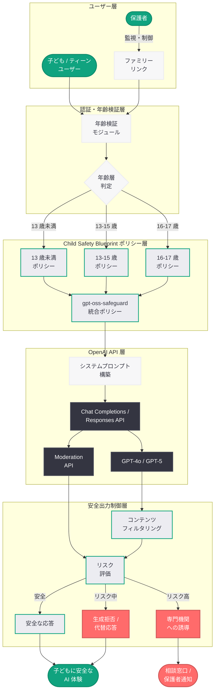
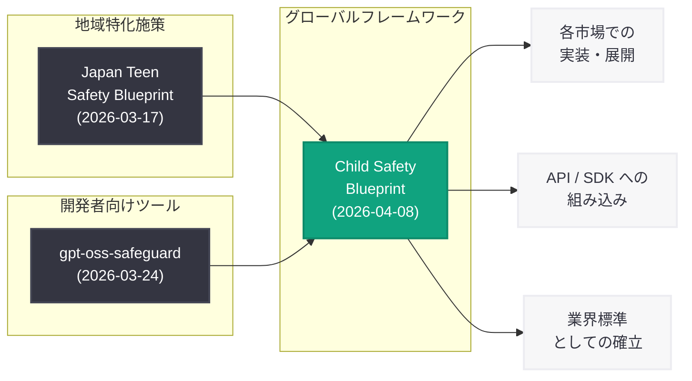

# OpenAI が「Child Safety Blueprint」を発表: 子どもの安全を守る AI 開発の包括的フレームワーク

## メタデータ

| 項目 | 内容 |
|------|------|
| 発表日 | 2026-04-08 |
| ソース | OpenAI News |
| カテゴリ | Safety |
| 公式リンク | [Introducing the Child Safety Blueprint](https://openai.com/index/introducing-child-safety-blueprint) |

> **注記:** 本レポートは、記事全文が Cloudflare のアクセス制限により取得できなかったため、公開されている記事の概要、OpenAI の既存の子ども・ティーン安全施策に関する情報、および関連する発表内容に基づいて作成されている。正確な詳細については公式ページを参照されたい。

## 概要

OpenAI は 2026 年 4 月 8 日、AI を責任を持って構築するための包括的なロードマップ「Child Safety Blueprint」を発表した。本ブループリントは、セーフガードの実装、年齢に適した設計原則、そしてステークホルダーとの協働を通じて、オンライン上の子どもや若者を保護し、その可能性を引き出すことを目的としている。

この発表は、OpenAI が 2026 年 3 月 17 日に公開した日本市場向けの「Japan Teen Safety Blueprint」および 3 月 24 日に公開した開発者向けツール「gpt-oss-safeguard」に続く取り組みであり、これらの地域特化型・開発者向け施策を統合し、グローバルかつ包括的なフレームワークとして体系化したものと位置づけられる。ティーン (13-17 歳) だけでなく、より幅広い年齢層の子ども全体を対象としている点が特徴であり、AI プロダクト開発における子どもの安全を業界全体の標準として確立することを目指している。

## 主な内容

### Child Safety Blueprint の全体像

Child Safety Blueprint は、AI システムの設計・開発・運用の各段階において子どもの安全を確保するための包括的なガイドラインである。以下の 4 つの柱で構成されていると考えられる。

| 柱 | 内容 | 対象 |
|---|---|---|
| セーフガード | 技術的な保護メカニズムの実装 | AI システム全体 |
| 年齢適切設計 | 発達段階に応じた体験の提供 | 子ども・ティーン |
| コンテンツモデレーション | 有害コンテンツのフィルタリングと制御 | 全ユーザー |
| ステークホルダー協働 | 教育者・保護者・安全団体との連携 | エコシステム全体 |

### セーフガードの設計原則

Child Safety Blueprint の中核をなすのは、多層的なセーフガードの実装である。AI システムが子どもに対して安全に機能するための技術的・運用的な保護メカニズムが体系的に定義されている。

- **入力段階の保護:** 子どもアカウントからのリクエストに対して、年齢に適さないトピックや危険なコンテンツの要求を検知・ブロックするフィルタリングを適用
- **モデルレベルの制御:** Model Spec (モデル仕様) に基づき、子どもユーザーへの応答生成時に年齢に適した出力制御を実施
- **出力段階の検証:** 生成されたコンテンツが子どもに適切であるかを追加の安全性チェックで検証
- **継続的なモニタリング:** 利用パターンの分析を通じて、潜在的なリスクを早期に検知し対応

### 年齢に適した設計 (Age-Appropriate Design)

子どもの発達段階に応じた AI 体験を提供するための設計原則が定義されている。これは単にコンテンツを制限するだけでなく、子どもの学習や成長を積極的に支援するための設計思想を含んでいる。

- **段階的な機能開放:** ユーザーの年齢に応じて利用可能な機能を段階的に制御し、発達段階に適した AI 体験を提供
- **子ども向け UI/UX の最適化:** 子どもが安全かつ直感的に AI を利用できるインターフェースの設計ガイドライン
- **教育的価値の重視:** AI の利用が子どもの学習や創造性を促進する方向に導かれる設計
- **透明性の確保:** AI が生成したコンテンツであることを子どもにも理解しやすい形で明示

### コンテンツモデレーションとフィルタリング

子どもに対して有害なコンテンツの生成や表示を防止するための高度なモデレーションシステムが組み込まれている。

- **年齢層別フィルタリング:** 13 歳未満、13-15 歳、16-17 歳といった年齢層に応じたフィルタリングレベルの段階的適用
- **カテゴリベースの制限:** 暴力、性的コンテンツ、薬物、自傷行為、いじめ、個人情報の共有といったリスクカテゴリごとの制御
- **コンテキスト認識型モデレーション:** 教育目的での利用と不適切な利用を区別し、学習に有益なコンテンツは適切に提供する知的なモデレーション
- **リアルタイム検知と対応:** 有害コンテンツの生成を事前に検知し、適切な代替応答や専門機関への誘導を実施

### 保護者によるコントロールと監視

保護者が子どもの AI 利用を適切に管理・監督できる仕組みの強化が含まれている。

- **ファミリーアカウント連携:** 保護者アカウントと子どものアカウントを紐付け、利用状況の可視化を実現
- **利用時間の管理:** 保護者が子どもの AI 利用時間を設定・制限できる機能
- **コンテンツ制限のカスタマイズ:** 保護者が子どもの年齢や成熟度に応じてフィルタリングレベルを調整可能
- **利用状況レポート:** 子どもの AI 利用頻度やインタラクションの概要を保護者に定期的に提供
- **緊急アラート:** 潜在的に危険な利用パターンを検知した場合に保護者へ通知

### ステークホルダーとの協働

Child Safety Blueprint は、OpenAI 単独の取り組みではなく、教育者、保護者、安全団体、政策立案者との幅広い協働を重視している。

- **教育者との連携:** 学校教育における AI の安全な活用を支援するガイドラインとリソースの提供
- **保護者向け啓発:** AI リテラシーに関する教育資材の提供と、保護者が子どもの AI 利用を理解するためのサポート
- **子どもの安全を専門とする団体との協力:** National Center for Missing & Exploited Children (NCMEC)、Internet Watch Foundation (IWF) 等の専門団体との連携
- **政策立案者との対話:** 各国の子ども保護に関する法規制との整合性を確保し、政策議論に貢献

## 技術的な詳細

### 多層防御アーキテクチャ

Child Safety Blueprint は、複数の技術的レイヤーを組み合わせた多層防御アプローチにより、子どもの安全を包括的に確保する設計となっている。

### 既存の安全施策との統合

Child Safety Blueprint は、OpenAI がこれまでに発表してきた安全施策を統合するグローバルフレームワークとして位置づけられる。

### gpt-oss-safeguard との関係

Child Safety Blueprint は、開発者向けに公開されている gpt-oss-safeguard の上位概念として機能する。gpt-oss-safeguard がプロンプトベースのティーン安全ポリシーを提供する技術的ツールであるのに対し、Child Safety Blueprint はより広範な設計原則、運用ガイドライン、ステークホルダー協働の枠組みを含む包括的なフレームワークである。

- **gpt-oss-safeguard:** プロンプトベースの安全ポリシーセット。開発者がシステムプロンプトに組み込む形で利用
- **Child Safety Blueprint:** 設計原則、技術的セーフガード、運用ガイドライン、ステークホルダー協働を包含する包括的ロードマップ

## 開発者への影響

Child Safety Blueprint の発表は、OpenAI API を利用してアプリケーションを構築する開発者に対して以下のような影響を与える。

- **子ども向けアプリケーション開発の指針の明確化:** 子どもが利用する可能性のある AI アプリケーションを構築する際の設計原則と実装ガイドラインが体系的に提供されることで、開発者は安全設計の方向性を明確に把握できる
- **年齢検証・年齢適切設計の実装要件:** アプリケーション側での年齢検証メカニズムの実装と、年齢層に応じた機能制御の導入がベストプラクティスとして求められる
- **gpt-oss-safeguard の活用推奨の強化:** Child Safety Blueprint に準拠するために、gpt-oss-safeguard のプロンプトベースポリシーの導入が実質的に推奨または要件化される可能性がある
- **保護者コントロール機能の実装:** ファミリーアカウント連携、利用時間管理、コンテンツ制限のカスタマイズといった保護者向け機能の実装が期待される
- **コンプライアンス対応の強化:** 米国の COPPA (児童オンラインプライバシー保護法)、EU の GDPR (一般データ保護規則) の子ども条項、日本の青少年インターネット環境整備法など、各国の子ども保護法規への対応が容易になる
- **API 利用規約への影響:** 子ども向けアプリケーションに対して、Child Safety Blueprint への準拠が OpenAI の API 利用規約に組み込まれる可能性がある
- **教育分野のアプリケーション開発の促進:** 明確な安全ガイドラインの存在により、教育機関向け AI アプリケーションの開発がより活発化する可能性がある

## 関連リンク

- [Introducing the Child Safety Blueprint](https://openai.com/index/introducing-child-safety-blueprint)
- [Japan Teen Safety Blueprint](https://openai.com/index/japan-teen-safety-blueprint/)
- [Helping developers build safer AI experiences for teens (gpt-oss-safeguard)](https://openai.com/index/teen-safety-policies-gpt-oss-safeguard)
- [Introducing the Teen Safety Blueprint](https://openai.com/index/introducing-the-teen-safety-blueprint/)
- [Teen Safety, Freedom, and Privacy](https://openai.com/index/teen-safety-freedom-and-privacy/)
- [AI Literacy Resources for Teens and Parents](https://openai.com/index/ai-literacy-resources-for-teens-and-parents/)
- [OpenAI Safety](https://openai.com/safety)
- [OpenAI News](https://openai.com/news)

## まとめ

OpenAI が発表した「Child Safety Blueprint」は、AI システムにおける子どもの安全を包括的に確保するためのグローバルフレームワークである。セーフガードの実装、年齢に適した設計、コンテンツモデレーション、ステークホルダーとの協働という 4 つの柱を軸に、AI プロダクト開発における子どもの保護を体系化している。2026 年 3 月に発表された Japan Teen Safety Blueprint (地域特化施策) および gpt-oss-safeguard (開発者向けツール) を統合・拡張し、ティーンだけでなくより幅広い年齢層の子どもを対象としたグローバルな指針として位置づけられる。教育者、保護者、安全団体、政策立案者との幅広い協働を重視している点が特徴的であり、AI 企業による子どもの安全保護の業界標準を確立する取り組みとして、開発者コミュニティおよび社会全体に対して重要な意義を持つものである。

> **免責事項:** 本レポートは OpenAI の記事概要、関連する安全施策の公開情報、および既存の Teen Safety Blueprint や gpt-oss-safeguard に関する情報に基づいて構成されたものであり、記事の全文を確認した上での分析ではない。記事の実際の内容とは異なる可能性がある点にご留意いただきたい。
