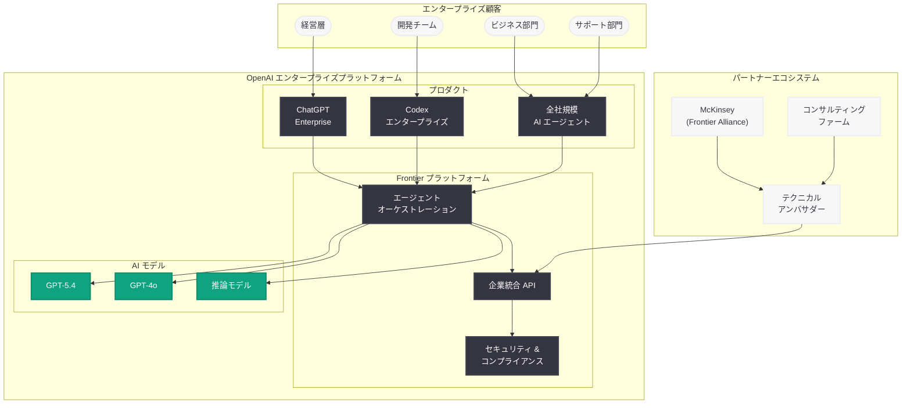
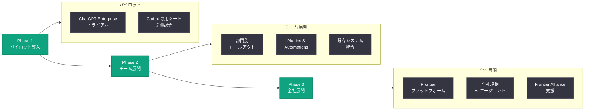

# OpenAI、エンタープライズ AI の次なるフェーズを発表: Frontier、ChatGPT Enterprise、Codex、全社規模 AI エージェントで企業導入を加速

> **注記:** 本レポートは、元記事が Cloudflare の保護により全文取得できなかったため、公式ブログの説明文および既存の関連レポートに基づいて作成されている。正確な詳細については [公式ページ](https://openai.com/index/next-phase-of-enterprise-ai) を参照されたい。

## メタデータ

| 項目 | 内容 |
|------|------|
| 発表日 | 2026-04-08 |
| ソース | OpenAI News/Blog |
| カテゴリ | Company / エンタープライズ戦略 |
| 公式リンク | [The next phase of enterprise AI](https://openai.com/index/next-phase-of-enterprise-ai) |

## 概要

OpenAI は 2026 年 4 月 8 日、「The next phase of enterprise AI (エンタープライズ AI の次なるフェーズ)」と題するブログ記事を公開し、企業向け AI 戦略の包括的なビジョンを示した。Frontier プラットフォーム、ChatGPT Enterprise、Codex、そして全社規模の AI エージェントを柱として、あらゆる産業における AI 導入の加速を推進する方針を明確にしている。

本発表は、OpenAI のエンタープライズ戦略における重要なマイルストーンである。2026 年 3 月 31 日に完了した 1,220 億ドルの資金調達において「ChatGPT、Codex、エンタープライズ AI の需要対応」が主要な使途として示されたことに続き、3 月 21 日に報じられた従業員数 8,000 人への倍増計画でもエンタープライズ市場への注力が明確化されていた。今回の発表は、これらの戦略的動きを統合し、エンタープライズ AI のロードマップとして具体化したものと位置付けられる。

## 主な内容

### Frontier: エンタープライズ AI プラットフォーム

Frontier は OpenAI のエンタープライズ戦略の中核に位置するエージェントベースの AI プラットフォームである。企業のワークフローに深く統合されるよう設計されており、以下の特徴を持つ。

- **エージェントオーケストレーション:** 複数の AI エージェントが協調してタスクを遂行するためのオーケストレーション層を提供
- **企業システム統合:** CRM、ERP、CI/CD パイプラインなど既存の業務システムとのシームレスな接続を実現
- **セキュリティとコンプライアンス:** エンタープライズ要件を満たすデータ保護、アクセス制御、監査ログ機能を搭載
- **カスタマイズ可能なエージェント:** 企業固有の業務プロセスに合わせて設定可能な AI エージェントテンプレートを提供

OpenAI は McKinsey をはじめとするコンサルティングファームとの「Frontier Alliance」を通じて、企業への AI 導入支援を組織的に展開している。テクニカルアンバサダーが企業に伴走し、Frontier プラットフォームの技術的な統合を支援する体制も構築されている。

### ChatGPT Enterprise の導入加速

ChatGPT Enterprise は大規模組織向けのエンタープライズプランであり、産業を横断して導入が加速している。

| 指標 | 数値 |
|------|------|
| ChatGPT 有料ビジネスユーザー | 900 万人以上 |
| 毎週 Codex を利用するビルダー | 200 万人以上 |
| Business / Enterprise での Codex ユーザー成長率 (2026 年 1 月以降) | 6 倍 |

ChatGPT Enterprise の主な機能は以下の通りである。

- **管理者コンソール:** 組織全体の利用状況を可視化し、一元的に管理
- **SSO (シングルサインオン):** 既存の認証基盤との統合によるセキュアなアクセス
- **データプライバシー保護:** 企業データがモデルの学習に使用されないことを保証
- **無制限のアクセス:** レート制限なしでの利用が可能

STADLER (製造業)、VfL Wolfsburg (スポーツ業界)、Notion、Ramp、Braintrust などの企業が既に ChatGPT Enterprise を活用しており、業種を問わない幅広い導入が進んでいる。

### Codex のエンタープライズ展開

Codex はクラウドベースのソフトウェアエンジニアリングエージェントであり、エンタープライズ環境での利用が急速に拡大している。2026 年 4 月 2 日には従量課金制の Codex 専用シートが導入され、導入障壁がさらに低下した。

エンタープライズ向け Codex の主要な機能強化は以下の通りである。

- **従量課金制 Codex 専用シート:** 固定シート料金なし、トークン消費量ベースの課金でコスト管理が容易
- **Plugins:** 外部ツールやサービスとの接続を可能にする拡張機能
- **Automations:** ワークフローの自動化を実現する機能
- **サブエージェント GA:** 複雑なタスクを分割して並列処理する機能の一般提供
- **カスタムエージェント:** 企業固有のコーディング規約やワークフローに適応するエージェント設定

### 全社規模 AI エージェント

今回の発表で特に注目されるのが、「全社規模の AI エージェント (company-wide AI agents)」というコンセプトである。これは個人やチーム単位の AI 活用から、組織全体にわたる AI エージェントの展開へと進化するビジョンを示している。

- **部門横断的な AI 活用:** エンジニアリング、マーケティング、営業、カスタマーサポート、法務、人事など、あらゆる部門で AI エージェントが業務を支援
- **組織知識の統合:** 企業内の知識ベースやドキュメントを AI エージェントが活用し、部門間の情報共有を促進
- **ワークフローの自動化:** 定型業務の自動化から意思決定支援まで、幅広いタスクを AI エージェントがカバー
- **スケーラブルな展開:** 小規模なパイロットから段階的に全社展開へと拡大可能な設計

### 産業別の導入加速

OpenAI はエンタープライズ AI の導入があらゆる産業で加速していることを強調している。既存のレポートから確認できる産業別の導入事例は以下の通りである。

| 産業 | 企業例 | 活用領域 |
|------|--------|---------|
| 金融 | Gradient Labs、Ramp | AI バンキング、経費管理 |
| 製造 | STADLER | ナレッジワークの効率化 |
| スポーツ | VfL Wolfsburg | 組織全体の業務効率化 |
| テクノロジー | Notion、Braintrust、Wasmer | エンジニアリングワークフロー |
| 小売 | Wayfair | カタログ管理、カスタマーサポート |
| コンサルティング | McKinsey (Frontier Alliance) | AI 導入支援 |

## 技術的な詳細

### エンタープライズ AI プラットフォームの全体像

OpenAI のエンタープライズ AI 戦略は、Frontier プラットフォームを中核として、ChatGPT Enterprise、Codex、AI エージェントが有機的に連携する構造となっている。

### エンタープライズ導入フロー

企業が OpenAI のエンタープライズ AI を導入する際の典型的なフローは以下の通りである。

### エンタープライズ AI の進化の軌跡

OpenAI のエンタープライズ戦略は段階的に進化しており、今回の発表はその最新フェーズに位置付けられる。

| 時期 | フェーズ | 主要な動き |
|------|---------|-----------|
| 2024-2025 年 | 基盤構築期 | ChatGPT Enterprise 提供開始、API のエンタープライズ対応 |
| 2025 年後半 | 拡大期 | Codex のエンタープライズ展開、Frontier Alliance 立ち上げ |
| 2026 年 Q1 | 加速期 | 1,220 億ドル調達、従業員倍増計画、Codex 従量課金制導入 |
| 2026 年 Q2 | 次世代フェーズ | Frontier プラットフォーム本格展開、全社規模 AI エージェント |

## 開発者への影響

今回の発表は、OpenAI のプラットフォームを利用する開発者やエンタープライズ顧客に対して以下の影響をもたらす。

- **Frontier プラットフォーム SDK の拡充:** 企業のワークフローに AI エージェントを組み込むための専用 SDK やフレームワークの提供が加速する見込みである。エージェントオーケストレーション API やカスタムエージェントテンプレートの充実が期待される
- **エンタープライズ統合の選択肢拡大:** Plugins と Automations を通じて、CI/CD パイプライン、プロジェクト管理ツール、CRM などとの統合がより容易になる。開発者は既存のツールチェーンに AI エージェントをシームレスに組み込むことが可能となる
- **Codex のエンタープライズ機能強化:** 従量課金制の導入に続き、エンタープライズ向けのセキュリティ機能、コンプライアンス対応、チーム管理機能がさらに強化される可能性がある
- **全社規模エージェントの開発機会:** 組織全体にわたる AI エージェントの構築・カスタマイズは、新たな開発領域として大きな機会を創出する。エンタープライズ向けの AI エージェント開発やインテグレーションの需要が急増すると見込まれる
- **API キャパシティへの留意:** OpenAI CFO が 4 月 5 日にコンピュート不足を認めており、エンタープライズ需要の急増が API のレート制限やキャパシティに影響を与える可能性がある。マルチプロバイダー戦略の検討も引き続き重要である
- **エンタープライズ偏重のリスク:** 組織のリソースがエンタープライズ向けに集中することで、個人開発者や小規模チーム向けのサービス改善が後回しになる可能性がある点には留意が必要である

## 関連リンク

- [The next phase of enterprise AI (公式)](https://openai.com/index/next-phase-of-enterprise-ai)
- [関連レポート: OpenAI、1,220 億ドルの資金調達を発表](2026-03-31-accelerating-the-next-phase-ai.md)
- [関連レポート: OpenAI、従業員数を 8,000 人に倍増計画](2026-03-21-openai-workforce-doubling-8000.md)
- [関連レポート: Codex がチーム向けに柔軟な従量課金制を導入](2026-04-02-codex-flexible-pricing-for-teams.md)
- [関連レポート: OpenAI CFO、コンピュート不足により事業機会を見送り](2026-04-05-openai-cfo-compute-constraints.md)
- [関連レポート: Microsoft、自社 AI モデル発表と OpenAI パートナーシップ転換](2026-04-04-microsoft-in-house-ai-openai-partnership-shift.md)
- [ChatGPT Enterprise](https://openai.com/chatgpt/enterprise)
- [OpenAI News](https://openai.com/news)

## まとめ

OpenAI が発表した「エンタープライズ AI の次なるフェーズ」は、同社のエンタープライズ戦略の集大成を示す包括的なビジョンである。Frontier プラットフォームを中核に、ChatGPT Enterprise、Codex、全社規模 AI エージェントの 4 つの柱を据え、産業を横断した AI 導入の加速を推進する方針を明確にした。ChatGPT の有料ビジネスユーザーが 900 万人を超え、Business および Enterprise での Codex ユーザーが 2026 年 1 月以降 6 倍に成長するなど、エンタープライズ AI の需要は急速に拡大している。1,220 億ドルの資金調達、従業員数の 8,000 人への倍増計画、McKinsey との Frontier Alliance、Codex の従量課金制導入といった一連の戦略的動きが今回の発表に収束しており、OpenAI がコンシューマー向け AI の先駆者からエンタープライズ AI プラットフォーム企業への変貌を本格化させていることを示している。ただし、CFO が認めたコンピュート不足や、最大のパートナーである Microsoft が自社 AI モデルの開発を加速させている競争環境の変化は、この野心的なビジョンの実現における課題として注視が必要である。
