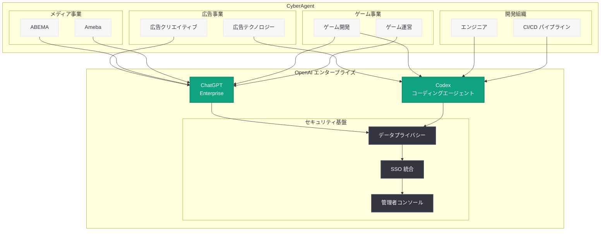

# CyberAgent が ChatGPT Enterprise と Codex で広告・メディア・ゲーム事業の AI 活用を加速

## メタデータ

| 項目 | 内容 |
|------|------|
| 発表日 | 2026-04-09 |
| ソース | OpenAI News/Blog |
| カテゴリ | B2B Story |
| 公式リンク | [openai.com/index/cyberagent](https://openai.com/index/cyberagent) |

> **注記:** 本レポートは、元記事が Cloudflare の保護により全文取得できなかったため、RSS フィードの説明文および CyberAgent に関する公開情報に基づいて作成されている。正確な詳細については [公式ページ](https://openai.com/index/cyberagent) を参照されたい。

## 概要

日本最大級のインターネット企業である CyberAgent (サイバーエージェント) が、ChatGPT Enterprise と Codex を活用して AI 導入をセキュアにスケールさせ、広告、メディア、ゲームの各事業領域において品質向上と意思決定の迅速化を実現した事例が OpenAI Blog で紹介された。

本事例は、OpenAI が 2026 年 4 月 8 日に発表した「The next phase of enterprise AI (エンタープライズ AI の次なるフェーズ)」の翌日に公開されたものであり、エンタープライズ戦略のグローバル展開を裏付ける重要な日本企業の導入事例として位置付けられる。ChatGPT の有料ビジネスユーザーが 900 万人を超え、Business および Enterprise での Codex ユーザーが 2026 年 1 月以降 6 倍に成長する中、日本市場における大規模エンタープライズ顧客として CyberAgent の事例は特に注目される。

## 主な内容

### CyberAgent の概要

CyberAgent (株式会社サイバーエージェント) は 1998 年に設立された日本最大級のインターネット企業であり、東京都渋谷区に本社を置く。東京証券取引所プライム市場 (証券コード: 4751) に上場しており、以下の 3 つの主要事業を展開している。

- **広告事業 (インターネット広告):** 日本最大のインターネット広告代理店として、デジタル広告テクノロジーと AI 駆動の広告最適化を専門とする。広告運用における AI 活用には長い歴史を持ち、自社開発の AI モデルも複数保有している
- **メディア事業:** インターネットテレビ「ABEMA」、ブログプラットフォーム「Ameba」をはじめとする各種メディアサービスを運営。コンテンツ制作からプラットフォーム運営まで幅広い領域を手掛ける
- **ゲーム事業:** Cygames をはじめとする子会社を通じてモバイルゲームの開発・運営を行っている。高品質なグラフィックスとゲームデザインに定評がある

CyberAgent は技術投資に積極的な企業として知られ、自社の AI 研究開発組織 (AI Lab など) を有し、大規模言語モデルの独自開発にも取り組んでいる。このような AI 先進企業が OpenAI の ChatGPT Enterprise と Codex を採用した点は、エンタープライズ AI プラットフォームとしての OpenAI の競争力を示すものである。

### ChatGPT Enterprise の活用

CyberAgent は ChatGPT Enterprise を導入し、広告、メディア、ゲームの各事業部門において全社的な AI 活用を推進している。RSS フィードの説明文に基づく主な活用領域は以下の通りである。

- **品質の向上 (Improve Quality):** 広告クリエイティブの品質改善、メディアコンテンツの制作支援、ゲーム開発における品質管理など、各事業領域でのアウトプット品質の向上に ChatGPT Enterprise を活用
- **意思決定の迅速化 (Accelerate Decisions):** 市場分析、競合分析、データに基づく意思決定の支援など、経営判断やビジネス判断のスピード向上に寄与
- **セキュアな AI 導入 (Securely Scale AI Adoption):** 上場企業として求められるセキュリティとコンプライアンスの要件を満たしながら、組織全体への AI 導入をスケール

#### 広告事業での活用想定

CyberAgent の広告事業は日本最大規模であり、ChatGPT Enterprise の活用が特に効果的と考えられる領域は以下の通りである。

- **広告コピーの生成と最適化:** 大量の広告クリエイティブを効率的に生成し、A/B テストを高速に回転
- **クライアント提案資料の作成:** 広告戦略の提案書や分析レポートの作成を効率化
- **市場トレンドの分析:** 大規模なデータを基にした市場トレンドの把握と戦略立案の支援
- **多言語対応:** グローバル展開における多言語広告クリエイティブの制作支援

#### メディア事業での活用想定

- **ABEMA のコンテンツ制作支援:** 番組企画、字幕生成、メタデータ管理などの効率化
- **Ameba ブログプラットフォームの運営支援:** コンテンツモデレーション、ユーザーサポートの効率化
- **データ分析と視聴者インサイト:** コンテンツのパフォーマンス分析と改善提案

#### ゲーム事業での活用想定

- **ゲームシナリオの制作支援:** ストーリー構成やキャラクター設定の草案作成
- **QA プロセスの効率化:** テストケースの生成やバグレポートの分析
- **ローカライゼーション:** 多言語対応の翻訳と文化的適応の支援

### Codex の活用

CyberAgent はソフトウェア開発エージェントである Codex も導入している。多数のエンジニアを擁する同社にとって、Codex の活用は開発効率の大幅な向上につながると期待される。

- **開発速度の向上:** 広告配信システム、メディアプラットフォーム、ゲームサーバーなど、多岐にわたるシステムの開発・保守における生産性向上
- **コードレビューの自動化:** 大規模な開発チームにおけるコードレビューの品質と速度の両立
- **技術的負債の解消:** レガシーコードのリファクタリングや最新化を Codex が支援
- **CI/CD パイプラインとの統合:** 自動テスト生成やビルドプロセスの効率化

CyberAgent はエンジニア組織の規模が大きく、広告テクノロジー、動画配信、ゲームエンジンなど高度な技術領域をカバーしている。Codex はこれらの多様な技術スタックにおいて開発者の生産性を向上させるツールとして活用されていると考えられる。

### セキュアな AI 導入

RSS フィードの説明文で「securely scale AI adoption」が強調されている点は、CyberAgent が AI 導入においてセキュリティを最重要視していることを示している。

- **データプライバシーの確保:** ChatGPT Enterprise のビジネスデータがモデルのトレーニングに使用されない保証は、広告クライアントの機密データや未公開のゲームコンテンツを扱う CyberAgent にとって必須要件
- **管理者コントロール:** 複数の事業部門にまたがる大規模な利用を一元的に管理し、利用ポリシーの統制を実現
- **SSO (シングルサインオン) 統合:** 既存の社内認証基盤との統合により、セキュアかつシームレスなアクセスを実現
- **コンプライアンス対応:** 上場企業 (TSE プライム) として求められるコーポレートガバナンスや個人情報保護法への準拠

### 導入効果

CyberAgent が ChatGPT Enterprise と Codex の導入により実現した効果は、RSS フィードの説明文に基づき以下のように整理される。

- **品質向上:** 広告クリエイティブ、メディアコンテンツ、ゲーム開発など各事業領域におけるアウトプットの品質が向上
- **意思決定の迅速化:** データ分析や市場調査の効率化により、ビジネス判断のスピードが加速
- **AI 導入のスケール:** セキュリティを確保しながら、広告、メディア、ゲームの全事業にわたって AI 活用を組織的に拡大
- **開発効率の改善:** Codex の活用により、ソフトウェア開発プロセス全体の生産性が向上

## 技術的な詳細

### ChatGPT Enterprise のエンタープライズ機能

CyberAgent が活用していると想定される ChatGPT Enterprise の主要な機能は以下の通りである。

| 機能 | 説明 |
|------|------|
| データプライバシー保護 | ビジネスデータがモデルの学習に使用されないことを保証 |
| 管理者コンソール | 組織全体の利用状況を可視化し、一元管理 |
| SSO 統合 | 既存の認証基盤 (SAML、OIDC) との統合 |
| 無制限アクセス | レート制限なしでの GPT-4o、推論モデルの利用 |
| カスタム GPTs | 事業部門ごとの業務に特化したカスタム GPT の作成 |
| SCIM プロビジョニング | ユーザーの自動プロビジョニングとデプロビジョニング |

### Codex のエンタープライズ機能

2026 年に入り Codex のエンタープライズ向け機能は急速に拡充されている。CyberAgent の開発チームが活用可能な主要機能は以下の通りである。

- **クラウドベースのコーディングエージェント:** サンドボックス環境でコード生成、テスト、レビューを自動実行
- **従量課金制 Codex 専用シート:** 2026 年 4 月 2 日に導入された柔軟な課金モデルにより、チームごとの導入コスト管理が容易
- **サブエージェント:** 複雑なタスクを分割して並列処理する機能
- **カスタムエージェント:** CyberAgent のコーディング規約やワークフローに適応するエージェント設定
- **Plugins と Automations:** 既存の CI/CD パイプラインやプロジェクト管理ツールとの統合

### アーキテクチャ概念図

## 開発者への影響

CyberAgent の事例は、日本の大規模テクノロジー企業における ChatGPT Enterprise と Codex の包括的な導入モデルとして、以下の示唆を提供する。

- **マルチ事業での AI 横展開モデル:** 広告、メディア、ゲームという異なる事業領域に ChatGPT Enterprise を横展開している CyberAgent の事例は、複数の事業部門を持つ企業にとって全社的な AI 導入の実践的な参考となる。事業ごとに異なるユースケースに対応しながら、統一的なガバナンスの下で AI 活用を推進するモデルは再現性が高い
- **AI 先進企業の OpenAI 採用:** CyberAgent は自社で大規模言語モデルを開発するなど AI 研究にも積極的な企業である。そのような企業が OpenAI の ChatGPT Enterprise と Codex を採用した事実は、自社開発と外部 AI プラットフォームの併用というハイブリッド戦略の有効性を示している
- **日本市場でのエンタープライズ AI 拡大:** Rakuten に続く日本の大規模企業の導入事例として、日本市場における OpenAI エンタープライズプロダクトの浸透が着実に進んでいることを示す。日本語での業務におけるChatGPT Enterprise の実用性が実証されつつある
- **広告テクノロジーと AI の融合:** デジタル広告業界における AI 活用の最前線として、ChatGPT Enterprise を広告クリエイティブの最適化や市場分析に活用する事例は、同業界の開発者にとって重要な参考事例となる
- **Codex のエンタープライズ活用拡大:** 2026 年 1 月以降 Business/Enterprise での Codex ユーザーが 6 倍に成長する中、CyberAgent の導入はこのトレンドを裏付ける事例であり、大規模開発組織における Codex の実用性を示している

## 関連リンク

- [CyberAgent moves faster with ChatGPT Enterprise and Codex (公式)](https://openai.com/index/cyberagent)
- [関連レポート: OpenAI、エンタープライズ AI の次なるフェーズを発表](2026-04-08-next-phase-of-enterprise-ai.md)
- [関連レポート: Rakuten が Codex で問題修復速度を 2 倍に向上](2026-03-11-rakuten-codex.md)
- [関連レポート: STADLER が ChatGPT でナレッジワークを変革](2026-03-27-stadler-chatgpt-knowledge-work.md)
- [関連レポート: Codex がチーム向けに柔軟な従量課金制を導入](2026-04-02-codex-flexible-pricing-for-teams.md)
- [ChatGPT Enterprise](https://openai.com/chatgpt/enterprise)
- [OpenAI Codex](https://openai.com/codex)
- [OpenAI News](https://openai.com/news)

## まとめ

日本最大級のインターネット企業である CyberAgent が、ChatGPT Enterprise と Codex を導入し、広告、メディア、ゲームの全事業にわたって AI 活用をセキュアにスケールさせた事例が OpenAI Blog で紹介された。品質向上、意思決定の迅速化、開発効率の改善といった具体的な成果は、多角的な事業を展開する大規模テクノロジー企業における ChatGPT Enterprise と Codex の実用的な価値を実証している。特に、自社で AI 研究開発を行う技術力の高い企業が OpenAI のエンタープライズプロダクトを採用した点は、自社開発と外部プラットフォームのハイブリッド活用という戦略の有効性を示すものである。Rakuten に続く日本の主要企業の導入事例として、OpenAI のエンタープライズ戦略がアジア太平洋地域で着実に浸透していることを裏付ける重要なケーススタディである。
