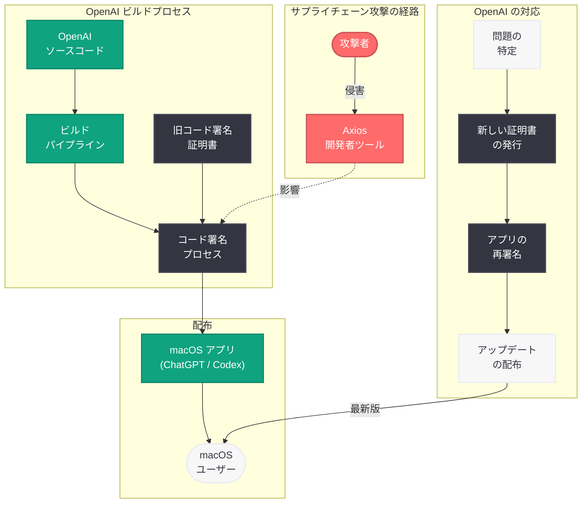

# OpenAI が Axios 開発者ツールのサプライチェーン攻撃に対応 -- macOS アプリのコード署名証明書をローテーション

## メタデータ

| 項目 | 内容 |
|------|------|
| 発表日 | 2026-04-10 |
| ソース | OpenAI News (Security) |
| カテゴリ | セキュリティ |
| 公式リンク | [Axios Developer Tool Compromise](https://openai.com/index/axios-developer-tool-compromise) |

> **注記:** 本レポートは、公式ブログ記事が Cloudflare のアクセス制限により全文取得できなかったため、公開されている概要情報および複数のニュースソースに基づいて作成されている。正確な詳細については公式ページを参照されたい。

## 概要

OpenAI は 2026 年 4 月 10 日、サードパーティ製開発者ツール「Axios」に関連するセキュリティ問題を特定し、これに対応したことを発表した。この問題は、OpenAI の macOS アプリケーション (ChatGPT および Codex) のコード署名プロセスで使用されていた Axios ツールにおけるサプライチェーン攻撃に起因するものである。

OpenAI は問題の特定後、直ちに macOS のコード署名証明書をローテーションし、影響を受けるすべての Mac アプリケーションを更新した。OpenAI は、ユーザーデータの侵害は確認されておらず、同社のシステムのセキュリティは維持されていることを確認している。ただし、万全を期すため、すべての macOS ユーザーに対して ChatGPT および Codex アプリの最新バージョンへのアップデートを推奨している。

## 主な内容

### インシデントの概要

今回のセキュリティインシデントは、OpenAI 自身のコードやインフラストラクチャに対する直接的な攻撃ではなく、ソフトウェアサプライチェーンにおけるサードパーティ製ツールの侵害 (サプライチェーン攻撃) である。具体的には、macOS アプリケーションのコード署名・証明プロセスで使用されていた「Axios」と呼ばれる開発者ツールにおいてセキュリティ上の問題が発見された。

サプライチェーン攻撃は、ソフトウェア開発プロセスの上流にある依存関係 (ライブラリ、ツール、サービスなど) を侵害することで、最終的な製品やサービスに間接的に影響を与える攻撃手法である。直接的なコードの改ざんではなく、開発・ビルド・配布プロセスの信頼されたコンポーネントを標的とするため、検出が困難であるという特徴がある。

### OpenAI の対応手順

OpenAI は以下の手順でインシデントに対応した。

1. **問題の特定:** Axios 開発者ツールにおけるセキュリティ上の脆弱性を発見・特定
2. **証明書のローテーション:** macOS アプリケーションに使用されていたコード署名証明書を新しい証明書に置き換え
3. **アプリケーションの更新:** 新しい証明書で署名された ChatGPT および Codex の macOS アプリケーションをリリース
4. **影響範囲の確認:** ユーザーデータへの侵害がないことを確認し、OpenAI のシステム全体のセキュリティが維持されていることを検証

### ユーザーデータへの影響

OpenAI は、今回のインシデントによるユーザーデータの漏洩や侵害は確認されていないと明言している。サプライチェーン上のツールに問題があったものの、OpenAI のシステム自体は安全な状態を維持しており、ユーザーの会話データ、アカウント情報、API キーなどへのアクセスは発生していないとされる。

### ユーザーへの推奨事項

OpenAI は「万全を期すため (out of an abundance of caution)」として、以下の対応をユーザーに推奨している。

- **ChatGPT macOS アプリ:** 最新バージョンへのアップデート
- **Codex macOS アプリ:** 最新バージョンへのアップデート

macOS 上で OpenAI のアプリケーションを使用しているユーザーは、App Store またはアプリ内の更新機能を通じて、速やかに最新バージョンに更新することが推奨される。

## 技術的な詳細

### サプライチェーン攻撃とは

サプライチェーン攻撃 (Supply Chain Attack) は、ソフトウェア開発ライフサイクルの中で使用されるサードパーティ製のコンポーネント、ツール、サービスを侵害することにより、最終的なソフトウェア製品に悪意のあるコードや脆弱性を注入する攻撃手法である。

サプライチェーン攻撃の主な特徴は以下の通りである。

| 特徴 | 説明 |
|------|------|
| 間接的な攻撃経路 | 標的のコードを直接改ざんするのではなく、依存関係を通じて間接的に影響を与える |
| 信頼関係の悪用 | 開発者が信頼しているツールやライブラリを介して攻撃を行う |
| 広範な影響 | 侵害されたコンポーネントを使用するすべてのソフトウェアが影響を受ける可能性がある |
| 検出の困難さ | 正規の開発プロセスの中で発生するため、通常のセキュリティ検査では検出しにくい |

近年のサプライチェーン攻撃の代表的な事例としては、SolarWinds 攻撃 (2020 年)、Codecov 攻撃 (2021 年)、Log4Shell 脆弱性 (2021 年) などがあり、ソフトウェア業界全体でサプライチェーンセキュリティへの関心が高まっている。

### macOS コード署名と証明書ローテーション

macOS のコード署名は、Apple のセキュリティフレームワークにおいて、アプリケーションの完全性と発行元の身元を保証するための重要なメカニズムである。

**コード署名の役割:**

- **発行元の認証:** アプリケーションが信頼された開発者によって作成されたことを証明
- **改ざん検知:** アプリケーションのバイナリが署名後に変更されていないことを保証
- **Gatekeeper 連携:** macOS の Gatekeeper 機能と連携し、信頼されたアプリケーションのみの実行を許可
- **Notarization:** Apple の公証 (Notarization) プロセスを通じて、マルウェアのスキャンと配布の承認を実施

**証明書ローテーションの手順:**

証明書のローテーションとは、既存のコード署名証明書を無効化し、新しい証明書を発行してアプリケーションを再署名するプロセスである。今回の OpenAI の対応では以下の手順が実行されたと考えられる。

1. **新しい証明書の発行:** Apple Developer Program を通じて新しいコード署名証明書を取得
2. **既存証明書の失効:** 侵害された可能性のある既存の証明書を失効 (Revoke) させる
3. **アプリケーションの再署名:** ChatGPT および Codex の macOS アプリケーションを新しい証明書で再署名
4. **再公証 (Re-Notarization):** Apple の公証プロセスを再度通過させ、配布の承認を取得
5. **アップデートの配布:** 更新されたアプリケーションをユーザーに配布

### サプライチェーン攻撃のフロー

### 影響範囲の整理

今回のインシデントの影響範囲を以下に整理する。

| 対象 | 影響 | 対応状況 |
|------|------|----------|
| macOS 版 ChatGPT アプリ | コード署名証明書のローテーションが必要 | 更新済み |
| macOS 版 Codex アプリ | コード署名証明書のローテーションが必要 | 更新済み |
| OpenAI API | 影響なし | -- |
| Web 版 ChatGPT | 影響なし | -- |
| iOS / Android アプリ | 影響なし | -- |
| Windows アプリ | 影響なし | -- |
| ユーザーデータ | 侵害なし | 確認済み |

## 開発者への影響

### macOS アプリ利用者への影響

今回のインシデントは、macOS 上で ChatGPT または Codex アプリケーションを使用しているすべてのユーザーに影響する。ただし、ユーザーデータの侵害は確認されていないため、必要な対応は最新バージョンへのアップデートのみである。

- **即座のアクション:** macOS 版 ChatGPT および Codex アプリを最新バージョンに更新する。App Store またはアプリ内の自動更新機能を使用して、新しい証明書で署名されたバージョンを取得する
- **API キーの確認:** 念のため、OpenAI API キーに不審な利用がないか確認することを推奨する。OpenAI はユーザーデータの侵害はないと確認しているが、セキュリティのベストプラクティスとして定期的な確認は有益である
- **古いバージョンの継続利用に関する注意:** 旧証明書で署名されたアプリケーションは、証明書の失効により将来的に macOS の Gatekeeper によってブロックされる可能性がある

### OpenAI API 開発者への影響

OpenAI API を直接使用している開発者への直接的な影響はない。今回のインシデントは macOS アプリケーションのコード署名プロセスに限定されており、API エンドポイント、認証メカニズム、データ処理パイプラインには影響がない。

### サプライチェーンセキュリティの教訓

本インシデントは、ソフトウェア開発におけるサプライチェーンセキュリティの重要性を改めて浮き彫りにしている。

- **依存関係の監査:** 使用しているサードパーティ製ツールやライブラリのセキュリティを定期的に監査することの重要性
- **SBOM (Software Bill of Materials) の管理:** ソフトウェア構成要素の一覧を管理し、脆弱性が発見された場合に迅速に影響範囲を特定できる体制の構築
- **証明書管理のベストプラクティス:** コード署名証明書の適切な管理、定期的なローテーション、およびインシデント発生時の迅速な対応手順の整備
- **ゼロトラストアーキテクチャの採用:** ビルドパイプラインにおいても、すべてのコンポーネントを検証するゼロトラストの原則を適用

## 関連リンク

- [Axios Developer Tool Compromise (原文)](https://openai.com/index/axios-developer-tool-compromise)
- [OpenAI Security](https://openai.com/security)
- [OpenAI Bug Bounty Program](https://openai.com/index/safety-bug-bounty)
- [OpenAI News](https://openai.com/news)
- [Apple Developer - Code Signing](https://developer.apple.com/support/code-signing/)
- [NIST - Software Supply Chain Security Guidance](https://www.nist.gov/itl/executive-order-14028-improving-nations-cybersecurity/software-supply-chain-security)

## まとめ

OpenAI は 2026 年 4 月 10 日、macOS アプリケーションのコード署名プロセスで使用されていたサードパーティ製開発者ツール「Axios」にサプライチェーン攻撃が発生したことを公表し、迅速な対応を行った。OpenAI は問題を特定後、直ちにコード署名証明書をローテーションし、ChatGPT および Codex の macOS アプリケーションを更新した。ユーザーデータの侵害は確認されておらず、OpenAI のシステムのセキュリティは維持されている。macOS ユーザーは万全を期すため最新バージョンへのアップデートが推奨される。本インシデントは OpenAI 自身のコードの脆弱性ではなく、サードパーティ製ツールを介したサプライチェーン攻撃であり、ソフトウェア開発における依存関係管理とサプライチェーンセキュリティの重要性を改めて示す事例となった。

> **免責事項:** 本レポートは、OpenAI の公式ブログ記事の概要情報および複数のニュースソースに基づいて構成されたものであり、記事の全文を確認した上での分析ではない。記事の実際の内容とは異なる可能性がある点にご留意いただきたい。
