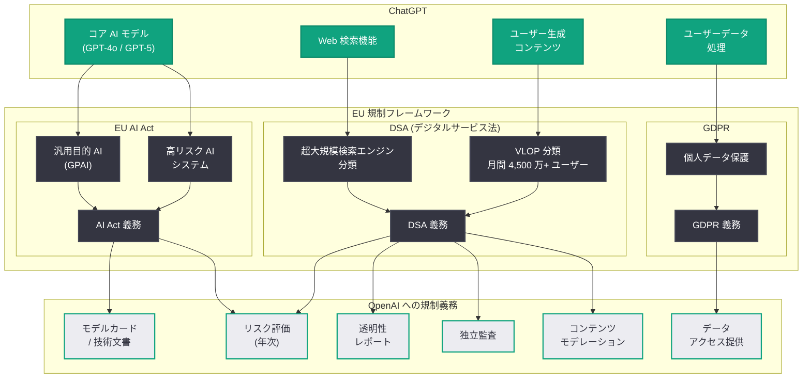
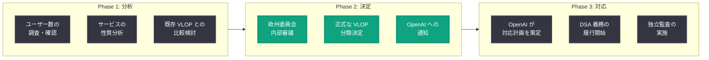

# EU が ChatGPT を DSA (デジタルサービス法) の「超大規模プラットフォーム」に分類検討 -- より厳格な規制へ

## メタデータ

| 項目 | 内容 |
|------|------|
| 発表日 | 2026-04-10 |
| ソース | 外部ニュース (Channel News Asia, Devdiscourse, Handelsblatt) |
| カテゴリ | 規制 / コンプライアンス |
| 公式リンク | N/A (外部報道) |

## 概要

2026 年 4 月 10 日、欧州委員会 (European Commission) が OpenAI の ChatGPT を EU デジタルサービス法 (Digital Services Act: DSA) における「超大規模オンラインプラットフォーム」(Very Large Online Platform: VLOP) または「超大規模検索エンジン」(Very Large Search Engine) に分類することを検討していることが明らかになった。ドイツの Handelsblatt 紙が最初に報じ、Channel News Asia や Devdiscourse など複数の国際メディアが追随して報道した。

この分類が実現すれば、ChatGPT は Google、Meta、X (旧 Twitter)、TikTok などと同列の規制対象となり、リスク評価の実施、透明性レポートの提出、外部監査の受け入れ、コンテンツモデレーション措置の導入など、DSA が定める厳格な義務を負うことになる。既に EU AI Act によって AI システムとしての規制を受けている ChatGPT に対し、DSA はプラットフォームレベルでの追加的な義務を課すものであり、AI 規制の新たな局面を示す重要な動きである。

## 主な内容

### DSA における VLOP 分類の意味

EU デジタルサービス法 (DSA) は、EU 域内で月間アクティブユーザーが 4,500 万人を超えるオンラインプラットフォームを「超大規模オンラインプラットフォーム」(VLOP) に分類し、より厳格な規制を課す枠組みである。ChatGPT のユーザー数は全世界で数十億規模に達しており、この閾値を大幅に超えていることは明白である。

VLOP に分類された場合、以下の義務が課される。

- **リスク評価の実施:** システムリスク (違法コンテンツの拡散、基本的権利への影響、選挙プロセスへの影響など) に関する年次リスク評価の実施と公表
- **透明性レポートの提出:** コンテンツモデレーションの実施状況、アルゴリズムの仕組み、広告に関する情報を含む詳細な透明性レポートの定期的な提出
- **独立監査の受け入れ:** 独立した第三者機関による年次監査の受け入れ
- **コンテンツモデレーション措置:** 違法コンテンツの迅速な削除、ユーザーへの通知、不服申し立てメカニズムの整備
- **アルゴリズムの透明性:** レコメンデーションシステムの仕組みに関する説明義務
- **危機対応プロトコル:** 公衆衛生上の危機や安全保障上の脅威に対する緊急対応メカニズムの整備

### ChatGPT が「検索エンジン」として分類される可能性

Channel News Asia の報道によると、ChatGPT は VLOP だけでなく「超大規模検索エンジン」としても分類される可能性がある。ChatGPT は 2023 年以降、Web 検索機能を統合しており、ユーザーがリアルタイムの情報を検索・取得できるようになっている。この検索機能の統合により、従来の検索エンジン (Google、Bing など) と同様の規制が適用される根拠が生まれている。

検索エンジンとしての分類が加わった場合、以下の追加義務が発生する可能性がある。

- 検索結果のランキングアルゴリズムに関する透明性の確保
- 検索結果における広告の明確な識別
- 検索インデックスに関するデータアクセスの提供

### 既存の EU 規制との関係

ChatGPT は既に複数の EU 規制の対象となっている。DSA の VLOP 分類が加わることで、規制の層がさらに厚くなる。

| 規制 | 対象 | ChatGPT への適用 |
|------|------|-----------------|
| EU AI Act | AI システム | 汎用目的 AI (GPAI) として規制対象。高リスク AI システムの要件が一部適用される可能性 |
| GDPR | 個人データの処理 | 既に適用済み。イタリアによる一時利用停止 (2023 年) の前例あり |
| DSA (VLOP 分類) | オンラインプラットフォーム | 検討中。プラットフォームレベルでのコンテンツモデレーション義務 |

### 検討の現状と今後の見通し

Devdiscourse の報道によると、VLOP 分類の決定はまだ最終的なものではない。欧州委員会は現在分析段階にあり、正式な分類決定に至るまでにはさらなる審議が必要とされる。しかし、複数のメディアが一斉に報じたことから、欧州委員会内部での議論がかなり進んでいることが推察される。

正式に分類された場合、OpenAI には DSA の各義務に対応するための準備期間が設けられるが、既に DSA が他のプラットフォームに対して積極的に執行されている状況を踏まえると、迅速な対応が求められる可能性が高い。

### 他プラットフォームの DSA 対応状況

DSA は既に複数の大手プラットフォームに対して適用・執行されている。これらの先行事例は、ChatGPT が VLOP に分類された場合に直面する規制の具体的な姿を示している。

| プラットフォーム | VLOP 分類時期 | 主な DSA 対応状況 |
|----------------|-------------|-----------------|
| Google (検索) | 2023 年 | 透明性レポートの提出、広告ラベリングの強化 |
| Meta (Facebook, Instagram) | 2023 年 | コンテンツモデレーション体制の強化、研究者向けデータアクセスの提供 |
| X (旧 Twitter) | 2023 年 | 欧州委員会による調査実施、コンプライアンス違反の指摘 |
| TikTok | 2023 年 | 未成年者保護措置の強化、アルゴリズム透明性の改善 |

## 技術的な詳細

### EU 規制フレームワークにおける ChatGPT の位置付け

ChatGPT は AI システムであると同時に、ユーザーが直接操作するプラットフォームであり、さらに検索機能も備えている。この多面的な性質により、複数の EU 規制が重畳的に適用される構造となっている。

### DSA VLOP 分類の判定フロー

欧州委員会が ChatGPT を VLOP として分類するまでのプロセスは以下の通りである。

## 開発者への影響

DSA の VLOP 分類は、ChatGPT を直接利用するエンドユーザーだけでなく、OpenAI API を利用して EU 向けサービスを構築している開発者にも間接的な影響を及ぼす可能性がある。

### API 利用に関する影響

- **コンテンツフィルタリングの強化:** DSA のコンテンツモデレーション義務に対応するため、OpenAI が API レベルでのコンテンツフィルタリングを強化する可能性がある。これにより、API レスポンスの内容や速度に影響が出る可能性がある
- **透明性要件の波及:** API を利用してエンドユーザー向けサービスを構築している開発者は、自身のサービスにおいても DSA の仲介サービス (intermediary service) としての義務が発生する可能性がある。特に EU 域内のユーザーにサービスを提供している場合、コンテンツモデレーションポリシーや不服申し立てメカニズムの整備が求められる場合がある
- **データ処理の変更:** リスク評価や監査への対応として、OpenAI が EU 向けのデータ処理方法を変更する可能性がある。API 利用者のログデータや利用統計に関するポリシーが更新される可能性がある

### EU 向けサービス構築時の考慮事項

- **利用規約の見直し:** OpenAI API の利用規約が DSA 対応により更新される可能性があるため、EU 向けサービスの法的基盤を定期的に確認する必要がある
- **コンプライアンスの連鎖:** API を通じてサービスを提供する開発者は、OpenAI のコンプライアンス対応と自社のコンプライアンス対応の両方を管理する必要がある。特に、エンドユーザーからの苦情処理フローの設計に注意が必要である
- **EU AI Act との二重規制:** 開発者が構築するサービスが「高リスク AI システム」に該当する場合、EU AI Act の義務と DSA の義務の両方に対応する必要がある。規制の重複に伴うコンプライアンスコストの増大を見込んでおく必要がある

### ビジネスへの影響

- **EU 市場での AI サービス提供コスト増:** 規制対応に伴うコストが OpenAI の料金体系に反映される可能性がある。EU 向けの API 利用料金が他地域と差異化される可能性も排除できない
- **サービスの可用性:** イタリアでの GDPR 関連の一時利用停止 (2023 年) の前例を踏まえると、規制違反が認定された場合にサービスの一時停止リスクがある。EU 向けサービスのバックアッププランを検討しておくことが推奨される
- **競争環境の変化:** DSA の規制強化は、EU 域内の AI プラットフォーム間の競争条件に影響を与える。コンプライアンスコストを負担できる大手プレイヤーと、中小規模の AI スタートアップとの間で競争格差が拡大する可能性がある

## 関連リンク

- [EU Digital Services Act (欧州委員会公式)](https://digital-strategy.ec.europa.eu/en/policies/digital-services-act-package)
- [EU AI Act (欧州委員会公式)](https://digital-strategy.ec.europa.eu/en/policies/regulatory-framework-ai)
- [関連レポート: OpenAI、エンタープライズ AI の次なるフェーズを発表](2026-04-08-next-phase-of-enterprise-ai.md)
- [関連レポート: 子どもの安全に関するブループリント](2026-04-08-introducing-child-safety-blueprint.md)
- [関連レポート: 日本における 10 代向け安全対策ブループリント](2026-03-17-japan-teen-safety-blueprint.md)
- [関連レポート: OpenAI Safety Fellowship](2026-04-06-openai-safety-fellowship.md)
- [OpenAI News](https://openai.com/news)

## まとめ

欧州委員会が ChatGPT を DSA の「超大規模オンラインプラットフォーム」(VLOP) または「超大規模検索エンジン」に分類することを検討しているという報道は、AI プラットフォームに対する EU 規制の新たな展開を示すものである。この分類が実現すれば、ChatGPT は既存の EU AI Act および GDPR に加え、DSA によるプラットフォームレベルの規制義務 (リスク評価、透明性レポート、独立監査、コンテンツモデレーション) を負うこととなり、三層の規制フレームワークの下に置かれることになる。決定はまだ最終段階には至っていないが、ChatGPT のユーザー数が VLOP の閾値 (月間 4,500 万人) を大幅に超えていることを踏まえると、分類の方向に進む蓋然性は高い。OpenAI API を利用して EU 向けサービスを構築している開発者は、コンテンツフィルタリングの強化、利用規約の変更、コンプライアンスコストの増大に備え、EU 規制動向を継続的にモニタリングすることが推奨される。
