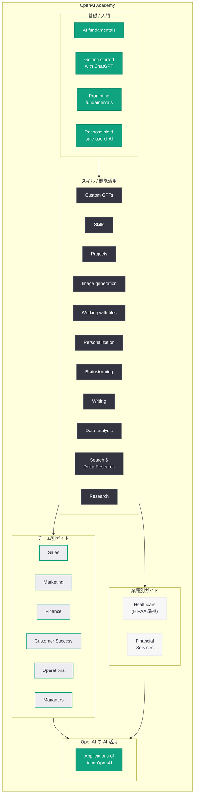

# OpenAI Academy を正式ローンチ -- 24 以上の教育リソースでチーム・業種別 AI 活用を支援

## メタデータ

| 項目 | 内容 |
|------|------|
| 発表日 | 2026-04-10 |
| ソース | OpenAI News/Blog |
| カテゴリ | プロダクト / 教育 |
| 公式リンク | [OpenAI Academy](https://openai.com/academy) |

## 概要

OpenAI は 2026 年 4 月 10 日、AI 活用スキルの習得を体系的に支援する教育プラットフォーム「OpenAI Academy」を正式にローンチした。ローンチ時点で 24 以上の教育リソースが同時公開されており、AI の基礎知識から ChatGPT の高度な活用法、営業・マーケティング・財務などのチーム別ガイド、さらにはヘルスケアや金融サービスといった業種別ガイドまで、幅広い学習コンテンツが網羅されている。

本発表は、OpenAI が教育分野を戦略的に重視していることを改めて示すものである。2026 年 3 月 4 日の AI 学習成果測定フレームワーク、3 月 5 日の AI 教育機会に関する記事、3 月 10 日の ChatGPT 数学・科学学習機能、3 月 17 日の日本における 10 代向け安全対策ブループリント、4 月 8 日の子どもの安全に関するブループリントに続く一連の教育・安全施策の延長線上に位置付けられる。また、4 月 8 日に発表されたエンタープライズ AI の次なるフェーズにおいて、組織全体での AI 導入加速が掲げられたことと密接に関連しており、Academy は企業・チームレベルでの AI リテラシー向上を支える基盤として機能する。

## 主な内容

### OpenAI Academy の位置付け

OpenAI Academy は、個人からチーム、組織全体に至るまで、あらゆるレベルの AI 学習ニーズに対応する包括的な教育プラットフォームである。AI の基礎概念を学ぶ初心者から、業務に特化した活用法を習得したいプロフェッショナルまで、段階的に学べるカリキュラム構成となっている。

主な特徴は以下の通りである。

- **体系的なカリキュラム:** 基礎から応用まで、段階的に学習を進められる構成
- **チーム別ガイド:** 営業、マーケティング、財務、カスタマーサクセス、オペレーション、マネージャー向けに特化したコンテンツ
- **業種別ガイド:** ヘルスケア、金融サービスなど、業界固有の要件に対応したガイド
- **実践的なスキル習得:** プロンプト設計、データ分析、画像生成、リサーチなど、即座に業務に活かせるスキルの学習

### 公開された教育リソース一覧

ローンチ時に公開された 24 以上のリソースは、以下の 5 つのカテゴリに分類される。

#### 基礎 / 入門 (Getting Started)

| リソース名 | 概要 | リンク |
|-----------|------|--------|
| AI fundamentals | AI とは何か、どのように機能するか、ChatGPT が大規模言語モデルをどう活用するかを学ぶ | [リンク](https://openai.com/academy/what-is-ai) |
| Getting started with ChatGPT | ChatGPT の基本的な使い方と操作方法を習得する | [リンク](https://openai.com/academy/getting-started) |
| Prompting fundamentals | 効果的なプロンプトの設計方法と基本原則を学ぶ | [リンク](https://openai.com/academy/prompting) |
| Responsible and safe use of AI | AI の責任ある安全な利用方法を理解する | [リンク](https://openai.com/academy/responsible-and-safe-use) |

#### スキル / 機能活用 (Skills & Features)

| リソース名 | 概要 | リンク |
|-----------|------|--------|
| Using custom GPTs | ワークフローの自動化、一貫した出力の維持にカスタム GPT を活用する | [リンク](https://openai.com/academy/custom-gpts) |
| Using skills | 再利用可能なワークフローの作成、繰り返しタスクの自動化を行う | [リンク](https://openai.com/academy/skills) |
| Using projects in ChatGPT | ChatGPT のプロジェクト機能を使った作業整理の方法を学ぶ | [リンク](https://openai.com/academy/projects) |
| Creating images with ChatGPT | ChatGPT を使った画像生成の手法とベストプラクティスを学ぶ | [リンク](https://openai.com/academy/image-generation) |
| Working with files in ChatGPT | ChatGPT でファイルを扱い、分析・編集する方法を学ぶ | [リンク](https://openai.com/academy/working-with-files) |
| Personalizing ChatGPT | ChatGPT を個人の好みや業務スタイルに合わせてカスタマイズする | [リンク](https://openai.com/academy/personalization) |
| Brainstorming with ChatGPT | ChatGPT を活用したアイデア発想とブレインストーミング手法を学ぶ | [リンク](https://openai.com/academy/brainstorming) |
| Writing with ChatGPT | ChatGPT を使った文章作成、編集、校正の技術を習得する | [リンク](https://openai.com/academy/writing) |
| Analyzing data with ChatGPT | ChatGPT を使ったデータ分析の手法とワークフローを学ぶ | [リンク](https://openai.com/academy/data-analysis) |
| Research with ChatGPT | ChatGPT の検索機能とディープリサーチを活用した調査手法を学ぶ | [リンク](https://openai.com/academy/search-and-deep-research) |
| ChatGPT for research | ChatGPT をリサーチツールとして活用する方法を学ぶ | [リンク](https://openai.com/academy/research) |

#### チーム別ガイド (Team-Specific Guides)

| リソース名 | 対象チーム | リンク |
|-----------|-----------|--------|
| ChatGPT for sales teams | 営業チーム | [リンク](https://openai.com/academy/sales) |
| ChatGPT for marketing teams | マーケティングチーム | [リンク](https://openai.com/academy/marketing) |
| ChatGPT for finance teams | 財務チーム | [リンク](https://openai.com/academy/finance) |
| ChatGPT for customer success teams | カスタマーサクセスチーム | [リンク](https://openai.com/academy/customer-success) |
| ChatGPT for operations teams | オペレーションチーム | [リンク](https://openai.com/academy/operations) |
| ChatGPT for managers | マネージャー | [リンク](https://openai.com/academy/managers) |

#### 業種別ガイド (Industry Guides)

| リソース名 | 業種 | 特徴 | リンク |
|-----------|------|------|--------|
| Healthcare | ヘルスケア | HIPAA 準拠の AI ツール活用法を含む | [リンク](https://openai.com/academy/healthcare) |
| Financial services | 金融サービス | 金融業界特有のコンプライアンス要件に対応 | [リンク](https://openai.com/academy/financial-services) |

#### OpenAI 自身の AI 活用事例 (Meta)

| リソース名 | 概要 | リンク |
|-----------|------|--------|
| Applications of AI at OpenAI | OpenAI 社内での AI 活用事例を紹介する | [リンク](https://openai.com/academy/applications-of-ai) |

### カテゴリ別の学習パス

Academy のコンテンツは、学習者のレベルや目的に応じた段階的な学習パスを提供するように設計されている。

1. **初心者パス:** AI fundamentals から Getting started、Prompting fundamentals へと進み、AI と ChatGPT の基本を理解する
2. **実務活用パス:** スキル / 機能活用カテゴリのリソースを通じて、画像生成、データ分析、リサーチなどの実践的スキルを習得する
3. **チーム導入パス:** チーム別ガイドを活用し、各部門の業務に最適化された AI 活用法を展開する
4. **業界特化パス:** 業種別ガイドにより、業界固有の規制やベストプラクティスに準拠した AI 活用を実現する

## 技術的な詳細

### Academy の構造とカテゴリ体系

OpenAI Academy のコンテンツは、基礎から応用、個人からチーム、汎用から業種特化へと段階的に広がる構造となっている。

### 組織における Academy 活用フロー

企業や組織が OpenAI Academy を活用して AI リテラシーを向上させるための典型的なフローは以下の通りである。

```mermaid
flowchart LR
    subgraph Phase1["Phase 1: 基礎理解"]
        F1["AI fundamentals"]
        F2["Getting started"]
        F3["Prompting"]
        F4["Responsible use"]
    end

    subgraph Phase2["Phase 2: スキル習得"]
        S1["Custom GPTs &<br/>Skills"]
        S2["Data analysis &<br/>Research"]
        S3["Image generation &<br/>Writing"]
    end

    subgraph Phase3["Phase 3: チーム展開"]
        T1["チーム別ガイドで<br/>部門別活用"]
        T2["業種別ガイドで<br/>コンプライアンス対応"]
    end

    subgraph Phase4["Phase 4: 全社定着"]
        O1["ChatGPT Enterprise<br/>全社導入"]
        O2["Codex 活用<br/>開発チーム"]
        O3["AI エージェント<br/>業務自動化"]
    end

    Phase1 --> Phase2 --> Phase3 --> Phase4

    classDef openai fill:#10A37F,stroke:#0D8A6A,stroke-width:2px,color:white
    classDef dark fill:#343541,stroke:#444654,stroke-width:2px,color:white
    classDef light fill:#F7F7F8,stroke:#ECECF1,stroke-width:2px,color:#343541

    class Phase1,Phase2,Phase3,Phase4 openai
    class F1,F2,F3,F4,S1,S2,S3 dark
    class T1,T2,O1,O2,O3 dark
```

### エンタープライズ戦略における Academy の位置付け

OpenAI Academy は、エンタープライズ AI 導入戦略の「教育基盤」として機能する。4 月 8 日に発表されたエンタープライズ AI の次なるフェーズでは、Frontier プラットフォーム、ChatGPT Enterprise、Codex、全社規模 AI エージェントの 4 つの柱が示されたが、Academy はこれらの製品を組織全体で効果的に活用するためのスキル基盤を提供する役割を担っている。

| エンタープライズ製品 | Academy での学習リソース |
|-------------------|----------------------|
| ChatGPT Enterprise | Getting started、Prompting、チーム別ガイド全般 |
| Custom GPTs / Skills | Using custom GPTs、Using skills |
| Codex | (今後の拡充が見込まれる) |
| Frontier プラットフォーム | (今後の拡充が見込まれる) |

## 開発者への影響

OpenAI Academy のローンチは、開発者およびビジネスユーザーに以下の影響をもたらす。

### チーム・組織レベルでの AI リテラシー向上

- **オンボーディングの効率化:** 新入社員や AI 初心者に対し、Academy の基礎リソースを使った体系的なオンボーディングプログラムを構築できる。AI fundamentals から Prompting fundamentals までの基礎カリキュラムは、組織全体の AI リテラシーのベースラインを揃えるのに有効である
- **部門別トレーニングの標準化:** チーム別ガイドにより、営業、マーケティング、財務、カスタマーサクセス、オペレーション、マネージャーの各部門が、自部門に最適化された AI 活用法を標準的なカリキュラムで学習できる
- **マネージャー向けの AI 戦略支援:** ChatGPT for managers ガイドは、AI の導入推進を担うマネージャーがチーム全体の AI 活用を効果的にリードするための知見を提供する

### 業種固有の要件への対応

- **ヘルスケア分野:** HIPAA 準拠の AI ツール活用法が明示されたガイドにより、医療機関や関連企業がコンプライアンスを維持しながら AI を導入するための具体的な指針が得られる
- **金融サービス分野:** 金融業界特有の規制要件やデータ取り扱いに配慮した AI 活用ガイドにより、金融機関が安全に AI を業務に組み込む道筋が示される
- **今後の業種拡張:** ローンチ時はヘルスケアと金融サービスの 2 業種であるが、今後の業種別ガイドの拡充が見込まれる。法律、教育、製造業など、規制やドメイン知識が重要な業界への展開が期待される

### 実務への即時適用

- **プロンプトエンジニアリングの基盤:** Prompting fundamentals は、API を利用する開発者にとってもプロンプト設計の基礎知識として有用である
- **Custom GPTs と Skills の活用:** カスタム GPT やスキル機能を活用したワークフロー自動化は、開発者が社内ツールを構築する際の参考となる
- **データ分析ワークフロー:** Analyzing data with ChatGPT のガイドは、ビジネスアナリストやデータサイエンティストが ChatGPT を日常的なデータ分析に組み込むための具体的な手法を提供する

### エンタープライズ導入との連携

- **ChatGPT Enterprise の導入促進:** Academy で学習した従業員が即座に ChatGPT Enterprise を活用できるようになるため、企業の AI 投資の ROI 向上に直結する
- **組織全体の AI 成熟度向上:** 全社規模 AI エージェントの効果的な活用には、組織全体の AI リテラシーが前提条件となる。Academy はその基盤を提供するものである
- **トレーニングコストの削減:** 外部研修やコンサルティングに依存していた AI 教育を、Academy の無料リソースで代替または補完できる可能性がある

## 関連リンク

- [OpenAI Academy (公式)](https://openai.com/academy)
- [関連レポート: ChatGPT に数学・科学のインタラクティブ学習機能が追加](2026-03-10-chatgpt-math-science-learning.md)
- [関連レポート: OpenAI、エンタープライズ AI の次なるフェーズを発表](2026-04-08-next-phase-of-enterprise-ai.md)
- [関連レポート: 日本における 10 代向け安全対策ブループリント](2026-03-17-japan-teen-safety-blueprint.md)
- [関連レポート: 子どもの安全に関するブループリント](2026-04-08-introducing-child-safety-blueprint.md)
- [関連レポート: AI 教育機会](2026-03-05-ai-education-opportunity.md)
- [OpenAI News](https://openai.com/news)

## まとめ

OpenAI Academy のローンチは、AI の民主化を推進する OpenAI の教育戦略における重要なマイルストーンである。24 以上の教育リソースが 5 つのカテゴリ (基礎 / 入門、スキル / 機能活用、チーム別ガイド、業種別ガイド、OpenAI の AI 活用事例) に体系化されており、AI 初心者から業務での高度な活用を目指すプロフェッショナルまで、幅広い学習者のニーズに対応している。特にチーム別ガイド (営業、マーケティング、財務、カスタマーサクセス、オペレーション、マネージャー) と業種別ガイド (ヘルスケア、金融サービス) の提供は、組織全体での AI 導入を加速させるうえで実践的な価値が高い。4 月 8 日に発表されたエンタープライズ AI の次なるフェーズにおいて、ChatGPT Enterprise の有料ビジネスユーザーが 900 万人を超えていることが示されたが、Academy はこうした急速に拡大するユーザーベースの AI リテラシーを底上げし、AI 投資の ROI を最大化するための教育基盤として機能する。今後、Codex や Frontier プラットフォーム向けのリソース拡充、および法律・教育・製造業など追加の業種別ガイドの公開が期待される。
