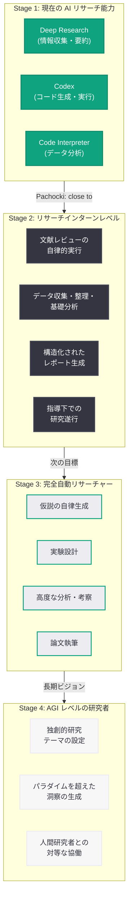

# OpenAI チーフサイエンティスト Pachocki が「AI は人間のリサーチインターンに匹敵する水準に近づいている」と発言

## メタデータ

| 項目 | 内容 |
|------|------|
| 発表日 | 2026-04-10 |
| ソース | 外部ニュース (Business Insider via MSN) |
| カテゴリ | 研究 / AI 能力 |
| 公式リンク | N/A (外部ニュース報道) |

## 概要

2026 年 4 月 10 日、Business Insider は OpenAI のチーフサイエンティストである Jakub Pachocki が「AI は人間のリサーチインターンと同等の能力に近づいている」と述べたことを報じた。Pachocki は直近の AI の進歩と能力について言及し、「I definitely see this as a signal that something here is on track (これは、ここで何かが正しい方向に進んでいるというシグナルだと確実に捉えている)」と語った。

この発言は、2026 年 3 月 20 日に MIT Technology Review が報じた OpenAI の「完全自動化されたリサーチャー」構想の延長線上にあるものであり、AI が研究タスクにおいて人間の補助的役割を実質的に担える段階に到達しつつあることを、同社のトップサイエンティスト自らが認めた点で注目に値する。OpenAI が掲げる AGI (汎用人工知能) への段階的アプローチにおいて、「リサーチインターン」レベルの達成は重要な中間マイルストーンと位置付けられる。

## 主な内容

### Pachocki の発言の背景と意味

Jakub Pachocki は OpenAI のチーフサイエンティストとして、同社の研究戦略全体を統括する立場にある。今回の「AI が人間のリサーチインターンに匹敵する水準に近づいている」という発言は、単なる楽観的な将来予測ではなく、社内で実際に観測されている AI の研究能力に基づく評価と考えられる。

Pachocki が述べた「I definitely see this as a signal that something here is on track」という言葉は、以下の点を示唆している。

- **実証的な根拠に基づく評価:** 「signal (シグナル)」という表現は、具体的な実験結果やベンチマークに基づいた評価であることを示唆する
- **段階的な進歩の確認:** 「on track (正しい方向に進んでいる)」という表現は、OpenAI が設定した研究ロードマップに沿って AI 能力が着実に向上していることを意味する
- **控えめながらも確信のある表明:** 「definitely (確実に)」と「close to (近づいている)」を組み合わせた表現は、まだ完全には達成していないが、到達が現実的な射程にあるという慎重な楽観主義を反映している

### 「リサーチインターン」レベルの AI とは

リサーチインターンとは、研究機関や大学において、指導教員の監督のもとで研究補助業務を行う初期段階の研究者を指す。AI がこのレベルに到達するということは、以下のような能力を備えることを意味する。

- **文献の読解と要約:** 学術論文や技術文書を読み、重要なポイントを正確に抽出・要約する能力
- **データの収集と整理:** 指示に基づいて必要なデータを収集し、分析可能な形式に整理する能力
- **基礎的な分析の実行:** 統計処理や基本的なデータ分析を適切な手法で実行する能力
- **指示に基づく研究遂行:** 明確な指示が与えられれば、一連の研究手順を自律的に実行する能力
- **レポートの作成:** 調査結果や分析結果を構造化されたレポートとしてまとめる能力

一方で、リサーチインターンレベルの AI には以下の制約が想定される。

- **独立した研究設計:** 新規の研究テーマを独自に設定し、革新的な研究計画を策定する能力はまだ限定的
- **高度な批判的思考:** 既存の研究に対する深い批判的分析や、パラダイムを超えた洞察の生成は発展途上
- **予測不能な状況への対応:** 想定外の実験結果や例外的なケースへの柔軟な対応は依然として課題

### 完全自動リサーチャー構想との関連

2026 年 3 月 20 日に MIT Technology Review が報じた [OpenAI の完全自動リサーチャー構想](2026-03-20-openai-automated-researcher.md) では、文献レビューから仮説生成、実験設計、データ分析、論文執筆に至るまで、研究プロセス全体を AI が自律的に遂行するシステムの実現が目指されていることが明らかにされた。また、SiliconANGLE は 3 月 16 日にこの機能を「AI リサーチインターン」と表現して報じている。

今回の Pachocki の発言は、この構想の進捗状況を裏付けるものである。完全自動リサーチャーの実現に向けたロードマップにおいて、「リサーチインターン」レベルは重要な中間段階として以下のように位置付けられる。

1. **現在の Deep Research:** ユーザーの質問に対して情報を検索・統合・要約する「情報収集型」のリサーチ
2. **リサーチインターンレベル (現在接近中):** 指導のもとで文献調査、データ収集、基礎分析、レポート作成を一貫して遂行できる「研究補助型」のリサーチ
3. **完全自動リサーチャー (将来目標):** 仮説生成から実験設計、データ分析、論文執筆まで自律的に遂行する「研究遂行型」のリサーチ

### OpenAI の研究トラジェクトリ

Pachocki の発言は、OpenAI が 2026 年に推進してきた一連の技術革新の文脈で捉える必要がある。

- **GPT-5.4 モデル (2026 年 3 月発表):** 科学的推論能力の大幅な強化が図られ、研究タスクにおけるパフォーマンスが飛躍的に向上した
- **Codex (コーディングエージェント):** ソフトウェア開発タスクの自律的実行を可能にしたエージェントであり、研究におけるコード実装・データ処理の自動化基盤となっている
- **Deep Research 機能:** ChatGPT に統合された多段階リサーチ機能であり、完全自動リサーチャーの技術的前身
- **Accelerating science with GPT-5 レポート (2026 年 3 月 18 日):** GPT-5 が科学研究の加速にどう貢献できるかを詳述した公式レポート

これらの技術的基盤の上に、AI のリサーチインターンレベルへの到達が実現しつつあるという構図である。

## 技術的な詳細

### AI 研究能力の進化ロードマップ

以下の図は、OpenAI が公に示唆してきた AI の研究能力の段階的進化を示すものである。Pachocki の発言は、現在の AI が Stage 2 に接近していることを示している。

### リサーチインターンレベルの能力要件

AI がリサーチインターンレベルの研究能力を達成するためには、以下の技術的要件が満たされる必要がある。

**長文脈理解と情報統合:** 学術論文は通常数十ページに及び、関連する複数の論文を横断的に理解する必要がある。コンテキストウィンドウの拡大とともに、複数の情報源から矛盾なく知識を統合する能力が不可欠である。

**科学的推論の正確性:** リサーチインターンには、基礎的な統計処理、実験結果の適切な解釈、論理的な推論チェーンの構築が求められる。AI モデルの推論能力の向上、特に Chain-of-Thought 推論の精度向上がこの要件を支える。

**ツール活用能力:** 実際の研究では、データベースの検索、スプレッドシートの操作、統計ソフトウェアの使用、可視化ツールの活用など、多様なツールの操作が必要となる。AI エージェントが外部ツールを適切に選択・操作する能力が鍵となる。

**指示の解釈と自律的実行:** リサーチインターンは、上位研究者からの抽象度の高い指示を解釈し、具体的な行動計画に落とし込んで実行する能力を持つ。AI がこの能力を持つためには、タスク分解、優先順位付け、進捗管理といったプランニング能力が求められる。

## 開発者への影響

### AI 支援型研究開発の加速

Pachocki の発言は、AI が研究補助の実用的なレベルに到達しつつあることを示しており、開発者や研究者にとって以下のような具体的な影響が想定される。

- **プロトタイピングの高速化:** AI がリサーチインターンレベルの文献調査やデータ収集を担うことで、開発者は先行研究の調査に費やす時間を大幅に削減し、実装やプロトタイピングに集中できるようになる
- **技術選定の効率化:** 新しい技術やフレームワークを採用する際の調査・比較分析を AI が補助することで、意思決定の速度と質が向上する
- **学術研究と実務の橋渡し:** AI が学術論文の知見を実装可能な形式に翻訳する能力を持つことで、最新の研究成果を実務に取り入れるサイクルが短縮される

### AI エージェント開発への示唆

リサーチインターンレベルの AI の実現は、AI エージェント開発の方向性にも重要な示唆を与える。

- **マルチステップタスクの信頼性向上:** リサーチインターンが行う一連の研究作業は典型的なマルチステップタスクであり、この領域での AI の成熟は、他の複雑なエージェントタスクにも応用可能な知見をもたらす
- **人間 - AI 協働モデルの確立:** リサーチインターンは上位研究者の指導のもとで働くモデルであり、AI エージェントと人間ユーザーの最適な協働パターンを確立するための参考モデルとなる
- **評価手法の発展:** AI の研究能力を「リサーチインターン」という人間の職能と比較する手法は、AI 能力の評価フレームワークとして他の領域にも拡張可能である

### 科学研究コミュニティへの影響

AI がリサーチインターンレベルに到達することは、科学研究のあり方そのものを変える可能性がある。

- **研究リソースの民主化:** 大学院生やリサーチインターンを雇用する予算がない研究室や小規模組織でも、AI を活用することで研究補助の恩恵を受けられるようになる
- **研究の再現性向上:** AI が体系的かつ一貫した手法でデータ収集・分析を行うことで、研究の再現性が向上する可能性がある
- **学際的研究の促進:** AI が複数の専門分野にまたがる文献を横断的に調査できるため、学際的な研究テーマの発見と推進が容易になる

### 競合環境と業界全体への波及

OpenAI のチーフサイエンティストがこのような発言をした事実は、競合各社にとっても AI 研究能力の基準を引き上げるものとなる。Anthropic、Google DeepMind、Meta AI をはじめとする各社が研究自動化の領域で競争を激化させることが予想され、結果として AI の研究支援能力の進化が業界全体で加速する可能性がある。

## 関連リンク

- [関連レポート: OpenAI が完全自動 AI リサーチャーの構築に全力投球](2026-03-20-openai-automated-researcher.md)
- [MIT Technology Review: "OpenAI is throwing everything into building a fully automated researcher"](https://www.technologyreview.com/)
- [SiliconANGLE: "OpenAI to launch ChatGPT superapp, 'AI research intern'"](https://siliconangle.com/)
- [OpenAI Blog: "Accelerating science with GPT-5" (2026-03-18)](https://openai.com/index/accelerating-science-gpt-5)
- [OpenAI Research](https://openai.com/research)

## まとめ

OpenAI のチーフサイエンティスト Jakub Pachocki が「AI は人間のリサーチインターンに匹敵する水準に近づいている」と述べたことは、AI の研究能力が実用的な段階に到達しつつあることを同社のトップサイエンティスト自らが認めた点で大きな意味を持つ。「I definitely see this as a signal that something here is on track」という発言は、具体的な成果に裏打ちされた慎重な楽観主義を反映しており、OpenAI の内部で AI の研究能力が着実に向上していることを示唆している。この発言は、2026 年 3 月に MIT Technology Review が報じた完全自動リサーチャー構想、SiliconANGLE が報じた AI リサーチインターンの製品化計画、そして GPT-5.4 モデルの発表や Codex の進化といった一連の技術的進展の文脈に位置付けられる。AI がリサーチインターンレベルに到達することは、完全自動リサーチャーへの道のりにおける重要な中間マイルストーンであり、研究リソースの民主化、研究ワークフローの効率化、学際的研究の促進といった広範な影響をもたらす可能性がある。開発者にとっては、AI 支援型の研究開発がより現実的な選択肢となり、プロトタイピングの高速化や技術選定の効率化が期待される。OpenAI が AGI への段階的アプローチにおいてこのマイルストーンを確認したことは、AI 研究自動化の領域全体に活気をもたらし、業界全体の技術競争を加速させる契機となるだろう。
