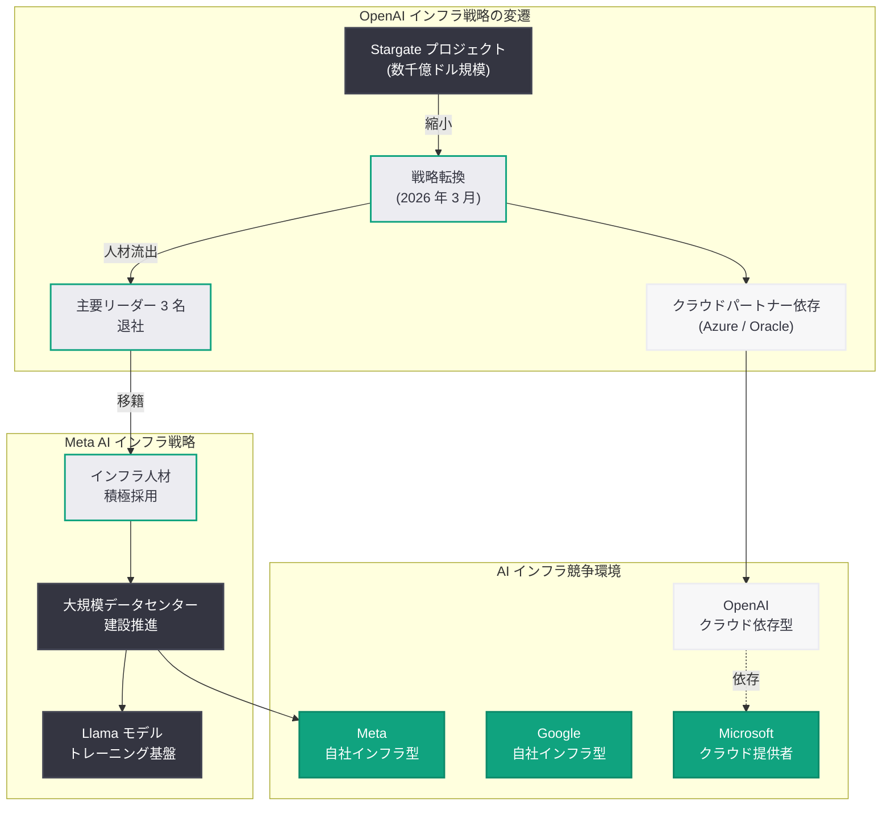

# OpenAI Stargate データセンター構想の主要リーダー 3 名が退社し Meta に移籍へ

## メタデータ

| 項目 | 内容 |
|------|------|
| 発表日 | 2026-04-10 |
| ソース | Bloomberg、The Information |
| カテゴリ | 企業ニュース / インフラ戦略 |
| 公式リンク | N/A (外部報道) |

## 概要

Bloomberg および The Information の報道によると、OpenAI の大規模データセンター構想「Stargate」プロジェクトの立ち上げに中心的な役割を果たした主要幹部 3 名が退社し、Meta Platforms Inc. に移籍する準備を進めていることが明らかになった。Bloomberg はこの 3 名を「数千億ドル規模の AI データセンター容量を構築する OpenAI の大規模な取り組みにおけるキープレイヤー」と表現しており、データセンターインフラ領域における重要な人材流出となる。

この動きは、OpenAI が近年経験している一連のリーダーシップ変動の中で最新のものであり、2026 年 3 月に報じられたデータセンター戦略の転換 (自社データセンター建設の縮小とクラウドパートナーへの依存強化) と密接に関連している。一方の Meta は AI インフラへの積極的な投資を加速しており、OpenAI から経験豊富なデータセンター専門家を獲得することで、自社の AI 基盤整備を一層強化する狙いがあるとみられる。

## 主な内容

### 退社する 3 名の位置付け

The Information が 2026 年 4 月 9 日に最初に報じ、Bloomberg が 4 月 10 日に追加報道したところによると、退社する 3 名はいずれも OpenAI の Stargate プロジェクトの初期段階から関与し、データセンターの設計・計画・建設に深く携わってきた幹部である。

- **Stargate プロジェクトの中核メンバー:** 数千億ドル規模の AI データセンター容量を確保するための戦略策定と実行を主導
- **データセンター専門知識の集中:** 大規模 AI インフラの構築・運用に関する実務的なノウハウを保有
- **組織的影響:** 3 名が同時期に退社することで、OpenAI のインフラチームに大きな空白が生じる可能性がある

### OpenAI のインフラ戦略変動との関連

今回の人材流出は、OpenAI のデータセンター戦略が大きく変化している時期に重なっている。

- **データセンター投資の縮小:** 2026 年 3 月 22 日に報じられた通り、OpenAI は IPO を前にデータセンターへの設備投資を大幅に縮小し、Microsoft Azure や Oracle Cloud などのクラウドパートナーへの依存度を高める方向に転換した
- **Stargate プロジェクトの位置付け変化:** SoftBank との合弁で進められてきた Stargate プロジェクトは、OpenAI の戦略転換に伴い、その規模や優先度が見直されている可能性がある
- **人材の流動化:** インフラ戦略の転換により、自社データセンター構築を推進してきた専門人材のキャリアパスが変化し、外部への流出が加速していると考えられる

### Meta の AI インフラ投資戦略

Meta Platforms は AI インフラへの大規模投資を積極的に推進しており、今回の人材獲得はその戦略の一環と位置付けられる。

- **積極的なデータセンター拡張:** Meta は自社 AI モデル (Llama シリーズなど) のトレーニングと推論のため、大規模なデータセンター建設を推進している
- **人材獲得競争:** AI インフラ分野における経験豊富な専門家は希少であり、Meta は OpenAI からの人材獲得を通じて即戦力を確保する狙いがある
- **競争優位の構築:** OpenAI の Stargate プロジェクトに携わった経験を持つ人材は、数千億ドル規模のインフラ計画を実行する上で極めて貴重な知見を有している

### OpenAI における相次ぐリーダーシップ変動

今回の退社は、OpenAI が近年経験している幹部の退社・異動の流れの中に位置付けられる。

- **CMO の退任:** 2026 年 4 月 3 日に Kate Rouch CMO が退任
- **プロダクトリーダーの退社:** 2026 年 4 月 3 日に Fidji Simo が OpenAI を離脱
- **継続的な組織変動:** 共同創業者や初期メンバーの退社が相次いでおり、組織の安定性に関する懸念が指摘されている
- **IPO 前の不確実性:** 2026 年内の IPO が見込まれる中、幹部の相次ぐ退社は投資家にとって懸念材料となりうる

## アーキテクチャ

## 開発者への影響

### 短期的な影響は限定的

今回の人材移動は主にデータセンターインフラの計画・建設レベルの話であり、OpenAI API の機能やサービスレベルに直ちに影響が出る可能性は低い。

- **API サービスの継続性:** OpenAI は既にクラウドパートナーへの依存を強化しており、自社データセンター担当者の退社が API の安定性に直接影響する局面は限定的である
- **モデル開発への影響:** データセンター構築チームとモデル開発チームは別組織であり、研究開発のペースへの直接的な影響は小さいと考えられる

### 中長期的な懸念

一方で、中長期的な視点では注意すべき点がある。

- **インフラの競争力:** 自社データセンター構築の専門知識が Meta に流出することで、OpenAI のインフラ面での競争力が相対的に低下する可能性がある
- **Meta の台頭:** Meta が AI インフラを強化することで、Llama モデルをはじめとするオープンソース AI エコシステムが一層強化され、OpenAI の商用 API との競争が激化する可能性がある
- **クラウド依存のリスク:** OpenAI がクラウドパートナーに依存する戦略を採る中、自社インフラの専門家を失うことは、将来的な戦略オプションの幅を狭める要因となりうる

## 関連リンク

- [Bloomberg: Three Key Players in OpenAI's Stargate Data Center Effort Depart for Meta](https://www.bloomberg.com/news/articles/2026-04-10/openai-stargate-data-center-leaders-depart-for-meta)
- [The Information: OpenAI Data Center Leaders Depart](https://www.theinformation.com/articles/openai-data-center-leaders-depart)
- [関連レポート: OpenAI、IPO を前にデータセンター投資を縮小し Nvidia 契約を見直し](./2026-03-22-openai-datacenter-pivot-nvidia-ipo.md)
- [関連レポート: OpenAI リーダーシップの変動 -- CMO Kate Rouch 退任](./2026-04-03-openai-cmo-kate-rouch-steps-down.md)
- [関連レポート: Fidji Simo が OpenAI を離脱](./2026-04-03-openai-leadership-shuffle-simo-leave.md)

## まとめ

OpenAI の Stargate データセンター構想を主導してきた主要リーダー 3 名が退社し Meta Platforms に移籍するという今回の報道は、AI インフラ分野における人材争奪戦の激化と、OpenAI のインフラ戦略転換がもたらす組織的影響を浮き彫りにしている。OpenAI は 2026 年 3 月にデータセンター投資の縮小とクラウドパートナーへのシフトを決定しており、自社データセンター構築を推進してきた専門人材にとってキャリアパスの変化が生じていたことが背景にあると考えられる。一方の Meta は AI インフラへの積極投資を続けており、OpenAI の Stargate プロジェクトで培われた知見を獲得することで、自社の大規模 AI 基盤整備を加速する狙いがある。OpenAI にとっては、CMO の退任や Fidji Simo の離脱に続く幹部流出であり、IPO を控えた時期における組織の安定性確保が一層重要な課題となっている。開発者にとって短期的な API サービスへの影響は限定的であるが、AI インフラの競争環境が大きく変動しつつある点には注目すべきである。
