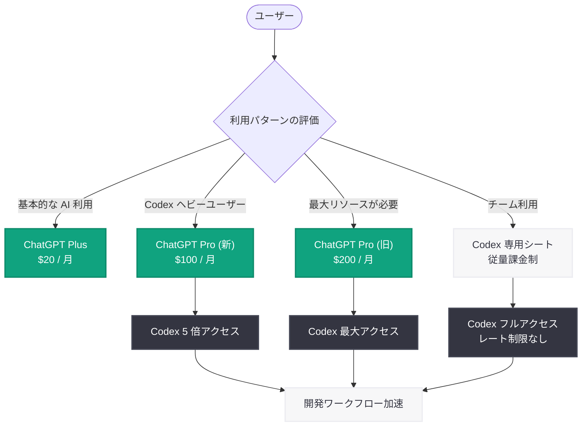

# OpenAI、月額 100 ドルの新 ChatGPT Pro プランを発表 -- Codex アクセス 5 倍で Claude Max に対抗

## メタデータ

| 項目 | 内容 |
|------|------|
| 発表日 | 2026-04-11 |
| ソース | 外部報道 (Engadget, Thurrott, Lifehacker, The Next Web, thelec.net) |
| カテゴリ | プロダクト / 料金体系 |
| 関連レポート | [Codex がチーム向けに柔軟な従量課金制を導入 (2026-04-02)](2026-04-02-codex-flexible-pricing-for-teams.md) |

## 概要

OpenAI は、ChatGPT の新しい月額 $100 の「Pro」プランを発表した。これまで月額 $200 で提供されていた Pro プランの価格を半額に引き下げるとともに、標準の Plus プランと比較して Codex へのアクセスを 5 倍に拡大するものである。本プランは、コーディングエージェント Codex を頻繁に利用するヘビーユーザーや開発者をターゲットとしており、より高いコンピューティングリソースと優先的な処理能力を提供する。

今回の価格改定は、Anthropic の Claude Max をはじめとする競合サービスへの対抗策として戦略的に位置付けられている。2026 年 4 月 2 日に発表された Codex のチーム向け従量課金制に続く施策であり、個人の開発者やヘビーユーザー向けに、Pro レベルの機能をより手頃な価格で提供する狙いがある。AI コーディングアシスタント市場における競争が激化するなか、OpenAI はプラン体系の再編と価格引き下げにより、ユーザー基盤の拡大を図っている。

## 主な内容

### 新 ChatGPT Pro プランの概要

月額 $100 の新 ChatGPT Pro プランは、従来の $200 プランの中核機能を半額で提供するものである。最大の特徴は Codex アクセスの大幅な強化であり、Plus プランと比較して 5 倍のコンピューティングリソースが割り当てられる。主な特徴は以下の通りである。

- **月額 $100 の価格設定:** 従来の $200 Pro プランから半額に引き下げ
- **Codex アクセス 5 倍:** 標準 Plus プランと比較して 5 倍の Codex 利用枠を提供
- **優先コンピューティング:** より高いコンピューティングリソースへの優先アクセス
- **ヘビーユーザー向け設計:** Codex を頻繁に利用する開発者やパワーユーザーに最適化

### 料金プランの再編

今回の発表により、ChatGPT の個人向けプラン体系が再編された。$200 の旧 Pro プランと $20 の Plus プランの間に $100 の新 Pro プランが挿入されることで、ユーザーは自身の利用頻度や必要なコンピューティングリソースに応じて、より適切なプランを選択できるようになった。

特に、Codex を業務の中核ツールとして活用しているが、$200 のフルスペック Pro プランまでは必要としないユーザー層にとって、$100 の新プランは最適な選択肢となる。

### 競合他社との比較

今回の価格改定は、Anthropic の Claude Max に対する直接的な競争戦略と位置付けられている。AI コーディングアシスタント市場では、以下のような競争構図が形成されている。

- **Anthropic Claude Max:** Claude の最上位プランとして、高度なコーディング支援を提供。OpenAI の新 Pro プランは、この価格帯で直接競合する
- **Google の AI コーディングツール:** Gemini を基盤としたコーディング支援機能の拡充を進めており、3 社間の競争が激化
- **OpenAI の差別化要因:** Codex エコシステム (Plugins、Automations) との統合や、2026 年 4 月 2 日に導入されたチーム向け従量課金制との組み合わせにより、個人からチームまで一貫した価格体系を構築

## 技術的な詳細

### 料金プランの比較

| プラン | 月額料金 | Codex アクセス | 対象ユーザー | 備考 |
|--------|---------|---------------|-------------|------|
| ChatGPT Plus | $20 | 標準 (1x) | 一般ユーザー | 基本的な AI アシスタント機能 |
| ChatGPT Pro (新) | $100 | 5 倍 (5x) | ヘビーユーザー / 開発者 | 今回の新設プラン |
| ChatGPT Pro (旧) | $200 | 最大 | パワーユーザー | 最上位の機能・リソース |

### 競合サービスとの価格帯比較

| サービス | プラン | 月額料金 | 特徴 |
|---------|--------|---------|------|
| OpenAI ChatGPT Pro (新) | Pro | $100 | Codex 5 倍アクセス |
| Anthropic Claude | Max | $100 | 高度なコーディング支援 |
| OpenAI ChatGPT Pro (旧) | Pro | $200 | 最上位リソース |

### プラン選択フロー

## 開発者への影響

今回の新 ChatGPT Pro プランの導入は、開発者に対して以下の重要な影響をもたらす。

- **コスト障壁の大幅低下:** 月額 $200 から $100 への価格引き下げにより、高度な Codex 機能への参入コストが半減した。Plus プラン ($20) では不足するが、旧 Pro プラン ($200) は予算的に厳しいという開発者層にとって、$100 の新プランは理想的な選択肢となる
- **Codex アクセスの 5 倍拡大:** 標準 Plus プランと比較して 5 倍の Codex 利用枠が提供されることで、大規模なコーディングタスクや頻繁な Codex 呼び出しを必要とする開発者のワークフローが大幅に改善される
- **チーム向け従量課金制との補完:** 2026 年 4 月 2 日に導入された Codex のチーム向け従量課金制と組み合わせることで、個人の開発者は新 Pro プランを利用し、チーム全体では従量課金制を採用するという柔軟な構成が可能となる
- **競争によるイノベーション加速:** Anthropic Claude Max との直接的な価格競争により、両社がより良い機能とより手頃な価格を追求する好循環が生まれる。開発者はより多くの選択肢と改善された機能の恩恵を受けることができる
- **段階的なスケーリングパス:** Plus ($20) から新 Pro ($100)、旧 Pro ($200)、さらにチーム向け従量課金制まで、段階的にスケールアップできるパスが整備されたことで、個人のサイドプロジェクトから本格的な業務利用への移行が円滑に行える

## 関連リンク

- [OpenAI has a new $100 ChatGPT Pro plan to better match up with Claude - Engadget](https://www.engadget.com/ai/openai-has-a-new-100-chatgpt-pro-plan-to-better-match-up-with-claude-165730573.html)
- [OpenAI Launches $100/Month ChatGPT Pro Plan For Heavy Codex Users - Thurrott](https://www.thurrott.com/ai/319971/openai-launches-100-month-chatgpt-pro-plan-for-heavy-codex-users)
- [OpenAI Just Cut ChatGPT Pro's Price in Half - Lifehacker](https://lifehacker.com/tech/openai-cuts-chatgpt-pro-price-in-half)
- [OpenAI's new $100 ChatGPT Pro plan targets Claude Max with five times the Codex access - The Next Web](https://thenextweb.com/news/openai-100-chatgpt-pro-plan-targets-claude-max-codex-access)
- [OpenAI Adds $100 Monthly Tier for Codex Coding Agent - thelec.net](https://www.thelec.net/news/openai-adds-100-monthly-tier-for-codex-coding-agent)
- [Codex がチーム向けに柔軟な従量課金制を導入 (2026-04-02)](2026-04-02-codex-flexible-pricing-for-teams.md)

## まとめ

OpenAI は、月額 $100 の新 ChatGPT Pro プランを発表し、従来の $200 Pro プランの価格を半額に引き下げた。新プランの最大の特徴は、標準 Plus プランと比較して 5 倍の Codex アクセスを提供する点であり、Codex を頻繁に利用するヘビーユーザーや開発者をターゲットとしている。この価格改定は、Anthropic の Claude Max に対する直接的な競争戦略として位置付けられており、AI コーディングアシスタント市場における価格競争の激化を象徴するものである。2026 年 4 月 2 日に発表された Codex のチーム向け従量課金制と合わせて、OpenAI は個人からチームまで、利用規模に応じた柔軟かつ手頃な価格体系を構築しつつある。開発者にとっては、高度な Codex 機能へのアクセスコストが大幅に低下し、Plus ($20) から新 Pro ($100)、旧 Pro ($200) への段階的なスケーリングパスが整備されたことが最大のメリットとなる。
