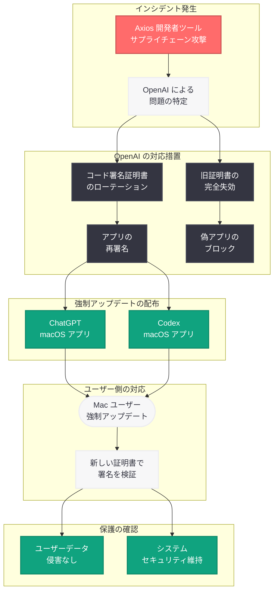

# OpenAI、Mac ユーザーに ChatGPT / Codex アプリの緊急アップデートを義務化 -- サードパーティツール経由のセキュリティインシデントに対応

## メタデータ

| 項目 | 内容 |
|------|------|
| 発表日 | 2026-04-11 |
| ソース | 9to5Mac / Reuters / Cybernews / Forbes |
| カテゴリ | セキュリティ / アプリケーション更新 |
| 公式リンク | [Axios Developer Tool Compromise](https://openai.com/index/axios-developer-tool-compromise) |

> **注記:** 本レポートは、複数の外部ニュースソース (9to5Mac、Reuters、Cybernews、Forbes 等) の報道に基づいて作成されている。OpenAI の公式ブログ記事は Cloudflare のアクセス制限により全文を取得できなかったため、正確な詳細については公式ページを参照されたい。

> **関連レポート:** 本レポートは、2026 年 4 月 10 日に報告された [Axios 開発者ツールのサプライチェーン攻撃に関するレポート](2026-04-10-axios-developer-tool-compromise.md) の続報である。前回のレポートではインシデントの技術的背景を中心に扱ったが、本レポートでは OpenAI が実施した対応措置と Mac ユーザーへの影響に焦点を当てる。

## 概要

OpenAI は 2026 年 4 月 11 日、サードパーティ製開発者ツールに関連するセキュリティ問題への対応として、すべての Mac ユーザーに対し ChatGPT および Codex アプリケーションの強制アップデートを実施した。9to5Mac の Zac Hall 記者による報道をはじめ、Reuters、Cybernews、Forbes など複数のメディアが一斉にこのニュースを取り上げた。OpenAI はユーザーデータへのアクセスは発生していないと公式に確認しているが、予防措置として全 Mac アプリの更新を義務化する異例の対応をとった。

この強制アップデートは、4 月 10 日に公表された Axios 開発者ツールのサプライチェーン攻撃 (詳細は[関連レポート](2026-04-10-axios-developer-tool-compromise.md)を参照) に対する具体的な remediation (修復) 措置である。OpenAI はコード署名証明書のローテーションに加え、偽の ChatGPT アプリをブロックする対策も実施しており、Mac ユーザーが旧バージョンのアプリケーションを使い続けることによるリスクを排除する姿勢を明確にしている。Forbes / Yahoo の報道 (4 月 12 日付) では「OpenAI Confirms Security Incident -- Mac Users Must Update All Apps Now」と題され、事態の緊急性が強調されている。

## 主な内容

### インシデントの時系列

今回のセキュリティインシデントと OpenAI の対応は、以下の時系列で進展した。

| 日付 | 出来事 |
|------|--------|
| 2026-04-10 | OpenAI が Axios 開発者ツールにおけるセキュリティ問題を公表。macOS コード署名証明書のローテーションを実施 |
| 2026-04-11 | OpenAI がすべての Mac アプリに対する強制アップデートを発動。9to5Mac、Reuters、Cybernews が報道 |
| 2026-04-12 | Forbes / Yahoo が「Mac Users Must Update All Apps Now」と報道。偽 ChatGPT アプリのブロック措置も確認される |
| 2026-04-12-13 | 複数のメディアが「偽 ChatGPT アプリのブロック」を含む包括的な対応策を報道 |

### 強制アップデートの内容

OpenAI が義務化した Mac アプリの強制アップデートには、以下の措置が含まれている。

1. **コード署名証明書の更新:** Axios ツールの侵害を受けて旧証明書を失効させ、新しい証明書で再署名されたアプリケーションへの置き換え
2. **ChatGPT macOS アプリの更新:** 新しいコード署名証明書で署名された最新バージョンへの移行
3. **Codex macOS アプリの更新:** 同様に新しい証明書で署名された最新バージョンへの移行
4. **偽アプリのブロック:** 旧証明書で署名された偽の ChatGPT アプリケーションが実行されないようブロック機構を導入

「推奨 (recommended)」ではなく「義務 (mandatory)」としてアップデートが位置づけられたことは、OpenAI がこのインシデントの潜在的リスクを深刻に捉えていることを示している。

### ユーザーデータへの影響

Reuters の報道によると、OpenAI はユーザーデータへのアクセスが発生していないことを公式に確認している。具体的には以下の点が確認されている。

- **会話データ:** ChatGPT でのユーザーの会話履歴は侵害されていない
- **アカウント情報:** ユーザーのアカウント認証情報は安全に保護されている
- **API キー:** OpenAI API キーへの不正アクセスは確認されていない
- **支払い情報:** 課金・支払い情報への影響はない

ただし、OpenAI は「万全を期すため (out of an abundance of caution)」という姿勢を維持しており、すべての Mac ユーザーに対してアプリケーションの即座の更新を求めている。

### 偽 ChatGPT アプリへの対策

4 月 12 日以降の報道では、OpenAI が偽の ChatGPT アプリケーションをブロックする措置を講じたことも明らかになっている。旧証明書で署名されたアプリケーションが悪意のある第三者によって改ざん・再配布されるリスクに対処するための措置であり、具体的には以下の対策が含まれると考えられる。

- **旧証明書の完全失効:** Apple の証明書失効リスト (CRL) および Online Certificate Status Protocol (OCSP) を通じて、旧証明書で署名されたすべてのバイナリを無効化
- **Gatekeeper との連携強化:** macOS の Gatekeeper 機能が旧証明書で署名されたアプリケーションの起動を自動的にブロック
- **ユーザーへの警告表示:** 旧バージョンのアプリを起動しようとした場合に、アップデートを促す警告メッセージを表示

## 技術的な詳細

### セキュリティ対応のフロー

OpenAI のインシデント対応からユーザーへの強制アップデートまでの全体的なフローを以下に示す。

### 強制アップデートの技術的メカニズム

macOS アプリケーションの強制アップデートを実現するための技術的なメカニズムは、複数のレイヤーで構成されている。

| レイヤー | メカニズム | 効果 |
|----------|------------|------|
| 証明書レイヤー | 旧証明書の失効 (Revocation) | CRL / OCSP により旧署名の検証が失敗する |
| OS レイヤー | macOS Gatekeeper | 旧証明書で署名されたアプリの起動をブロック |
| アプリレイヤー | アプリ内更新チェック | 起動時にバージョンチェックを行いアップデートを強制 |
| 配布レイヤー | App Store / 直接配布 | 最新バージョンのみをダウンロード可能にする |

### 旧バージョン利用時のリスク

旧バージョンの macOS アプリを使い続けた場合に想定されるリスクは以下の通りである。

1. **旧証明書の失効による起動不能:** macOS の Gatekeeper が旧証明書で署名されたアプリの起動をブロックするため、アップデートなしではアプリが使用できなくなる可能性がある
2. **偽アプリへの置き換えリスク:** 旧証明書の情報が悪用され、正規アプリに見せかけた偽アプリが配布される可能性がある
3. **将来的なセキュリティパッチの欠落:** 旧バージョンではセキュリティパッチが適用されないため、今後発見される脆弱性に対して無防備となる

## 開発者への影響

### Mac ユーザーへの即座の影響

macOS 上で ChatGPT または Codex アプリケーションを使用しているすべてのユーザーは、直ちに以下の対応を行う必要がある。

- **ChatGPT macOS アプリ:** 最新バージョンへのアップデートを即座に実行する。App Store またはアプリ内の更新機能を使用する
- **Codex macOS アプリ:** 同様に最新バージョンへのアップデートを即座に実行する
- **旧バージョンの削除:** アップデート後、旧バージョンのバイナリがシステムに残っていないことを確認する

### API 開発者への影響

OpenAI API を直接利用している開発者への直接的な影響はない。今回のインシデントは macOS アプリケーションのコード署名に限定されており、API エンドポイント、SDK、認証メカニズムには影響がない。ただし、以下の点に留意することを推奨する。

- **API キーの定期的な確認:** セキュリティのベストプラクティスとして、API キーの使用状況に不審な点がないか確認する
- **依存ライブラリの監査:** 自身のプロジェクトで使用しているサードパーティ製ライブラリのセキュリティ状況を確認する
- **Axios ライブラリのバージョン確認:** 自身のプロジェクトで Axios を使用している場合、最新の安全なバージョンを使用していることを確認する

### インシデント対応の教訓

OpenAI の今回の対応は、セキュリティインシデントにおける迅速かつ包括的な remediation の好事例として参考になる。

- **透明性の確保:** 問題の特定から公表、対応までのプロセスを迅速に公開した
- **予防的措置の徹底:** ユーザーデータの侵害が確認されていない段階でも、強制アップデートという強い措置を実施した
- **複数レイヤーでの対策:** 証明書のローテーション、偽アプリのブロック、ユーザーへの通知など多層的な対策を講じた

## 関連リンク

- [Axios Developer Tool Compromise (OpenAI 公式)](https://openai.com/index/axios-developer-tool-compromise)
- [関連レポート: OpenAI が Axios 開発者ツールのサプライチェーン攻撃に対応](2026-04-10-axios-developer-tool-compromise.md)
- [9to5Mac - OpenAI says to update Mac apps including ChatGPT and Codex as security precaution](https://9to5mac.com/2026/04/11/openai-says-to-update-mac-apps-including-chatgpt-and-codex-as-security-precaution/)
- [Reuters - OpenAI identifies security issue involving third-party tool](https://www.reuters.com/technology/)
- [Cybernews - OpenAI warns Mac users to update apps after third-party security issue](https://cybernews.com/)
- [Forbes - OpenAI Confirms Security Incident](https://www.forbes.com/sites/kateoflahertyuk/)
- [OpenAI Security](https://openai.com/security)
- [Apple Developer - Code Signing](https://developer.apple.com/support/code-signing/)

## まとめ

OpenAI は 2026 年 4 月 11 日、Axios 開発者ツールのサプライチェーン攻撃への対応として、すべての Mac ユーザーに対し ChatGPT および Codex アプリケーションの強制アップデートを義務化した。Reuters の報道によりユーザーデータへのアクセスは発生していないことが確認されているが、OpenAI は予防措置としてコード署名証明書のローテーション、旧証明書の失効、偽 ChatGPT アプリのブロックなど包括的な対策を実施した。macOS ユーザーは直ちにアプリケーションを最新バージョンに更新する必要がある。本インシデントは、4 月 10 日に公表されたサプライチェーン攻撃 (詳細は[関連レポート](2026-04-10-axios-developer-tool-compromise.md)を参照) に対する OpenAI の迅速かつ透明性の高いインシデントレスポンスを示す事例であり、セキュリティインシデント発生時における予防的措置の重要性を改めて浮き彫りにした。

> **免責事項:** 本レポートは、9to5Mac、Reuters、Cybernews、Forbes 等の外部ニュースソースに基づいて構成されたものであり、OpenAI の公式ブログ記事の全文を確認した上での分析ではない。記事の実際の内容とは異なる可能性がある点にご留意いただきたい。
