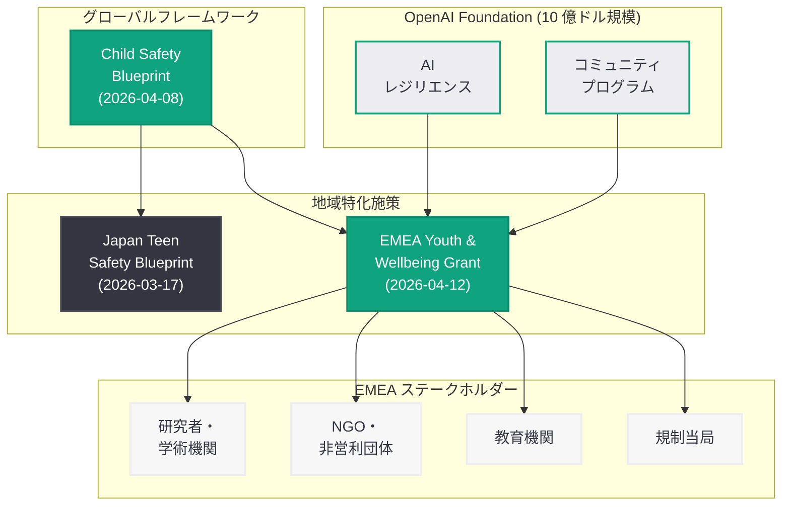

# OpenAI、EMEA 地域の若者の安全とウェルビーイングを支援する助成プログラムを発表

## メタデータ

| 項目 | 内容 |
|------|------|
| 発表日 | 2026-04-12 |
| ソース | OpenAI News (Global Affairs) |
| カテゴリ | グローバル / 安全性 / 社会貢献 |
| 公式リンク | [EMEA Youth and Wellbeing Grant](https://openai.com/index/emea-youth-and-wellbeing-grant/) |

> **注記:** 本レポートは、記事全文が Cloudflare のアクセス制限により取得できなかったため、OpenAI のサイトマップ情報 (lastmod: 2026-04-12)、関連する公式発表、OpenAI Foundation の助成活動に関する報道、および Child Safety Blueprint 等の既存施策に基づいて作成されている。正確な詳細については公式ページを参照されたい。

## 概要

OpenAI は 2026 年 4 月 12 日、EMEA (Europe, Middle East, and Africa: 欧州・中東・アフリカ) 地域における若者の安全とウェルビーイング (wellbeing) を支援するための助成プログラム「EMEA Youth and Wellbeing Grant」を発表した。本プログラムは、AI 技術が若者に与える影響に関する研究、安全な AI 利用環境の構築、およびデジタルウェルビーイングの促進を目的としており、EMEA 地域の研究者、非営利団体 (NGO)、教育機関などを対象に助成金を提供するものである。

この発表は、OpenAI Foundation が 2026 年 3 月 24 日に公表した 10 億ドル規模の社会投資計画の具体的な実行施策の一つとして位置づけられる。OpenAI は 2026 年 4 月 8 日に「Child Safety Blueprint」をグローバルフレームワークとして発表しており、本助成プログラムはその理念を EMEA 地域で実践に移すための資金的裏付けとなるものである。また、2026 年 3 月 17 日の「Japan Teen Safety Blueprint」に続く地域特化型の取り組みであり、OpenAI が各地域の規制環境や文化的背景に応じたきめ細かな安全施策を展開する姿勢を示している。

## 主な内容

### 助成プログラムの概要

EMEA Youth and Wellbeing Grant は、AI 時代における若者の安全とウェルビーイングの向上を目指す助成プログラムである。OpenAI Foundation のコミュニティプログラムおよび AI レジリエンスの重点分野に該当する取り組みとして、以下の領域を対象としていると考えられる。

| 領域 | 内容 | 期待される成果 |
|------|------|----------------|
| 研究助成 | AI が若者のメンタルヘルスやウェルビーイングに与える影響の調査研究 | エビデンスに基づく政策提言 |
| 安全対策 | オンライン上の若者保護に関する技術的・制度的ソリューションの開発 | 実装可能な保護メカニズム |
| 教育・啓発 | 若者および保護者向けの AI リテラシー・デジタルウェルビーイング教育 | AI リテラシーの向上 |
| コミュニティ支援 | 地域の NGO や教育機関による若者支援プログラムの強化 | 草の根レベルでの保護体制 |

### EMEA 地域への注力

EMEA 地域が助成対象として選定された背景には、以下の要因があると考えられる。

- **EU の先進的な規制環境:** EU AI Act (AI 規制法) や GDPR (一般データ保護規則) の子ども条項、Digital Services Act (DSA: デジタルサービス法) など、欧州は AI およびデジタルサービスに関する規制が世界で最も進んでいる地域の一つである。助成プログラムを通じて、これらの規制環境と連携した実践的な安全対策の研究・開発を支援することが期待される
- **多様な言語・文化的背景:** EMEA 地域は多数の言語と文化圏を包含しており、若者の AI 利用における安全対策も画一的なアプローチでは不十分である。地域の研究者や NGO と連携し、各国・各文化に適した安全施策を開発することが重要となる
- **デジタルデバイドへの対応:** アフリカや中東の一部地域では、AI 技術へのアクセスが急速に拡大する一方で、安全な利用環境の整備が追いついていない状況がある。助成プログラムを通じてこれらの地域における若者保護の基盤構築を支援する意義は大きい
- **UK の AI 安全性への取り組み:** 英国は AI Safety Institute (AISI) を設立するなど、AI 安全性に関する国際的なリーダーシップを発揮している。EMEA 地域への助成は、こうした既存の安全性への取り組みとの相乗効果が期待できる

### Child Safety Blueprint との連携

本助成プログラムは、2026 年 4 月 8 日に発表された Child Safety Blueprint のグローバルフレームワークを EMEA 地域で具体化するための重要な施策として位置づけられる。

### OpenAI Foundation の助成活動の拡大

本プログラムは、OpenAI Foundation が助成活動を本格的に拡大している時期に発表された。2026 年 4 月 9 日には Inside Philanthropy が「OpenAI Foundation Sheds More Light on Its Grantmaking」と報じており、同日にはアルツハイマー研究への資金提供も発表されている。EMEA Youth and Wellbeing Grant は、OpenAI Foundation が掲げる 4 つの重点分野のうち「コミュニティプログラム」と「AI レジリエンス」を横断する形で、若者の安全という社会的課題に具体的な資金を投じるものである。

- **2026 年 3 月 24 日:** OpenAI Foundation の 10 億ドル投資計画を発表
- **2026 年 4 月 8 日:** Child Safety Blueprint をグローバルフレームワークとして公開
- **2026 年 4 月 9 日:** 助成活動の詳細が報道、アルツハイマー研究への資金提供
- **2026 年 4 月 12 日:** EMEA Youth and Wellbeing Grant を発表

この一連の流れは、OpenAI Foundation が理念の表明から具体的な助成プログラムの実行へと移行していることを示しており、組織としての成熟度が高まっていると評価できる。

## 開発者への影響

EMEA Youth and Wellbeing Grant の発表は、EMEA 地域で AI アプリケーションを開発する企業や開発者に対して、以下のような影響を与える。

- **EMEA 地域における若者向け AI アプリの安全基準の明確化:** 助成プログラムを通じて蓄積されるエビデンスや知見が、EMEA 地域における若者向け AI アプリケーションの設計・開発に関するベストプラクティスとして整備されることが期待される
- **EU AI Act との整合性確保の支援:** EU AI Act では高リスク AI システムに対する厳格な要件が定められており、子ども向けサービスはその対象となる可能性が高い。助成プログラムの成果が、開発者のコンプライアンス対応を支援するリソースとなることが見込まれる
- **多言語・多文化対応の知見蓄積:** EMEA 地域の多様な言語・文化環境における若者保護の知見は、グローバルに展開する AI アプリケーションの安全設計に貢献する
- **研究者・NGO との連携機会:** 助成を受けた研究者や NGO との協力関係を通じて、開発者がユーザーの安全に関する最新の知見やフィードバックを得る機会が拡大する
- **gpt-oss-safeguard の EMEA 地域向け拡張:** 助成プログラムの成果を踏まえ、gpt-oss-safeguard に EMEA 地域の規制環境や文化的背景に対応したポリシーセットが追加される可能性がある
- **ウェルビーイング指標の確立:** 若者のデジタルウェルビーイングに関する定量的な指標が確立されることで、開発者がプロダクトの安全性をより客観的に評価できるようになることが期待される

## 関連リンク

- [EMEA Youth and Wellbeing Grant](https://openai.com/index/emea-youth-and-wellbeing-grant/)
- [Introducing the Child Safety Blueprint](https://openai.com/index/introducing-child-safety-blueprint)
- [Japan Teen Safety Blueprint](https://openai.com/index/japan-teen-safety-blueprint/)
- [Helping developers build safer AI experiences for teens (gpt-oss-safeguard)](https://openai.com/index/teen-safety-policies-gpt-oss-safeguard)
- [Update on the OpenAI Foundation](https://openai.com/index/update-on-the-openai-foundation)
- [OpenAI Safety](https://openai.com/safety)
- [OpenAI News](https://openai.com/news)

### 関連レポート

- [Child Safety Blueprint レポート](./2026-04-08-introducing-child-safety-blueprint.md)
- [Japan Teen Safety Blueprint レポート](./2026-03-17-japan-teen-safety-blueprint.md)
- [OpenAI Foundation 最新情報レポート](./2026-03-24-update-on-the-openai-foundation.md)

## まとめ

OpenAI が発表した「EMEA Youth and Wellbeing Grant」は、EMEA 地域における若者の安全とデジタルウェルビーイングの向上を目的とした助成プログラムである。OpenAI Foundation の 10 億ドル規模の社会投資計画および Child Safety Blueprint のグローバルフレームワークを基盤に、EMEA 地域の研究者、NGO、教育機関との連携を通じて、AI 時代における若者保護の実践的な取り組みを推進するものである。EU AI Act や GDPR といった先進的な規制環境との整合性を確保しつつ、多様な言語・文化的背景を持つ EMEA 地域に適した安全施策を開発する点に本プログラムの意義がある。Japan Teen Safety Blueprint に続く地域特化型の取り組みとして、OpenAI が責任ある AI 展開をグローバルに推進する姿勢を改めて示したものと評価できる。

> **免責事項:** 本レポートは OpenAI のサイトマップ情報、関連する公式発表、OpenAI Foundation の助成活動に関する報道、および既存の Child Safety Blueprint や Teen Safety Blueprint に関する情報に基づいて構成されたものであり、記事の全文を確認した上での分析ではない。記事の実際の内容とは異なる可能性がある点にご留意いただきたい。
