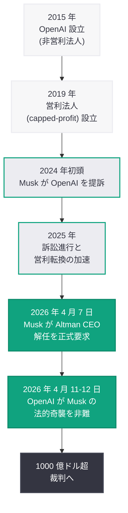
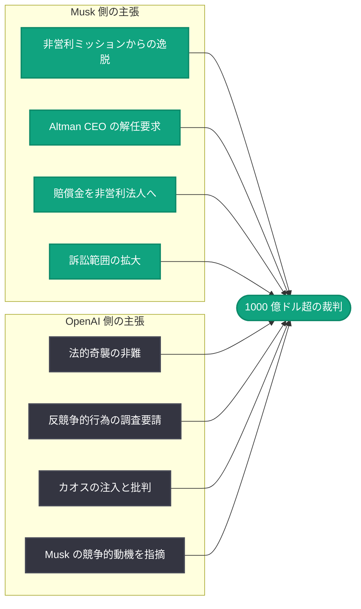

# OpenAI、Musk の「法的奇襲」を非難 -- 1000 億ドル規模の裁判を前に反競争的行為の調査を要請

## メタデータ

| 項目 | 内容 |
|------|------|
| 発表日 | 2026-04-12 |
| ソース | 外部ニュース (Bloomberg, Engadget, Financial Times, Gizmodo, TipRanks, MSN) |
| カテゴリ | 企業 / 法務 |
| 公式リンク | N/A (外部報道) |

## 概要

OpenAI は、1000 億ドル超の賠償規模が見込まれる裁判を目前に控え、Elon Musk が「法的奇襲 (legal ambush)」を仕掛けていると正式に非難した。Bloomberg が 4 月 11 日に報じたところによると、OpenAI は裁判所に対し Musk の訴訟戦略が意図的に手続きを混乱させるものであると訴え、さらに Musk の「反競争的行為 (anti-competitive behavior)」に対する調査を要請している。Gizmodo は OpenAI が Musk の行動を「カオスの注入 (injecting chaos)」と表現したと報じており、双方の対立は裁判直前にして一段と激化している。

本件は、2026 年 4 月 7 日に報じられた Musk による Sam Altman CEO 解任要求の続報にあたる。Financial Times は 4 月 12 日付で、Musk が OpenAI との法廷対決を前に「連敗 (legal losing streak)」を喫していると報じた。一方、TipRanks は本訴訟の範囲拡大が Microsoft にも影響を及ぼす可能性があると指摘しており、裁判の行方は OpenAI の IPO 計画や企業構造のみならず、AI 業界全体のパワーバランスに重大な影響を与えうる局面を迎えている。

## 主な内容

### OpenAI が Musk の「法的奇襲」を正式に非難

Bloomberg (4 月 11 日) および Engadget (4 月 12 日) の報道によると、OpenAI は裁判所に提出した書面の中で、Musk が裁判直前に訴訟戦略を大幅に変更し「法的奇襲」を仕掛けていると主張した。具体的には、Musk が訴訟の論点や請求内容を土壇場で拡大し、OpenAI の防御準備を妨害する意図があると OpenAI 側は訴えている。

Engadget は「OpenAI says Elon Musk is orchestrating a last-minute 'legal ambush' before trial」と題する記事で、Musk の戦略が裁判の公正な進行を阻害するものであるとする OpenAI の主張を詳報した。OpenAI は、Musk 側が裁判の焦点をずらし、訴訟コストを増大させることで OpenAI に不利な状況を作り出そうとしていると主張している。

### 反競争的行為の調査要請

複数の MSN ソース (4 月 12 日-13 日) によると、OpenAI は裁判所に対し Musk の「反競争的行為」に関する調査を正式に要請した。OpenAI の主張の核心は、Musk が xAI の創業者兼 CEO として OpenAI の直接的な競合企業を率いている立場にありながら、訴訟を通じて OpenAI の事業運営を妨害し、競争上の優位を得ようとしているという点にある。

この調査要請は、Musk の訴訟が表面上は「非営利ミッションの防衛」を掲げながらも、実質的には競争的動機に基づくものであるとする OpenAI 側の主張を裏付ける法的戦略の一環と見られる。

### 「カオスの注入」-- Musk の訴訟戦術への批判

Gizmodo (4 月 12 日) は「OpenAI Says Elon Musk Is 'Injecting Chaos' with Recent Legal Maneuver」と報じ、OpenAI が Musk の法的手続きを「カオスの注入」と形容したことを伝えた。OpenAI は、Musk が裁判の焦点を意図的にぼかし、メディアの注目を集めることで裁判外での圧力を強めようとしていると主張している。

この表現は、OpenAI が Musk の法的戦術を単なる訴訟上の争いではなく、組織的かつ戦略的な妨害行為として位置づけようとしていることを示している。

### Musk の「連敗」と裁判の行方

Financial Times (4 月 12 日) は「Elon Musk hits legal losing streak ahead of showdown with OpenAI's Sam Altman」と題し、Musk が OpenAI との裁判を前に複数の法的手続きで不利な結果を受けていると報じた。この「連敗」は、Musk の訴訟戦略の有効性に疑問を投げかけるものであり、裁判本番に向けた Musk 側のモメンタムに影響を与える可能性がある。

一方で、裁判の賠償規模が 1000 億ドルを超えるとされている点は、本件が AI 業界史上最大級の法的紛争であることを示しており、裁判の結果次第では OpenAI の企業構造やビジネスモデルに根本的な変更が求められる可能性がある。

### Microsoft への波及効果

TipRanks (4 月 12 日) は「OpenAI Calls Musk Move 'Legal Ambush' as Lawsuit Shift Raises Stakes for Microsoft (MSFT)」と報じ、訴訟範囲の拡大が OpenAI の最大の投資家兼パートナーである Microsoft にも影響を及ぼす可能性を指摘した。

Microsoft は OpenAI に対して数十億ドル規模の投資を行い、Azure を通じた OpenAI モデルの提供や Copilot 製品群への統合など、事業上の深い関係を構築している。訴訟の結果が OpenAI の企業構造や営利転換に影響を与えた場合、Microsoft の投資価値や事業提携の条件にも波及する可能性がある。

### 訴訟の経緯とエスカレーション

### 双方の主張の構図 (最新版)

## 開発者への影響

本件は法的紛争であり、OpenAI の API やサービスに直接的な技術的変更をもたらすものではないが、OpenAI エコシステムに依存する開発者にとって以下の点で重要な意味を持つ。

- **OpenAI の企業構造への影響:** 裁判の結果次第では、OpenAI の営利転換や企業構造に重大な変更が求められる可能性がある。開発者は、利用規約やライセンス条件が将来的に変更されるリスクを認識しておく必要がある
- **IPO 計画への不確実性:** 訴訟の長期化や不利な判決は、OpenAI の IPO スケジュールに影響を及ぼす可能性がある。IPO は OpenAI の資金調達能力と事業拡大計画に直結しており、結果としてサービスの拡充や新機能のリリーススケジュールにも間接的な影響を及ぼしうる
- **Microsoft パートナーシップの安定性:** Microsoft が訴訟の影響を受けた場合、Azure OpenAI Service や Copilot 製品群を通じて OpenAI の技術を利用している企業や開発者にも波及効果が生じる可能性がある
- **API 価格やサービス条件の変動リスク:** 1000 億ドル超の賠償が命じられた場合、OpenAI の財務状況に深刻な影響を与え、API 価格体系やサービス提供条件に変更が生じる可能性がある
- **競合エコシステムへの分散の検討:** 訴訟リスクを考慮し、OpenAI のみに依存せず、Anthropic、Google、Mistral など複数のプロバイダーを活用するマルチプロバイダー戦略の重要性が改めて浮き彫りとなっている

## 関連リンク

- [Bloomberg: OpenAI Accuses Musk of 'Ambush' as $100 Billion-Plus Trial Looms](https://www.bloomberg.com/news/articles/2026-04-11/openai-accuses-musk-of-ambush-as-100-billion-plus-trial-looms)
- [Engadget: OpenAI says Elon Musk is orchestrating a last-minute 'legal ambush' before trial](https://www.engadget.com/)
- [Financial Times: Elon Musk hits legal losing streak ahead of showdown with OpenAI's Sam Altman](https://www.ft.com/)
- [Gizmodo: OpenAI Says Elon Musk Is 'Injecting Chaos' with Recent Legal Maneuver](https://gizmodo.com/)
- [TipRanks: OpenAI Calls Musk Move 'Legal Ambush' as Lawsuit Shift Raises Stakes for Microsoft](https://www.tipranks.com/)
- [前回のレポート: Musk が OpenAI 訴訟で Altman CEO 解任を要求](2026-04-07-musk-seeks-altman-ouster.md)

## まとめ

OpenAI は、1000 億ドル超の賠償が見込まれる裁判の直前に Elon Musk が「法的奇襲」を仕掛けていると正式に非難し、裁判所に対して Musk の「反競争的行為」の調査を要請した。OpenAI は Musk の行動を「カオスの注入」と表現し、xAI を率いる Musk が競争的動機に基づいて訴訟を利用していると主張している。Financial Times は Musk が裁判前に「連敗」を喫していると報じる一方、TipRanks は訴訟範囲の拡大が Microsoft にも波及する可能性を指摘した。4 月 7 日の Altman CEO 解任要求から僅か数日で事態はさらにエスカレートしており、AI 業界史上最大級のこの法的紛争の行方は、OpenAI の企業構造、IPO 計画、Microsoft とのパートナーシップ、そして AI 業界全体の競争構造に広範な影響を及ぼす可能性がある。
