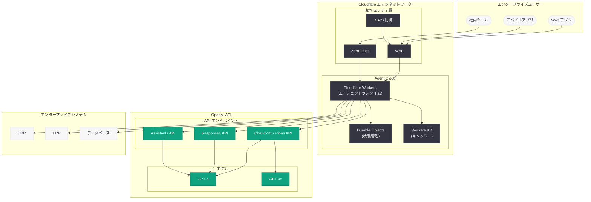
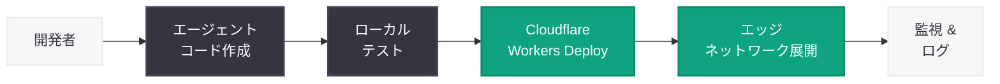

# エンタープライズが Cloudflare Agent Cloud と OpenAI でエージェントワークフローを実現

## メタデータ

| 項目 | 内容 |
|------|------|
| 発表日 | 2026-04-13 |
| ソース | OpenAI News/Blog |
| カテゴリ | パートナーシップ / エンタープライズ |
| 公式リンク | [Enterprises power agentic workflows in Cloudflare Agent Cloud with OpenAI](https://openai.com/index/enterprises-power-agentic-workflows-cloudflare-agent-cloud/) |

## 概要

OpenAI は 2026 年 4 月 13 日、Cloudflare との提携による「Cloudflare Agent Cloud」を発表した。本パートナーシップにより、エンタープライズ企業は Cloudflare のグローバルなエッジコンピューティングインフラストラクチャ上で、OpenAI のモデルを活用したエージェント型 AI ワークフローを構築・デプロイできるようになる。Cloudflare Agent Cloud は、AI エージェントが複雑なタスクを自律的に遂行するためのプラットフォームであり、Cloudflare の低レイテンシなエッジネットワークと OpenAI の API (Chat Completions、Responses API、Assistants API) を統合する。

本発表は、OpenAI のエンタープライズ AI 戦略における重要な進展である。2026 年 4 月 8 日に発表された「エンタープライズ AI の次なるフェーズ」で示された全社規模 AI エージェントのビジョンを具体化するものであり、Codex エージェントインフラストラクチャや Responses API といった既存の技術基盤を補完する形で、エンタープライズ向けのエージェントデプロイメントの選択肢を大幅に拡充する。Cloudflare が世界 300 以上の都市に展開するエッジネットワークを活用することで、エージェントの応答速度とスケーラビリティにおいて、従来のクラウドベースの AI デプロイメントとは一線を画す性能が期待される。

## 主な内容

### Cloudflare Agent Cloud の概要

Cloudflare Agent Cloud は、エンタープライズ企業が AI エージェントを構築、テスト、デプロイするための統合プラットフォームである。Cloudflare Workers をベースとしたサーバーレスアーキテクチャを採用しており、開発者はインフラストラクチャの管理を意識することなく、エージェントのロジックに集中できる。

- **サーバーレスエージェントホスティング:** Cloudflare Workers 上でエージェントが実行され、スケーリングは自動的に処理される
- **エッジ実行:** 世界 300 以上のデータセンターでエージェントが実行されるため、エンドユーザーに最も近いロケーションで低レイテンシな応答を実現
- **Durable Objects 統合:** Cloudflare の Durable Objects を活用し、エージェントの状態管理とセッション永続化を実現
- **セキュリティ:** Cloudflare の WAF、DDoS 防御、Zero Trust アクセス制御がエージェントの保護に適用される

### OpenAI API との統合

Cloudflare Agent Cloud は、OpenAI の主要な API と深く統合されている。エンタープライズ企業は、用途に応じて最適な API を選択し、エージェントワークフローに組み込むことができる。

- **Chat Completions API:** 会話型エージェントの構築に使用。マルチターンの対話を通じてユーザーの意図を理解し、タスクを遂行する
- **Responses API:** OpenAI のエージェント開発向け次世代 API。マルチステップのツール呼び出しと状態管理を API レベルでサポートし、複雑なエージェントワークフローに最適
- **Assistants API:** ファイル処理、コード実行、知識検索を統合したエージェントの構築に対応。エンタープライズのナレッジベースと連携するエージェントに適している

### エンタープライズユースケース

Cloudflare Agent Cloud と OpenAI の統合により、以下のようなエンタープライズユースケースが実現可能となる。

#### 自動化されたワークフロー

エージェントが複数のシステムを横断して業務プロセスを自動実行する。例えば、受注処理エージェントが注文内容を解析し、在庫システムの確認、配送手配、顧客への通知までを一連のワークフローとして処理する。

#### エージェントタスクの自律実行

複雑なタスクを複数のサブタスクに分解し、エージェントが自律的に遂行する。コードレビュー、ドキュメント生成、データ分析など、従来は人間の介在が必要だった業務を、エージェントが判断しながら実行する。

#### カスタマーサポートの高度化

エッジネットワーク上で動作するカスタマーサポートエージェントが、顧客の問い合わせに対してリアルタイムに応答する。ナレッジベースの検索、チケットの作成・更新、エスカレーション判断までをエージェントが自律的に処理する。

#### コンプライアンスとデータガバナンス

エンタープライズのデータレジデンシー要件に対応し、特定の地域のエッジロケーションでのみエージェントを実行する構成が可能。GDPR や各国の規制に準拠したエージェントデプロイメントを実現する。

### Cloudflare エッジコンピューティングの優位性

Cloudflare のエッジネットワークは、AI エージェントのデプロイメントにおいて以下の重要な優位性を提供する。

| 特性 | 従来のクラウドデプロイメント | Cloudflare Agent Cloud |
|------|--------------------------|----------------------|
| レイテンシ | 数百ミリ秒 (リージョン依存) | 数十ミリ秒 (エッジ実行) |
| スケーリング | 手動設定またはオートスケール | 自動 (サーバーレス) |
| グローバル展開 | リージョンごとの設定が必要 | 300 以上のロケーションに自動展開 |
| 状態管理 | 外部データベースが必要 | Durable Objects で組み込み |
| セキュリティ | 別途設定が必要 | WAF / DDoS / Zero Trust が統合 |

### OpenAI のエンタープライズ戦略における位置付け

Cloudflare Agent Cloud は、OpenAI のエンタープライズ戦略の中でインフラストラクチャ層を補完するパートナーシップとして位置付けられる。2026 年に入り、OpenAI はエンタープライズ向けの取り組みを急速に拡大しており、本パートナーシップはその一環である。

- **2026 年 3 月 11 日:** Responses API にコンピュータ環境を装備し、エージェントランタイムの基盤を構築
- **2026 年 3 月 31 日:** 1,220 億ドルの資金調達を完了、エンタープライズ AI への投資を加速
- **2026 年 4 月 2 日:** Codex のチーム向け従量課金制を導入し、エンタープライズの導入障壁を低下
- **2026 年 4 月 8 日:** 「エンタープライズ AI の次なるフェーズ」を発表、全社規模 AI エージェントのビジョンを提示
- **2026 年 4 月 13 日:** Cloudflare Agent Cloud で、エッジベースのエージェントデプロイメントプラットフォームを実現 (本発表)

## 技術的な詳細

### アーキテクチャ概要

Cloudflare Agent Cloud と OpenAI の統合アーキテクチャは、以下のような構造を持つ。



### エージェントのデプロイフロー



### 実装例: Cloudflare Workers 上のエージェント

以下は、Cloudflare Workers 上で OpenAI の Responses API を利用したエージェントの基本的な実装例である。

```typescript
import OpenAI from "openai";

export interface Env {
  OPENAI_API_KEY: string;
  AGENT_STATE: DurableObjectNamespace;
}

export default {
  async fetch(request: Request, env: Env): Promise<Response> {
    const openai = new OpenAI({ apiKey: env.OPENAI_API_KEY });

    const { messages, session_id } = await request.json<{
      messages: Array<{ role: string; content: string }>;
      session_id?: string;
    }>();

    // Durable Objects でセッション状態を管理
    const id = env.AGENT_STATE.idFromName(session_id ?? crypto.randomUUID());
    const stub = env.AGENT_STATE.get(id);

    // Responses API を使用したエージェント実行
    const response = await openai.responses.create({
      model: "gpt-5",
      input: messages,
      tools: [
        {
          type: "function",
          name: "search_knowledge_base",
          description: "社内ナレッジベースを検索する",
          parameters: {
            type: "object",
            properties: {
              query: { type: "string", description: "検索クエリ" },
            },
            required: ["query"],
          },
        },
        {
          type: "function",
          name: "create_ticket",
          description: "サポートチケットを作成する",
          parameters: {
            type: "object",
            properties: {
              title: { type: "string" },
              description: { type: "string" },
              priority: { type: "string", enum: ["low", "medium", "high"] },
            },
            required: ["title", "description"],
          },
        },
      ],
    });

    // セッション状態を Durable Objects に保存
    await stub.fetch(new Request("https://internal/save-state", {
      method: "POST",
      body: JSON.stringify({ response_id: response.id, messages }),
    }));

    return new Response(JSON.stringify(response), {
      headers: { "Content-Type": "application/json" },
    });
  },
};
```

### Chat Completions API を使用したシンプルなエージェント

```typescript
import OpenAI from "openai";

export default {
  async fetch(request: Request, env: Env): Promise<Response> {
    const openai = new OpenAI({ apiKey: env.OPENAI_API_KEY });

    const { prompt } = await request.json<{ prompt: string }>();

    // Chat Completions API によるエージェント処理
    const completion = await openai.chat.completions.create({
      model: "gpt-4o",
      messages: [
        {
          role: "system",
          content:
            "あなたはエンタープライズ向けの業務支援エージェントです。" +
            "ユーザーの要求を分析し、適切なアクションを提案してください。",
        },
        { role: "user", content: prompt },
      ],
      tools: [
        {
          type: "function",
          function: {
            name: "execute_workflow",
            description: "業務ワークフローを実行する",
            parameters: {
              type: "object",
              properties: {
                workflow_name: { type: "string" },
                parameters: { type: "object" },
              },
              required: ["workflow_name"],
            },
          },
        },
      ],
    });

    return new Response(JSON.stringify(completion), {
      headers: { "Content-Type": "application/json" },
    });
  },
};
```

### `wrangler.toml` 設定例

```toml
name = "enterprise-agent"
main = "src/index.ts"
compatibility_date = "2026-04-13"

[durable_objects]
bindings = [
  { name = "AGENT_STATE", class_name = "AgentState" }
]

[[migrations]]
tag = "v1"
new_classes = ["AgentState"]

[vars]
OPENAI_MODEL = "gpt-5"

# シークレットは wrangler secret put で設定
# wrangler secret put OPENAI_API_KEY
```

## 開発者への影響

Cloudflare Agent Cloud と OpenAI の統合は、開発者に対して以下の重要な影響をもたらす。

- **エージェントデプロイメントの簡素化:** Cloudflare Workers のサーバーレスモデルにより、インフラストラクチャの管理を意識することなく AI エージェントをデプロイできる。`wrangler deploy` コマンド一つで、世界 300 以上のエッジロケーションにエージェントが展開される
- **低レイテンシなエージェント応答:** エッジコンピューティングの活用により、エンドユーザーに最も近いロケーションでエージェントのオーケストレーションロジックが実行される。OpenAI API への接続についても、Cloudflare のネットワーク最適化による恩恵が期待される
- **状態管理の統合:** Durable Objects によるエージェントの状態管理が組み込みで提供されるため、外部データベースの設定や管理が不要となる。セッション管理、会話履歴、ワークフローの進行状況などを永続的に管理できる
- **API 選択の柔軟性:** Chat Completions API、Responses API、Assistants API のいずれも利用可能であり、ユースケースに応じて最適な API を選択できる。特に Responses API はマルチステップのエージェントワークフローに最適化されており、Cloudflare Agent Cloud との相性が良い
- **セキュリティの自動適用:** Cloudflare の WAF、DDoS 防御、Zero Trust が自動的にエージェントに適用されるため、セキュリティ設定に関する開発者の負担が大幅に軽減される
- **エンタープライズ開発の新たな市場:** Cloudflare Agent Cloud 上でのエージェント開発は、新たなスキルセットと市場を創出する。エッジベースの AI エージェント開発に精通した開発者への需要が高まることが予想される
- **コスト最適化:** Cloudflare Workers の従量課金モデルにより、エージェントの実行コストを使用量に応じて最適化できる。アイドル時のコストが発生しないため、トラフィックの変動が大きいエンタープライズ環境に適している

## 関連リンク

- [Enterprises power agentic workflows in Cloudflare Agent Cloud with OpenAI (公式)](https://openai.com/index/enterprises-power-agentic-workflows-cloudflare-agent-cloud/)
- [関連レポート: エンタープライズ AI の次なるフェーズ (2026-04-08)](2026-04-08-next-phase-of-enterprise-ai.md)
- [関連レポート: Responses API にコンピュータ環境を装備する (2026-03-11)](2026-03-11-responses-api-computer-environment.md)
- [関連レポート: Codex がチーム向けに柔軟な従量課金制を導入 (2026-04-02)](2026-04-02-codex-flexible-pricing-for-teams.md)
- [関連レポート: 1,220 億ドルの資金調達を発表 (2026-03-31)](2026-03-31-accelerating-the-next-phase-ai.md)
- [Cloudflare Workers ドキュメント](https://developers.cloudflare.com/workers/)
- [OpenAI API ドキュメント](https://platform.openai.com/docs)

## まとめ

OpenAI と Cloudflare のパートナーシップによる Cloudflare Agent Cloud は、エンタープライズ AI エージェントのデプロイメントにおけるパラダイムシフトを象徴する発表である。Cloudflare のグローバルなエッジネットワーク上で OpenAI のモデルを活用したエージェントを構築・実行できるようになることで、低レイテンシ、自動スケーリング、組み込みのセキュリティ、状態管理といったエッジコンピューティングの優位性が AI エージェントに直接もたらされる。2026 年 4 月 8 日に発表された「エンタープライズ AI の次なるフェーズ」で掲げた全社規模 AI エージェントのビジョンを、具体的なインフラストラクチャパートナーシップとして実現するものであり、OpenAI の Responses API や Codex エージェントインフラストラクチャと補完的な関係にある。開発者にとっては、Cloudflare Workers のサーバーレスモデルと OpenAI の API を組み合わせた新しいエージェント開発パラダイムが登場したことを意味し、エンタープライズ AI エージェント市場における開発機会の大幅な拡大が見込まれる。
