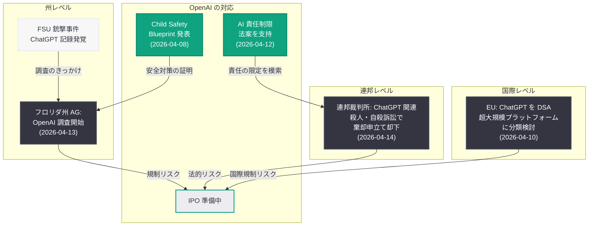

# フロリダ州司法長官、FSU 銃撃事件での ChatGPT 記録発覚を受け OpenAI への正式調査を開始

## メタデータ

| 項目 | 内容 |
|------|------|
| 発表日 | 2026-04-13 |
| ソース | WPTV, MSN |
| カテゴリ | 規制 / 法的 / AI 安全性 |
| 公式リンク | [WPTV](https://www.wptv.com/) |

## 概要

2026 年 4 月 13 日、WPTV は「Florida AG opens OpenAI investigation after ChatGPT records surface in FSU shooting」と題する記事を公開し、フロリダ州司法長官 (Attorney General) が OpenAI に対する正式な調査を開始したことを報じた。この調査は、フロリダ州立大学 (Florida State University: FSU) で発生した銃撃事件に関連して ChatGPT の会話記録が発見されたことを契機としている。MSN も同日、「'Wrongdoers must be held accountable,' says Florida AG as probe hits OpenAI amid IPO plans」と報じ、フロリダ州司法長官が「不正行為者は責任を問われなければならない」と強い姿勢を示していることを伝えた。

この調査は、OpenAI が IPO (新規株式公開) の準備を進めている極めてデリケートな時期に開始されたものであり、投資家の信頼や企業評価に影響を及ぼす可能性がある。さらに、連邦裁判所が ChatGPT に関連する殺人・自殺事件の訴訟で OpenAI の棄却申立てを却下した判決 (2026 年 4 月 14 日)、OpenAI 自身の AI 責任制限法案への支持 (2026 年 4 月 12 日)、EU による ChatGPT の DSA 規制検討 (2026 年 4 月 10 日) といった一連の動きと合わせ、AI 企業に対する規制圧力が連邦・州・国際レベルで同時多発的に強まっていることを象徴する出来事である。

## 主な内容

### フロリダ州司法長官による調査の概要

フロリダ州司法長官は、OpenAI のコンテンツ安全性に関する業務慣行を対象とした正式な調査 (probe) を開始した。調査の焦点は、ChatGPT が懸念される行動を助長したか、あるいはそのような行動を適切に検知・通報しなかったかという点に置かれている。

- **調査の法的根拠:** 州司法長官は、消費者保護法や州法に基づく広範な調査権限を有しており、企業に対して文書の提出、証言の要求、業務慣行の精査を行うことができる
- **調査の範囲:** OpenAI のコンテンツモデレーション体制、安全ガードレールの有効性、危険な行動の兆候を検知するメカニズムの妥当性が調査対象となると考えられる
- **強制力:** 州司法長官の調査は、民事調査要求 (Civil Investigative Demand: CID) を通じて法的拘束力のある情報開示を企業に求めることができ、任意の照会とは異なる強制力を持つ

### FSU 銃撃事件と ChatGPT 記録の発覚

調査の発端となったのは、FSU で発生した銃撃事件の捜査過程で ChatGPT の会話記録が発見されたことである。

- **会話記録の発見:** 銃撃事件の容疑者が ChatGPT を利用していたことが捜査過程で判明し、その会話記録が証拠として確保された
- **AI の役割に関する疑問:** ChatGPT との会話が容疑者の行動にどのような影響を与えたか、あるいは ChatGPT が懸念すべき会話内容を検知して適切な対応 (警告の表示、会話の制限、関係機関への通報) を取ったかどうかが問われている
- **AI と暴力事件の関連性:** AI チャットボットの利用と暴力事件との関連性が社会的に注目されるケースが増加しており、本件はその最新の事例となった

### フロリダ州司法長官の声明

フロリダ州司法長官は「Wrongdoers must be held accountable (不正行為者は責任を問われなければならない)」と明確に述べ、AI 企業に対する厳格な規制姿勢を示した。

- **攻撃的な規制スタンス:** この声明は、州レベルの規制当局が AI 企業に対して積極的な法執行を行う意思を明確にしたものである
- **政治的背景:** AI 安全性は党派を超えた政治課題となりつつあり、州司法長官が AI 企業への調査を公表することには政治的なシグナルとしての意味合いも含まれる
- **先例としての意義:** フロリダ州の調査が成果を上げた場合、他の州の司法長官が同様の調査を開始する連鎖的な動きにつながる可能性がある

### IPO への影響とタイミング

今回の調査は、OpenAI が IPO の準備を進めている時期と重なっており、その影響は財務的にも戦略的にも極めて大きい。

- **投資家心理への影響:** 州司法長官の正式調査は、OpenAI の規制リスクプロファイルを引き上げ、投資家の慎重姿勢を誘発する可能性がある。IPO において規制リスクは最も重要な開示事項の一つであり、進行中の調査は目論見書 (prospectus) に記載される必要がある
- **企業価値への影響:** 規制上の不確実性は企業価値の算定に直接影響を与え、IPO 価格の引き下げ圧力となりうる
- **IPO スケジュールへの影響:** 調査の進展状況によっては、OpenAI が IPO のスケジュールを調整する必要に迫られる可能性もある
- **開示義務:** 進行中の法的手続きや政府調査は、IPO プロセスにおいて SEC (証券取引委員会) への開示が義務付けられており、OpenAI はこの調査の存在と潜在的な影響を投資家に対して明確に説明する必要がある

### AI 企業に対する規制圧力の全体像

### 州司法長官調査がもたらしうる結果

州司法長官の調査は、以下のような結果をもたらす可能性がある。

- **多額の罰金:** 州の消費者保護法違反が認定された場合、OpenAI に対して数百万ドルから数千万ドル規模の罰金が科される可能性がある
- **業務慣行の変更命令:** 司法長官は、同意命令 (consent decree) を通じて、OpenAI に対してコンテンツモデレーション体制の強化、安全機能の追加、定期的な監査の実施などを義務付ける権限を有する
- **和解契約:** 多くの州司法長官調査は和解で終結するが、和解条件には業務改善義務、継続的な報告義務、遵守状況の監視メカニズムが含まれることが多い
- **他州への波及:** フロリダ州の調査が公表されたことで、他の州の司法長官が OpenAI に対する独自の調査を検討する動きが加速する可能性がある。過去のテクノロジー企業に対する規制では、複数州の司法長官が連合して調査を行う「マルチステート調査」に発展するケースが散見される

### より広範な背景: AI と暴力事件を巡る社会的議論

本件は、AI チャットボットと暴力事件との関連性を巡るより広範な社会的議論の中に位置付けられる。

- **AI インタラクションの記録と証拠:** 法執行機関が犯罪捜査において AI との会話記録を証拠として活用するケースが増加しており、AI 企業に対するデータ保持やデータ提供の要求が強まっている
- **予防的安全措置の限界:** AI システムが利用者の意図や行動を正確に予測し、暴力行為を未然に防止することには技術的な限界がある。しかし、明らかに危険な兆候が会話の中に現れた場合にそれを検知・対応する責任は AI 企業に求められつつある
- **プラットフォーム責任の再定義:** ソーシャルメディアプラットフォームに対する責任論が AI チャットボットにも拡大適用される流れが形成されつつあり、AI 企業は単なる技術提供者ではなく、利用者のインタラクションに対して一定の注意義務を負う存在として位置付けられるようになっている

## 開発者への影響

- **コンテンツ安全性の実装がさらに重要に:** フロリダ州司法長官の調査は、AI アプリケーションにおけるコンテンツ安全機能の実装が法的義務として認識される方向に進んでいることを示している。開発者は、暴力や自傷に関連するコンテンツの検知・制御メカニズムを設計段階から組み込む必要がある
- **OpenAI Moderation API の積極的活用:** OpenAI の Moderation API を活用して、危険なコンテンツや懸念される行動パターンをリアルタイムで検知・フィルタリングする体制を構築することが強く推奨される
- **ログと監査証跡の法的重要性が増大:** 州司法長官の調査では、AI インタラクションのログや内部文書が証拠として要求される可能性が高い。開発者は、適切なログ保持ポリシーを策定し、法的要請に対応できる体制を整える必要がある
- **州ごとの規制差異への対応:** 米国各州の消費者保護法は内容が異なるため、AI アプリケーションを全米で展開する開発者は、州ごとの法的要件を把握し、最も厳格な基準に合わせた安全対策を実装することが望ましい
- **IPO やファンディングへのリスク考慮:** AI スタートアップにとって、規制リスクが資金調達や企業評価に直接影響を与えることが本件によって改めて明確になった。投資家向けの開示資料において、規制リスクとコンプライアンス体制に関する記載を充実させることが重要である
- **危機介入メカニズムの実装:** AI アプリケーションが利用者の危機的状況を検知した場合に、適切な支援リソース (相談窓口、緊急連絡先) を提示する機能の実装を検討すべきである。これは法的リスクの軽減のみならず、社会的責任としても重要性を増している
- **Child Safety Blueprint との整合性:** OpenAI が 2026 年 4 月 8 日に発表した「Child Safety Blueprint」のガイドラインに準拠することが、安全対策の妥当性を示す一つの基準として有効となりうる

## 関連リンク

- [WPTV: Florida AG opens OpenAI investigation after ChatGPT records surface in FSU shooting](https://www.wptv.com/)
- [MSN: 'Wrongdoers must be held accountable,' says Florida AG as probe hits OpenAI amid IPO plans](https://www.msn.com/)
- [関連レポート: 連邦裁判所、ChatGPT に関連する殺人・自殺事件の訴訟で OpenAI の棄却申立てを却下 (2026-04-14)](2026-04-14-chatgpt-murder-suicide-federal-claims.md)
- [関連レポート: OpenAI、AI による損害の責任を制限する法案を支持 (2026-04-12)](2026-04-12-openai-ai-liability-legislation.md)
- [関連レポート: EU が ChatGPT を DSA の「超大規模プラットフォーム」に分類検討 (2026-04-10)](2026-04-10-eu-dsa-chatgpt-regulation.md)
- [関連レポート: OpenAI が「Child Safety Blueprint」を発表 (2026-04-08)](2026-04-08-introducing-child-safety-blueprint.md)
- [OpenAI Safety](https://openai.com/safety)
- [OpenAI News](https://openai.com/news)

## まとめ

フロリダ州司法長官が FSU 銃撃事件における ChatGPT 会話記録の発覚を受けて OpenAI への正式調査を開始したことは、AI 企業に対する州レベルの規制が新たな段階に入ったことを示している。「不正行為者は責任を問われなければならない」という司法長官の声明は、AI 企業の安全管理体制に対する厳格な法執行の意思を明確にしたものであり、連邦裁判所での訴訟継続判決 (2026 年 4 月 14 日) や EU の DSA 規制検討 (2026 年 4 月 10 日) と相まって、OpenAI を取り巻く規制環境は連邦・州・国際の三つのレベルで同時に圧力が高まっている。特に、OpenAI が IPO を準備している最中にこの調査が開始されたことは、規制リスクが企業の資金調達戦略や市場評価に直接的な影響を及ぼしうることを示す重要な事例である。AI 開発者にとっては、コンテンツ安全機能の実装、ログの保持と法的対応体制の構築、州ごとの規制差異への対応が喫緊の課題となり、AI アプリケーションの設計・運用において安全性を最優先に据えたアプローチがこれまで以上に強く求められている。
