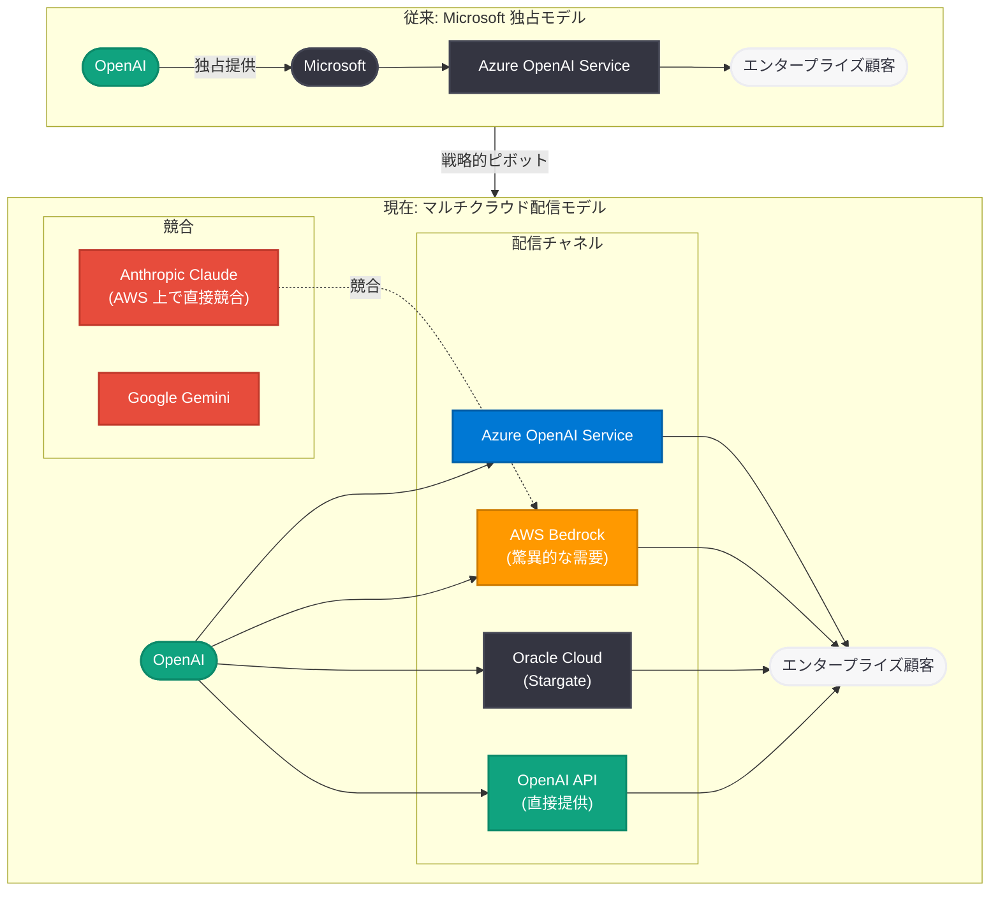

# OpenAI 内部メモが流出: Amazon 提携の急拡大、Anthropic への対抗戦略、Microsoft との摩擦が明らかに

## メタデータ

| 項目 | 内容 |
|------|------|
| 発表日 | 2026-04-13 |
| ソース | CNBC / The Verge / Axios / GeekWire / THE DECODER |
| カテゴリ | ビジネス戦略 / 企業 |
| 公式リンク | [CNBC](https://www.cnbc.com/)、[The Verge](https://www.theverge.com/)、[Axios](https://www.axios.com/)、[GeekWire](https://www.geekwire.com/) |

## 概要

OpenAI の内部メモが流出し、同社の競争戦略の全容が明らかになった。CNBC は「OpenAI touts Amazon alliance in memo, says Microsoft has 'limited our ability' to reach clients」と報じ、The Verge は Anthropic を含む競合他社への対抗戦略の詳細を公開した。このメモは、OpenAI が Microsoft への依存から脱却し、Amazon Web Services (AWS) を通じたエンタープライズ市場への直接的なリーチを急速に拡大していることを示す重要な文書である。

メモの中で OpenAI は、AWS 上でのサービス提供に対する「staggering (驚異的な)」需要があると報告し、Microsoft が「limited our ability (我々の能力を制限してきた)」と明言している。さらに、Anthropic (Claude) を名指しで競合として批判し、新基盤モデル「Spud」がすべての製品を「significantly better (大幅に改善する)」と述べている。これは [3 月 21 日に報じられた Amazon との協議開始](2026-03-21-amazon-openai-custom-models.md)、および [4 月 4 日に報じられた Microsoft の自社モデル開発加速](2026-04-04-microsoft-in-house-ai-openai-partnership-shift.md) の流れを受けた、OpenAI 側からの戦略的意思表明である。

## 主な内容

### Amazon 提携と「驚異的な」需要

OpenAI は内部メモにおいて、AWS 上でのサービス提供が予想を大幅に上回る需要を獲得していることを明らかにした。GeekWire が「OpenAI sees 'staggering' demand for Amazon offering」と報じた通り、エンタープライズ顧客からの関心は極めて高い水準にある。

- **エンタープライズ市場への直接アクセス:** AWS を通じた提供により、Microsoft Azure を経由せずにエンタープライズ顧客にリーチできる新たなチャネルが確立された
- **マルチクラウド戦略の本格化:** [3 月 21 日の Amazon との協議報道](2026-03-21-amazon-openai-custom-models.md) から約 3 週間で、協議段階から実際の需要獲得段階へと急速に進展している
- **収益基盤の多角化:** Microsoft 一社への依存から脱却し、AWS、Oracle (Stargate プロジェクト) を含む複数のクラウドパートナーを通じた収益構造の構築が進んでいる

### Microsoft との摩擦の表面化

メモの中で最も注目すべき記述の一つが、Microsoft が OpenAI のエンタープライズ顧客へのリーチを「制限してきた」という直接的な批判である。CNBC はこの点を見出しに掲げ、両社のパートナーシップにおける構造的な緊張関係を浮き彫りにした。

- **顧客アクセスの制限:** OpenAI は Microsoft との独占的パートナーシップが、エンタープライズ顧客への直接的なアプローチを妨げてきたと認識している
- **戦略的分離の加速:** [4 月 4 日に Microsoft が自社 AI モデル 3 種を発表](2026-04-04-microsoft-in-house-ai-openai-partnership-shift.md)し、OpenAI への依存を減らす動きを見せたことと対をなす形で、OpenAI 側も Microsoft からの自立を明確にしている
- **契約再編の影響:** 両社の契約再編により、OpenAI が AWS や他のクラウドプロバイダーを通じてサービスを提供する自由度が拡大したが、それでもなお Microsoft との関係が制約要因として残っていることをメモは示唆している

### Anthropic (Claude) への対抗戦略

Axios が「OpenAI rips Anthropic, distances itself from Microsoft」と報じた通り、メモは Anthropic を主要な競合として名指しし、対抗戦略を明示している。The Verge は「Read OpenAI's latest internal memo about beating the competition — including Anthropic」として、メモの詳細な内容を報じた。

- **直接的な競合認定:** OpenAI は Anthropic (Claude) をエンタープライズ AI 市場における最大の競争相手の一つとして位置づけている
- **製品力での差別化:** 新モデル Spud を含む技術的優位性により、Anthropic の Claude シリーズに対抗する方針が示されている
- **市場シェアの争奪:** 特に AWS Bedrock 上での競争が焦点となっている。Amazon が Anthropic に 40 億ドル以上を投資してきた経緯を踏まえ、OpenAI は AWS プラットフォーム上で Anthropic と直接競合する構図が鮮明になっている

### 新基盤モデル「Spud」の位置づけ

THE DECODER が「OpenAI's leaked memo says new 'Spud' model will make all its products 'significantly better'」と報じた通り、メモは新基盤モデル Spud が OpenAI の全製品ラインを大幅に改善すると述べている。

- **全製品への統合:** Spud は ChatGPT、API、エンタープライズ向けサービスを含む OpenAI の全製品に統合され、性能を大幅に向上させることが計画されている
- **競争優位の源泉:** Spud の投入により、Anthropic Claude や Google Gemini に対する技術的優位性を確立することが戦略の柱となっている
- **関連レポート:** Spud モデルについては [4 月 2 日のレポート](2026-04-02-openai-spud-model-agi-claims.md) で Greg Brockman が AGI への「見通し」を持つ新基盤モデルとして予告しており、今回のメモはその戦略的位置づけをさらに具体化するものである

### 戦略的ピボットの全体像

今回のメモは、OpenAI が Microsoft との独占的パートナーシップから、マルチクラウド・マルチパートナーのエンタープライズ戦略へと明確にピボットしていることを示している。

- **Microsoft 依存からの脱却:** Azure 経由の独占的提供から、AWS、Oracle を含む複数チャネルへの移行
- **直接的な顧客関係の構築:** クラウドプロバイダーを介した間接的な関係ではなく、エンタープライズ顧客との直接的な関係構築を推進
- **IPO に向けた事業基盤の強化:** 収益源の多角化は、OpenAI が準備を進めている IPO に向けた事業基盤の安定化にも寄与する

## 技術的な詳細

### エンタープライズ配信チャネルの構造変化

OpenAI のエンタープライズ配信モデルは、単一クラウド依存から分散型マルチクラウドモデルへと構造的に変化している。

### パートナーシップの時系列的変遷

OpenAI と Microsoft の関係性は、以下のフェーズを経て変化してきた。

1. **独占期 (2019-2025 年):** Microsoft が OpenAI に 130 億ドル以上を投資し、Azure を通じた独占的なクラウド提供を実施
2. **契約再編期 (2025-2026 年初頭):** OpenAI の営利企業への転換に伴い、Microsoft との契約条件を再交渉。独占性が緩和される
3. **多角化期 (2026 年 3 月-):** Amazon との協議開始 (3 月 21 日)、Microsoft の自社モデル発表 (4 月 4 日) を経て、両社が互いに依存を軽減
4. **表面化期 (2026 年 4 月 13 日):** 内部メモの流出により、OpenAI が Microsoft との関係を明確に制約要因と認識していることが公に

## 開発者への影響

- **マルチクラウド対応の重要性増大:** OpenAI モデルが Azure だけでなく AWS Bedrock でも利用可能になることで、開発者はクラウドプラットフォームの選択において柔軟性が大幅に向上する。特定のクラウドに依存したアーキテクチャを避け、抽象化レイヤーを設けることが推奨される
- **AWS 開発者への恩恵:** AWS をプライマリクラウドとして利用している開発者にとって、Azure との併用なしに OpenAI モデルを活用できる環境が整いつつある。既存の AWS インフラ (Lambda、Step Functions 等) との統合が容易になる
- **Spud モデルへの準備:** 新基盤モデル Spud が投入された場合、API エンドポイントやモデル名の変更、性能特性の違いに対応する必要がある。[4 月 2 日のレポート](2026-04-02-openai-spud-model-agi-claims.md) で報じた通り、Spud は従来の GPT シリーズとは異なるアーキテクチャである可能性があり、プロンプト設計やパラメータ調整の見直しが求められる場合がある
- **競合モデルとの比較評価:** OpenAI と Anthropic の競争激化により、両社のモデル性能が向上する可能性が高い。開発者は用途に応じてモデルを比較評価し、最適なモデルを選択するベンチマーク体制を整備することが重要である
- **エンタープライズ契約の見直し:** Azure OpenAI Service を通じて OpenAI モデルを利用している企業は、AWS Bedrock 経由での利用も選択肢に入れることで、コスト最適化やベンダーロックイン回避を実現できる可能性がある

## 関連リンク

- [CNBC: OpenAI touts Amazon alliance in memo, says Microsoft has 'limited our ability' to reach clients](https://www.cnbc.com/)
- [The Verge: Read OpenAI's latest internal memo about beating the competition — including Anthropic](https://www.theverge.com/)
- [Axios: OpenAI rips Anthropic, distances itself from Microsoft](https://www.axios.com/)
- [GeekWire: OpenAI sees 'staggering' demand for Amazon offering, says Microsoft partnership held it back](https://www.geekwire.com/)
- [THE DECODER: OpenAI's leaked memo says new 'Spud' model will make all its products 'significantly better'](https://the-decoder.com/)
- [関連レポート: Amazon、OpenAI とカスタムモデル提供に向けた協議を開始 (2026-03-21)](2026-03-21-amazon-openai-custom-models.md)
- [関連レポート: Microsoft、自社 AI モデル 3 種を発表 (2026-04-04)](2026-04-04-microsoft-in-house-ai-openai-partnership-shift.md)
- [関連レポート: OpenAI が新基盤モデル「Spud」を予告 (2026-04-02)](2026-04-02-openai-spud-model-agi-claims.md)

## まとめ

OpenAI の内部メモ流出は、同社のビジネス戦略における根本的な転換を明確に示すものとなった。Microsoft が「我々の能力を制限してきた」という率直な記述は、両社の関係が協力から緊張を含む段階へと移行していることを裏付ける。一方で、AWS 上での「驚異的な需要」は、OpenAI がマルチクラウド戦略を通じて新たな成長エンジンを獲得しつつあることを示している。Anthropic を名指しで競合と位置づけた点は、エンタープライズ AI 市場における競争が AWS Bedrock 上での直接対決へと収斂しつつあることを意味する。新基盤モデル Spud をすべての製品に統合するという計画は、この競争を技術力で勝ち抜く意思の表明である。3 月 21 日の Amazon 協議開始、4 月 2 日の Spud 予告、4 月 4 日の Microsoft 自社モデル発表という一連の動きの中で、今回のメモ流出は OpenAI の戦略的意図を最も明確に言語化した文書として、AI 業界のパートナーシップ再編の方向性を決定づける重要な転機となっている。
