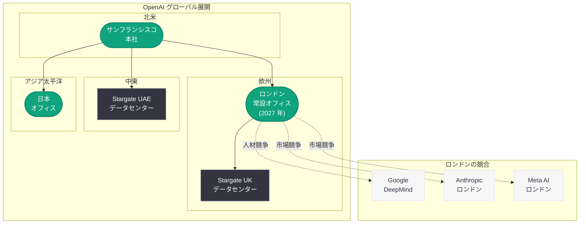

# OpenAI、2027 年にロンドン初の常設オフィスを開設: 欧州市場への本格進出と国際展開の加速

## メタデータ

| 項目 | 内容 |
|------|------|
| 発表日 | 2026-04-13 |
| ソース | Reuters |
| カテゴリ | 企業 / 国際展開 |
| 公式リンク | [Reuters](https://www.reuters.com/technology/artificial-intelligence/) |

## 概要

OpenAI が 2027 年までに英国ロンドンに初の常設オフィスを開設する計画を発表した。この動きは、OpenAI の欧州市場への本格進出を象徴するものであり、グローバル展開戦略の重要な一歩となる。ロンドンは世界有数の AI ハブとして、優秀な人材プールと先進的な規制環境を兼ね備えており、OpenAI にとって戦略的に極めて重要な拠点となる。

今回の発表は、OpenAI が進める一連の国際展開の一環として位置づけられる。同社は既に UAE および英国での Stargate データセンターパートナーシップ、日本オフィスの設立など、グローバルな事業基盤の構築を急速に進めている。ロンドン常設オフィスの開設は、これらの国際拠点と連携しながら欧州における事業プレゼンスを確立するための戦略的拠点となる。

## 主な内容

### ロンドン常設オフィスの戦略的意義

ロンドンは AI 産業において世界的に重要な都市であり、OpenAI が常設オフィスを構える場所として理想的な条件を備えている。

- **世界トップクラスの AI 人材:** 英国の大学群 (オックスフォード、ケンブリッジ、インペリアル・カレッジ・ロンドンなど) から輩出される高度な AI 研究者やエンジニアへのアクセスが可能となる
- **AI エコシステムの成熟度:** Google DeepMind の本拠地であるロンドンには、AI スタートアップ、研究機関、投資家が集積しており、活発なエコシステムが形成されている
- **規制環境の優位性:** 英国政府が推進する AI フレンドリーな規制方針は、OpenAI の事業展開にとって追い風となる
- **欧州市場へのゲートウェイ:** ロンドンは欧州全体へのビジネス展開における戦略的拠点として機能する

### OpenAI のグローバル展開の全体像

ロンドンオフィスの開設は、OpenAI が推進する大規模なグローバル展開戦略の一部である。

- **Stargate UAE:** UAE との大規模データセンターパートナーシップにより、中東地域での AI インフラを構築
- **Stargate UK:** 英国における AI インフラ投資を通じて、欧州での計算基盤を強化
- **日本オフィス:** アジア太平洋地域における事業拠点として、日本市場でのプレゼンスを確立
- **ロンドン常設オフィス (2027 年):** 欧州における恒久的な事業拠点として、研究開発、営業、パートナーシップ活動を統括

### 英国の AI 政策と規制環境

英国政府は AI 産業の育成に積極的な姿勢を示しており、OpenAI のロンドン進出を後押しする環境が整っている。

- **AI Safety Summit の開催:** 2023 年にブレッチリー・パークで開催された AI Safety Summit は、英国が AI の安全性と規制において国際的なリーダーシップを発揮していることを示した
- **イノベーション重視の規制アプローチ:** 英国は EU の AI Act とは異なり、よりイノベーションを重視した柔軟な規制フレームワークを採用しており、AI 企業にとって事業展開しやすい環境を提供している
- **政府の AI 投資:** 英国政府は AI 研究開発への大規模な公共投資を推進しており、産業界との連携を強化している

### 競合環境とロンドンにおけるポジショニング

ロンドンは既に主要な AI 企業が拠点を構える激戦区であり、OpenAI の参入は競争をさらに激化させる。

- **Google DeepMind:** ロンドンに本社を置き、同地で大規模な研究開発を展開している。OpenAI にとって人材獲得において最大の競合となる
- **Anthropic:** 既にロンドンにオフィスを構えており、欧州市場でのプレゼンスを確立している
- **Meta AI:** ロンドンを含む欧州各地に研究拠点を持ち、オープンソース戦略を通じて影響力を拡大している
- **Microsoft:** OpenAI の最大のパートナーであり、ロンドンに既に大規模な AI 研究拠点を有している

## 市場・戦略分析

### 欧州 AI 市場の重要性

欧州 AI 市場は急速に成長しており、OpenAI にとって北米に次ぐ重要な市場となっている。

- **市場規模の拡大:** 欧州の AI 市場は年率 30% 以上の成長が見込まれており、エンタープライズ向け AI サービスの需要が急増している
- **データ主権への対応:** 欧州の顧客はデータの所在地と処理に関して厳格な要件を持っており、現地オフィスの存在はこれらの懸念に対応する上で重要である
- **パートナーシップの構築:** 欧州の大手企業やスタートアップとの直接的なパートナーシップ構築が可能になる

### 組織拡大との連動

OpenAI は 2026 年末までに従業員数を 8,000 人に倍増させる計画を進めており、ロンドンオフィスの開設はこの組織拡大戦略と密接に連動している。

- **欧州での採用強化:** ロンドンオフィスを拠点として欧州全体からの人材採用を加速させることが可能になる
- **研究開発の分散化:** サンフランシスコ本社への一極集中を避け、グローバルに分散した研究開発体制を構築する
- **タイムゾーンカバレッジ:** ロンドン拠点の設立により、24 時間体制でのカスタマーサポートやエンタープライズ対応が実現しやすくなる

## 開発者への影響

### 欧州拠点の開発者への直接的な恩恵

- **ローカルサポートの充実:** ロンドンオフィスの存在により、欧州の開発者が OpenAI のサポートチームやテクニカルアンバサダーに直接アクセスしやすくなる
- **開発者イベントの増加:** 欧州での開発者カンファレンス、ハッカソン、ワークショップなどのイベント開催が活発化する可能性がある
- **欧州向け API パフォーマンスの改善:** Stargate UK データセンターとの連携により、欧州リージョンでの API レイテンシの改善が期待される

### エコシステムへの影響

- **パートナーシップ機会の拡大:** 欧州のスタートアップや企業が OpenAI と直接連携する機会が増加し、開発者エコシステムの成長が促進される
- **人材市場への影響:** ロンドンの AI 人材市場における競争が激化し、開発者の報酬水準や待遇が向上する可能性がある
- **オープンソースコミュニティとの連携:** ロンドンの活発なオープンソースコミュニティとの接点が増え、OpenAI のツールやライブラリへの貢献が活性化する可能性がある

### データとコンプライアンスへの影響

- **データローカリゼーション:** 欧州のデータ保護規制 (GDPR) への対応が強化され、欧州の開発者がコンプライアンス要件を満たしやすくなる
- **規制対応の透明性:** 現地オフィスを通じて、英国および欧州の規制動向に関する情報が開発者コミュニティに迅速に共有されることが期待される

## 関連リンク

- [Reuters - AI ニュース](https://www.reuters.com/technology/artificial-intelligence/)
- [OpenAI - Stargate UK の発表](https://openai.com/index/introducing-stargate-uk/)
- [OpenAI、2026 年末までに従業員数を 8,000 人に倍増計画](reports/2026/2026-03-21-openai-workforce-doubling-8000.md)
- [OpenAI News](https://openai.com/news)
- [OpenAI 公式ドキュメント](https://platform.openai.com/docs)

## まとめ

OpenAI が 2027 年にロンドン初の常設オフィスを開設するという発表は、同社のグローバル展開戦略における重要なマイルストーンである。ロンドンは Google DeepMind の本拠地であり Anthropic も拠点を置く世界有数の AI ハブであり、OpenAI にとって優秀な人材の獲得、欧州市場へのアクセス、AI フレンドリーな規制環境の活用という複数の戦略的メリットを提供する。Stargate UK データセンターや日本オフィスと並ぶこの新拠点は、OpenAI が従業員数 8,000 人への組織拡大を進める中で、グローバルに分散した事業基盤の構築を加速させるものである。欧州の開発者にとっては、ローカルサポートの充実、API パフォーマンスの向上、データコンプライアンス対応の強化といった恩恵が期待される。AI 産業のグローバル競争が激化する中、OpenAI のロンドン進出は、同社が北米中心の企業から真のグローバル AI プラットフォーム企業へと進化していることを明確に示している。
