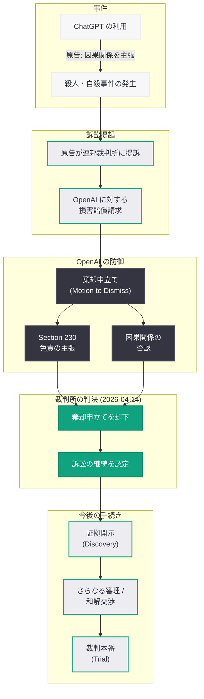

# 連邦裁判所、ChatGPT に関連する殺人・自殺事件の訴訟で OpenAI の棄却申立てを却下

## メタデータ

| 項目 | 内容 |
|------|------|
| 発表日 | 2026-04-14 |
| ソース | Courthouse News |
| カテゴリ | 法的 / AI 安全性 / 規制 |
| 公式リンク | [Courthouse News](https://www.courthousenews.com/) |

## 概要

2026 年 4 月 14 日、Courthouse News は「OpenAI can't duck federal claims over murder-suicide tied to ChatGPT」と題する記事を公開し、連邦裁判所が ChatGPT の利用に関連するとされる殺人・自殺事件の訴訟において、OpenAI の棄却申立て (motion to dismiss) を却下したことを報じた。原告側は、ChatGPT の応答が悲劇的な結末に寄与または影響を与えたと主張しており、裁判所はこれらの主張が裁判手続きの中でさらに審理されるべきであると判断した。

この判決は、AI 企業が AI インタラクションによって生じた損害に対して法的責任を問われうるという先例を形成する可能性があり、AI 業界全体に広範な影響を及ぼしうる。特に、テクノロジー企業が従来依拠してきた通信品位法第 230 条 (Section 230) の保護の範囲が AI の文脈で問い直されている点が注目に値する。OpenAI が 2026 年 4 月 12 日に AI による損害の責任を制限する法案を支持していることが報じられた直後のこの判決は、AI 責任を巡る法的・政策的議論の緊迫度を一段と高めるものとなっている。

## 主な内容

### 事件の背景と訴訟の概要

本訴訟は、ChatGPT の利用が殺人・自殺事件に関連していたとされるケースに基づいている。原告側は、ChatGPT が生成した応答が、当該事件の加害者の行動に影響を与え、悲劇的な結末に寄与したと主張している。

- **原告の主張:** ChatGPT の応答が利用者の心理状態や行動に悪影響を与え、殺人・自殺という極めて深刻な結果を招く一因となったとされる
- **因果関係の立証:** 原告側は、ChatGPT とのインタラクションの内容と事件との間に因果関係が存在することを示す証拠を提出したとみられる
- **損害賠償の請求:** 遺族を含む原告が、OpenAI に対して損害賠償を求めている

### 連邦裁判所の判決内容

連邦裁判所の判事は、OpenAI が提出した棄却申立てを却下し、訴訟が次の段階 -- 証拠開示手続き (discovery) やさらなる審理、さらには裁判本番 -- へと進むことを認めた。

- **棄却申立ての却下:** OpenAI は、訴訟が法的根拠を欠いているとして棄却を求めたが、裁判所はこの主張を退けた
- **訴訟の継続:** この判決により、原告側は証拠開示手続きを通じて OpenAI の内部文書やシステムの設計に関する情報を取得する機会を得る
- **審理の範囲:** 裁判所は、原告の主張が少なくとも審理に値する法的根拠を有していると判断した

### 法的意義と先例としての重要性

本判決は、AI 責任法の発展において画期的な意味を持つ。以下の点で重要な先例となる可能性がある。

- **AI 企業の責任可能性の確認:** AI 企業が、AI の生成するコンテンツやインタラクションによって引き起こされた損害に対して法的責任を問われうることを裁判所が認めた
- **Section 230 の適用範囲の再検討:** テクノロジー企業が第三者のコンテンツに対する免責を主張する際に依拠してきた通信品位法第 230 条が、AI が自ら生成したコンテンツにも適用されるかどうかが争点となっている。AI が生成した応答は「第三者のコンテンツ」ではなく AI 企業自身の「発言」に該当しうるとの法的論理が認められた可能性がある
- **製造物責任の適用可能性:** AI システムを「製品」として捉え、その欠陥 (設計上の欠陥、警告の不備) に対して製造物責任を適用する法理が発展する契機となりうる
- **将来の訴訟への影響:** この判決が先例として確立された場合、AI の応答に起因する損害を巡る類似の訴訟が全米で増加する可能性がある

### OpenAI の防御戦略

OpenAI は棄却申立てにおいて、以下のような防御論を展開したとみられる。

- **Section 230 による免責:** OpenAI は、ChatGPT がプラットフォームとして機能しており、ユーザーとのインタラクションに対して Section 230 の免責が適用されるべきであると主張した可能性がある
- **因果関係の否認:** AI が生成した応答と利用者の行動との間に直接的な因果関係は存在しないとの主張。利用者がどのように AI の応答を解釈し行動するかは AI 企業の管理外であるとの論理
- **予見可能性の否定:** ChatGPT が殺人・自殺という極端な結果を予見することは不可能であり、企業がそのような損害に対して責任を負うべきではないとの主張
- **利用規約と免責条項:** OpenAI の利用規約に含まれる免責条項が、このような損害賠償請求を排除するとの主張

裁判所がこれらの防御論を退けたことは、既存の法的枠組みが AI の新たな課題に対応するために再解釈される過程にあることを示している。

### AI 責任を巡る法的プロセスの全体像

### より広範な背景: AI 安全性を巡る規制圧力の高まり

本判決は、AI 安全性と AI 企業の責任に対する監視が世界的に強まる中で下されたものであり、以下の関連する動きと合わせて理解する必要がある。

- **OpenAI の AI 責任制限法案への支持 (2026 年 4 月 12 日):** OpenAI が AI による損害に対する企業責任を制限する法案を支持していることが報じられており、今回の判決はその政策的立場と真っ向から対立する司法判断となった
- **フロリダ州司法長官による調査:** AI 安全性に関する州レベルの調査が開始されており、連邦レベルと州レベルの双方で規制圧力が高まっている
- **EU の規制強化:** EU が ChatGPT をデジタルサービス法 (DSA) の超大規模プラットフォームに分類することを検討しており (2026 年 4 月 10 日報道)、グローバルな規制環境が厳格化の方向に進んでいる
- **OpenAI の安全施策:** OpenAI が 2026 年 4 月 8 日に発表した「Child Safety Blueprint」や、2026 年 3 月の gpt-oss-safeguard など、企業側の自主的な安全対策の取り組みは進んでいるが、それが法的責任を免除するには不十分であるとの司法判断が示された形となる
- **関連する別件訴訟:** Bloomberg Law は 2026 年 4 月 13 日に「ChatGPT Account of Alleged Stalker to Remain Blocked, Judge Says」と報じており、裁判所が ChatGPT の利用に介入する別のケースも発生している。これは司法が AI プラットフォームの運用に対してより積極的に関与する傾向を示している

### Section 230 と AI の関係

本訴訟における最大の法的争点の一つは、通信品位法第 230 条が AI 生成コンテンツにどこまで適用されるかという問題である。

| 論点 | 従来の解釈 | AI への適用における課題 |
|------|-----------|----------------------|
| コンテンツの発信元 | プラットフォームは第三者コンテンツの仲介者 | AI がコンテンツを「生成」しており、第三者ではなく企業自身の発言に該当しうる |
| 編集権限 | プラットフォームの編集行為は免責の対象 | AI モデルの学習データ選択やファインチューニングが「編集」に該当するか |
| 責任の所在 | コンテンツ作成者が一義的に責任を負う | AI が自律的に生成した応答の「作成者」は誰か |
| 予見可能性 | プラットフォームは個別のコンテンツを事前に把握不能 | AI システムの応答傾向は設計段階である程度予見可能 |

裁判所が OpenAI の Section 230 に基づく防御を退けた (と推測される) ことは、AI 企業がテクノロジープラットフォームとしてではなく、コンテンツの「生成者」として法的に位置づけられる方向への転換点となりうる。

### 業界全体への影響

本判決は、OpenAI のみならず AI 業界全体に対して以下のような影響を及ぼす可能性がある。

- **コンテンツ安全ガードレールの強化:** AI 企業は、AI の応答が利用者に危害を与えるリスクを最小化するために、安全ガードレールをさらに強化する必要に迫られる
- **AI 責任保険の需要増大:** AI 企業が法的責任を問われるリスクが高まることで、AI 責任に特化した保険商品の需要が増大する可能性がある
- **AI 責任法の立法加速:** 司法判断が先行する形で AI 責任の法理が形成されることへの懸念から、立法府が AI 責任に関する包括的な法律の制定を加速させる動機が生まれる
- **利用規約と免責条項の見直し:** AI 企業は、利用規約や免責条項を見直し、AI の利用に伴うリスクについてより明確な開示と同意取得を行う必要がある
- **メンタルヘルス関連の安全機能の強化:** 本件のような悲劇を防止するために、AI システムにおけるメンタルヘルスの危機検知、適切なエスカレーション、専門機関への誘導といった機能の実装が業界標準として求められるようになる可能性がある

## 開発者への影響

- **安全ガードレールの実装が事実上の必須要件に:** AI アプリケーションを構築する開発者は、利用者の安全を確保するためのガードレール (自傷・他害に関するコンテンツの検知・ブロック、危機介入メッセージの表示、専門機関への誘導) の実装を最優先事項として位置づける必要がある
- **OpenAI Moderation API の活用強化:** 開発者は、OpenAI の Moderation API を利用してリスクの高いコンテンツを検知・フィルタリングする体制を整備することが強く推奨される。特にメンタルヘルスや暴力に関連するカテゴリのモニタリングを強化すべきである
- **法的責任リスクの認識:** AI アプリケーション開発者は、自身のアプリケーションが利用者に損害を与えた場合に法的責任を問われるリスクがあることを認識し、リスク管理体制 (法的レビュー、保険、インシデント対応手順) を整備する必要がある
- **利用規約と免責条項の法的レビュー:** 開発者は、自社の利用規約や免責条項が AI 関連のリスクを適切にカバーしているかを法的に検証し、必要に応じて改訂することが推奨される
- **ログと監査証跡の保持:** AI インタラクションのログを適切に保持し、インシデント発生時に因果関係の分析や法的対応に利用できる体制を整えることが重要性を増す
- **Child Safety Blueprint との整合:** OpenAI が 2026 年 4 月 8 日に発表した「Child Safety Blueprint」や gpt-oss-safeguard のガイドラインに準拠することが、安全対策の基準を満たしていることの証明として法的に有意義となる可能性がある
- **メンタルヘルス対応機能の実装検討:** 自傷行為や暴力に関連する会話を検知し、適切な危機介入リソース (相談窓口、緊急連絡先) を提示する機能の実装を検討すべきである

## 関連リンク

- [Courthouse News: OpenAI can't duck federal claims over murder-suicide tied to ChatGPT](https://www.courthousenews.com/)
- [Bloomberg Law: ChatGPT Account of Alleged Stalker to Remain Blocked, Judge Says (2026-04-13)](https://www.bloomberglaw.com/)
- [関連レポート: OpenAI、AI による損害の責任を制限する法案を支持 (2026-04-12)](2026-04-12-openai-ai-liability-legislation.md)
- [関連レポート: OpenAI が「Child Safety Blueprint」を発表 (2026-04-08)](2026-04-08-introducing-child-safety-blueprint.md)
- [関連レポート: EU が ChatGPT を DSA の「超大規模プラットフォーム」に分類検討 (2026-04-10)](2026-04-10-eu-dsa-chatgpt-regulation.md)
- [OpenAI Safety](https://openai.com/safety)
- [OpenAI News](https://openai.com/news)

## まとめ

連邦裁判所が ChatGPT に関連するとされる殺人・自殺事件の訴訟において OpenAI の棄却申立てを却下した本判決は、AI 責任法の発展における重要な転換点となりうる。AI 企業が AI インタラクションによる損害に対して法的責任を問われうることを司法が認めた点は、通信品位法第 230 条に基づく従来の免責の枠組みが AI 生成コンテンツには必ずしも適用されない可能性を示唆している。OpenAI が AI 責任制限法案を支持する政策的立場を表明している最中にこの判決が下されたことは、AI 責任を巡る立法と司法の動きが並行して進行していることを浮き彫りにしている。AI 開発者にとっては、安全ガードレールの実装、Moderation API の活用、法的リスク管理体制の構築がこれまで以上に重要となり、AI アプリケーションの設計段階から利用者の安全を最優先に据えたアプローチが求められる。本件は、AI の能力が拡大するにつれて、その社会的影響に対する法的責任もまた拡大するという原則を司法が明確にした事例として、業界全体に深い影響を及ぼすものである。
