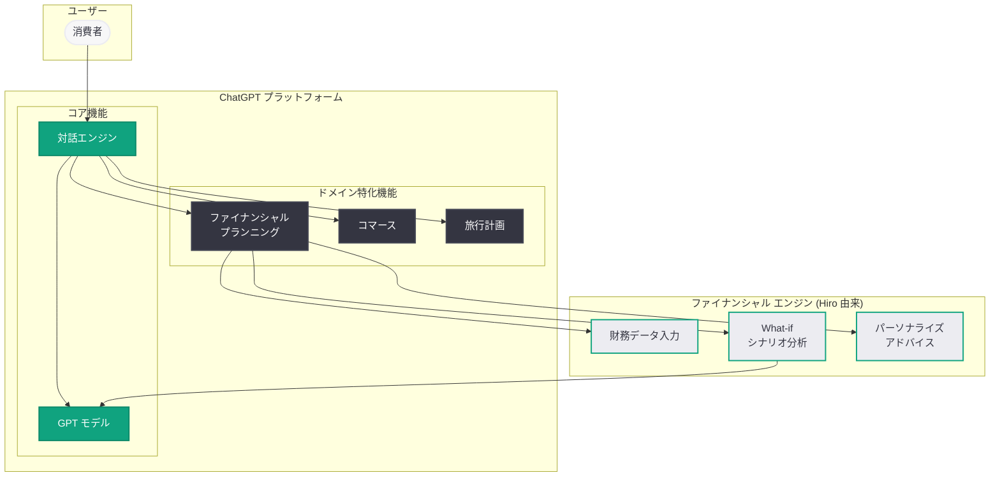

# OpenAI が AI パーソナルファイナンス スタートアップ Hiro を買収: ChatGPT にファイナンシャルプランニング機能を統合へ

## メタデータ

| 項目 | 内容 |
|------|------|
| 発表日 | 2026-04-14 |
| ソース | TechCrunch |
| カテゴリ | M&A / プロダクト戦略 |
| 公式リンク | [TechCrunch](https://techcrunch.com/2026/04/13/openai-has-bought-ai-personal-finance-startup-hiro/) |

## 概要

OpenAI は AI を活用したパーソナルファイナンス スタートアップ Hiro を買収した。今回の買収は、ChatGPT にファイナンシャルプランニング機能を構築するという OpenAI の戦略を示すものである。買収条件は非公開であり、Hiro がこれまでに調達した資金額も公表されていない。

Hiro は 2026 年 4 月 20 日にサービスを停止し、5 月 13 日にはサーバーからすべてのデータを削除する予定であることから、今回の買収は人材獲得を主目的とした「アクハイヤー」と位置づけられている。Hiro の CEO である Bloch 氏は、Hiro の従業員が自身とともに OpenAI に移籍することを明らかにしており、LinkedIn の情報によると同社には約 10 名の従業員が在籍している。

## 主な内容

### Hiro の概要とプロダクト

Hiro は 2023 年に設立された AI パーソナルファイナンス スタートアップであり、約 5 か月前に AI ツールをローンチした。Hiro のプロダクトは、消費者向けの AI 搭載ファイナンシャルプランニングサービスであり、以下のような機能を提供していた。

- **財務情報の入力:** ユーザーは給与、負債、月々の支出などの財務情報をアプリに入力
- **What-if シナリオモデリング:** 入力されたデータに基づき、さまざまな仮定条件でのシミュレーションを実行
- **意思決定支援:** シナリオ分析を通じて、ユーザーの財務上の意思決定を支援

### 買収の形態: アクハイヤー

今回の買収は、プロダクトやサービスの継続ではなく、人材の獲得を主目的とした「アクハイヤー」である。これを裏付ける事実は以下の通りである。

- **サービスの停止:** Hiro は 2026 年 4 月 20 日にオペレーションを停止する
- **データの完全削除:** 2026 年 5 月 13 日にサーバーからすべてのユーザーデータを削除する
- **人材の移籍:** CEO の Bloch 氏をはじめ、Hiro の従業員 (約 10 名) が OpenAI に移籍する
- **買収条件の非公開:** 買収金額は開示されていない

### OpenAI のドメイン特化戦略における位置づけ

Hiro の買収は、OpenAI が ChatGPT にドメイン特化型の機能を次々と追加している広範な戦略の一環である。近年の動きとして以下が挙げられる。

- **コマース機能:** ChatGPT 内でのショッピング・商取引機能の統合
- **旅行機能:** EaseMyTrip との統合による旅行計画支援
- **ファイナンシャルプランニング:** Hiro 買収による金融計画機能の追加 (本件)

これらの取り組みは、ChatGPT を単なる汎用 AI アシスタントから、日常生活のさまざまな領域で実用的な価値を提供する統合プラットフォームへと進化させるという OpenAI の意図を明確に示している。

### OpenAI の買収戦略の加速

2026 年に入り、OpenAI は急速に買収を進めている。

| 日付 | 対象 | 領域 |
|------|------|------|
| 2026-03-19 | Astral | Python 開発者ツール (uv, Ruff) |
| 2026-04-02 | TBPN | AI メディアネットワーク |
| 2026-04-14 | Hiro | AI パーソナルファイナンス |

この一連の買収は、OpenAI が開発者ツール、メディア、消費者向けサービスなど、多角的な領域で事業基盤を拡大していることを示している。

## 技術的な詳細

### ChatGPT へのファイナンシャルプランニング統合の展望

Hiro のチームが OpenAI に合流することで、以下のような技術的統合が想定される。

- **財務データの構造化処理:** ユーザーの給与、負債、支出データを ChatGPT 内で安全に入力・管理する仕組み
- **シナリオシミュレーション エンジン:** 「もし住宅ローンを組んだ場合」「転職した場合」などの What-if シナリオを ChatGPT の対話インターフェースで実行する機能
- **パーソナライズされた財務アドバイス:** ユーザーの財務状況に基づいた、AI による個別化されたファイナンシャルプランニングの提供
- **プライバシーとセキュリティ:** 機密性の高い財務データを扱うための暗号化やデータ保護の強化

### アーキテクチャ

## 開発者への影響

今回の買収は主に消費者向けプロダクトに関するものであるが、開発者やエコシステムに対しても以下の影響が考えられる。

- **ChatGPT プラグイン / 拡張エコシステムへの影響:** ファイナンシャルプランニング機能が ChatGPT にネイティブ統合されることで、同領域のサードパーティ プラグインや GPTs との競合が生じる可能性がある
- **API の拡張可能性:** 将来的に、財務シナリオ分析やファイナンシャルプランニング関連の API が OpenAI プラットフォームに追加される可能性がある。フィンテック開発者にとっては新たな統合機会となり得る
- **データプライバシーの重要性:** 財務データという高度に機密性のある情報を AI が処理することになるため、データ保護やプライバシーに関する要件がより厳格になることが予想される
- **ドメイン特化 AI の普及:** OpenAI が複数の専門領域 (コマース、旅行、金融) に進出するパターンは、AI アプリケーション開発者にとって、特定のドメインに深く特化したソリューションの需要が今後も拡大することを示唆している
- **フィンテック業界への示唆:** AI 大手がファイナンシャルプランニング領域に参入することで、既存のフィンテック スタートアップやロボアドバイザーサービスとの競争環境が変化する可能性がある

## 関連リンク

- [TechCrunch: OpenAI has bought AI personal finance startup Hiro](https://techcrunch.com/2026/04/13/openai-has-bought-ai-personal-finance-startup-hiro/)
- [OpenAI が Astral を買収 (関連レポート)](reports/2026/2026-03-19-openai-to-acquire-astral.md)
- [OpenAI が TBPN を買収 (関連レポート)](reports/2026/2026-04-02-openai-acquires-tbpn.md)
- [OpenAI News](https://openai.com/news)
- [ChatGPT](https://chatgpt.com)

## まとめ

OpenAI による AI パーソナルファイナンス スタートアップ Hiro の買収は、ChatGPT にファイナンシャルプランニング機能を統合するための戦略的なアクハイヤーである。2023 年設立の Hiro は、AI を活用した消費者向け財務計画ツールを提供しており、CEO の Bloch 氏をはじめとする約 10 名の従業員が OpenAI に移籍する。Hiro のサービスは 4 月 20 日に停止し、5 月 13 日にデータが完全削除される。本買収は、OpenAI がコマース、旅行、金融といったドメイン特化型の機能を ChatGPT に統合する広範な戦略の一環であり、Astral (開発者ツール)、TBPN (メディア) に続く 2026 年の一連の買収活動を加速させるものである。ChatGPT が汎用 AI アシスタントから日常生活の多領域をカバーする統合プラットフォームへと進化する方向性が、より一層明確になった。
