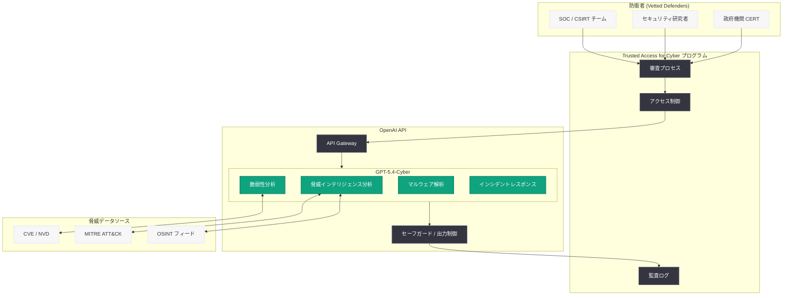

# サイバー防衛の新時代に向けた Trusted Access プログラムの拡大

## メタデータ

| 項目 | 内容 |
|------|------|
| 発表日 | 2026-04-14 |
| ソース | OpenAI News/Blog |
| カテゴリ | セキュリティ |
| 公式リンク | [Trusted access for the next era of cyber defense](https://openai.com/index/scaling-trusted-access-for-cyber-defense) |

> **注記:** 本レポートは RSS フィード情報および関連する公開情報に基づいて作成されている。記事公開ページへの直接アクセスが制限されていたため、RSS の説明文、過去の Trusted Access for Cyber プログラムに関する公開情報、および関連するセキュリティ分野の公開情報をもとに内容を構成している。

## 概要

OpenAI は 2026 年 4 月 14 日、サイバーセキュリティ防衛者向けプログラム「Trusted Access for Cyber」の大規模拡大を発表した。本プログラムの拡張において、サイバーセキュリティ用途に特化した新モデル「GPT-5.4-Cyber」が導入され、審査を通過した防衛者 (vetted defenders) に対して提供が開始される。AI のサイバーセキュリティ能力が急速に進化する中、防衛側が攻撃者に対して技術的優位性を維持するための戦略的な取り組みである。

本プログラムは、OpenAI が以前立ち上げた [Trusted Access for Cyber](https://openai.com/index/trusted-access-for-cyber/) の発展版であり、GPT-5.4 をベースにサイバーセキュリティ領域に最適化された専用モデルの提供、審査プロセスの拡充、およびセーフガードの強化が主要な柱となっている。AI が攻撃と防御の双方で活用される時代において、信頼できる防衛者に高度な AI ツールを優先的に提供することで、サイバーセキュリティのエコシステム全体の安全性を向上させることを目指している。

## 主な内容

### GPT-5.4-Cyber の導入

GPT-5.4-Cyber は、2026 年 3 月 5 日に発表された GPT-5.4 をベースに、サイバーセキュリティの防衛用途に特化したファインチューニングおよび最適化が施された専用モデルである。標準の GPT-5.4 と比較して、以下の領域で強化されていると考えられる。

- **脆弱性分析能力の強化:** CVE データベース、脆弱性パターン、エクスプロイト手法に関する深い理解を持ち、未知の脆弱性を含むセキュリティリスクの特定と評価を高精度で実行
- **脅威インテリジェンスの処理:** 大量の脅威情報 (IoC: Indicators of Compromise、TTPs: Tactics, Techniques, and Procedures) を高速に分析し、MITRE ATT&CK フレームワークに基づいた構造化レポートを生成
- **マルウェア解析支援:** バイナリ解析、コード難読化解除、マルウェアの挙動分析といった高度なリバースエンジニアリングタスクの支援
- **インシデントレスポンス支援:** セキュリティインシデントの検出から封じ込め、復旧までのプロセスを AI が支援し、対応時間を大幅に短縮
- **セキュリティコード監査:** アプリケーションコードのセキュリティレビューを、GPT-5.4 の 1M トークンコンテキストウィンドウを活用して大規模コードベースに対して実行

### Trusted Access for Cyber プログラムの拡大

Trusted Access for Cyber プログラムは、サイバーセキュリティの防衛者に対して、審査を経た上で高度な AI 機能への優先的なアクセスを提供する仕組みである。今回の拡大では以下の要素が強化されたと推察される。

- **参加資格の拡充:** 政府機関のセキュリティチーム、CERT/CSIRT、大手セキュリティベンダー、認定されたペネトレーションテスト企業、学術研究機関など、より幅広い防衛者カテゴリへの対象拡大
- **審査プロセスの体系化:** 参加者の信頼性を確認するための多段階審査プロセスの導入。組織の信頼性評価、セキュリティクリアランスの確認、利用目的の審査を含む
- **段階的アクセスモデル:** 参加者の実績と信頼度に応じて、利用可能な機能の範囲を段階的に拡大する仕組み
- **グローバル展開:** 初期の限定的な地域展開から、国際的なサイバーセキュリティコミュニティへの参加拡大

### セーフガードの強化

AI のサイバーセキュリティ能力が高度化するに伴い、悪用リスクも増大する。OpenAI は GPT-5.4-Cyber の提供に際して、以下のセーフガードを強化していると考えられる。

- **利用制限の明確化:** 防衛目的に限定された利用ポリシーの厳格な適用。攻撃目的での使用を検出・防止する監視機構
- **出力制御:** エクスプロイトコードの生成や攻撃手法の詳細な手順の出力に対する厳格なフィルタリング
- **監査ログ:** 全てのリクエストとレスポンスの監査証跡を記録し、不正利用の事後検証を可能にする仕組み
- **アクセス制御:** API キーの厳格な管理、IP アドレス制限、多要素認証などの技術的アクセス制御

## 技術的な詳細

### GPT-5.4-Cyber の API アクセス

GPT-5.4-Cyber は、Trusted Access プログラムの参加者に対して OpenAI API 経由で提供されると考えられる。以下は想定される基本的な利用パターンである。

```python
from openai import OpenAI

client = OpenAI()

# 脅威インテリジェンスの分析
response = client.chat.completions.create(
    model="gpt-5.4-cyber",
    messages=[
        {
            "role": "system",
            "content": (
                "You are a cybersecurity threat intelligence analyst. "
                "Analyze the provided indicators of compromise and map them "
                "to the MITRE ATT&CK framework."
            )
        },
        {
            "role": "user",
            "content": (
                "Analyze the following network logs for potential threats:\n\n"
                "- Outbound connections to 198.51.100.23:443 every 30 minutes\n"
                "- DNS queries to randomly generated subdomains of example-c2.net\n"
                "- PowerShell execution with Base64-encoded payloads\n"
                "- Registry modification in HKLM\\SOFTWARE\\Microsoft\\Windows\\CurrentVersion\\Run"
            )
        }
    ],
    max_tokens=4096
)

print(response.choices[0].message.content)
```

### 脆弱性分析の利用例

```python
from openai import OpenAI

client = OpenAI()

# ソースコードの脆弱性分析
with open("target_application.py", "r") as f:
    source_code = f.read()

response = client.chat.completions.create(
    model="gpt-5.4-cyber",
    messages=[
        {
            "role": "system",
            "content": (
                "You are a security code auditor. Analyze the provided source code "
                "for security vulnerabilities. Classify findings by severity "
                "(Critical/High/Medium/Low) and provide remediation guidance."
            )
        },
        {
            "role": "user",
            "content": f"Perform a security audit of this code:\n\n{source_code}"
        }
    ],
    max_tokens=8192
)

print(response.choices[0].message.content)
```

### インシデントレスポンス支援の利用例

```python
from openai import OpenAI

client = OpenAI()

# インシデント対応の支援
response = client.chat.completions.create(
    model="gpt-5.4-cyber",
    messages=[
        {
            "role": "system",
            "content": (
                "You are an incident response specialist. Help the security team "
                "triage and respond to the reported security incident. Provide "
                "step-by-step containment and remediation procedures."
            )
        },
        {
            "role": "user",
            "content": (
                "We detected the following incident:\n"
                "- Ransomware encryption activity on 3 file servers\n"
                "- Lateral movement from compromised admin workstation\n"
                "- Data exfiltration to external IP over HTTPS\n"
                "- Initial access via phishing email with malicious macro\n\n"
                "Current status: Encryption is ongoing. "
                "What are the immediate containment steps?"
            )
        }
    ],
    max_tokens=4096
)

print(response.choices[0].message.content)
```

> **注:** 上記のコード例は Trusted Access プログラム参加者向けの想定利用パターンであり、`gpt-5.4-cyber` モデル名および API パラメータの詳細は公式ドキュメントを参照してください。プログラム未参加者はこのモデルにアクセスできません。

### 標準 GPT-5.4 との主な違い

| 観点 | GPT-5.4 | GPT-5.4-Cyber |
|------|---------|---------------|
| アクセス条件 | 一般提供 | Trusted Access プログラム参加者限定 |
| 最適化領域 | 汎用タスク | サイバーセキュリティ防衛 |
| 脅威分析能力 | 標準 | MITRE ATT&CK 対応の強化された分析 |
| 脆弱性検出 | 標準的なコードレビュー | セキュリティ特化の深い脆弱性分析 |
| マルウェア解析 | 基本的な分析 | 高度なリバースエンジニアリング支援 |
| セーフガード | 標準ポリシー | 防衛用途限定の強化ポリシー |
| 監査機能 | 標準ログ | 全リクエストの詳細監査証跡 |

## アーキテクチャ



## 開発者への影響

### サイバーセキュリティツール開発の加速

- **専用モデルの活用:** Trusted Access プログラムに参加するセキュリティベンダーや開発者は、GPT-5.4-Cyber を組み込んだ次世代のセキュリティツール (SIEM、SOAR、EDR など) を開発できるようになる。従来の署名ベースやルールベースの検出に加え、AI による文脈理解に基づく高度な脅威検出が実現する
- **API 統合の標準化:** GPT-5.4-Cyber が OpenAI API を通じて提供されることで、既存のセキュリティワークフローへの統合が容易になる。SOC チームの日常的なオペレーションに AI を組み込むハードルが大幅に低下する
- **セキュリティ自動化の高度化:** インシデントレスポンスの自動化、脅威ハンティングの効率化、脆弱性トリアージの迅速化など、セキュリティ運用の多くの領域で AI 駆動の自動化が進む

### アクセス制限に関する考慮事項

- **参加審査の必要性:** GPT-5.4-Cyber へのアクセスには Trusted Access プログラムへの参加が必須であり、組織の審査プロセスを経る必要がある。開発者は事前に参加申請と審査プロセスに必要な期間を考慮すべきである
- **利用ポリシーの遵守:** 防衛用途に限定された厳格な利用ポリシーが適用されるため、開発するプロダクトの用途が明確に防衛目的であることを文書化する必要がある
- **監査対応の準備:** 全リクエストの監査証跡が記録されるため、開発者は適切なログ管理とコンプライアンス対応の体制を整備する必要がある

### セキュリティ業界全体への波及効果

- **AI 活用の標準化:** OpenAI がサイバーセキュリティ特化モデルを正式に提供することで、セキュリティ業界における AI 活用が一段と加速し、業界標準のツールセットに AI が組み込まれることが期待される
- **防衛側の技術的優位性:** 攻撃者が汎用 AI を悪用するのに対し、防衛側は専用最適化されたモデルを利用できるため、技術的な非対称性が防衛側に有利に傾く可能性がある
- **責任ある AI セキュリティの推進:** セーフガードや監査機能を組み込んだモデル提供は、AI セキュリティ分野における責任ある開発・運用のモデルケースとなる

## 関連リンク

- [Trusted access for the next era of cyber defense (原文)](https://openai.com/index/scaling-trusted-access-for-cyber-defense)
- [Trusted Access for Cyber (初期プログラム)](https://openai.com/index/trusted-access-for-cyber/)
- [GPT-5.4 の発表](https://openai.com/index/introducing-gpt-5-4)
- [Codex Security: リサーチプレビュー](https://openai.com/index/codex-security-now-in-research-preview)
- [OpenAI Safety Bug Bounty](https://openai.com/index/safety-bug-bounty)
- [Designing AI agents to resist prompt injection](https://openai.com/index/designing-agents-to-resist-prompt-injection)
- [OpenAI Safety](https://openai.com/safety)
- [OpenAI API ドキュメント](https://platform.openai.com/docs)
- [MITRE ATT&CK フレームワーク](https://attack.mitre.org/)

## まとめ

OpenAI が発表した Trusted Access for Cyber プログラムの拡大と GPT-5.4-Cyber の導入は、AI サイバーセキュリティ分野における重要なマイルストーンである。GPT-5.4 をベースにサイバーセキュリティ防衛に特化したファインチューニングが施された GPT-5.4-Cyber は、脅威インテリジェンス分析、脆弱性検出、マルウェア解析、インシデントレスポンス支援といった領域で防衛者の能力を大幅に強化する。審査を通過した信頼できる防衛者のみにアクセスを限定し、厳格なセーフガードと監査機能を組み込むことで、高度な AI 能力の悪用リスクを抑制しつつ防衛側の技術的優位性を確保するというバランスの取れたアプローチが採用されている。AI が攻撃と防御の双方で活用される時代において、専用モデルを通じて防衛側を支援する本プログラムは、サイバーセキュリティエコシステム全体の安全性向上に貢献する重要な取り組みとして評価される。

> **免責事項:** 本レポートは RSS フィード情報および関連する公開情報に基づいて構成されたものであり、記事の全文を確認した上での分析ではない。GPT-5.4-Cyber の具体的な仕様やプログラムの詳細条件は、記事の実際の内容とは異なる可能性がある点にご留意いただきたい。
