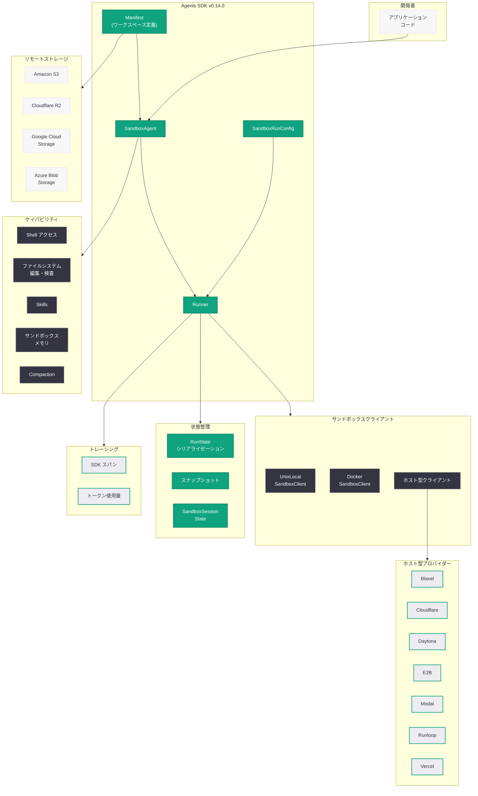

# Agents SDK の次なる進化: Sandbox Agents によるセキュアなエージェント実行環境

## メタデータ

| 項目 | 内容 |
|------|------|
| 発表日 | 2026-04-15 |
| ソース | OpenAI News |
| カテゴリ | Product |
| 公式リンク | [The next evolution of the Agents SDK](https://openai.com/index/the-next-evolution-of-the-agents-sdk) |

## 概要

OpenAI は 2026 年 4 月 15 日、Agents SDK v0.14.0 をリリースし、ネイティブなサンドボックス実行環境とモデルネイティブハーネスを導入した。この大規模アップデートにより、開発者は永続的かつ隔離されたワークスペース上でエージェントを実行できるようになり、ファイル操作、コマンド実行、リポジトリ編集、アーティファクト生成、そして実行の中断と再開をセキュアに行えるようになった。

Sandbox Agents は、既存の `Agent` と `Runner` のフローを維持しながら、ワークスペースマニフェスト、サンドボックスネイティブケイパビリティ、サンドボックスクライアント、スナップショット、レジューム機能を追加する。ローカル開発から Docker コンテナ、さらには Cloudflare、E2B、Modal、Vercel などのホスト型プロバイダーまで、多様な実行バックエンドをサポートしており、開発者がセキュアで長時間実行可能なエージェントを構築するための包括的な基盤を提供する。

## 主な内容

### Sandbox Agents: 永続的で隔離されたエージェント実行環境

Sandbox Agents は、Agents SDK v0.14.0 で導入されたベータ機能であり、エージェントに永続的で隔離されたワークスペースを提供する SDK サーフェスである。従来の `Agent` と `Runner` のフローを踏襲しつつ、以下の主要コンポーネントを追加している。

- **`SandboxAgent`:** サンドボックスのデフォルト設定 (`default_manifest`、サンドボックス命令、ケイパビリティ、`run_as`) を持つ `Agent` の拡張
- **`Manifest`:** ファイル、ディレクトリ、ローカルファイル、ローカルディレクトリ、Git リポジトリ、環境変数、ユーザー、グループ、マウントを定義するワークスペース契約
- **`SandboxRunConfig`:** クライアント作成、ライブセッション注入、シリアライズされたセッションの再開、マニフェストオーバーライド、スナップショット、マテリアライゼーション並行数制限などのサンドボックス実行設定

これにより、エージェントは実際のファイルを操作し、コマンドを実行し、リポジトリを編集し、アーティファクトを生成し、複数の実行にまたがって作業を継続できるようになった。

### サンドボックスクライアントとホスト型プロバイダー

Sandbox Agents は、ローカル、コンテナ化、ホスト型の 3 つの実行バックエンドをサポートしている。

**ローカル実行:**
- **`UnixLocalSandboxClient`:** 高速なローカル開発向け。セットアップ不要で即座にサンドボックス環境を利用可能

**コンテナ実行:**
- **`DockerSandboxClient`:** Docker コンテナによる隔離環境を提供し、イメージパリティを確保

**ホスト型プロバイダー:**
- Blaxel
- Cloudflare
- Daytona
- E2B
- Modal
- Runloop
- Vercel

各プロバイダーは optional extras として提供され、プロバイダー固有のマウント戦略が用意されている。リモートストレージとしては S3、Cloudflare R2、GCS、Azure Blob Storage、S3 Files をサポートしている。

### サンドボックスメモリ: 実行間の学習と知識の蓄積

サンドボックスメモリ機能により、エージェントは過去の実行から得た教訓を将来の実行に活用できるようになった。メモリはサンドボックスワークスペース内に保存され、後続の実行に簡潔なサマリーとして注入される。プログレッシブディスクロージャを採用しており、必要に応じて詳細な情報を段階的に提供する。

主要な機能は以下のとおりである。

- **読み取り専用モード / 生成専用モード:** 用途に応じてメモリの利用方法を制御可能
- **ライブ更新:** エージェントが古くなったメモリを検出した際にリアルタイムで更新
- **マルチターングルーピング:** `conversation_id`、SDK `Session`、`RunConfig.group_id`、または生成されたラン ID による会話のグルーピング
- **個別メモリレイアウト:** エージェントやワークフローごとにメモリを分離
- **S3 バックドメモリ:** S3 を利用した実行間のメモリ永続化

### ワークスペースマウント、スナップショット、レジューム

ワークスペースマウントは多様なソースからのファイルとディレクトリの提供をサポートしている。

**ローカルソース:**
- ローカルファイルとディレクトリ
- 合成ファイルとディレクトリ (プログラムで生成)
- Git リポジトリエントリ

**リモートストレージマウント:**
- Amazon S3
- Cloudflare R2
- Google Cloud Storage (GCS)
- Azure Blob Storage
- S3 Files

**スナップショット機能:** ポータブルなスナップショットにより、パス正規化、シンボリックリンク保持、マウントセーフなスナップショット取得、リモートスナップショットをサポートしている。

**レジューム機能:** 以下の 3 つのパスでエージェントの実行を再開できる。
- Runner が管理する `RunState` による自動レジューム
- 明示的な `SandboxSessionState` による手動レジューム
- 保存されたスナップショットからのレジューム

### ランタイム、トレーシング、モデルプラミング

エージェント実行の基盤となるランタイム層にも大幅な改善が加えられた。

- **Runner 管理のサンドボックス準備:** ケイパビリティバインディング、セッションライフサイクル管理、状態シリアライゼーション、レジューム動作を Runner が一元管理
- **サンドボックス対応の `RunState` シリアライゼーション:** エージェントの実行状態を完全にシリアライズし、後で復元可能
- **統合サンドボックストレーシング:** SDK スパンとの統合トレーシングにより、サンドボックス内の操作を詳細に追跡可能
- **トークン使用量のスパン記録:** 各スパンにトークン使用量を記録し、コスト分析を支援
- **プロンプトキャッシュキーのデフォルト設定:** Runner が管理するプロンプトキャッシュキーのデフォルトにより、キャッシュ効率を最適化
- **OpenAI エージェント登録とハーネス ID 設定:** モデルネイティブハーネスとの統合をサポート

## 技術的な詳細

### コードサンプル

以下のコードサンプルは、Sandbox Agents の基本的な使用方法を示している。

#### 基本的な SandboxAgent の作成と実行

```python
from agents import SandboxAgent, Runner
from agents.sandbox import Manifest, SandboxRunConfig
from agents.sandbox.clients import DockerSandboxClient

# マニフェストでワークスペースを定義
manifest = Manifest(
    files={"main.py": "print('Hello from sandbox!')"},
    directories=["output"],
    env={"PYTHONPATH": "/workspace"},
)

# SandboxAgent を作成
agent = SandboxAgent(
    name="coding-agent",
    instructions="あなたはコーディングアシスタントです。ファイルを編集し、コマンドを実行してください。",
    default_manifest=manifest,
)

# Docker バックエンドでサンドボックスを実行
sandbox_config = SandboxRunConfig(
    client=DockerSandboxClient(image="python:3.12-slim"),
)

result = await Runner.run(
    agent,
    "main.py を修正して、フィボナッチ数列を計算する関数を追加してください。",
    sandbox_run_config=sandbox_config,
)

print(result.final_output)
```

#### Git リポジトリのマウントとコードレビュー

```python
from agents import SandboxAgent, Runner
from agents.sandbox import Manifest, GitRepoEntry, SandboxRunConfig
from agents.sandbox.clients import DockerSandboxClient

# Git リポジトリをマウントするマニフェスト
manifest = Manifest(
    git_repos=[
        GitRepoEntry(
            url="https://github.com/example/project.git",
            branch="feature-branch",
            path="/workspace/project",
        )
    ],
)

agent = SandboxAgent(
    name="code-reviewer",
    instructions="リポジトリのコードをレビューし、改善点を提案してください。",
    default_manifest=manifest,
)

sandbox_config = SandboxRunConfig(
    client=DockerSandboxClient(image="python:3.12-slim"),
)

result = await Runner.run(
    agent,
    "プロジェクト全体のコード品質をレビューしてください。",
    sandbox_run_config=sandbox_config,
)
```

#### スナップショットとレジュームによる長時間タスク

```python
from agents import SandboxAgent, Runner
from agents.sandbox import Manifest, SandboxRunConfig, SandboxSessionState
from agents.sandbox.clients import DockerSandboxClient

agent = SandboxAgent(
    name="long-task-agent",
    instructions="大規模なデータ処理タスクを段階的に実行してください。",
)

sandbox_config = SandboxRunConfig(
    client=DockerSandboxClient(image="python:3.12-slim"),
)

# 初回実行
result = await Runner.run(
    agent,
    "データの前処理を開始してください。",
    sandbox_run_config=sandbox_config,
)

# セッション状態を保存
session_state: SandboxSessionState = result.sandbox_session_state

# 後続の実行でセッションを再開
resume_config = SandboxRunConfig(
    client=DockerSandboxClient(image="python:3.12-slim"),
    session_state=session_state,  # 前回のセッションを復元
)

result = await Runner.run(
    agent,
    "前処理の結果を使って分析を実行してください。",
    sandbox_run_config=resume_config,
)
```

#### サンドボックスメモリの活用

```python
from agents import SandboxAgent, Runner
from agents.sandbox import Manifest, SandboxRunConfig
from agents.sandbox.capabilities import SandboxMemory
from agents.sandbox.clients import DockerSandboxClient

# メモリ機能を有効にした SandboxAgent
agent = SandboxAgent(
    name="learning-agent",
    instructions="過去の経験を活かしてタスクを効率的に実行してください。",
    capabilities=[
        SandboxMemory(
            layout="project-alpha",  # メモリを分離するレイアウト名
        ),
    ],
)

sandbox_config = SandboxRunConfig(
    client=DockerSandboxClient(image="python:3.12-slim"),
    group_id="session-001",  # マルチターングルーピング用 ID
)

# 1 回目の実行: エージェントがタスクを学習
result = await Runner.run(
    agent,
    "このプロジェクトのビルドシステムを調査してください。",
    sandbox_run_config=sandbox_config,
)

# 2 回目の実行: 前回の学習を活用
result = await Runner.run(
    agent,
    "テストスイートを実行し、失敗したテストを修正してください。",
    sandbox_run_config=sandbox_config,
)
```

#### ホスト型プロバイダー (E2B) の利用

```python
from agents import SandboxAgent, Runner
from agents.sandbox import Manifest, SandboxRunConfig

# E2B プロバイダーの場合 (optional extras: pip install agents[e2b])
from agents.sandbox.clients.e2b import E2BSandboxClient

manifest = Manifest(
    files={
        "analysis.py": "import pandas as pd\n# データ分析スクリプト",
    },
)

agent = SandboxAgent(
    name="data-analyst",
    instructions="データ分析を実行し、結果をレポートとして出力してください。",
    default_manifest=manifest,
)

sandbox_config = SandboxRunConfig(
    client=E2BSandboxClient(),
)

result = await Runner.run(
    agent,
    "analysis.py を完成させ、サンプルデータで実行してください。",
    sandbox_run_config=sandbox_config,
)
```

#### リモートストレージマウント (S3) の活用

```python
from agents import SandboxAgent, Runner
from agents.sandbox import Manifest, SandboxRunConfig, S3Mount
from agents.sandbox.clients import DockerSandboxClient

# S3 バケットをマウントするマニフェスト
manifest = Manifest(
    mounts=[
        S3Mount(
            bucket="my-data-bucket",
            prefix="datasets/",
            path="/workspace/data",
            read_only=True,
        ),
        S3Mount(
            bucket="my-output-bucket",
            prefix="results/",
            path="/workspace/output",
        ),
    ],
)

agent = SandboxAgent(
    name="etl-agent",
    instructions="S3 上のデータを読み込み、変換し、結果を出力ディレクトリに保存してください。",
    default_manifest=manifest,
)

sandbox_config = SandboxRunConfig(
    client=DockerSandboxClient(image="python:3.12-slim"),
)

result = await Runner.run(
    agent,
    "/workspace/data 内の CSV ファイルを分析し、集計結果を /workspace/output に保存してください。",
    sandbox_run_config=sandbox_config,
)
```

## アーキテクチャ



## 開発者への影響

- **エージェント開発の安全性が飛躍的に向上:** サンドボックス環境により、エージェントがファイルシステム操作やコマンド実行を行っても、ホスト環境に影響を与えることがなくなった。これにより、コード生成・実行エージェントの本番運用が現実的になる
- **長時間実行タスクへの対応:** スナップショットとレジューム機能により、エージェントの実行を中断・再開できるようになった。大規模なコードレビュー、データ処理、ドキュメント生成など、長時間を要するタスクに対応可能となる
- **マルチクラウド対応の実行環境:** 7 つのホスト型プロバイダーと 4 つのリモートストレージサービスのサポートにより、開発者は自社のインフラストラクチャに最適なバックエンドを選択できる。ローカル開発から本番環境まで、同一のコードで動作する
- **エージェントの知識蓄積:** サンドボックスメモリ機能により、エージェントは過去の実行から学習し、同様のタスクをより効率的に実行できるようになる。プログレッシブディスクロージャにより、メモリの肥大化を防ぎながら知識を蓄積できる
- **既存コードとの互換性:** Sandbox Agents は既存の `Agent` と `Runner` のフローを拡張する形で実装されているため、既存のエージェントコードからの移行コストが低い
- **DevOps ワークフローへの統合:** Git リポジトリのマウント、Docker コンテナによる実行、リモートストレージとの連携により、CI/CD パイプラインや DevOps ワークフローにエージェントを組み込むことが容易になる
- **コスト管理の改善:** トークン使用量のスパン記録とプロンプトキャッシュキーのデフォルト設定により、エージェント実行のコストを詳細に把握し、最適化するための基盤が整った

## 関連リンク

- [The next evolution of the Agents SDK (公式ブログ)](https://openai.com/index/the-next-evolution-of-the-agents-sdk)
- [openai/openai-agents-python (GitHub)](https://github.com/openai/openai-agents-python)
- [Agents SDK v0.14.0 リリースノート](https://github.com/openai/openai-agents-python/releases/tag/v0.14.0)
- [OpenAI Agents SDK ドキュメント](https://openai.github.io/openai-agents-python/)
- [OpenAI Platform ドキュメント](https://platform.openai.com/docs)

## まとめ

Agents SDK v0.14.0 で導入された Sandbox Agents は、エージェント開発における安全性、永続性、スケーラビリティの課題を包括的に解決する大規模なアップデートである。`SandboxAgent`、`Manifest`、`SandboxRunConfig` を中心とするアーキテクチャにより、開発者は既存の `Agent`/`Runner` パターンを維持しながら、隔離されたワークスペースでのファイル操作、コマンド実行、リポジトリ編集を安全に行えるようになった。

ローカル (Unix)、コンテナ (Docker)、ホスト型 (Blaxel、Cloudflare、Daytona、E2B、Modal、Runloop、Vercel) の 3 層の実行バックエンドに加え、S3、R2、GCS、Azure Blob Storage へのリモートストレージマウントをサポートしている。スナップショットとレジューム機能により長時間実行タスクへの対応が可能となり、サンドボックスメモリ機能によりエージェントが過去の実行から学習し知識を蓄積できるようになった。統合トレーシングとトークン使用量記録により、本番環境での運用監視とコスト最適化も支援されている。

この進化により、Agents SDK はコード生成、データ処理、DevOps 自動化、ドキュメント生成など、実際のファイルとツールを操作するセキュアで長時間実行可能なエージェントを構築するための本格的なプラットフォームへと成長した。
