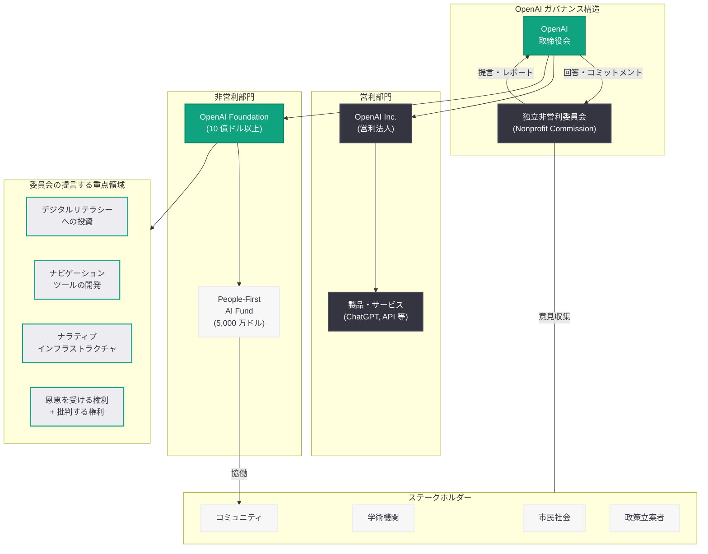

# OpenAI 非営利委員会レポート: 取締役会が独立委員会の提言に回答

## メタデータ

| 項目 | 内容 |
|------|------|
| 発表日 | 2026-04-15 |
| ソース | OpenAI News |
| カテゴリ | 企業 / グローバル・アフェアーズ |
| 公式リンク | [OpenAI Nonprofit Commission Report](https://openai.com/index/nonprofit-commission-report/) |

## 概要

OpenAI は 2026 年 4 月 15 日、独立した非営利委員会 (Nonprofit Commission) が作成したレポートに対する取締役会の回答を公表した。この委員会は、OpenAI の慈善活動が長期的かつ構造的な社会課題にどのように取り組むべきかについて、幅広いステークホルダーからの意見や学びを収集するエンゲージメントプロセスを支援する目的で OpenAI 自身が召集したものである。取締役会は、このレポートが「委員会の独立した調査結果を反映したもの」であると述べ、倫理的な AI、透明性、そして協働へのコミットメントを表明した。

本レポートは、OpenAI が非営利組織から営利企業への移行を進める中で、その社会的使命をいかに維持・発展させるかという根本的な問いに答えるものである。2026 年 3 月 24 日に発表された OpenAI Foundation の 10 億ドル投資計画、そして同日公表された 5,000 万ドル規模の People-First AI Fund と合わせて、OpenAI のフィランソロピー戦略の全体像が明らかになりつつある。

## 主な内容

### 非営利委員会の設立経緯と目的

OpenAI は、自社の慈善活動のあり方について外部の視点を取り入れるため、独立した非営利委員会を召集した。この委員会の使命は、幅広いステークホルダー (市民社会、学術機関、コミュニティ団体、政策立案者など) からフィードバックと学びを収集し、OpenAI のフィランソロピーが長期的かつ構造的な社会課題の解決にどのように貢献できるかを提言することであった。

委員会は OpenAI から独立した立場で調査・分析を行い、最終レポートをまとめた。取締役会は「添付されたレポートは委員会の独立した調査結果を反映している」と明言しており、委員会の自律性が確保されていたことを強調している。

### 委員会の主要な調査結果と提言

委員会のレポートには、以下のような重要な知見と提言が含まれている。

**AI とフィランソロピーの透明性:** AI とフィランソロピーの複雑さが、公的な監視を妨げるベールとなるリスクがあると指摘している。技術と慈善活動の交差点において、透明性の確保が不可欠であるという認識が示された。

**デジタルリテラシーへの投資:** OpenAI の非営利部門は、デジタルリテラシー、ナビゲーションツール、そしてナラティブインフラストラクチャへの投資を行うべきであると提言した。コミュニティが AI を単に利用するだけでなく、理解し、問い正し、影響を与えることができるよう支援する必要があるとしている。

**恩恵を受ける権利と批判する権利:** レポートは、AI から恩恵を受ける権利は批判する権利と対になって初めて最も強固になると主張している。つまり、AI 技術の受益者であるコミュニティが、同時にその技術を批判的に評価し、改善を求める権利を持つべきであるという原則を打ち出した。

**コミュニティ中心のアプローチ:** AI の開発と展開において、コミュニティの声を中心に据えるべきであるという基本方針が強調された。テクノロジー企業主導ではなく、市民社会やコミュニティが主体的に AI のあり方を形作る仕組みが必要であるとしている。

### 取締役会の回答とコミットメント

OpenAI の取締役会は、委員会の提言を受けて以下の分野へのコミットメントを表明した。

- **倫理的 AI への取り組み:** AI の開発・展開における倫理的基準の維持と強化
- **透明性の向上:** フィランソロピー活動および AI 技術に関する情報公開の拡充
- **協働の推進:** ステークホルダーとの継続的な対話と協働関係の構築
- **委員会の提言に基づく具体的施策の実行:** レポートの主要な提言を実際の活動に反映

### 関連する取り組み: People-First AI Fund

委員会レポートの公表と同日に、OpenAI は 5,000 万ドル規模の「People-First AI Fund」を発表した。このファンドはコミュニティと協力して構築することを目的としており、委員会が提言した「コミュニティ中心のアプローチ」を具体的に実現するための施策と位置づけられる。

## 技術的な詳細

### OpenAI の組織構造と非営利部門の位置づけ

OpenAI は創設時に非営利組織として設立されたが、AI 研究の規模拡大に伴い営利部門を設立し、現在は営利企業への完全移行を進めている。この移行において、非営利的な使命をどのように維持するかが重要な課題となっている。

2026 年 3 月 24 日に発表された OpenAI Foundation は、少なくとも 10 億ドルを社会投資に充てる計画を持つ独立した非営利組織である。非営利委員会のレポートは、この Foundation の活動方針を形作る上で重要な指針となる。

### 委員会レポートの構造的意義

非営利委員会のレポートは、単なるフィランソロピー戦略の提言にとどまらず、AI 企業のガバナンスにおける重要な先例を示している。

- **独立した外部評価:** AI 企業が自社の社会貢献活動について独立した外部委員会による評価を受けるという仕組みは、AI 業界におけるアカウンタビリティの新しいモデルとなりうる
- **ステークホルダーエンゲージメント:** 多様なステークホルダーからの意見を体系的に収集し、それを組織の方針に反映するプロセスは、AI ガバナンスのベストプラクティスとして注目される
- **公的監視の確保:** AI とフィランソロピーの複雑さが公的監視を妨げるリスクを明示的に認識し、その対策を講じることを提言している点は、AI 企業の透明性に対する新しい基準を示している

## 開発者への影響

- **コミュニティ向け AI ツールの需要増加:** 委員会がデジタルリテラシーツールやナビゲーションツールへの投資を提言していることから、コミュニティが AI を理解・評価するためのツール開発の機会が拡大する可能性がある
- **People-First AI Fund による資金調達機会:** 5,000 万ドル規模のファンドは、コミュニティ主導の AI プロジェクトに取り組む開発者にとって、新たな資金源となりうる
- **AI の説明可能性・透明性の重要性向上:** 委員会が AI の公的監視の重要性を強調していることから、AI モデルやシステムの説明可能性 (Explainability) や透明性を確保する技術の需要が高まる可能性がある
- **AI 倫理・ガバナンスへの開発者の関与:** AI 開発において倫理的考慮やステークホルダーとの対話がより重要視されるようになり、開発プロセスにおけるガバナンス意識が求められる
- **オープンソースおよび非営利 AI プロジェクトへの支援拡大:** OpenAI Foundation の活動を通じて、社会課題解決に取り組む AI プロジェクトへの技術的・資金的支援が強化されることが期待される

## 関連リンク

- [OpenAI Nonprofit Commission Report (公式)](https://openai.com/index/nonprofit-commission-report/)
- [A $50 million fund to build with communities (People-First AI Fund)](https://openai.com/index/a-50-million-fund-to-build-with-communities/)
- [Update on the OpenAI Foundation](https://openai.com/index/update-on-the-openai-foundation/)
- [OpenAI Foundation の最新情報 (日本語レポート)](./2026-03-24-update-on-the-openai-foundation.md)
- [OpenAI Foundation](https://openai.com/foundation)
- [OpenAI About](https://openai.com/about)

## まとめ

OpenAI の独立非営利委員会は、OpenAI のフィランソロピーが長期的な社会課題に取り組むための包括的な提言をまとめたレポートを公表し、取締役会がこれに回答した。委員会は、AI とフィランソロピーの複雑さが公的監視を妨げるリスクを指摘し、デジタルリテラシーへの投資、コミュニティが AI を理解・批判・影響を与えるための基盤整備、そして「恩恵を受ける権利は批判する権利と対になる」という原則を打ち出した。取締役会は倫理的 AI、透明性、協働へのコミットメントを表明している。

このレポートは、同日発表された 5,000 万ドル規模の People-First AI Fund、そして 2026 年 3 月に発表された OpenAI Foundation の 10 億ドル投資計画と一体をなすものであり、OpenAI が営利企業への移行を進めながらも非営利的な社会使命を維持・発展させるための戦略的フレームワークの一部である。AI 企業が独立した外部委員会によるフィランソロピー評価を受けるという試みは、AI 業界におけるガバナンスとアカウンタビリティの新しいモデルとして注目に値する。
