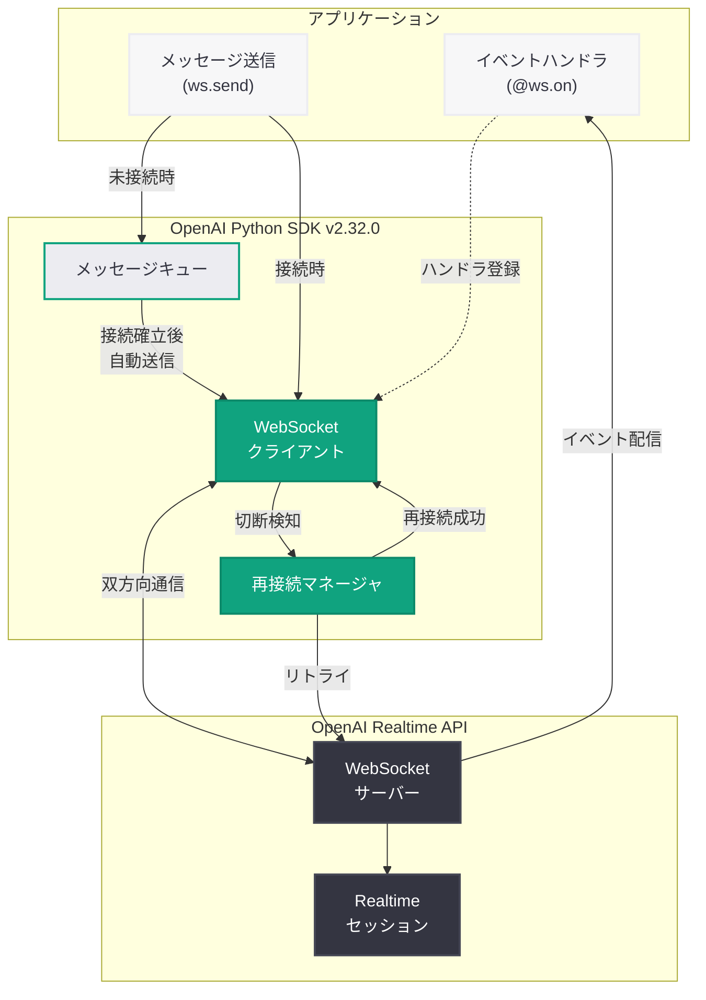

# OpenAI Python SDK v2.32.0: WebSocket 再接続とイベントハンドラの大幅強化

## メタデータ

| 項目 | 内容 |
|------|------|
| 発表日 | 2026-04-15 |
| ソース | OpenAI API Changelog (GitHub Releases) |
| カテゴリ | API 更新 |
| 公式リンク | [Python SDK v2.32.0](https://github.com/openai/openai-python/releases/tag/v2.32.0) |

## 概要

OpenAI は 2026 年 4 月 15 日、Python SDK v2.32.0 をリリースした。今回のリリースの最大の注目点は、WebSocket クライアントに対する 3 つの重要な機能追加である。具体的には、イベントハンドラの実装、未接続状態でのメッセージエンキュー、そして自動再接続 (reconnection) のサポートが導入された。これらの機能により、Realtime API を利用するアプリケーションの堅牢性と開発体験が大幅に向上する。

さらに、API レベルの更新として `InputFileContent` への `detail` パラメータの追加と `OAuthErrorCode` 型の新規追加が含まれている。バグ修正として、ファイルデータ送信時にパラメータが重複して送信される問題が解消された。

## 主な内容

### WebSocket イベントハンドラの実装

Python SDK の WebSocket クライアントにイベントハンドラ (event handler) の実装が追加された。従来の Python SDK では、WebSocket からのイベントを処理する際にポーリングや低レベルのコールバック管理が必要だったが、v2.32.0 ではイベントハンドラパターンが公式にサポートされるようになった。これにより、Realtime API のオーディオストリーミングやテキスト応答の処理を、より宣言的かつ構造化された方法で実装できる。

### 未接続状態でのメッセージエンキュー

WebSocket が接続状態でない場合でもメッセージをキューに追加できるようになった。従来は WebSocket 接続が確立される前やネットワーク切断中にメッセージを送信しようとすると例外が発生していたが、v2.32.0 ではメッセージが内部キューに蓄積され、接続が確立または再確立された時点で自動的に送信される。

この改善は、不安定なネットワーク環境やモバイルアプリケーションにおいて特に有効であり、接続状態を意識することなく一貫したメッセージ送信ロジックを記述できるようになる。

### WebSocket 自動再接続のサポート

WebSocket 接続が切断された場合に自動的に再接続を試みる機能が追加された。ネットワークの一時的な障害やサーバー側のタイムアウトなどが発生した際に、SDK が自動的にリトライ処理を行い、アプリケーション側での手動再接続ロジックが不要になる。再接続時には、キューに蓄積されたメッセージが順次送信されるため、セッションの継続性が保たれる。

### InputFileContent への detail パラメータ追加

`InputFileContent` に `detail` パラメータが追加された。これは、ファイルコンテンツを API に送信する際に、処理の詳細度 (detail level) を指定できるようにするものである。画像ファイルを Vision 機能で処理する際に、`high` や `low` といった解像度レベルを `InputFileContent` 経由で直接指定できるようになり、API 呼び出しの柔軟性が向上した。

### OAuthErrorCode 型の追加

OAuth 関連のエラーコードを表す `OAuthErrorCode` 型が新たに追加された。OpenAI の OAuth 認証フローにおいて発生しうるエラーを型安全に処理できるようになり、認証エラーのハンドリングコードの品質と保守性が向上する。

## 技術的な詳細

### コードサンプル

#### WebSocket イベントハンドラの使用例

```python
from openai import OpenAI

client = OpenAI()

# Realtime API with event handler (new in v2.32.0)
async with client.realtime.connect(model="gpt-4o-realtime") as ws:
    # Register event handlers for different event types
    @ws.on("response.audio.delta")
    async def handle_audio(event):
        # Process audio stream chunks
        audio_data = event.delta
        await play_audio(audio_data)

    @ws.on("response.text.delta")
    async def handle_text(event):
        # Process text stream chunks
        print(event.delta, end="", flush=True)

    @ws.on("error")
    async def handle_error(event):
        print(f"Error occurred: {event.error}")

    # Send a message to start the conversation
    await ws.send({
        "type": "conversation.item.create",
        "item": {
            "type": "message",
            "role": "user",
            "content": [{"type": "input_text", "text": "Hello!"}]
        }
    })

    await ws.send({"type": "response.create"})
```

#### 未接続状態でのエンキューと再接続

```python
from openai import OpenAI

client = OpenAI()

# WebSocket with reconnection support (new in v2.32.0)
async with client.realtime.connect(
    model="gpt-4o-realtime",
    # Enable automatic reconnection
    reconnect=True,
) as ws:
    # Messages can be enqueued even before connection is ready
    # They will be sent automatically once connected
    await ws.send({
        "type": "session.update",
        "session": {
            "modalities": ["text", "audio"],
            "instructions": "You are a helpful assistant.",
        }
    })

    @ws.on("session.created")
    async def on_session_created(event):
        print("Session created, sending message...")
        await ws.send({
            "type": "conversation.item.create",
            "item": {
                "type": "message",
                "role": "user",
                "content": [{"type": "input_text", "text": "Tell me a joke."}]
            }
        })
        await ws.send({"type": "response.create"})

    @ws.on("response.text.done")
    async def on_text_done(event):
        print(f"\nComplete response: {event.text}")
```

#### InputFileContent に detail パラメータを指定

```python
from openai import OpenAI

client = OpenAI()

# Using detail parameter with InputFileContent (new in v2.32.0)
response = client.responses.create(
    model="gpt-4o",
    input=[
        {
            "role": "user",
            "content": [
                {
                    "type": "input_file",
                    "file_data": "data:image/png;base64,iVBORw0KGgo...",
                    "detail": "high"  # Specify detail level: "high" or "low"
                },
                {
                    "type": "input_text",
                    "text": "Describe what you see in this image in detail."
                }
            ]
        }
    ]
)

print(response.output_text)
```

### 変更一覧

| 種別 | 変更内容 |
|------|---------|
| 機能追加 | WebSocket クライアントにイベントハンドラの実装を追加 |
| 機能追加 | WebSocket 未接続状態でのメッセージエンキューをサポート |
| 機能追加 | WebSocket の自動再接続 (reconnection) をサポート |
| 機能追加 | `InputFileContent` に `detail` パラメータを追加 |
| 機能追加 | `OAuthErrorCode` 型を追加 |
| バグ修正 | ファイルデータが複数パラメータとして送信される問題を修正 |
| ドキュメント | サンプルコードの改善 |

## アーキテクチャ

以下の図は、v2.32.0 で強化された WebSocket クライアントの再接続フローを示している。ネットワーク切断が発生した場合でも、メッセージキューと自動再接続により、アプリケーションの継続性が保たれる仕組みを表している。



## 開発者への影響

### Realtime API 利用者への恩恵

- **堅牢なリアルタイム通信:** 自動再接続機能により、ネットワーク障害時にもセッションが自動的に復旧し、ユーザー体験の中断を最小限に抑えられる
- **宣言的なイベント処理:** イベントハンドラパターンにより、各イベントタイプに対する処理を個別に定義でき、コードの可読性と保守性が大幅に向上する
- **メッセージの信頼性向上:** 未接続状態でもメッセージをエンキューできるため、タイミングに依存しない安定したメッセージ送信が可能になる

### ファイル処理の柔軟性向上

- **Vision 処理の最適化:** `InputFileContent` の `detail` パラメータにより、画像の処理解像度を明示的に制御でき、コストとレスポンス速度のバランスを調整できる
- **ファイル送信の信頼性改善:** ファイルデータが重複パラメータとして送信されるバグが修正され、大容量ファイルの送信が安定する

### OAuth 認証のエラーハンドリング

- **型安全な認証エラー処理:** `OAuthErrorCode` 型の追加により、OAuth 認証フローにおけるエラーを網羅的かつ型安全に処理できるようになった

### アップグレード時の注意点

- WebSocket 関連の API は追加的な変更であり、既存コードへの破壊的影響はない
- ファイルデータ送信のバグ修正により、一部のワークアラウンドコードが不要になる可能性がある
- v2.31.0 からのアップグレードでは、互換性の問題は報告されていない

## 関連リンク

- [Python SDK v2.32.0 リリースノート](https://github.com/openai/openai-python/releases/tag/v2.32.0)
- [OpenAI Realtime API ドキュメント](https://platform.openai.com/docs/guides/realtime)
- [OpenAI API Changelog](https://platform.openai.com/docs/changelog)
- [openai-python GitHub リポジトリ](https://github.com/openai/openai-python)
- [OpenAI API リファレンス](https://platform.openai.com/docs/api-reference)

## まとめ

Python SDK v2.32.0 は、WebSocket クライアントの機能を大幅に強化するリリースである。イベントハンドラの実装、未接続状態でのメッセージエンキュー、そして自動再接続のサポートという 3 つの WebSocket 関連機能が同時に追加されたことで、Realtime API を利用するアプリケーションの開発体験と運用時の堅牢性が飛躍的に向上した。特に自動再接続とメッセージキューの組み合わせにより、不安定なネットワーク環境でもセッションの継続性を維持できるようになった点は、プロダクション環境での Realtime API 活用において重要な進展である。加えて、`InputFileContent` への `detail` パラメータ追加はファイル処理の柔軟性を高め、`OAuthErrorCode` 型の追加は認証エラーの型安全な処理を可能にする。WebSocket 機能の成熟は、OpenAI の Realtime API エコシステムが着実に進化していることを示している。
