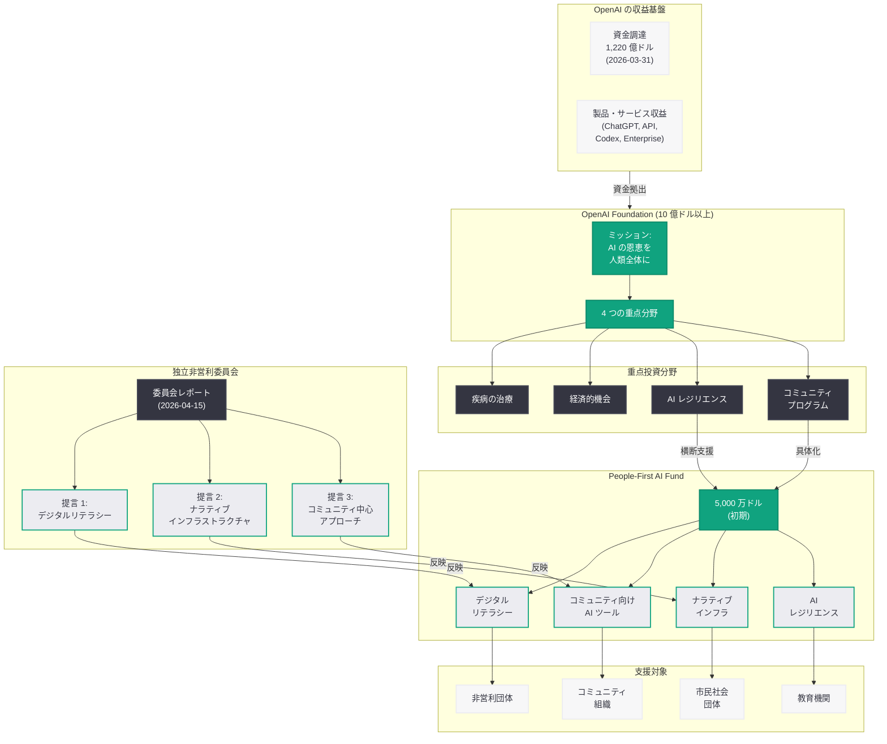

# OpenAI、5,000 万ドルの People-First AI Fund を設立: コミュニティと共に築く AI の未来

## メタデータ

| 項目 | 内容 |
|------|------|
| 発表日 | 2026-04-15 |
| ソース | OpenAI News |
| カテゴリ | 企業 / グローバル・アフェアーズ |
| 公式リンク | [People-First AI Fund](https://openai.com/index/people-first-ai-fund/) |

> **注記:** 本レポートは、元記事が Cloudflare のアクセス制限により全文取得できなかったため、OpenAI のサイトマップ情報 (lastmod: 2026-04-15)、同日公表された非営利委員会レポート、OpenAI Foundation に関する既存の公式発表、および関連報道に基づいて作成されている。正確な詳細については公式ページを参照されたい。

## 概要

OpenAI は 2026 年 4 月 15 日、非営利団体やコミュニティ組織を支援するための 5,000 万ドル (約 75 億円) 規模の初期ファンド「People-First AI Fund」を発表した。本ファンドは、同日公表された独立非営利委員会 (Nonprofit Commission) のレポートに基づいて設計されており、AI 技術の恩恵をコミュニティレベルで実現するための具体的な資金的裏付けとなるものである。

本ファンドの最大の特徴は、「コミュニティのために (for)」ではなく「コミュニティと共に (with)」構築するという姿勢を明確に打ち出している点にある。2026 年 3 月 24 日に発表された OpenAI Foundation の 10 億ドル社会投資計画における最初の具体的な大型施策として位置づけられ、デジタルリテラシーの向上、コミュニティ向け AI ツールの開発、ナラティブインフラストラクチャの構築といった、非営利委員会が提言した重点領域への投資を実行に移すものである。OpenAI が 2026 年 3 月 31 日に完了した 1,220 億ドルの資金調達を背景に、営利企業としての成長と社会的使命の両立を具体的な行動で示す取り組みとして注目される。

## 主な内容

### People-First AI Fund の概要

People-First AI Fund は、OpenAI Foundation が運営する 5,000 万ドル規模の初期ファンドであり、非営利団体およびコミュニティ組織を対象とした助成・支援プログラムである。「初期 (initial)」という表現が用いられていることから、今後の活動状況や成果に応じて追加的な資金投入が行われる可能性がある。

| 項目 | 内容 |
|------|------|
| ファンド名 | People-First AI Fund |
| 規模 | 5,000 万ドル (初期) |
| 運営主体 | OpenAI Foundation |
| 対象 | 非営利団体、コミュニティ組織 |
| 根拠 | 独立非営利委員会レポートの提言 |
| 上位計画 | OpenAI Foundation 10 億ドル社会投資計画 |

本ファンドは、OpenAI Foundation が掲げる 4 つの重点投資分野 (疾病の治療、経済的機会の創出、AI レジリエンス、コミュニティプログラム) のうち、特に「コミュニティプログラム」領域を具体化するものである。ただし、デジタルリテラシーや AI レジリエンスといった他の領域とも横断的に関連しており、包括的な社会課題への対応を目指している。

### 非営利委員会レポートとの関連

People-First AI Fund は、同日公表された独立非営利委員会レポートの提言を直接的に反映して設計されている。委員会は、OpenAI が幅広いステークホルダーからフィードバックを収集するために召集したもので、以下の主要な提言がファンドの方向性に反映されている。

**デジタルリテラシーへの投資:** 委員会は、OpenAI の非営利部門がデジタルリテラシー、ナビゲーションツール、ナラティブインフラストラクチャへの投資を行うべきであると提言した。People-First AI Fund は、この提言を具体的な資金として実現するものである。

**コミュニティ中心のアプローチ:** 委員会は、AI の開発・展開においてコミュニティの声を中心に据えるべきであると強調した。ファンドの名称に含まれる「People-First」は、この原則を直接反映している。テクノロジー企業が一方的にソリューションを提供するのではなく、コミュニティ自身が AI のあり方を形作る主体となることを支援する。

**恩恵と批判の権利の両立:** 委員会は、AI から恩恵を受ける権利は批判する権利と対になって初めて最も強固になると主張した。ファンドの支援を受けるコミュニティ組織が、OpenAI の技術に対して批判的な評価を行う自由を持つことが、このファンドの健全な運営にとって不可欠な原則となる。

**公的監視の確保:** AI とフィランソロピーの複雑さが公的監視を妨げるベールとなるリスクが指摘されており、ファンドの運営においても透明性の確保が求められている。

### 重点投資領域

非営利委員会の提言および OpenAI Foundation の方針に基づき、People-First AI Fund は以下の領域を重点的に支援するものと考えられる。

#### デジタルリテラシー

AI 技術が急速に普及する中、コミュニティレベルでの AI リテラシー向上は喫緊の課題である。特に、AI の仕組みを理解し、AI が生成する情報を批判的に評価する能力、AI ツールを安全かつ効果的に活用する技能の教育が重点となる。2026 年 4 月 10 日に正式ローンチされた OpenAI Academy が主に企業・チーム向けの教育を担うのに対し、本ファンドは非営利団体やコミュニティ組織を通じた草の根レベルでの AI リテラシー教育を支援するものと位置づけられる。

#### コミュニティ向け AI ツール

非営利団体やコミュニティ組織が AI を効果的に活用するためのツールやプラットフォームの開発・提供が想定される。これには以下が含まれると考えられる。

- 非営利団体の業務効率化のための AI ツール
- コミュニティ向け情報提供・相談対応の AI アシスタント
- 地域課題の分析・可視化のための AI ツール
- 多言語対応の AI コミュニケーションツール

#### ナラティブインフラストラクチャ

委員会が特に重視した領域の一つが「ナラティブインフラストラクチャ」である。これは、AI に関する議論や物語が社会の中でどのように形成・共有されるかという基盤を指す概念である。AI テクノロジーに関する公正で多様な声を確保し、特定の企業や技術者コミュニティだけでなく、幅広い市民社会が AI の方向性に関する議論に参加できる環境の整備を目指している。

#### AI レジリエンス

コミュニティが AI のリスクや課題に対して備え、回復力を持つための支援も重点領域の一つである。AI の誤用・悪用に対する防御策の開発、AI システムに依存することのリスク管理、AI が社会に与える影響を継続的にモニタリングする体制の構築などが含まれる。

### コミュニティとの「共創」アプローチ

本ファンドの公式タイトルが「A $50 million fund to build with communities」であることから明らかなように、「共に構築する (build with)」というアプローチがファンドの核心に据えられている。

従来型のフィランソロピーが「資金提供者が方向性を決定し、受益者がそれに従う」というトップダウン型のモデルであったのに対し、People-First AI Fund は以下のような特徴を持つと考えられる。

- **コミュニティの主体性:** 支援対象のコミュニティ組織自身が課題を定義し、解決策を設計する
- **双方向の学び:** OpenAI がコミュニティの知見から学び、それを技術開発やポリシーに反映する
- **長期的なパートナーシップ:** 単発の助成ではなく、継続的な関係構築を通じた支援
- **現場の声の反映:** AI の影響を最も直接的に受けるコミュニティの声を、AI 開発のフィードバックループに組み込む

## 技術的な詳細

### コミュニティ組織への AI 技術支援

People-First AI Fund を通じて、コミュニティ組織には資金的支援に加えて、AI 技術へのアクセスが提供される可能性が高い。OpenAI Foundation の投資実行体制として想定されている技術支援 (AI 技術やコンピューティングリソースの無償または低コストでの提供) は、本ファンドにおいても重要な要素となる。

具体的には以下のような技術支援が想定される。

- **API アクセスの提供:** OpenAI API への無償または優遇アクセスにより、非営利団体が ChatGPT や GPT モデルを活用したサービスを構築できる環境の整備
- **カスタム GPT の構築支援:** コミュニティの特定のニーズに合わせたカスタム GPT の開発・展開の技術的サポート
- **トレーニングとキャパシティビルディング:** 非営利団体のスタッフに対する AI 活用のトレーニングプログラムの提供
- **セキュリティとプライバシーの支援:** コミュニティデータを安全に取り扱うためのセキュリティ・プライバシー対策のガイダンス

### OpenAI Foundation のフィランソロピー構造における位置づけ

## 開発者への影響

- **コミュニティ向け AI アプリケーションの開発機会:** People-First AI Fund がコミュニティ組織の AI 活用を支援することで、非営利セクター向けの AI アプリケーション開発の需要が増加する可能性がある。開発者にとっては、社会課題解決に直結する AI ソリューションの構築という新たな市場が開かれる
- **People-First AI Fund による資金調達機会:** 5,000 万ドル規模のファンドは、コミュニティ主導の AI プロジェクトに取り組む開発者やスタートアップにとって、新たな資金源となりうる。特に、非営利団体と協力して AI ツールを開発するプロジェクトは、ファンドの支援対象となる可能性が高い
- **AI の説明可能性と透明性の技術需要:** 委員会がコミュニティによる AI の理解と批判的評価を重視していることから、AI モデルの説明可能性 (Explainability) や判断プロセスの透明性を確保する技術の需要が高まると考えられる
- **多言語・多文化対応の重要性:** コミュニティ向け AI ツールは、多様な言語や文化的背景を持つユーザーに対応する必要があるため、多言語処理やローカライゼーションの技術がより重要になる
- **デジタルリテラシー教育ツールの開発:** AI リテラシー向上のための教育ツールやプラットフォームの開発需要が生まれ、EdTech 分野の開発者にとって新たな機会となる
- **オープンソースプロジェクトへの波及効果:** ファンドがコミュニティの AI 活用を促進することで、非営利団体向けのオープンソース AI ツールの開発やコントリビューションが活発化する可能性がある

## 背景と文脈

### OpenAI の企業構造転換との関連

People-First AI Fund の発表は、OpenAI が非営利組織から営利企業への構造転換を進める中で、社会的使命の維持を具体的な行動で示す重要な施策である。2026 年 3 月 31 日に完了した 1,220 億ドルの資金調達により企業評価額が 8,520 億ドルに達し、IPO の準備も進む中で、OpenAI が非営利的なミッションを形骸化させないための仕組みづくりが問われている。

### 秘密資金提供問題への対応

2026 年 4 月 5 日には、Futurism が OpenAI による非営利研究団体への秘密資金提供を報じ、資金提供の透明性に対する批判が高まっていた。People-First AI Fund の発表において、独立した非営利委員会の提言に基づく設計であることが強調されていることは、こうした批判への対応という側面も持つ。透明性と独立性を確保したフィランソロピーの仕組みを構築することで、以前の秘密資金提供問題とは一線を画す姿勢を示している。

### OpenAI Foundation の助成活動の加速

People-First AI Fund は、OpenAI Foundation の助成活動が加速している流れの一環として位置づけられる。

| 日付 | 施策 | 内容 |
|------|------|------|
| 2026-03-24 | OpenAI Foundation 発表 | 10 億ドル以上の社会投資計画 |
| 2026-04-06 | Intelligence Age の産業政策 | 人間中心の産業政策を提言 |
| 2026-04-08 | Child Safety Blueprint | 子どもの安全に関するグローバルフレームワーク |
| 2026-04-10 | OpenAI Academy | AI 教育プラットフォームのローンチ |
| 2026-04-12 | EMEA Youth and Wellbeing Grant | EMEA 地域の若者の安全とウェルビーイング支援 |
| 2026-04-15 | 非営利委員会レポート | 独立委員会の提言と取締役会の回答 |
| 2026-04-15 | People-First AI Fund | 5,000 万ドルのコミュニティ支援ファンド |

この一連の流れは、OpenAI Foundation が理念の表明段階から、具体的な資金拠出と組織的実行の段階へと移行していることを示している。

## 関連リンク

- [People-First AI Fund (公式)](https://openai.com/index/people-first-ai-fund/)
- [OpenAI Nonprofit Commission Report (公式)](https://openai.com/index/nonprofit-commission-report/)
- [Update on the OpenAI Foundation (公式)](https://openai.com/index/update-on-the-openai-foundation/)
- [OpenAI Foundation](https://openai.com/foundation)
- [OpenAI News](https://openai.com/news)

### 関連レポート

- [OpenAI 非営利委員会レポート](./2026-04-15-nonprofit-commission-report.md)
- [OpenAI Foundation の最新情報](./2026-03-24-update-on-the-openai-foundation.md)
- [OpenAI、1,220 億ドルの資金調達を発表](./2026-03-31-accelerating-the-next-phase-ai.md)
- [Intelligence Age のための産業政策](./2026-04-06-industrial-policy-intelligence-age.md)
- [EMEA Youth and Wellbeing Grant](./2026-04-12-emea-youth-wellbeing-grant.md)
- [OpenAI Academy ローンチ](./2026-04-10-openai-academy-launch.md)
- [OpenAI 秘密資金提供問題](./2026-04-05-openai-secret-nonprofit-funding.md)

## まとめ

OpenAI が発表した「People-First AI Fund」は、5,000 万ドル規模の初期ファンドとして、非営利団体やコミュニティ組織が AI の恩恵を実際に享受するための具体的な資金的裏付けを提供するものである。同日公表された独立非営利委員会レポートの提言に基づいて設計されており、デジタルリテラシーへの投資、コミュニティ向け AI ツールの開発、ナラティブインフラストラクチャの構築、AI レジリエンスの強化を重点領域としている。

本ファンドの最も重要な特徴は、「コミュニティと共に構築する (build with communities)」という共創アプローチを採用している点にある。コミュニティ自身が課題を定義し、解決策を設計する主体となることを支援するこのモデルは、従来型のトップダウン型フィランソロピーからの転換を示している。また、委員会が打ち出した「恩恵を受ける権利は批判する権利と対になる」という原則は、AI 企業のフィランソロピーにおける独立性と透明性の新たな基準を提示するものである。

OpenAI Foundation の 10 億ドル投資計画の最初の具体的な大型施策として、People-First AI Fund は OpenAI が営利企業への構造転換を進めながらも、社会的使命を具体的な行動で実現する意志を示すものである。1,220 億ドルの資金調達後という文脈において、その資金力を社会に還元する最初の一歩として、今後のファンドの運営実態と成果が注目される。
