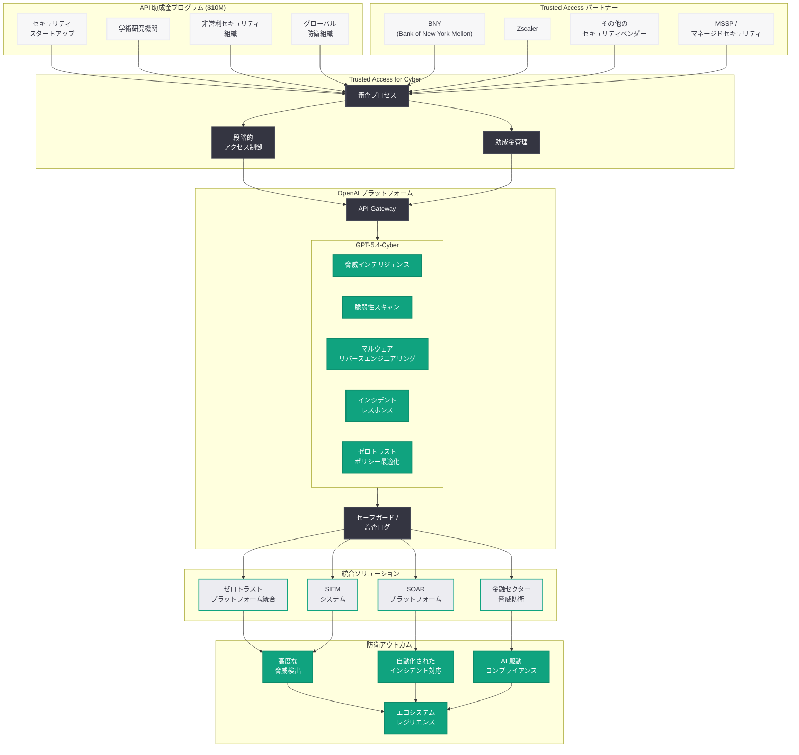
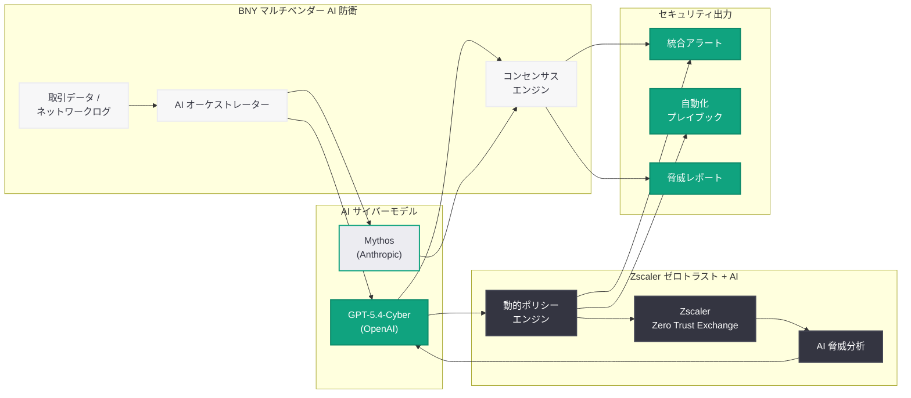

# サイバー防衛エコシステムの加速: 1,000 万ドルの API 助成金と業界パートナーシップの拡大

## メタデータ

| 項目 | 内容 |
|------|------|
| 発表日 | 2026-04-16 |
| ソース | OpenAI News |
| カテゴリ | Security |
| 公式リンク | [Accelerating the cyber defense ecosystem that protects us all](https://openai.com/index/accelerating-cyber-defense-ecosystem) |

> **注記:** 本レポートは RSS フィード情報および複数の公開ニュースソース (Forbes、SecurityWeek、Axios、CyberScoop、SDxCentral、Hackread、The Hacker News、GovInfoSecurity、Security Magazine) に基づいて作成されている。記事公開ページへの直接アクセスが Cloudflare の保護により制限されていたため、RSS の説明文および関連する報道をもとに内容を構成している。
>
> **関連レポート:** 本レポートは 2026 年 4 月 16 日に発表されたエコシステム拡大に関するものであり、2 日前の 4 月 14 日に発表された Trusted Access for Cyber プログラムの初期拡大 (GPT-5.4-Cyber の導入) については [サイバー防衛の新時代に向けた Trusted Access プログラムの拡大](./2026-04-14-scaling-trusted-access-cyber-defense.md) を参照されたい。

## 概要

OpenAI は 2026 年 4 月 16 日、サイバー防衛エコシステムの強化を目的とした大規模な施策を発表した。1,000 万ドル (約 15 億円) 規模の API 助成金プログラムの設立、GPT-5.4-Cyber へのアクセス拡大、そして BNY (Bank of New York Mellon) や Zscaler をはじめとする主要セキュリティ企業および金融機関のパートナー参画が主な内容である。4 月 14 日に発表された Trusted Access for Cyber プログラムの拡大から僅か 2 日後のこの発表は、OpenAI がサイバーセキュリティ分野において防衛側のエコシステム全体を包括的に支援する戦略を加速させていることを示している。

注目すべきは、この発表が Anthropic による Mythos サイバーセキュリティモデルの公開直後に行われたという競争的文脈である。Axios の報道によれば、BNY は OpenAI と Anthropic の双方から先進的なサイバーモデルへのアクセスを得ており、大手金融機関が AI サイバーセキュリティの分野で複数の AI プロバイダーを戦略的に活用する動きが顕在化している。OpenAI は助成金による経済的支援とパートナーネットワークの拡大という二軸で、エコシステムにおける自社の地位を強化しようとしている。

## 主な内容

### 1,000 万ドルの API 助成金プログラム

OpenAI は、グローバルなサイバー防衛エコシステムの強化を目的として、総額 1,000 万ドルの API 助成金を拠出することを発表した。この助成金プログラムは、以下の目的で設計されていると考えられる。

- **セキュリティスタートアップへの支援:** 革新的なサイバーセキュリティソリューションを開発する新興企業に対して、GPT-5.4-Cyber の API クレジットを提供し、プロダクト開発を加速させる
- **学術研究機関への助成:** 大学やリサーチラボにおけるサイバーセキュリティ AI 研究を支援し、防衛技術の基礎研究を促進する
- **非営利セキュリティ組織の支援:** CERT/CSIRT、ISAC (Information Sharing and Analysis Center) などの非営利セキュリティ組織が AI を活用した防衛能力を構築するための資金を提供する
- **グローバルな防衛能力の底上げ:** 特にリソースが限られた地域や組織に対して、高度な AI サイバーセキュリティツールへのアクセスを民主化する

1,000 万ドルという規模は、OpenAI がこれまでに実施してきた各種助成金プログラム (教育、ヘルスケアなど) と同等以上であり、サイバーセキュリティ分野へのコミットメントの強さを示している。API クレジットとして提供されることで、助成金受給者は GPT-5.4-Cyber を含む OpenAI のセキュリティ機能を直接活用した開発に着手できる。

### GPT-5.4-Cyber のアクセス拡大

4 月 14 日の発表では、厳格な審査を通過した限定的な防衛者に対して GPT-5.4-Cyber が提供されたが、今回の発表ではそのアクセス範囲が大幅に拡大された。「より広範な審査済み防衛者 (a wider set of vetted defenders)」への提供開始が明示されており、以下のカテゴリへの拡大が想定される。

- **大手セキュリティベンダー:** エンタープライズセキュリティ製品に GPT-5.4-Cyber を統合するための優先アクセス
- **金融機関のセキュリティチーム:** BNY の参画に代表される、金融セクターのサイバー防衛チームへのアクセス開放
- **ゼロトラストセキュリティプロバイダー:** Zscaler の参画に代表される、次世代ネットワークセキュリティ企業への提供
- **MSSP (Managed Security Service Provider):** マネージドセキュリティサービスを提供する企業が、GPT-5.4-Cyber を活用したサービスを構築するためのアクセス
- **重要インフラ防衛組織:** エネルギー、通信、交通などの重要インフラセクターのセキュリティチーム

### 新規パートナーの参画

今回の発表において、複数の主要企業が Trusted Access for Cyber プログラムへの新規参画を表明している。

#### BNY (Bank of New York Mellon)

世界最大のカストディアン銀行である BNY の参画は、金融セクターにおける AI サイバーセキュリティの採用を象徴する重要な動きである。Axios の報道によれば、BNY は OpenAI の GPT-5.4-Cyber と Anthropic の Mythos の双方にアクセスを得ており、マルチベンダー AI セキュリティ戦略を採用している。

- **金融セクターの脅威対応:** 高度な金融詐欺、ランサムウェア攻撃、サプライチェーン攻撃に対する AI を活用した防衛
- **コンプライアンス要件への対応:** 金融規制当局が要求する高度なセキュリティ体制を AI で強化
- **デュアルベンダー戦略:** 単一の AI プロバイダーへの依存を避け、複数のサイバーセキュリティ AI モデルを並行活用

#### Zscaler

ゼロトラストセキュリティのリーディングカンパニーである Zscaler の参画は、AI とゼロトラストアーキテクチャの融合という新たなパラダイムを示している。SDxCentral の報道によれば、Zscaler と OpenAI はゼロトラストセキュリティを AI アクセラレーターに変えるための提携を発表している。

- **ゼロトラスト + AI の統合:** Zscaler のゼロトラストエクスチェンジプラットフォームに GPT-5.4-Cyber の脅威分析能力を統合し、リアルタイムの脅威検出と対応を強化
- **AI 駆動のポリシー最適化:** ゼロトラストポリシーの動的な最適化に AI を活用し、セキュリティと利便性のバランスを自動調整
- **大規模脅威インテリジェンスの処理:** Zscaler が日次で処理する数千億のトランザクションデータを GPT-5.4-Cyber で分析し、新興脅威の早期検出を実現

#### その他の参画企業

報道からは、上記 2 社以外にも複数の主要セキュリティ企業およびエンタープライズ組織が Trusted Access for Cyber プログラムに参画していることが示唆されている。具体的な企業名の完全なリストは公式発表を参照されたい。

### Anthropic との競争的文脈

今回の発表において注目すべきは、その競争的な文脈である。複数のメディアが報じているように、OpenAI のエコシステム拡大は Anthropic が Mythos サイバーセキュリティモデルを公開した直後に行われた。

- **タイミングの戦略性:** Anthropic の Mythos 発表直後にアクセス拡大と助成金プログラムを発表することで、サイバーセキュリティ AI 市場における主導的地位を維持する意図がある
- **差別化戦略:** OpenAI は単なるモデル提供ではなく、1,000 万ドルの助成金を含むエコシステム全体の支援という差別化戦略を採用している
- **金融セクターの争奪:** BNY が両社のモデルにアクセスを得ていることは、大手金融機関の AI セキュリティ市場をめぐる激しい競争を反映している
- **防衛側の恩恵:** AI プロバイダー間の競争は、結果的に防衛側の選択肢を増やし、サイバーセキュリティエコシステム全体の強化につながる

### 銀行セクターへの積極的なアプローチ

複数の報道が指摘しているように、OpenAI は今回の発表において特に銀行・金融セクターへの積極的なアプローチを展開している。

- **金融機関の課題への対応:** 金融機関は最も高度なサイバー脅威にさらされるセクターの一つであり、GPT-5.4-Cyber の能力を最も有効に活用できる分野である
- **規制対応の支援:** 金融規制 (PCI DSS、SOX、GLBA など) のコンプライアンス要件を AI で効率的に満たすための支援
- **高付加価値市場の開拓:** 金融セクターは IT セキュリティ投資額が最大の業種の一つであり、商業的にも重要な市場である

## 技術的な詳細

### GPT-5.4-Cyber API の活用パターン

Trusted Access for Cyber プログラムのパートナー企業が GPT-5.4-Cyber を活用する際の主要なユースケースとコードパターンを以下に示す。

#### ゼロトラストポリシーの AI 最適化

Zscaler のようなゼロトラストプロバイダーが、GPT-5.4-Cyber を活用してポリシーを動的に最適化するパターンである。

```python
from openai import OpenAI

client = OpenAI()

# ゼロトラストポリシーの AI 駆動最適化
def analyze_zero_trust_policy(current_policy: str, access_logs: str) -> str:
    """
    現行のゼロトラストポリシーとアクセスログを分析し、
    セキュリティリスクとポリシー最適化の推奨事項を提供する。
    """
    response = client.chat.completions.create(
        model="gpt-5.4-cyber",
        messages=[
            {
                "role": "system",
                "content": (
                    "You are a zero-trust security policy analyst. "
                    "Analyze the current zero-trust policies and access logs "
                    "to identify security gaps, anomalous access patterns, "
                    "and recommend policy optimizations. Output your analysis "
                    "in a structured format with severity ratings."
                )
            },
            {
                "role": "user",
                "content": (
                    f"Current Zero-Trust Policy:\n{current_policy}\n\n"
                    f"Recent Access Logs (last 24h):\n{access_logs}\n\n"
                    "Please analyze for:\n"
                    "1. Policy violations and anomalous patterns\n"
                    "2. Overly permissive rules that should be tightened\n"
                    "3. Legitimate access being blocked (false positives)\n"
                    "4. Recommended policy adjustments with risk assessment"
                )
            }
        ],
        max_tokens=8192
    )
    return response.choices[0].message.content
```

#### 金融セクター向け脅威ハンティング

BNY のような金融機関が GPT-5.4-Cyber を活用して金融特化の脅威ハンティングを行うパターンである。

```python
from openai import OpenAI
import json

client = OpenAI()

def financial_threat_hunting(
    transaction_logs: str,
    network_telemetry: str,
    threat_intel_feeds: str
) -> dict:
    """
    金融機関の取引ログ、ネットワークテレメトリ、
    脅威インテリジェンスフィードを統合分析し、
    高度な脅威を検出する。
    """
    response = client.chat.completions.create(
        model="gpt-5.4-cyber",
        messages=[
            {
                "role": "system",
                "content": (
                    "You are a financial sector threat hunting specialist. "
                    "Analyze the provided data sources to identify advanced "
                    "persistent threats (APTs), insider threats, and "
                    "sophisticated fraud schemes targeting financial "
                    "institutions. Map findings to MITRE ATT&CK for "
                    "Financial Services."
                )
            },
            {
                "role": "user",
                "content": (
                    f"Transaction Logs:\n{transaction_logs}\n\n"
                    f"Network Telemetry:\n{network_telemetry}\n\n"
                    f"Threat Intelligence Feeds:\n{threat_intel_feeds}\n\n"
                    "Perform comprehensive threat hunting with focus on:\n"
                    "1. SWIFT/payment system anomalies\n"
                    "2. Lateral movement patterns in trading networks\n"
                    "3. Data exfiltration attempts targeting PII/PCI data\n"
                    "4. Supply chain compromise indicators\n"
                    "5. Correlation with known financial sector APT groups"
                )
            }
        ],
        max_tokens=8192,
        response_format={"type": "json_object"}
    )
    return json.loads(response.choices[0].message.content)
```

#### SOAR プラットフォームとの統合

セキュリティオーケストレーション自動化レスポンス (SOAR) プラットフォームに GPT-5.4-Cyber を統合するパターンである。

```python
from openai import OpenAI
from typing import TypedDict

client = OpenAI()


class AlertTriageResult(TypedDict):
    severity: str
    confidence: float
    is_true_positive: bool
    recommended_actions: list[str]
    mitre_techniques: list[str]
    escalation_required: bool
    summary: str


def automated_alert_triage(
    alert_data: str,
    historical_context: str,
    asset_inventory: str
) -> str:
    """
    SOAR プラットフォームから受信したセキュリティアラートを
    GPT-5.4-Cyber で自動トリアージし、対応の優先順位付けと
    推奨アクションを生成する。
    """
    response = client.chat.completions.create(
        model="gpt-5.4-cyber",
        messages=[
            {
                "role": "system",
                "content": (
                    "You are an automated security alert triage system "
                    "integrated with a SOAR platform. Analyze incoming "
                    "security alerts, correlate with historical data and "
                    "asset inventory, and provide structured triage results. "
                    "Minimize false positives while ensuring no true threats "
                    "are missed. Output JSON conforming to the SOAR "
                    "platform's expected schema."
                )
            },
            {
                "role": "user",
                "content": (
                    f"Incoming Alert:\n{alert_data}\n\n"
                    f"Historical Context (past 30 days):\n{historical_context}\n\n"
                    f"Asset Inventory:\n{asset_inventory}\n\n"
                    "Triage this alert and provide:\n"
                    "- severity: Critical/High/Medium/Low/Informational\n"
                    "- confidence: 0.0-1.0\n"
                    "- is_true_positive: true/false with reasoning\n"
                    "- recommended_actions: ordered list of response steps\n"
                    "- mitre_techniques: mapped ATT&CK techniques\n"
                    "- escalation_required: true/false\n"
                    "- summary: concise human-readable summary"
                )
            }
        ],
        max_tokens=4096
    )
    return response.choices[0].message.content
```

#### API 助成金受給者向けのクイックスタート

1,000 万ドルの API 助成金プログラムの受給者が GPT-5.4-Cyber の活用を開始するための基本パターンである。

```python
from openai import OpenAI

# API 助成金受給者は、助成金プログラムの API キーを使用してアクセス
client = OpenAI(
    api_key="sk-cyber-grant-..."  # 助成金プログラム用 API キー
)


def quick_start_vulnerability_scan(code_repository: str) -> str:
    """
    助成金受給者向けのクイックスタート: コードリポジトリの
    脆弱性スキャンを GPT-5.4-Cyber で実行する基本例。
    """
    response = client.chat.completions.create(
        model="gpt-5.4-cyber",
        messages=[
            {
                "role": "system",
                "content": (
                    "You are a security vulnerability scanner. Analyze the "
                    "provided code for OWASP Top 10 vulnerabilities, "
                    "insecure dependencies, and configuration issues. "
                    "Provide findings with CVSS scores and remediation "
                    "guidance."
                )
            },
            {
                "role": "user",
                "content": (
                    f"Scan the following code for vulnerabilities:\n\n"
                    f"{code_repository}"
                )
            }
        ],
        max_tokens=8192
    )
    return response.choices[0].message.content
```

#### マルチモデルサイバー防衛パイプライン

BNY のようにマルチベンダー戦略を採用する組織が、複数の AI モデルを統合して防衛パイプラインを構築するパターンである。

```python
from openai import OpenAI
from dataclasses import dataclass

# マルチモデルサイバー防衛パイプラインの設計パターン
# BNY のようなデュアルベンダー戦略を採用する組織向け

openai_client = OpenAI()


@dataclass
class ThreatAnalysisResult:
    source_model: str
    severity: str
    confidence: float
    findings: list[str]
    recommendations: list[str]


def multi_model_threat_analysis(threat_data: str) -> list[ThreatAnalysisResult]:
    """
    複数の AI モデルで同一の脅威データを分析し、
    結果を統合して信頼性を向上させるパイプライン。
    """
    results = []

    # GPT-5.4-Cyber による分析
    openai_response = openai_client.chat.completions.create(
        model="gpt-5.4-cyber",
        messages=[
            {
                "role": "system",
                "content": (
                    "Analyze the threat data and provide severity, "
                    "confidence score, key findings, and recommendations."
                )
            },
            {
                "role": "user",
                "content": threat_data
            }
        ],
        max_tokens=4096
    )

    results.append(
        ThreatAnalysisResult(
            source_model="gpt-5.4-cyber",
            severity="",  # パースした結果を格納
            confidence=0.0,
            findings=[],
            recommendations=[]
        )
    )

    # 注: 他の AI プロバイダーの分析結果も同様に追加
    # results.append(other_model_analysis(...))

    return results


def consensus_analysis(results: list[ThreatAnalysisResult]) -> dict:
    """
    複数モデルの分析結果を統合し、
    コンセンサスに基づく最終判定を生成する。
    """
    # 両モデルが High 以上と判定した場合は自動エスカレーション
    high_severity_count = sum(
        1 for r in results
        if r.severity in ("Critical", "High")
    )
    auto_escalate = high_severity_count >= 2

    return {
        "individual_results": results,
        "consensus_severity": "High" if auto_escalate else "Medium",
        "auto_escalate": auto_escalate,
        "model_agreement": high_severity_count / len(results)
    }
```

### 4 月 14 日発表との技術的差分

| 観点 | 4 月 14 日発表 | 4 月 16 日発表 (本レポート) |
|------|---------------|--------------------------|
| 主な焦点 | GPT-5.4-Cyber のモデル導入と Trusted Access プログラムの拡大 | エコシステム全体の強化と産業界への普及 |
| アクセス範囲 | 厳選された審査済み防衛者 | より広範な審査済み防衛者への拡大 |
| 資金的支援 | 言及なし | 1,000 万ドルの API 助成金プログラム |
| パートナー | 一般的なカテゴリの言及 | BNY、Zscaler など具体的な企業名の公表 |
| 競争的文脈 | 言及なし | Anthropic Mythos との競争を意識した展開 |
| セクター焦点 | セキュリティ業界全般 | 金融セクターとゼロトラストへの重点的アプローチ |

## アーキテクチャ

以下の図は、4 月 16 日に発表されたサイバー防衛エコシステム全体の構造を示している。1,000 万ドルの API 助成金プログラム、主要パートナー企業、GPT-5.4-Cyber の位置づけ、そして最終的な防衛アウトカムまでの流れを包括的に表現している。



### パートナーエコシステムのデータフロー

以下の図は、BNY のマルチベンダー戦略と Zscaler のゼロトラスト統合を中心としたデータフローを示している。



## 開発者への影響

### API 助成金によるイノベーションの加速

- **スタートアップの参入障壁低下:** 1,000 万ドルの API 助成金により、資金的制約のあるセキュリティスタートアップでも GPT-5.4-Cyber を活用した製品開発に着手できる。API クレジットとして提供されるため、初期投資なしでプロトタイピングと市場検証を行える
- **オープンソースセキュリティツールの進化:** 助成金を受けた開発者が GPT-5.4-Cyber を活用したオープンソースセキュリティツールを公開する可能性がある。これにより、コミュニティ全体の防衛能力が底上げされる
- **研究から製品化へのパイプライン:** 学術研究機関が助成金を活用してサイバーセキュリティ AI の基礎研究を行い、その成果がスタートアップや企業に技術移転される循環が形成される

### エンタープライズセキュリティ統合の新たなパターン

- **ゼロトラスト + AI のリファレンスアーキテクチャ:** Zscaler との提携により、ゼロトラストセキュリティプラットフォームに AI を統合するための設計パターンが確立される。開発者はこのリファレンスアーキテクチャを自社製品に応用できる
- **金融セクター向けコンプライアンス自動化:** BNY の参画は、金融規制コンプライアンスの AI 自動化という新たな開発領域を開拓する。PCI DSS、SOX、GLBA などの規制要件を GPT-5.4-Cyber で効率的に検証するツールの需要が高まる
- **SOAR/SIEM 統合の標準化:** パートナーエコシステムの拡大により、主要な SOAR/SIEM プラットフォームと GPT-5.4-Cyber の統合が標準的な機能となることが期待される

### マルチモデル戦略への対応

- **ベンダーアグノスティックな設計:** BNY が OpenAI と Anthropic の双方を採用していることは、開発者にベンダーアグノスティックなセキュリティ AI アーキテクチャの設計を促している。抽象化レイヤーを介して複数の AI モデルを切り替え可能な設計が重要になる
- **コンセンサスベースの脅威分析:** 複数の AI モデルの分析結果を統合して信頼性を向上させる「コンセンサスアプローチ」が、新たなベストプラクティスとして確立される可能性がある
- **フォールバックとレジリエンス:** 単一の AI プロバイダーに依存しないアーキテクチャにより、特定のモデルやサービスに障害が発生した場合のフォールバック機能を実装できる

### 競争環境がもたらす開発者メリット

- **モデル性能の急速な向上:** OpenAI と Anthropic の競争は、サイバーセキュリティ特化モデルの性能向上を加速させる。開発者は定期的により高性能なモデルを利用できるようになる
- **API 料金の競争的価格設定:** 競争環境下では、API 料金の値下げやより寛大な無料枠の提供が期待できる
- **開発者ツールの充実:** パートナーエコシステムの拡大に伴い、SDK、ドキュメント、サンプルコード、チュートリアルなどの開発者向けリソースが充実する

## 関連リンク

- [Accelerating the cyber defense ecosystem that protects us all (公式)](https://openai.com/index/accelerating-cyber-defense-ecosystem)
- [サイバー防衛の新時代に向けた Trusted Access プログラムの拡大 (関連レポート 4/14)](./2026-04-14-scaling-trusted-access-cyber-defense.md)
- [Trusted Access for Cyber (初期プログラム)](https://openai.com/index/trusted-access-for-cyber/)
- [GPT-5.4 の発表](https://openai.com/index/introducing-gpt-5-4)
- [OpenAI Safety](https://openai.com/safety)
- [OpenAI API ドキュメント](https://platform.openai.com/docs)
- [MITRE ATT&CK フレームワーク](https://attack.mitre.org/)
- [Zscaler Zero Trust Exchange](https://www.zscaler.com/)
- [BNY Mellon](https://www.bnymellon.com/)

## まとめ

OpenAI が 2026 年 4 月 16 日に発表したサイバー防衛エコシステムの加速施策は、4 月 14 日の GPT-5.4-Cyber 導入と Trusted Access プログラム拡大の次のフェーズとして、産業界全体への普及と経済的支援を軸に展開されたものである。1,000 万ドルの API 助成金プログラムは、セキュリティスタートアップから学術研究機関、非営利セキュリティ組織まで幅広い防衛者に GPT-5.4-Cyber の活用機会を提供し、エコシステム全体のイノベーションを加速させる。

BNY や Zscaler といった主要企業の参画は、金融セクターのサイバー防衛とゼロトラストセキュリティの AI 統合という 2 つの重要なユースケースを具体化している。特に BNY が OpenAI と Anthropic の双方にアクセスを得ているという事実は、AI サイバーセキュリティ市場がマルチベンダーの競争時代に入ったことを示している。この競争は最終的に、防衛側の選択肢を増やし、モデル性能の向上を促進し、サイバーセキュリティエコシステム全体の強化につながる。

OpenAI の戦略は、単なるモデル提供を超えて、助成金、パートナーシップ、審査プロセス、セーフガードを含む包括的なエコシステムの構築にある。Anthropic との競争が激化する中、この包括的アプローチが業界標準を形成し、AI 駆動のサイバー防衛が次の段階に進化するための基盤を整備するものとして評価される。

> **免責事項:** 本レポートは RSS フィード情報および複数の公開ニュースソース (Forbes、SecurityWeek、Axios、CyberScoop、SDxCentral、Hackread、The Hacker News、GovInfoSecurity、Security Magazine) に基づいて構成されたものであり、OpenAI の公式記事の全文を確認した上での分析ではない。GPT-5.4-Cyber の API 助成金プログラムの詳細条件、パートナー企業の完全なリスト、および具体的な技術仕様は、公式発表の実際の内容とは異なる可能性がある点にご留意いただきたい。
