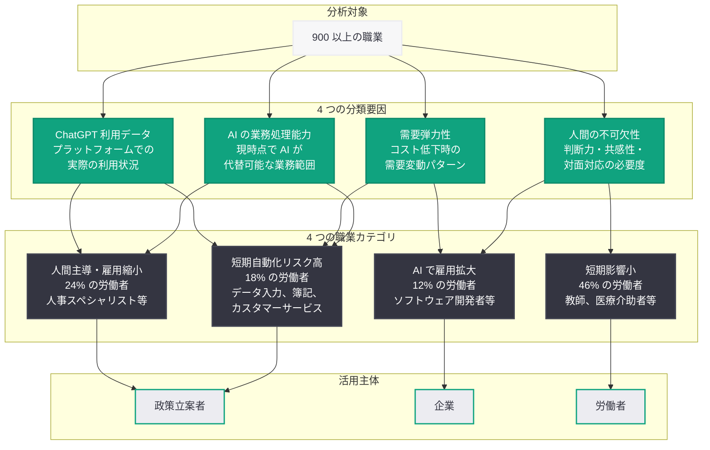
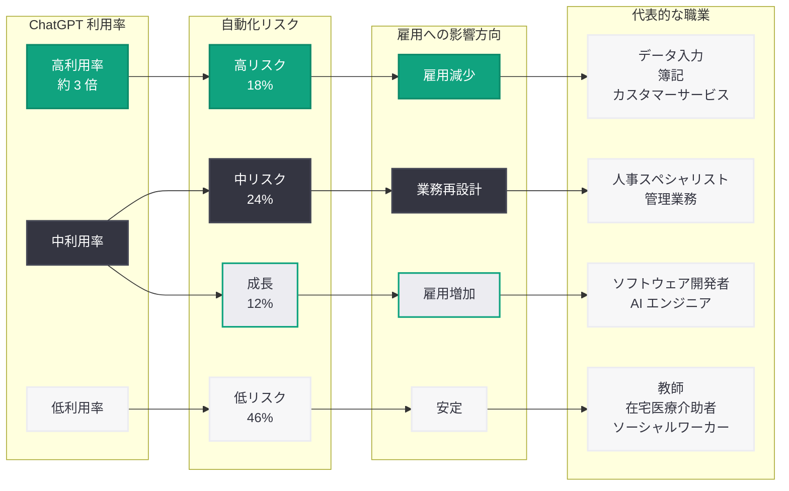
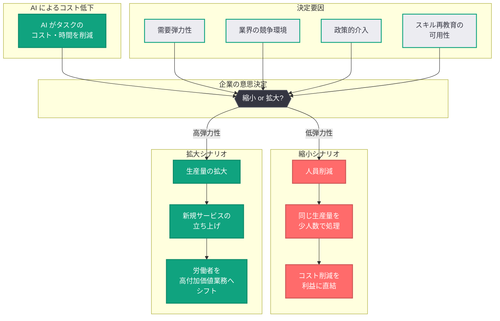

# AI 雇用転換フレームワーク: 900 以上の職業に対する AI の影響を 4 つの要因で分類

## メタデータ

| 項目 | 内容 |
|------|------|
| 発表日 | 2026-04-16 |
| ソース | OpenAI (cdn.openai.com) |
| カテゴリ | Policy / Research |
| 公式リンク | [The AI Jobs Transition Framework](https://cdn.openai.com/papers/ai-jobs-transition-framework.pdf) |

> **注記:** 本レポートは複数の公開ニュースソース (Techloy、National Review 等) の報道に基づいて作成されている。原文の PDF (cdn.openai.com) への直接アクセスが確認時点で利用できなかったため、外部報道をもとに内容を構成している。具体的な数値や分析の詳細は、原論文の実際の内容と異なる可能性がある点にご留意いただきたい。

## 概要

OpenAI は 2026 年 4 月 16 日、「The AI Jobs Transition Framework」と題する政策研究論文を公開した。本論文は、AI が労働市場に与える影響を体系的に分析するための新しいフレームワークを提案するもので、900 以上の職業を 4 つの要因に基づいて分類している。OpenAI のチーフエコノミスト Ronnie Chatterji 氏が主導するこの研究は、政策立案者、企業、労働者がそれぞれの立場で AI による雇用転換に備えるための実証的な基盤を提供することを目的としている。

特に注目すべきは、ChatGPT の実際の利用データを分析に組み込んでいる点である。自動化リスクが最も高い職業に就く労働者は、そうでない職業の労働者と比較して ChatGPT を約 3 倍多く利用しているという発見は、AI 導入が理論上の予測を超えて現場で既に進行していることを示唆している。一方で、失業データには大規模な混乱の兆候はまだ現れておらず、AI による雇用転換は単純な代替ではなく、より緩やかで不均一なプロセスであることも示されている。

## 主な内容

### フレームワークの 4 つの分類要因

本フレームワークは、900 以上の職業を以下の 4 つの要因に基づいて分析・分類している。

1. **AI が現実的に処理できる業務の範囲:** 各職業において、現在の AI 技術が実際にどの程度の業務を代替可能かを評価する。理論上の可能性ではなく、現時点での実用的な能力に基づいている
2. **人間の不可欠性:** その職業において人間が果たす役割がどの程度本質的であるかを判定する。人間の判断力、共感性、対人関係、物理的な対応が求められる度合いを評価する
3. **コスト低下時の需要変動:** AI によってタスクのコストが下がった場合に、そのサービスや製品への需要がどのように変化するかを分析する。コスト低下が需要拡大につながる職業と、単純に人員削減につながる職業を区別する重要な要因である
4. **ChatGPT における実際の利用状況:** ChatGPT プラットフォームでの利用データを分析し、各職業に関連する AI の実際の活用パターンを把握する。理論的な評価と実際の利用行動のギャップを埋める要因である

### 職業カテゴリ別の分析結果

フレームワークによる分析の結果、職業は大きく 4 つのカテゴリに分類された。

#### 短期的な自動化リスクが最も高い職業 (18%)

全労働者の約 18% が、短期的に最も高い自動化リスクに直面している。データ入力、簿記、カスタマーサービスなどの職業がこのカテゴリに該当する。これらの職業は、AI が現時点で高い精度で業務を遂行でき、かつ人間の判断や対人関係の要素が相対的に少ない領域である。

注目すべきは、このカテゴリの労働者が ChatGPT を最も積極的に利用しているという発見である。リスクが低い職業と比較して約 3 倍の利用率は、当該労働者が既に AI ツールを業務に取り入れていること、あるいは自らのスキルアップや転職準備のために AI を活用していることを示唆している。

#### 人間主導だが雇用縮小の可能性がある職業 (24%)

全労働者の約 24% が属するこのカテゴリでは、業務自体は引き続き人間が主導するものの、AI による効率化によって必要な人員数が減少する可能性がある。人事スペシャリストなどがこの例として挙げられている。

このカテゴリの特徴は、AI が業務を完全に代替するわけではないが、1 人当たりの生産性が向上することで、同じ業務量をより少ない人数で処理できるようになる点にある。組織は人員を削減するか、あるいは既存の人材をより高付加価値な業務にシフトさせるかの選択を迫られる。

#### AI 導入により雇用が拡大する可能性がある職業 (12%)

全労働者の約 12% が属するこのカテゴリでは、AI の導入がむしろ雇用の拡大につながる可能性がある。ソフトウェア開発者がその代表例である。

この現象は「需要弾力性」の効果によって説明される。AI がコストを下げ、生産性を向上させることで、これまで経済的に実現が困難だったプロジェクトやサービスが可能になり、結果として当該分野の労働需要が増加する。ソフトウェア開発の場合、AI アシスタントによる生産性向上が、より多くのソフトウェアプロジェクトの立ち上げを可能にし、開発者の需要を押し上げる構図である。

#### 短期的な影響が最も小さい職業 (46%)

全労働者の約 46% が属するこのカテゴリは、教師、在宅医療介助者など、人間の判断力、ケア能力、対面でのインタラクションに本質的に依存する職業で構成されている。

これらの職業は、現在の AI 技術では代替が困難な要素を多く含んでおり、短期的には AI による直接的な影響は限定的である。ただし、これは AI が全く活用されないことを意味するのではなく、AI が補助的なツールとして活用される一方で、職業の本質的な部分は人間が担い続けるということを示している。

### ChatGPT 利用データからの知見

本フレームワークの独自性の一つは、ChatGPT プラットフォームの実際の利用データを分析に組み込んでいる点にある。主な発見は以下のとおりである。

- **利用率の格差:** 自動化リスクが最も高い職業の労働者は、リスクが低い職業の労働者と比較して ChatGPT を約 3 倍多く利用している
- **早期導入者の存在:** 自動化圧力にさらされている労働者ほど AI ツールを積極的に採用しており、AI が「脅威」であると同時に「適応手段」としても機能していることが示されている
- **実際の利用パターン:** 理論的な自動化可能性と実際の AI 利用行動には相関があるが、完全には一致しない。これは、技術的な可能性と実際の導入の間にある組織的・制度的要因の存在を示唆している

### 現在の労働市場の状況

フレームワークの分析において重要な文脈として、現時点の労働市場データが示すのは、AI による大規模な雇用混乱の兆候がまだ明確には現れていないという事実である。

- **失業データ:** 失業率やレイオフのデータにおいて、AI に起因する大量失業の統計的な証拠は現時点で確認されていない
- **転換の速度:** AI による雇用転換は、単純な「代替」ナラティブが示唆するよりも、緩やかかつ不均一に進行している可能性がある
- **早期採用者の生産性向上:** Chatterji 氏によれば、AI の能力は「前例のない速度」で向上しており、早期導入者は「意味のある生産性向上」を実現している

### AI がもたらす「拡大か縮小か」の分岐点

本フレームワークが提起する核心的な問題は、AI がタスクをより安く・速く処理できるようになった場合に、企業がどちらの方向に動くかという分岐点である。

- **縮小シナリオ:** 企業が AI による効率化を人員削減に直結させ、同じ業務量をより少ない人数で処理する方向に動く
- **拡大シナリオ:** 企業が AI によるコスト削減を活用して、生産量の拡大、新規サービスの立ち上げ、労働者のより高付加価値な業務へのシフトを行う

この分岐は、個々の企業の戦略、業界の競争環境、政策的な介入、労働者のスキル再教育の可用性など、複数の要因によって決定される。フレームワークは、この分岐を理解し、拡大シナリオを促進する政策を設計するための基盤を提供することを目指している。

## 技術的な詳細

### フレームワークの方法論

本フレームワークは、以下の技術的アプローチを組み合わせている。

| 分析要素 | 方法論 | データソース |
|----------|--------|------------|
| 業務の AI 代替可能性 | タスクレベルの分析 | O*NET 職業データベース (推定)、AI ベンチマーク |
| 人間の不可欠性 | 専門家評価 + 定量指標 | 職業特性データ、業界調査 |
| 需要弾力性 | 経済モデリング | 価格弾力性データ、市場分析 |
| 実際の AI 利用 | プラットフォームデータ分析 | ChatGPT 利用統計 |

### 分類アルゴリズムの概念モデル

フレームワークは各職業を 4 つの要因のスコアに基づいて分類しているが、その概念的なロジックは以下のように表現できる。

```python
from dataclasses import dataclass


@dataclass
class OccupationProfile:
    """職業プロファイル: フレームワークの 4 要因を表現"""
    name: str
    ai_capability_score: float      # AI が処理可能な業務の割合 (0.0-1.0)
    human_essentiality: float       # 人間の不可欠性 (0.0-1.0)
    demand_elasticity: float        # コスト低下時の需要弾力性 (-1.0 ~ +1.0)
    chatgpt_usage_rate: float       # ChatGPT の相対的利用率


def classify_occupation(profile: OccupationProfile) -> str:
    """
    職業プロファイルに基づいてカテゴリを判定する。
    注: 実際のフレームワークはより複雑な分類ロジックを使用していると推定される。
    """
    if (profile.ai_capability_score > 0.7
            and profile.human_essentiality < 0.3):
        return "HIGH_AUTOMATION_RISK"       # 18% - 短期自動化リスク高

    if (profile.ai_capability_score > 0.4
            and profile.human_essentiality > 0.5
            and profile.demand_elasticity < 0):
        return "HUMAN_LED_SHRINKING"        # 24% - 人間主導だが雇用縮小

    if (profile.demand_elasticity > 0.3
            and profile.ai_capability_score > 0.3):
        return "AI_DRIVEN_EXPANSION"        # 12% - AI で雇用拡大

    return "LEAST_IMMEDIATE_THREAT"         # 46% - 短期影響小


# 各カテゴリの代表的な職業例
examples = [
    OccupationProfile("データ入力事務員", 0.85, 0.15, -0.5, 3.0),
    OccupationProfile("人事スペシャリスト", 0.55, 0.60, -0.2, 1.5),
    OccupationProfile("ソフトウェア開発者", 0.50, 0.65, 0.6, 2.0),
    OccupationProfile("在宅医療介助者", 0.15, 0.90, 0.1, 0.5),
]

for occupation in examples:
    category = classify_occupation(occupation)
    print(f"{occupation.name}: {category}")
```

## アーキテクチャ

### 職業分類フレームワークの構造

以下の図は、AI 雇用転換フレームワークの全体構造を示している。900 以上の職業が 4 つの要因によって評価され、4 つのカテゴリに分類される流れを表現している。



### 職業カテゴリの分布と特性

以下の図は、各カテゴリの労働者比率と、AI の影響方向、ChatGPT 利用率の関係を可視化している。



### AI による雇用転換の分岐モデル

以下の図は、AI がタスクのコストを低下させた場合に、企業が「縮小」と「拡大」のどちらの方向に動くかという分岐点と、その決定要因を示している。



## 開発者・ビジネスへの影響

### 政策立案者への示唆

- **エビデンスベースの政策設計:** 900 以上の職業を実証データに基づいて分類するこのフレームワークは、従来の「AI が全ての仕事を奪う」という過度に単純化されたナラティブを超え、よりきめ細かな政策設計を可能にする。各カテゴリに応じた差別化された支援策の設計が求められる
- **スキル再教育への投資優先順位:** 短期的自動化リスクが高い 18% の労働者に対する重点的なスキル再教育プログラムの設計と、24% の「人間主導・雇用縮小」カテゴリへの予防的な支援が政策的優先事項となる
- **拡大シナリオの促進:** 12% の「AI で雇用拡大」カテゴリを積極的に支援し、AI による生産性向上が新たな雇用創出につながる好循環を政策的に促進することが重要である

### 企業への示唆

- **人材戦略の見直し:** 自社の労働力ポートフォリオが 4 つのカテゴリにどのように分布しているかを分析し、中長期的な人材戦略を再設計する必要がある。特に 18% の高リスクカテゴリに属する業務を多く抱える企業は、早期の対応が求められる
- **「拡大か縮小か」の戦略的選択:** AI による効率化を単なるコスト削減に使うのか、新たな事業機会の創出に活用するのかは、企業の競争力を左右する戦略的選択となる。フレームワークの需要弾力性分析は、この判断を支援する
- **AI ツールの社内導入:** ChatGPT の利用データが示すように、自動化リスクの高い職種の労働者は既に AI ツールを積極的に利用している。企業は抵抗するのではなく、この傾向を活用して労働者の生産性向上とスキル転換を支援すべきである

### 開発者への示唆

- **AI ツール開発の機会:** 12% の「AI で雇用拡大」カテゴリは、AI ツールの開発者にとって最も有望な市場である。生産性を向上させ、新たな業務を可能にするツールの需要は今後拡大する
- **トランジション支援ツール:** 18% の高リスクカテゴリの労働者に対するスキル評価、キャリアパス提案、再教育プログラムなど、トランジション支援のための AI ツールの開発機会がある
- **企業向け分析ツール:** フレームワークの方法論を活用して、個別企業の労働力ポートフォリオを分析し、カテゴリ別の戦略を提案する SaaS ツールの需要が見込まれる

### 労働者への示唆

- **自身の職業カテゴリの認識:** 本フレームワークを参考に、自身の職業がどのカテゴリに属するかを認識し、それに応じた準備を行うことが重要である
- **AI リテラシーの向上:** 利用データが示すように、自動化リスクの高い職業の労働者ほど AI ツールを積極的に活用している。AI を脅威としてではなく、自身の生産性向上とキャリア転換の手段として活用するリテラシーが求められる
- **スキルの多角化:** 46% の「短期影響小」カテゴリに属する職業であっても、AI の能力は急速に向上しているため、人間固有の判断力、創造性、対人スキルを強化し続けることが長期的な雇用安定につながる

## 関連リンク

- [The AI Jobs Transition Framework (公式 PDF)](https://cdn.openai.com/papers/ai-jobs-transition-framework.pdf)
- [OpenAI Research](https://openai.com/research)
- [OpenAI News](https://openai.com/news)
- [OpenAI Economic Impact Research](https://openai.com/economics)
- [O*NET Online (米国職業情報ネットワーク)](https://www.onetonline.org/)

## まとめ

OpenAI が 2026 年 4 月 16 日に公開した「The AI Jobs Transition Framework」は、AI が労働市場に与える影響を実証データに基づいて体系的に分析する画期的なフレームワークである。900 以上の職業を「AI の処理能力」「人間の不可欠性」「需要弾力性」「ChatGPT の実利用データ」という 4 つの要因で分類することにより、職業ごとの影響を 4 つのカテゴリ (短期自動化リスク高: 18%、人間主導・雇用縮小: 24%、AI で雇用拡大: 12%、短期影響小: 46%) に整理している。

最も注目すべき発見は、自動化リスクが高い職業の労働者が ChatGPT を約 3 倍多く利用しているという事実と、現時点の失業データには大規模な混乱の兆候がまだ現れていないという事実の共存である。これは、AI による雇用転換が理論家が予測するような急激な「代替」ではなく、労働者自身による適応を含むより複雑なプロセスであることを示している。

チーフエコノミスト Ronnie Chatterji 氏が指摘するように、AI の能力は前例のない速度で向上しており、早期導入者は既に意味のある生産性向上を実現している。企業が AI の効率化を「縮小」(人員削減) に使うか「拡大」(新規事業創出) に使うかという分岐点は、政策的な介入と企業戦略の双方によって決定される。本フレームワークは、この判断を実証データに基づいて支援するための重要な基盤を提供するものである。

> **免責事項:** 本レポートは複数の公開ニュースソース (Techloy、National Review 等) の報道に基づいて構成されたものであり、OpenAI の原論文の全文を確認した上での分析ではない。フレームワークの詳細な方法論、職業分類の具体的な基準、ChatGPT 利用データの分析手法、および政策提言の詳細は、原論文の実際の内容と異なる可能性がある点にご留意いただきたい。
