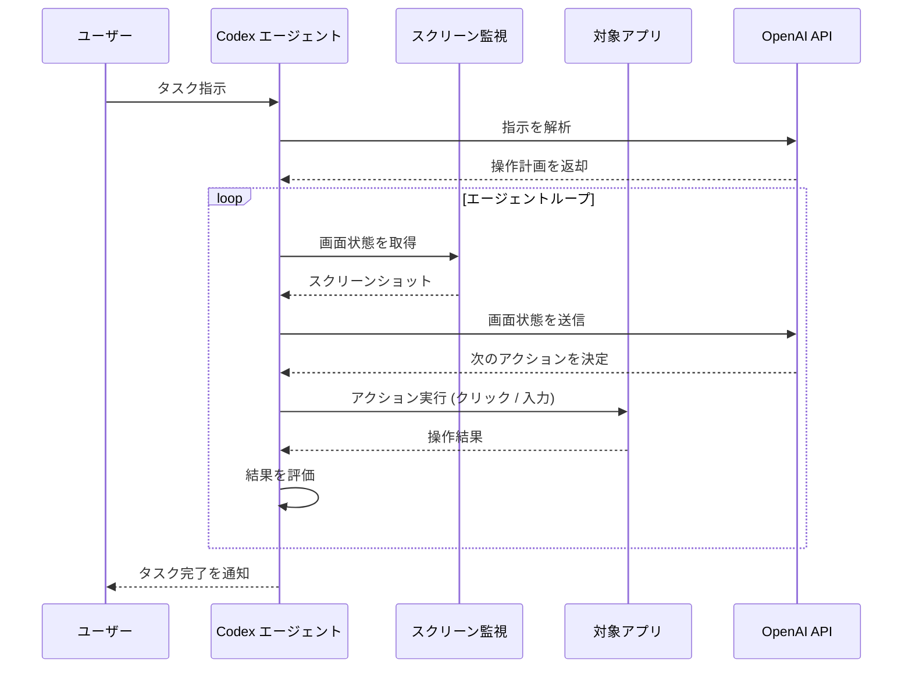
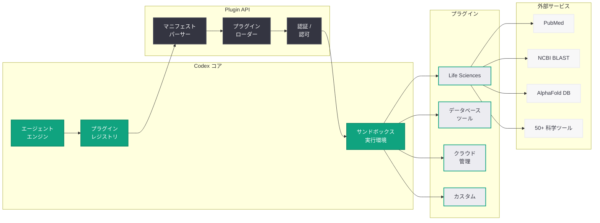

# Codex が「ほぼ万能」のスーパーアプリに進化: コンピュータ操作、ブラウザ、画像生成、メモリ、プラグインを統合

## メタデータ

| 項目 | 内容 |
|------|------|
| 発表日 | 2026-04-16 |
| ソース | OpenAI News |
| カテゴリ | Product |
| 公式リンク | [Codex for (almost) everything](https://openai.com/index/codex-for-almost-everything) |

> **注記:** 本レポートは RSS フィードおよび公開されているニュースソース (The Verge、TechCrunch、Engadget、MacStories、MacRumors、9to5Mac、ZDNET、CNET、The New Stack、VentureBeat、Decrypt) の報道に基づいて作成されている。公式記事ページは Cloudflare の保護により直接アクセスが制限されていたため、複数の外部報道を照合して内容を構成している。正確な詳細については公式ページを参照されたい。

## 概要

OpenAI は 2026 年 4 月 16 日、macOS および Windows 向けの Codex デスクトップアプリケーションに大規模なアップデートを実施し、コーディングツールから包括的な「スーパーアプリ」への変革を発表した。今回のアップデートにより、コンピュータ操作 (Computer Use)、アプリ内ブラウザ、画像生成、永続メモリ、プラグインシステムが追加され、Codex はコーディング専用ツールの枠を大きく超えた汎用 AI エージェントプラットフォームへと進化した。

この発表は、2026 年 3 月 20 日に報じられた OpenAI の「スーパーアプリ」構想を具体化する「第一段階 (first phase)」と位置づけられている。Codex はこれまで開発者のターミナル環境に限定されていたが、今回のアップデートにより全ての ChatGPT アカウント保有者がアクセス可能となった。Anthropic の Claude Computer Use や Claude Code に対する直接的な競合として設計されており、AI デスクトップエージェント市場における競争が一段と激化することになる。

## 主な内容

### コンピュータ操作 (Computer Use) の導入

今回のアップデートの中核となる機能が「Computer Use」である。Codex はユーザーのコンピュータを直接操作し、他のアプリケーションの制御、画面の監視、そして「常時稼働のコーディングエージェント」として機能する能力を獲得した。

Computer Use の主な特徴は以下の通りである。

- **アプリケーション操作:** Codex がユーザーのデスクトップ上で動作する他のアプリケーション (IDE、ターミナル、ブラウザ、ファイルマネージャなど) を直接制御し、開発者に代わって操作を実行する
- **画面監視:** ユーザーの画面をリアルタイムで観察し、コンテキストを理解した上で適切なアクションを提案・実行する
- **常時稼働エージェント:** バックグラウンドで継続的に動作し、ユーザーのワークフローを常時サポートする。タスクの完了を待つ間も、他の作業を並行して処理できる
- **マルチアプリケーション連携:** 複数のアプリケーション間を横断して操作を行い、従来は手動で行っていたワークフローの自動化を実現する

この機能は、2025 年後半に Anthropic が発表した Claude Computer Use に対する OpenAI の直接的な回答と位置づけられている。Anthropic の実装がリサーチプレビューとしてスタートしたのに対し、OpenAI は Codex のスーパーアプリ統合の一部として Computer Use を提供することで、より包括的なユーザー体験を実現しようとしている。

### アプリ内ブラウザ

Codex にビルトインの Web ブラウザが搭載され、エージェントがアプリ内から直接 Web ページを閲覧・プレビューできるようになった。

- **シームレスなブラウジング:** Codex を離れることなく、Web ページの閲覧やドキュメントの参照が可能。開発者はライブラリのドキュメント、API リファレンス、Stack Overflow の解決策などを Codex 内で直接確認できる
- **Web プレビュー:** 開発中の Web アプリケーションをアプリ内ブラウザでプレビューし、リアルタイムでフィードバックを得ながらコーディングを進めることが可能
- **リサーチ統合:** エージェントが自律的に Web 上の情報を検索・収集し、コーディングタスクに必要な技術情報やベストプラクティスを調査する
- **コンテキスト維持:** ブラウジングの結果がエージェントのコンテキストに統合され、後続のタスクで参照可能

2026 年 3 月 20 日のスーパーアプリ構想で予告されていた「内蔵ブラウザ」機能の実現であり、開発ワークフローの中断を最小限に抑えるための重要な機能追加である。

### 画像生成

Codex のワークフロー内で直接画像を生成する機能が追加された。

- **デザインアセット生成:** アイコン、バナー、プレースホルダー画像などのデザインアセットをコーディングワークフロー内で直接生成し、プロジェクトに組み込める
- **UI モックアップ:** アプリケーションの UI デザインのモックアップやプロトタイプ画像を生成し、実装の参考資料として活用できる
- **ダイアグラム作成:** アーキテクチャ図、フローチャート、ER 図などの技術的なダイアグラムを自然言語の指示から生成
- **DALL-E 統合:** OpenAI の画像生成モデル DALL-E との統合により、高品質な画像生成が可能

画像生成機能の追加により、Codex はコードだけでなくビジュアルコンテンツも含めたプロジェクト全体の開発をサポートするツールへと進化した。

### 永続メモリ (Memory)

セッションや会話をまたいでコンテキストを記憶する永続メモリ機能が導入された。

- **プロジェクトコンテキストの保持:** プロジェクトの構造、使用技術、コーディング規約、過去の設計決定などを記憶し、新しいセッションでも一貫したサポートを提供する
- **ユーザー設定の学習:** ユーザーのコーディングスタイル、好みのフレームワーク、頻繁に使用するパターンを学習し、よりパーソナライズされた提案を行う
- **長期的なプロジェクト管理:** 複数のセッションにわたる長期プロジェクトの進捗を追跡し、前回の作業を正確に引き継ぐことが可能
- **チームナレッジの蓄積:** チーム開発において、過去の議論や決定事項をメモリに蓄積し、新規メンバーのオンボーディングを支援する

ChatGPT で先行して導入されたメモリ機能を Codex エージェント向けに最適化したものであり、AI コーディングエージェントの実用性を大幅に向上させる重要な機能である。

### プラグインシステム

Codex の機能を拡張するプラグインシステムが導入され、サードパーティによるエコシステムの構築が可能になった。

- **拡張可能なアーキテクチャ:** 開発者やサードパーティが Codex の機能を拡張するプラグインを作成・配布できるプラットフォームを提供
- **Life Sciences プラグイン:** 発表と同時に、50 以上の科学ツールに接続するライフサイエンス研究プラグインが公開された。これにより、バイオインフォマティクス、ゲノム解析、創薬研究などの分野で Codex を活用できる
- **ドメイン特化型拡張:** 金融、医療、法務、教育などの特定ドメイン向けにカスタマイズされたプラグインの開発が可能
- **ツール統合:** 既存の開発ツールやサービス (CI/CD、プロジェクト管理、モニタリングなど) との連携プラグインにより、Codex を既存のワークフローに統合できる

プラグインシステムは、Codex を閉じたツールから開かれたプラットフォームへと転換させる戦略的な機能追加であり、エコシステムの成長によって Codex の価値が継続的に向上する好循環を生み出すことを目的としている。

### オートメーション (Automations)

条件に基づいて自動的にトリガーされるワークフローを作成できる「Automations」機能が追加された。

- **条件ベースのトリガー:** 特定のイベント (ファイル変更、Git プッシュ、テスト失敗、スケジュールなど) に基づいて自動的にワークフローを開始
- **ワークフロー連鎖:** 複数のアクションを連鎖させた複雑な自動化パイプラインを構築可能
- **エラーハンドリング:** ワークフロー内でのエラー検出と自動復旧処理の定義
- **通知と監視:** 自動化されたワークフローの実行結果に基づく通知の送信

2026 年 3 月 31 日に導入された Codex Hooks を発展させた機能であり、より高レベルな自動化をノーコードに近い形で実現するものと位置づけられる。

### アクセス範囲の拡大

今回のアップデートにおけるもう一つの重要な変更は、Codex へのアクセス範囲の大幅な拡大である。

- **全 ChatGPT ユーザーに開放:** これまでターミナル環境で操作する開発者向けに限定されていた Codex が、全ての ChatGPT アカウント保有者に開放された
- **macOS と Windows の同時サポート:** macOS に加え Windows プラットフォームでも完全にサポートされ、プラットフォーム間の機能格差が解消された
- **非開発者向け活用:** プラグインやオートメーション機能により、プログラミングの知識がなくても Codex の自動化能力を活用できるユースケースが拡大

## 技術的な詳細

### Computer Use API の統合

Codex の Computer Use 機能は、Responses API の Computer 環境機能を基盤としていると推定される。2026 年 3 月 11 日に公開された Responses API の Computer 環境仕様が、今回のデスクトップアプリでの Computer Use 実装の基盤技術となっている。

```python
from openai import OpenAI

client = OpenAI()

# Codex Computer Use を活用した操作の例
# (推定される API インターフェース)
response = client.responses.create(
    model="codex-agent-latest",
    input=[
        {
            "role": "user",
            "content": "VS Code を開いて、src/auth.py ファイルのレート制限ロジックを修正してください",
        }
    ],
    tools=[
        {
            "type": "computer_use_preview",
            "display_width": 1920,
            "display_height": 1080,
            "environment": "mac",
        }
    ],
)

# エージェントの操作ステップを処理
for output in response.output:
    if output.type == "computer_call":
        print(f"Action: {output.action.type}")
        print(f"Coordinates: ({output.action.x}, {output.action.y})")
```

### プラグインの定義と登録

プラグインシステムの技術的な構造は、以下のような形式で定義されると想定される。

**プラグインマニフェスト (`codex-plugin.json`):**

```json
{
  "name": "life-sciences-research",
  "version": "1.0.0",
  "description": "50 以上の科学ツールに接続するライフサイエンス研究プラグイン",
  "author": "OpenAI",
  "capabilities": [
    "tool_integration",
    "data_analysis",
    "visualization"
  ],
  "tools": [
    {
      "name": "pubmed_search",
      "description": "PubMed データベースから論文を検索",
      "parameters": {
        "query": { "type": "string", "description": "検索クエリ" },
        "max_results": { "type": "integer", "default": 10 }
      }
    },
    {
      "name": "blast_sequence",
      "description": "NCBI BLAST で配列相同性検索を実行",
      "parameters": {
        "sequence": { "type": "string", "description": "DNA/タンパク質配列" },
        "database": { "type": "string", "default": "nr" }
      }
    },
    {
      "name": "protein_structure",
      "description": "AlphaFold DB からタンパク質構造データを取得",
      "parameters": {
        "uniprot_id": { "type": "string", "description": "UniProt ID" }
      }
    }
  ],
  "permissions": [
    "network_access",
    "file_write"
  ]
}
```

**Python SDK によるプラグインの活用例:**

```python
from openai import OpenAI

client = OpenAI()

# Codex でライフサイエンスプラグインを使用した研究タスク
response = client.codex.tasks.create(
    prompt="BRCA1 遺伝子の最新の変異研究を調査し、関連する論文のサマリーを作成してください",
    plugins=["life-sciences-research"],
    tools_config={
        "pubmed_search": {"max_results": 20},
        "blast_sequence": {"database": "refseq_genomic"},
    },
)

print(f"Task ID: {response.id}")
print(f"Status: {response.status}")

# タスク結果の取得
result = client.codex.tasks.retrieve(response.id)
for artifact in result.artifacts:
    print(f"Type: {artifact.type}, Name: {artifact.name}")
    if artifact.type == "markdown":
        print(artifact.content)
```

### メモリ API の統合

永続メモリ機能は、ChatGPT のメモリ機能と同様のアーキテクチャを Codex エージェント向けに最適化したものと推定される。

```python
from openai import OpenAI

client = OpenAI()

# プロジェクト固有のメモリ設定例
memory_config = {
    "project_context": {
        "name": "my-web-app",
        "tech_stack": ["React", "TypeScript", "FastAPI", "PostgreSQL"],
        "coding_style": "functional",
        "test_framework": "pytest",
        "conventions": [
            "全ての関数に型ヒントを付与する",
            "テストカバレッジ 80% 以上を維持する",
            "commit メッセージは Conventional Commits に従う",
        ],
    },
    "persistence": {
        "scope": "project",
        "retention": "indefinite",
        "sync_across_sessions": True,
    },
}

# メモリを活用した Codex タスク
response = client.codex.tasks.create(
    repository="https://github.com/example/my-web-app",
    prompt="新しい API エンドポイント /api/v2/users を追加してください。"
           "前回の設計方針に従ってください。",
    memory=memory_config,
)
```

### Automations の設定

```python
from openai import OpenAI

client = OpenAI()

# テスト失敗時に自動修正を試みるオートメーション
automation = client.codex.automations.create(
    name="auto-fix-on-test-failure",
    description="テスト失敗時に自動的にコードを修正",
    trigger={
        "type": "webhook",
        "event": "test_failure",
        "source": "github_actions",
    },
    actions=[
        {
            "type": "codex_task",
            "prompt": "失敗したテストを分析し、原因を特定して修正してください",
            "auto_approve": False,
        },
        {
            "type": "notification",
            "channel": "slack",
            "message": "Codex が自動修正の提案を作成しました。レビューしてください。",
        },
    ],
    conditions={
        "max_retries": 3,
        "cooldown_seconds": 300,
    },
)

print(f"Automation ID: {automation.id}")
print(f"Status: {automation.status}")
```

### 各機能の対応プラットフォーム

| 機能 | macOS | Windows | 備考 |
|------|:-----:|:-------:|------|
| Computer Use | Yes | Yes | デスクトップ操作エージェント |
| アプリ内ブラウザ | Yes | Yes | Web プレビュー対応 |
| 画像生成 | Yes | Yes | DALL-E 統合 |
| 永続メモリ | Yes | Yes | クラウド同期 |
| プラグイン | Yes | Yes | Life Sciences プラグインを含む |
| Automations | Yes | Yes | Webhook / スケジュールトリガー |

## アーキテクチャ

以下は、Codex スーパーアプリの全体アーキテクチャを示す図である。

```mermaid
flowchart TD
    subgraph Users["ユーザー"]
        MacUser(["macOS ユーザー"])
        WinUser(["Windows ユーザー"])
    end

    subgraph CodexApp["Codex スーパーアプリ"]
        subgraph CoreUI["コア UI レイヤー"]
            ChatInterface["チャット<br/>インターフェース"]
            CodeEditor["コード<br/>エディタ"]
            BrowserView["アプリ内<br/>ブラウザ"]
            ImageView["画像生成<br/>ビュー"]
        end

        subgraph AgentLayer["エージェントレイヤー"]
            ComputerUse["Computer Use<br/>エージェント"]
            CodingAgent["コーディング<br/>エージェント"]
            BrowsingAgent["ブラウジング<br/>エージェント"]
            AutomationEngine["Automation<br/>エンジン"]
        end

        subgraph DataLayer["データレイヤー"]
            Memory["永続メモリ<br/>Memory"]
            PluginRegistry["プラグイン<br/>レジストリ"]
            ProjectCtx["プロジェクト<br/>コンテキスト"]
        end
    end

    subgraph Plugins["プラグインエコシステム"]
        LifeSci["Life Sciences<br/>50+ 科学ツール"]
        CustomPlugin["カスタム<br/>プラグイン"]
        ThirdParty["サードパーティ<br/>プラグイン"]
    end

    subgraph Backend["OpenAI バックエンド"]
        ResponsesAPI["Responses API"]
        CodexAPI["Codex Agent API"]
        DALLE["DALL-E<br/>画像生成"]
        Models["GPT / Codex<br/>モデル群"]
    end

    subgraph Desktop["デスクトップ環境"]
        Apps["他の<br/>アプリケーション"]
        FileSystem["ファイル<br/>システム"]
        Screen["スクリーン<br/>キャプチャ"]
    end

    MacUser --> CodexApp
    WinUser --> CodexApp

    ChatInterface --> CodingAgent
    ChatInterface --> BrowsingAgent
    CodeEditor --> CodingAgent
    BrowserView --> BrowsingAgent
    ImageView --> DALLE

    ComputerUse --> Apps
    ComputerUse --> FileSystem
    ComputerUse --> Screen

    CodingAgent --> Memory
    CodingAgent --> ProjectCtx
    BrowsingAgent --> Memory
    AutomationEngine --> CodingAgent
    AutomationEngine --> ComputerUse

    PluginRegistry --> LifeSci
    PluginRegistry --> CustomPlugin
    PluginRegistry --> ThirdParty

    CodingAgent --> ResponsesAPI
    CodingAgent --> CodexAPI
    BrowsingAgent --> ResponsesAPI
    ComputerUse --> ResponsesAPI

    ResponsesAPI --> Models
    CodexAPI --> Models

    classDef openai fill:#10A37F,stroke:#0D8A6A,stroke-width:2px,color:white
    classDef dark fill:#343541,stroke:#444654,stroke-width:2px,color:white
    classDef light fill:#F7F7F8,stroke:#ECECF1,stroke-width:2px,color:#343541
    classDef accent fill:#ECECF1,stroke:#10A37F,stroke-width:2px,color:#343541

    class ResponsesAPI,CodexAPI,DALLE,Models openai
    class ComputerUse,CodingAgent,BrowsingAgent,AutomationEngine dark
    class ChatInterface,CodeEditor,BrowserView,ImageView dark
    class MacUser,WinUser,Apps,FileSystem,Screen light
    class Memory,PluginRegistry,ProjectCtx,LifeSci,CustomPlugin,ThirdParty accent
```



### Computer Use の操作フロー



### プラグインシステムのアーキテクチャ



## 開発者への影響

### 開発ワークフローの根本的な変化

今回の Codex スーパーアプリへの進化は、開発者のワークフローに以下の根本的な変化をもたらす。

- **統合開発環境の再定義:** Codex が IDE、ターミナル、ブラウザ、デザインツールの機能を統合することで、開発者は複数のアプリケーションを切り替える必要がなくなる。コーディング、ドキュメント閲覧、テスト、デプロイまでを単一のインターフェースで完結できる可能性が広がった
- **Computer Use による自動化の飛躍:** 他のアプリケーションを直接操作できる Computer Use 機能により、従来は API が存在しないツールとの連携も自動化可能になる。レガシーシステムとの統合や、GUI ベースのツールの操作を Codex に委任できる
- **永続メモリによる継続的な開発支援:** セッション間でコンテキストが保持されることで、プロジェクトの長期的な一貫性が維持される。新しいセッションのたびにプロジェクト構造や設計方針を説明し直す必要がなくなり、開発効率が大幅に向上する

### プラグインエコシステムの可能性

- **サードパーティ開発者への機会:** プラグインシステムの導入により、Codex プラットフォーム上で新しいツールやサービスを開発・配布する市場が生まれる。AI コーディングエージェントのエコシステムとして成長する可能性がある
- **ドメイン特化型の拡張:** Life Sciences プラグインの公開に示されるように、特定の業界や分野に特化したプラグインの開発が奨励されている。金融工学、法務 AI、教育テクノロジーなど、多様な分野での Codex 活用が加速するだろう
- **既存ツールとの統合:** CI/CD パイプライン、プロジェクト管理ツール、モニタリングサービスなど、既存の開発ツールとの連携プラグインが充実すれば、Codex は開発ワークフローのハブとなる

### 競争環境の激化

- **Anthropic Claude との直接競合:** Computer Use は Anthropic の Claude Computer Use に対する直接的な対抗機能であり、メモリやプラグインを含む統合パッケージとして提供されることで差別化を図っている。Claude Code の CLI ベースのアプローチに対し、Codex はデスクトップアプリとしてより広い層にアプローチする
- **GitHub Copilot との関係:** Microsoft / GitHub が提供する Copilot とは協力と競争が交差する関係にある。Codex のスーパーアプリ化により、Copilot の IDE 統合型アプローチとは異なる価値提案が明確になった
- **Google Gemini Code Assist との差別化:** Google の Gemini Code Assist がクラウド IDE との統合を強化する中、Codex はデスクトップネイティブの統合と Computer Use による差別化を図っている

### 非開発者への波及

- **全 ChatGPT ユーザーへの開放:** Codex のアクセス範囲が全 ChatGPT アカウント保有者に拡大されたことで、プログラミングの専門知識を持たないユーザーも AI エージェントの自動化能力を活用できるようになった
- **ノーコード自動化:** Automations 機能とプラグインの組み合わせにより、コードを書かずに業務プロセスを自動化するユースケースが拡大する
- **ナレッジワーカーへの展開:** ドキュメント作成、データ分析、リサーチなど、コーディング以外のタスクでも Codex のエージェント能力を活用できるようになった

### 懸念事項と考慮すべきポイント

- **セキュリティリスク:** Computer Use 機能はデスクトップへの広範なアクセス権限を伴うため、悪意のある操作や意図しない操作に対するセキュリティ対策が極めて重要である
- **プライバシー:** 画面監視やメモリ機能により、ユーザーのデスクトップ環境やプロジェクト情報が OpenAI のサーバーに送信される。データの取り扱いポリシーの透明性が求められる
- **信頼性:** 常時稼働エージェントとして他のアプリケーションを操作する場合、誤操作によるデータ損失やシステム障害のリスクがある。操作前の確認フローと元に戻す機能の充実が必要
- **プラットフォーム依存:** スーパーアプリ化により OpenAI エコシステムへの依存度が高まる。ベンダーロックインのリスクを認識した上での採用判断が求められる

## 関連リンク

- [Codex for (almost) everything - OpenAI](https://openai.com/index/codex-for-almost-everything)
- [OpenAI's Codex is now a 'superapp' that goes beyond coding - The Verge](https://www.theverge.com/)
- [OpenAI Codex superapp update adds computer use, plugins, memory - TechCrunch](https://techcrunch.com/)
- [OpenAI Codex gets computer use to compete with Claude - Engadget](https://www.engadget.com/)
- [Codex for macOS adds computer use, image generation, and plugins - MacStories](https://www.macstories.net/)
- [OpenAI updates Codex with browser, memory, and more - MacRumors](https://www.macrumors.com/)
- [OpenAI transforms Codex into AI superapp - 9to5Mac](https://9to5mac.com/)
- [Codex superapp: OpenAI's answer to Claude computer use - ZDNET](https://www.zdnet.com/)
- [OpenAI Codex gets plugins and automations - CNET](https://www.cnet.com/)
- [OpenAI Codex plugin system targets developer workflows - The New Stack](https://thenewstack.io/)
- [OpenAI launches first phase of dream super app - VentureBeat](https://venturebeat.com/)
- [OpenAI Codex Life Sciences plugin connects 50+ tools - Decrypt](https://decrypt.co/)
- [OpenAI がデスクトップ「スーパーアプリ」を発表 (2026-03-20)](2026-03-20-openai-desktop-superapp.md)
- [Responses API Computer 環境 (2026-03-11)](2026-03-11-responses-api-computer-environment.md)
- [Codex Hooks (2026-03-31)](2026-03-31-codex-hooks.md)
- [ChatGPT Pro $100 プラン (2026-04-11)](2026-04-11-chatgpt-pro-100-codex-plan.md)
- [Codex がチーム向けに柔軟な従量課金制を導入 (2026-04-02)](2026-04-02-codex-flexible-pricing-for-teams.md)

## まとめ

OpenAI は Codex デスクトップアプリを macOS および Windows 向けに大規模アップデートし、コーディング専用ツールから包括的なスーパーアプリへの進化を実現した。Computer Use (コンピュータ操作)、アプリ内ブラウザ、画像生成、永続メモリ、プラグインシステム、Automations という 6 つの主要機能が追加され、Codex はコーディングだけでなくあらゆる開発ワークフロー、さらには非開発者向けの自動化タスクにも対応するプラットフォームとなった。特に注目すべきは、50 以上の科学ツールに接続する Life Sciences プラグインの同時公開であり、ドメイン特化型のプラグインエコシステムの構築に向けた本格的な取り組みが示された。全 ChatGPT アカウント保有者へのアクセス開放は、Codex のユーザーベースを開発者コミュニティからより広い層へと拡大する戦略的な決定である。本アップデートは 2026 年 3 月 20 日に報じられたスーパーアプリ構想の「第一段階」と位置づけられており、Anthropic の Claude Computer Use や Claude Code に対する OpenAI の包括的な回答として、AI デスクトップエージェント市場における競争をさらに激化させるものとなった。
